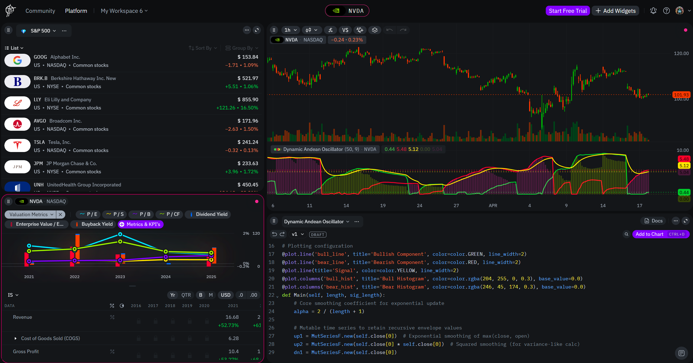
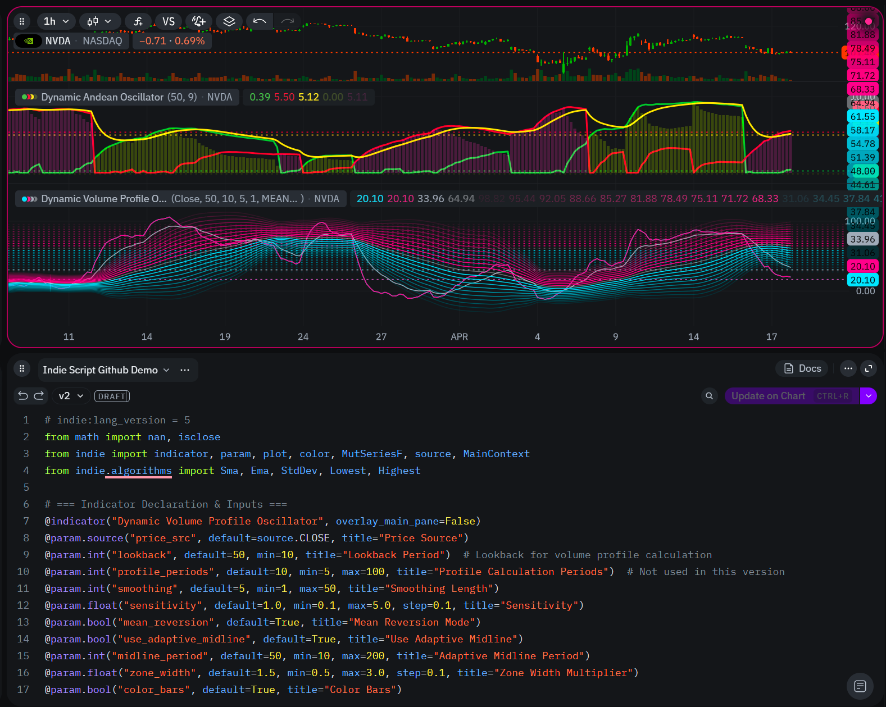
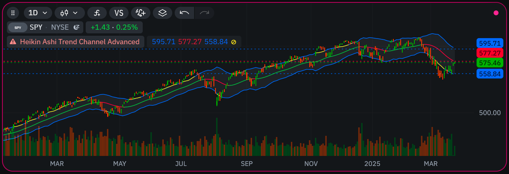

# Indie Language Code Examples
# Unofficial Indie language community page

Welcome to the unofficial GitHub hub for the **Indie Language** (Indie Script) — the Python-inspired scripting language used on the TakeProfit platform to build custom indicators, signals, and advanced trading logic. This page is intended as a clear, human-readable introduction for Pine Script™ users, Python developers, and algorithmic traders looking to explore or migrate to Indie.

### What is TakeProfit?

**TakeProfit** is a browser-based research and trading platform for retail traders and independent analysts. It has real-time charting, a flexible workspace and custom analytics tooling. TakeProfit supports a wide range of technical and fundamental analysis use cases, with a modular UI and community-oriented research sharing. Key features:

* Widget-based workspace for organizing charts, watchlists, notes and tools.
* WebGL-powered chart engine with multiple chart types, overlays and drawing tools.
* Integrated screener with 80+ fundamental and technical parameters.
* Real-time data (via integrated broker feeds).

### What is Indie?

**Indie Script** is a domain-specific programming language designed by [TakeProfit](https://takeprofit.com) for building technical indicators, visual overlays, and trading logic inside their charting platform. It is:

* **Pythonic**: Uses familiar `def`, `if`, `for`, and `import` syntax
* **Indicator-first**: Built for plotting, visual markers, multi-timeframe logic
* **Type-safe and vectorized**: Encourages clear use of series data vs. single values

## Key Features

| Feature | Description |
| ------- | ----------- |
| Python-style syntax | `def`, `class`, `if/else`, `for`, `math.isnan()` support |
| Built-in algorithms | `Sma`, `Ema`, `Rsi`, `Macd`, `Atr`, `FixNan`, and more |
| Visual plot decorators | `@plot`, `@fill`, `@bar_color`, `@background_color`, `@level` |
| Marker and label rendering | Use `plot.Marker(...)` with text, color, style, and positioning |
| Multi-timeframe support | Modularized via `@sec_context` and `calc_on()` |
| Mutable series state | With `MutSeriesF`, `MutSeriesI`, and explicit `SeriesF` |
| Strict type distinction | Avoids Pine's ambiguity: float vs. SeriesF vs. MutSeriesF |
| Math-safe | Uses `math.nan`, `math.isnan`, and handles divide-by-zero gracefully |

## Indie vs. Pine Script: What’s Different?

If you're coming from **TradingView's Pine Script™**, Indie might feel familiar in concept but different in execution:

| Concept | Pine Script™ | Indie |
| ------- | ------------ | ----- |
| Language type | Custom scripting | Python-like DSL |
| State management | `var` | `MutSeriesF.new(...)` |
| Multi-timeframe access | `request.security(...)` | `@sec_context` + `self.calc_on(...)` |
| Plotting style | `plot()`, `plotshape()` | Decorators + return-based plotting |
| Error handling | `na`, `nz`, `runtime.error()` | `math.nan`, `FixNan`, no exceptions |
| Label rendering | `label.new(...)` | `plot.Marker(text=...)` |
| Table / GUI overlays | `table.new(...)` | Not supported (simulate via markers) |

## Who Should Use Indie

* **Indicator builders** who want more structure and reusable functions than Pine
* **Strategy designers** who rely on multi-timeframe context
* **Python developers** looking to enter trading scripting without learning Pine
* **Data integrity hawks** who want explicit NaN checking and series safety

***

## Tips for Learning Indie

* Always distinguish between single values (`float`) and series (`SeriesF`, `MutSeriesF`)
* Use `@plot(...)` decorators to show lines, markers, and filled areas
* Wrap multi-timeframe logic in `@sec_context` functions
* Avoid trying to replicate Pine’s `strategy.entry()` — Indie is indicator-focused
* Watch for `math.nan` usage and use `FixNan` or `NanToZero` as needed

## Indie Script Language Resources

[Indie language official docs](https://takeprofit.com/docs/indie/What-is-Indie)

## Indicators

[Education indicators](https://github.com/pavkopavlo/Indie-language-code-examples/tree/master/indicators)

[Community Indicators](https://takeprofit.com/indicators)

[Platform Built-in Indicators](https://takeprofit.com/docs/indie/Code-examples/built-in-indicators)

## FAQ / Issues

[Pine Script to Indie Language Conversion Cheat Sheet](https://github.com/pavkopavlo/Indie-language-code-examples/tree/master/docs)

[Indie Language Packages / Built-ins Cheat Sheet](https://github.com/pavkopavlo/Indie-language-code-examples/tree/master/docs#indie-language-packages--built-ins-cheat-sheet)

[Indie FAQ / solutions](https://github.com/pavkopavlo/Indie-language-code-examples/blob/master/docs/indie-FAQ.md)

[Indie StackOverflow Issues/Solutions](https://stackoverflow.com/questions/tagged/indie)

## Articles

[Step-by-Step Guide: Rewriting Indicators from Pine Script to Indie](https://www.reddit.com/r/IndieLang/comments/1j4xss4/stepbystep_guide_rewriting_indicators_from_pine/)

## Community

[Discord](https://discord.gg/WVk8TjwU7p)
[Reddit TakeProfit](https://www.reddit.com/r/TakeProfit/) / [Reddit Indie Script](https://www.reddit.com/r/IndieLang/)
[Platform's community feed](https://takeprofit.com/feed)

## Contributing to This Guide

This repo aims to maintain a practical, hands-on Indie scripting reference. Pull requests, real indicator ports, and Pine-to-Indie conversions are welcome!
If you spot inconsistencies or want to improve examples, feel free to open an issue.

***

## License

This guide is an **unofficial community project** and not affiliated with TakeProfit.
Licensed under MIT. Content may be freely reused, forked, or modified.

Happy scripting with Indie Script!
