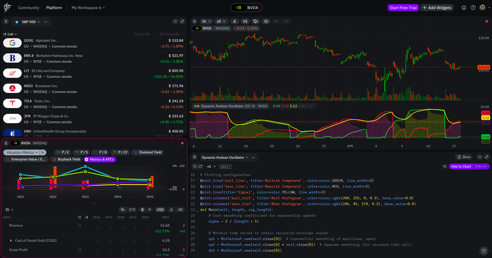
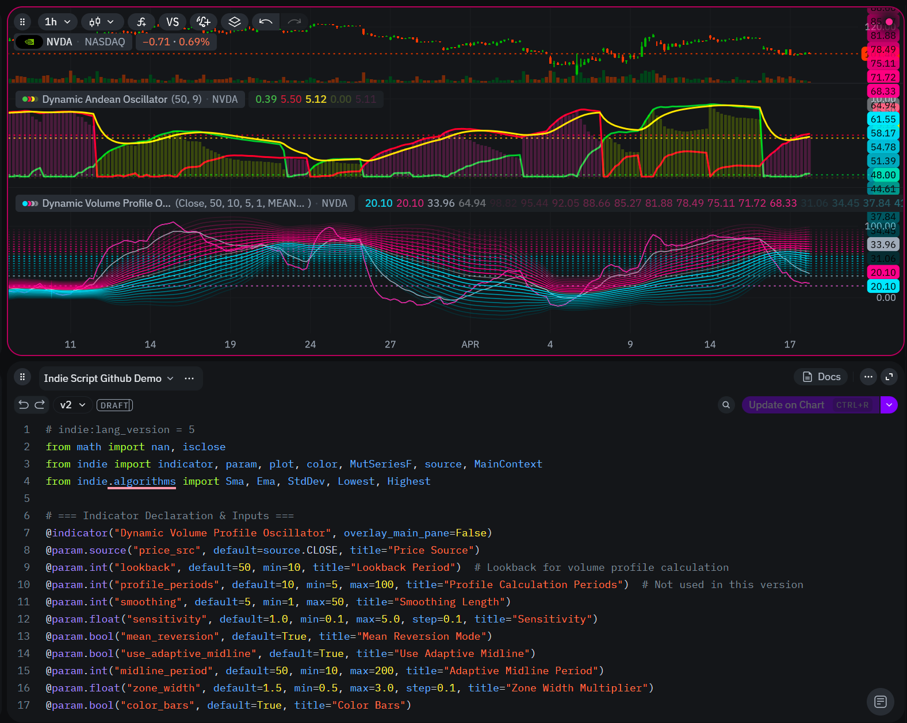
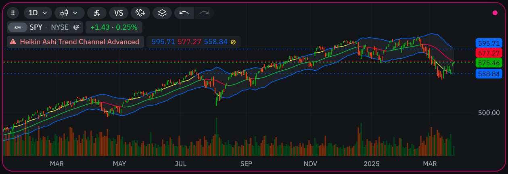



## Unofficial Indie language community page

Welcome to the unofficial community hub for the **Indie Language** (Indie Script): the Python-style scripting language of the TakeProfit platform for custom indicators, trading strategies and on-chart drawings. This page is a clear introduction for Pine Script™ users, Python developers and algorithmic traders who want to build with Indie or migrate to it.

  

    <svg class="octicon" width="18" height="18" aria-hidden="true"><use href="{{ ic }}#graph"></use></svg>
    
Indicators

    
Lines, histograms, fills, candles, bar colors, backgrounds and markers, with inputs in the indicator settings panel.

  

  

    <svg class="octicon" width="18" height="18" aria-hidden="true"><use href="{{ ic }}#iterations"></use></svg>
    
Strategies and backtests

    
Place orders, manage positions and take-profit / stop-loss levels from code, then test the strategy on history.

  

  

    <svg class="octicon" width="18" height="18" aria-hidden="true"><use href="{{ ic }}#table"></use></svg>
    
Tables and drawings

    
Summary tables, labels, lines, rectangles, circles, triangles and channels drawn straight from an indicator.

  

  

    <svg class="octicon" width="18" height="18" aria-hidden="true"><use href="{{ ic }}#database"></use></svg>
    
Your own data

    
Bring a CSV over HTTPS or a live WebSocket / SSE feed onto the chart as a series next to price.

  

  

    <svg class="octicon" width="18" height="18" aria-hidden="true"><use href="{{ ic }}#columns"></use></svg>
    
Other instruments and timeframes

    
Pull another symbol or timeframe into the calculation with <code>@sec_context</code> and <code>calc_on</code>.

  

  

    <svg class="octicon" width="18" height="18" aria-hidden="true"><use href="{{ ic }}#zap"></use></svg>
    
Alerts and AI

    
Cloud alerts on any plot of your script, and an MCP server that lets an AI assistant write, validate and run Indie code.

  

## What is TakeProfit?

**TakeProfit** is a browser-based charting and trading platform for retail traders and independent analysts, built around workspaces of linked widgets. What it offers today:

* **Workspaces of linked widgets.** Charts, watchlists, order entry, the stock screener and the community feed, started from a template or a blank canvas.
* **Charts.** Candles, line and bars, plus TPO market profile and Volume Footprint chart types, a Liquidity Heatmap overlay and a full set of drawing tools.
* **Indicators.** Built-in and Marketplace indicators, your own scripts, and an integrated code editor for Indie.
* **Cloud alerts.** Alerts on price and on any indicator, including your own, with notifications to Telegram and other channels.
* **Trading from the chart.** Connect Bybit for crypto spot and perpetuals, or Lime for US stocks, and trade from the workspace you chart in.
* **AI assistant.** Chart analysis, Indie scripts and alerts from a chat, also available to outside AI tools through the MCP server.
* **Stock screener.** Fundamentals and price data for about 5,000 US stocks, as a table, a list or a heatmap.
* **Community.** Posts with live charts, a feed, shared screeners and a mobile platform for alerts on the go.

Platform guides live in the [official TakeProfit docs](https://takeprofit.com/docs/guide/getting-started/Overview).

## What is Indie?

**Indie** is a technical-analysis programming language and runtime designed by [TakeProfit](https://takeprofit.com). Every built-in indicator on the platform is written in Indie, and you can fork any of them. It is:

* **Pythonic.** A subset of Python (`def`, `class`, `if`, `for`, `import`) plus decorators such as `@indicator`, `@param` and `@plot`.
* **Server-side.** Your code runs sandboxed on TakeProfit servers, so a heavy indicator over a long history never freezes the browser tab, and alerts keep watching with every tab closed.
* **Indicator- and strategy-first.** Plot, mark, draw, place orders and backtest from one language.
* **Typed series.** A single value (`float`) and a series with history (`SeriesF`, `MutSeriesF`) are different types, which keeps bar-by-bar logic explicit.
* **Moving fast.** The language is versioned: this site is checked against **Indie v5.19** (October 2026). See the [changelog](https://takeprofit.com/docs/indie/Changelog) for what changed.

## Key features

| Feature | What it gives you |
| ------- | ----------------- |
| Python-style syntax | `def`, `class`, `if/else`, `for`, `while`, `dict`, `math.isnan()` |
| Built-in algorithms | `Sma`, `Ema`, `Rsi`, `Macd`, `Bb`, `Atr`, `Adx`, `FixNan` and dozens more in `indie.algorithms` |
| Plot decorators | `@plot.line`, `@plot.histogram`, `@plot.fill`, `@plot.candles`, `@plot.bar_color`, `@plot.background`, `@plot.marker` |
| Levels and bands | `@level` and `@band` for fixed reference lines and zones |
| Inputs | `@param.int`, `@param.float`, `@param.bool`, `@param.color`, `@param.source` and more, shown in the Settings panel |
| Drawings | `LabelAbs`, `LabelRel`, lines, rectangles, circles, triangles, channels and `Table` from `indie.drawings` |
| Other instruments and timeframes | `@sec_context` with `self.calc_on(...)`, for higher and lower timeframes (lower since v5.14) |
| Mutable series state | `MutSeriesF.new(init=...)`, `MutSeriesI`, and `Var[T]` for a single carried value |
| Strategies | `@strategy` with `self.trading` for orders and positions, and a backtest on history |
| External data | `sources.Csv` and `sources.DataFeed` with `@data_context` and `request_series` |
| Math-safe | `math.nan`, `FixNan`, `NanToZero` instead of silent errors |

## Indie vs. Pine Script: what is different?

If you are coming from **TradingView's Pine Script™**, Indie feels familiar in concept and different in execution. The full mapping is in the [Pine → Indie cheat sheet]({{ '/docs/' | relative_url }}); the headline differences:

| Concept | Pine Script™ | Indie |
| ------- | ------------ | ----- |
| Language type | Purpose-built scripting language | Python subset with decorators |
| Persistent state | `var x = 0.0` | `x = MutSeriesF.new(init=0.0)` or `Var[float].new(0.0)` |
| Other timeframe or symbol | `request.security(...)` | `@sec_context` function + `self.calc_on(...)` in `__init__` |
| Plotting | `plot()`, `plotshape()` | Decorators declare the plot, `Main` returns the values |
| Missing values | `na`, `nz()` | `math.nan`, `FixNan`, `NanToZero` |
| Labels | `label.new(...)` | `LabelAbs`, `LabelRel`, or `plot.Marker` on a bar |
| Tables | `table.new(...)` | `Table`, `TableRow`, `TableCell` (since v5.17) |
| Strategies | `strategy.entry(...)` | `@strategy` and `self.trading` orders (since v5.10) |
| Alerts | `alertcondition(...)` | Plot a signal, then create a cloud alert on that plot in the platform |

> [!TIP]
> `MutSeriesF.new(0.0)` is not Pine's `var x = 0.0`: the first positional argument is written on every bar. For "initialise once, then carry forward", pass `init=0.0`.

## Who should use Indie

  

    
Indicator builders

    
Reusable functions, classes and typed series instead of one long script.

  

  

    
Strategy designers

    
Orders, TP/SL and multi-timeframe context in the same language as the indicators, with a built-in backtest.

  

  

    
Python developers

    
A way into trading scripting without learning a new syntax from zero.

  

  

    
Data-driven analysts

    
Your own CSV or live feed next to price, and explicit NaN handling throughout.

  

## Tips for learning Indie

* Always distinguish single values (`float`) from series (`SeriesF`, `MutSeriesF`).
* Declare plots with `@plot.*` decorators, and return one value per decorator from `Main`, in decorator order.
* Create algorithms with `Name.new(...)` inside `Main`, `calc`, an `@algorithm` or an `@sec_context` function, not in `__init__`.
* Request other timeframes or symbols with `@sec_context`, and call `calc_on` in `__init__`.
* Colors are `Color` objects, not strings, and opacity runs from 0 to 1: `color.RED(0.2)`.
* Handle gaps with `math.isnan`, `FixNan` or `NanToZero`.
* Compile early: the IDE and the MCP `ValidateScript` tool both run your code on the real runtime.

## Indie Script language resources

  <a class="md-link" href="https://takeprofit.com/docs/indie/Overview"><strong>Official Indie docs</strong>The reference for the language</a>
  <a class="md-link" href="https://takeprofit.com/docs/indie/Library-reference-overview"><strong>Library reference</strong>Every package, class and decorator</a>
  <a class="md-link" href="https://takeprofit.com/docs/indie/Changelog"><strong>Changelog</strong>Language versions and migrations</a>
  <a class="md-link" href="https://takeprofit.com/docs/indie/Code-examples/built-in-indicators"><strong>Built-in indicator code</strong>Source of the platform's own indicators</a>

## Learn on this site

  <a class="md-link" href="{{ '/docs/complete-guide-to-indie-quickstart.html' | relative_url }}"><strong>Quickstart</strong>From a minimal indicator to a strategy</a>
  <a class="md-link" href="{{ '/docs/' | relative_url }}"><strong>Pine → Indie cheat sheet</strong>Construct-by-construct mapping</a>
  <a class="md-link" href="{{ '/docs/indie-FAQ.html' | relative_url }}"><strong>FAQ and solutions</strong>Validated answers with working code</a>
  <a class="md-link" href="{{ '/docs/Vibe-Coding%20Indie%20Indicators%20AI%20with%20MCP.html' | relative_url }}"><strong>AI coding with MCP</strong>Write indicators by describing them</a>

## Indicators

  <a class="md-link" href="{{ '/indicators/' | relative_url }}"><strong>Indicator catalog</strong>Indie and Pine source side by side, by category</a>
  <a class="md-link" href="https://takeprofit.com/indicators"><strong>Community indicators</strong>The TakeProfit Marketplace</a>
  <a class="md-link" href="https://github.com/pavkopavlo/Indie-language-code-examples/tree/master/indicators"><strong>Educational examples</strong>Small indicators for learning, on GitHub</a>

## Community and articles

  <a class="md-link" href="https://discord.gg/WVk8TjwU7p"><strong>Discord</strong>Ask questions, share scripts</a>
  <a class="md-link" href="https://www.reddit.com/r/IndieLang/"><strong>Reddit r/IndieLang</strong>Indie language discussions</a>
  <a class="md-link" href="https://www.reddit.com/r/TakeProfit/"><strong>Reddit r/TakeProfit</strong>The platform community</a>
  <a class="md-link" href="https://stackoverflow.com/questions/tagged/indie"><strong>Stack Overflow [indie]</strong>Questions and solutions</a>
  <a class="md-link" href="https://takeprofit.com/feed"><strong>Platform community feed</strong>Posts with live charts</a>
  <a class="md-link" href="https://www.reddit.com/r/IndieLang/comments/1j4xss4/stepbystep_guide_rewriting_indicators_from_pine/"><strong>Rewriting indicators from Pine</strong>A step-by-step community guide</a>

## Contributing to this guide

This site keeps a practical, hands-on Indie reference. Pull requests, real indicator ports and Pine-to-Indie conversions are welcome: add a folder under `indicators/` with a `README.md` and the source files, and the catalog picks it up (see [CONTRIBUTING.md](https://github.com/Indie-script/indie-script.github.io/blob/main/CONTRIBUTING.md)). If you spot an inconsistency or an outdated example, open an issue.

## License

This guide is an **unofficial community project** and is not affiliated with TakeProfit. Licensed under MIT. Content may be freely reused, forked or modified.

Happy scripting with Indie Script!

