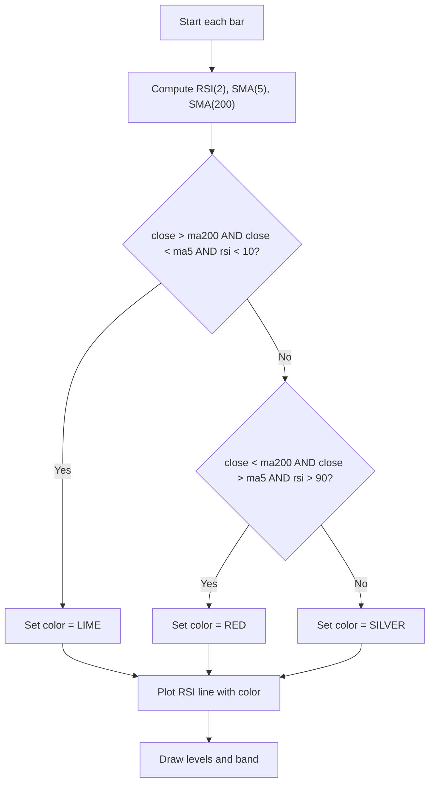

# 2-Period RSI Strategy - Technical Guide

> Plots a 2-period RSI with color-coded signals based on SMA(5), SMA(200) and oversold/overbought thresholds.

| | |
| --- | --- |
| **Language** | Indie Script v5 |
| **Platform** | [TakeProfit](https://takeprofit.com) |
| **Category** | Oscillators |
| **Type** | Indicator |
| **Author** | @dr_jones on TakeProfit |
| **Original** | Ported to Indie from https://www.tradingview.com/script/xOm7jSPf-CM-RSI-2-Strategy-Lower-Indicator/ created by @ChrisMoody Based on Larry Connors RSI-2 Strategy - Lower RSI |
| **License** | MPL-2.0 (see the header of the source file) |
| **Live script** | [Open on TakeProfit](https://takeprofit.com/indicator/2-period-rsi-strategy-51) |
| **Source file** | [2-Period RSI Strategy.indie5](2-Period%20RSI%20Strategy.indie5) |

## Overview

This indicator implements the Larry Connors 2-Period RSI mean-reversion strategy. It computes a 2-period RSI and two simple moving averages (5 and 200 periods). The RSI line is colored to highlight potential buy and sell setups: lime when the market is above the 200 SMA, below the 5 SMA, and the RSI is below 10 (oversold); red when below the 200 SMA, above the 5 SMA, and the RSI is above 90 (overbought). Otherwise the line is silver.

The indicator is designed for short-term mean-reversion trading. It draws fixed horizontal levels at 100, 90, 10, and 0, and a semi-transparent band between 10 and 90 to visually mark the oversold/overbought zones. The colored RSI line helps traders quickly identify when the conditions for a potential reversal are met.

## How it works

1. Compute the 2-period RSI from the current close price.
2. Compute the 5-period simple moving average (SMA) of close.
3. Compute the 200-period simple moving average (SMA) of close.
4. Check if close is above the 200 SMA and below the 5 SMA and RSI < 10; if true, set line color to lime.
5. Else check if close is below the 200 SMA and above the 5 SMA and RSI > 90; if true, set line color to red.
6. Otherwise set line color to silver.
7. Plot the RSI value as a line with the determined color.
8. Draw fixed levels at 100, 90, 10, 0 and a band between 10 and 90.

## Mathematical model

The indicator uses standard RSI and SMA formulas:

$$
\text{RSI} = 100 - \frac{100}{1 + \frac{\text{average gain}}{\text{average loss}}}
$$

where average gain and average loss are computed over the last 2 periods using Wilder's smoothing.

$$
\text{SMA}(n) = \frac{1}{n} \sum_{i=0}^{n-1} \text{close}[i]
$$

with $n=5$ and $n=200$.

## Logic flow



## Code walkthrough

### Decorators and UI setup

Lines 13-19 of [2-Period RSI Strategy.indie5](2-Period%20RSI%20Strategy.indie5):

```python
@indicator('RSI-2')
@plot.line(line_width=4, title='RSI', id='#plot_0')
@level(100, line_width=3, line_color=color.AQUA, line_style=line_style.SOLID, title='Upper Line 100')
@level(0, line_width=3, line_color=color.AQUA, line_style=line_style.SOLID, title='Lower Line 0')
@level(90, line_width=3, line_color=color.AQUA, line_style=line_style.SOLID, title='Upper Line 90')
@level(10, line_width=3, line_color=color.AQUA, line_style=line_style.SOLID, title='Lower Line 10')
@band(10, 90, fill_color=color.SILVER(0.1))
```

The `@indicator` decorator sets the indicator name to 'RSI-2'. The `@plot.line` decorator defines the main plot line with width 4 and title 'RSI'. The `@level` decorators draw horizontal lines at 100, 0, 90, and 10 with aqua color and solid style. The `@band` decorator fills the area between 10 and 90 with a semi-transparent silver fill. These decorators automatically generate the settings UI in the platform.

### Computing the indicators

Lines 21-24 of [2-Period RSI Strategy.indie5](2-Period%20RSI%20Strategy.indie5):

```python
    rsi = Rsi.new(self.close, 2)[0]

    ma5 = Sma.new(self.close, 5)[0]
    ma200 = Sma.new(self.close, 200)[0]
```

The RSI with period 2 is computed using `Rsi.new(self.close, 2)[0]`. The SMA with period 5 and 200 are computed similarly. The `[0]` index retrieves the current bar's value from the series returned by `.new()`. These values are used later in the color logic.

### Color logic for buy/sell signals

Lines 26-30 of [2-Period RSI Strategy.indie5](2-Period%20RSI%20Strategy.indie5):

```python
    col = color.SILVER
    if self.close[0] > ma200 and self.close[0] < ma5 and rsi < 10:
        col = color.LIME
    elif self.close[0] < ma200 and self.close[0] > ma5 and rsi > 90:
        col = color.RED
```

The variable `col` is initially set to `color.SILVER`. The first condition checks for a long setup: close above 200 SMA, close below 5 SMA, and RSI below 10. If true, the color becomes LIME. The second condition checks for a short setup: close below 200 SMA, close above 5 SMA, and RSI above 90. If true, the color becomes RED. Otherwise, the default silver is used.

### Returning the plot

Lines 32-32 of [2-Period RSI Strategy.indie5](2-Period%20RSI%20Strategy.indie5):

```python
    return plot.Line(rsi, color=col)
```

The function returns a `plot.Line` tuple containing the RSI value and the computed color. This single line is the only output drawn on the chart. The levels and band are drawn automatically by the decorators.

## Reading the chart

- The **RSI line** is colored **lime** when all three conditions for a long setup are met: price above the 200-period SMA, price below the 5-period SMA, and RSI below 10 (deeply oversold). This suggests a potential mean-reversion buy.
- The line is colored **red** when conditions for a short setup are met: price below the 200-period SMA, price above the 5-period SMA, and RSI above 90 (extremely overbought). This suggests a potential mean-reversion sell.
- Otherwise the line is **silver**, indicating no clear signal.
- The **aqua horizontal levels** at 100 and 0 mark the RSI extremes; levels at 90 and 10 highlight the overbought/oversold thresholds used in the strategy.
- The **silver band** between 10 and 90 visually emphasizes the normal RSI range; signals occur only when the RSI exits this band.

## Implementation notes

- The RSI(2) is extremely sensitive and can produce frequent whipsaws; it is designed for very short-term mean-reversion.
- The SMA(200) may not be available on charts with fewer than 200 bars; in that case the condition using `ma200` will be false and the line will remain silver.
- The indicator does not repaint because it uses only the current bar's close and RSI value; all calculations are based on the current bar's data.
- The color logic uses strict inequalities; if any of the conditions are not met (e.g., RSI exactly 10 or 90), the line stays silver.

## FAQ

**How can I change the RSI period or the moving average lengths?**

Modify the numeric arguments in lines 21, 23, and 24. For example, change `Rsi.new(self.close, 2)` to `Rsi.new(self.close, 5)` for a 5-period RSI, and adjust the SMA periods accordingly.

**Can I adjust the overbought/oversold thresholds (10 and 90)?**

Yes, edit the `@level` decorators on lines 17 and 18 to change the displayed levels, and update the hardcoded values in the conditions on lines 27 and 29 (e.g., change `rsi < 10` to `rsi < 20`).

**What does the lime and red coloring mean exactly?**

Lime indicates a potential long entry: price above the 200 SMA, below the 5 SMA, and RSI below 10. Red indicates a potential short entry: price below the 200 SMA, above the 5 SMA, and RSI above 90. These are mean-reversion signals based on Larry Connors' strategy.

## Full source code

Indie Script v5, as published on TakeProfit. Copy it into the platform's script editor or [open the live script](https://takeprofit.com/indicator/2-period-rsi-strategy-51).

```python
# Ported to Indie from https://www.tradingview.com/script/xOm7jSPf-CM-RSI-2-Strategy-Lower-Indicator/ created by @ChrisMoody
# Based on Larry Connors RSI-2 Strategy - Lower RSI

# This Source Code Form is subject to the terms of the Mozilla Public License, v. 2.0.  
# If a copy of the MPL was not distributed with this file, you can obtain one at  
# <https://mozilla.org/MPL/2.0/>.

# indie:lang_version = 5
from indie import indicator, color, plot, level, band, line_style
from indie.algorithms import Rsi, Sma


@indicator('RSI-2')
@plot.line(line_width=4, title='RSI', id='#plot_0')
@level(100, line_width=3, line_color=color.AQUA, line_style=line_style.SOLID, title='Upper Line 100')
@level(0, line_width=3, line_color=color.AQUA, line_style=line_style.SOLID, title='Lower Line 0')
@level(90, line_width=3, line_color=color.AQUA, line_style=line_style.SOLID, title='Upper Line 90')
@level(10, line_width=3, line_color=color.AQUA, line_style=line_style.SOLID, title='Lower Line 10')
@band(10, 90, fill_color=color.SILVER(0.1))
def Main(self):
    rsi = Rsi.new(self.close, 2)[0]

    ma5 = Sma.new(self.close, 5)[0]
    ma200 = Sma.new(self.close, 200)[0]

    col = color.SILVER
    if self.close[0] > ma200 and self.close[0] < ma5 and rsi < 10:
        col = color.LIME
    elif self.close[0] < ma200 and self.close[0] > ma5 and rsi > 90:
        col = color.RED
    
    return plot.Line(rsi, color=col)
```
