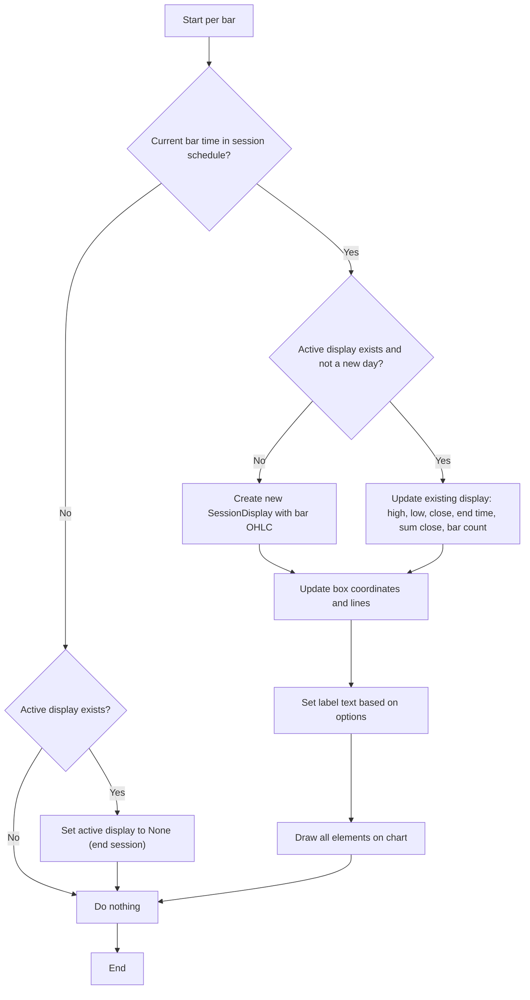

# 3 Trading Sessions - Technical Guide

> Highlights up to three customizable intraday trading sessions with colored rectangles, open/close lines, and optional statistics like tick range and average price.

| | |
| --- | --- |
| **Language** | Indie Script v5 |
| **Platform** | [TakeProfit](https://takeprofit.com) |
| **Category** | Other |
| **Type** | Indicator |
| **Author** | @dr_jones on TakeProfit |
| **Original** | Ported to Indie from TradingView built-in https://www.tradingview.com/support/solutions/43000729030-trading-sessions/ |
| **License** | MIT |
| **Live script** | [Open on TakeProfit](https://takeprofit.com/indicator/3-trading-sessions-25) |
| **Source file** | [3 Trading Sessions.indie5](3%20Trading%20Sessions.indie5) |

## Overview

3 Trading Sessions draws a colored rectangle for each enabled session, spanning from the first bar that opens within the session to the last bar that opens within it. The rectangle's top and bottom correspond to the session's high and low prices. Optional dashed lines mark the session's opening and closing prices, and a dotted line shows the average price of all bars in the session.

It is intended for intraday charts to visualize global market sessions. The indicator does not generate trading signals; it simply overlays time-based zones to help traders contextualize price action during specific hours.

## How it works

1. Parse user-defined session times and timezones into `Schedule` objects using `make_schedule`.
2. On each bar, determine if a new trading day has started by comparing the current and previous bar's trading session period via `trading_session.is_same_period`.
3. For each enabled session, check if the current bar's time falls within the session's schedule.
4. If inside a session and no active display exists or a new day started, create a new `SessionDisplay` with the bar's OHLC and start/end times.
5. If inside a session and an active display already exists, update the display's high, low, close, end time, and accumulate sum of closes and bar count.
6. Update the box coordinates to span from session start time to current end time, and from session low to high.
7. If enabled, draw open and close lines at their respective price levels, and an average line computed from accumulated closes.
8. If enabled, set a label at the session low showing the session name, tick range, and/or average price.
9. Draw all elements (box lines, open/close lines, average line, label) on the chart.
10. When a bar falls outside the session, clear the active display, ending the rectangle.

## Logic flow



## Parameters

| Parameter | Type | Default | Range | Description |
| --- | --- | --- | --- | --- |
| `show_session_names` | bool | true |  | Show session names |
| `show_session_oc` | bool | true |  | Draw session open and close lines |
| `show_session_tick_range` | bool | true |  | Show tick range for each session |
| `show_session_average` | bool | true |  | Show average price per session |
| `show_first` | bool | true |  | Show first session |
| `first_session_name` | str | Tokyo |  | First session name |
| `first_session_time` | str | 0900-1500 |  | First session time |
| `first_session_tz` | str | Asia/Tokyo |  | First session timezone |
| `show_second` | bool | true |  | Show second session |
| `second_session_name` | str | London |  | Second session name |
| `second_session_time` | str | 0830-1630 |  | Second session time |
| `second_session_tz` | str | Europe/London |  | Second session timezone |
| `show_third` | bool | true |  | Show third session |
| `third_session_name` | str | New York |  | Third session name |
| `third_session_time` | str | 0930-1600 |  | Third session time |
| `third_session_tz` | str | America/New_York |  | Third session timezone |

## Code walkthrough

### Parsing session time strings

Lines 11-19 of [3 Trading Sessions.indie5](3%20Trading%20Sessions.indie5):

```python
def make_schedule(time_str: str, timezone: str) -> Schedule:
    if len(time_str) != 9 or time_str[4] != '-':
        raise IndieError('time must be of pattern "hhmm-hhmm", got: ' + time_str)
    h_start = int(time_str[0]) * 10 + int(time_str[1])
    m_start = int(time_str[2]) * 10 + int(time_str[3])
    h_end = int(time_str[5]) * 10 + int(time_str[6])
    m_end = int(time_str[7]) * 10 + int(time_str[8])
    schedule_rule = ScheduleRule(start=time(hour=h_start, minute=m_start), end=time(hour=h_end, minute=m_end))
    return Schedule(rules=[schedule_rule], timezone=timezone)
```

The `make_schedule` function validates that the input string is exactly 9 characters with a dash at position 4 (format `hhmm-hhmm`). It extracts start and end hours/minutes, creates a `ScheduleRule` with `time` objects, and returns a `Schedule` with that rule and the given timezone. This schedule is later used to test if a bar's timestamp falls within the session.

### Setting up drawing primitives

Lines 23-38 of [3 Trading Sessions.indie5](3%20Trading%20Sessions.indie5):

```python
    def __init__(self, session_color: Color):
        # Box elements (4 lines to replace box)
        self._session_box_top = LineSegment(AbsolutePosition(0, 0), AbsolutePosition(0, 0), color=session_color)
        self._session_box_bottom = LineSegment(AbsolutePosition(0, 0), AbsolutePosition(0, 0), color=session_color)
        self._session_box_left = LineSegment(AbsolutePosition(0, 0), AbsolutePosition(0, 0), color=session_color)
        self._session_box_right = LineSegment(AbsolutePosition(0, 0), AbsolutePosition(0, 0), color=session_color)

        self._session_label = LabelAbs('', AbsolutePosition(0, 0), font_size=12, text_color=session_color,
                                       callout_position=callout_position.BOTTOM_RIGHT, bg_color=color.BLACK(0.0))

        self._open_line = LineSegment(AbsolutePosition(0, 0), AbsolutePosition(0, 0),
                                      color=session_color, line_style=line_segment_style.DASHED)
        self._close_line = LineSegment(AbsolutePosition(0, 0), AbsolutePosition(0, 0),
                                       color=session_color, line_style=line_segment_style.DASHED)
        self._avg_line = LineSegment(AbsolutePosition(0, 0), AbsolutePosition(0, 0),
                                     color=session_color, line_style=line_segment_style.DOTTED, line_width=2)
```

`SessionDisplay.__init__` creates four `LineSegment` objects to form a rectangle (top, bottom, left, right), a `LabelAbs` for session info, and three additional `LineSegment` objects for open, close, and average lines. All are initialized with placeholder coordinates and the session's color. The dashed and dotted line styles are set here. This approach uses line segments because Indie does not have a dedicated box drawing primitive.

### Per‑bar session logic

Lines 141-162 of [3 Trading Sessions.indie5](3%20Trading%20Sessions.indie5):

```python
    def calc(self, chart: Chart, is_change: bool, show_session_names: bool,
               show_session_oc: bool, show_session_tick_range: bool, show_session_average: bool,
               tick_size: float, price_precision: int) -> None:
        in_session = self.ctx.time[0] in self._schedule

        if in_session:
            if self._active.get() is None or is_change:
                self.create_session_display()
            else:
                self.update_session_display()

            # Update coordinates and draw
            active_display = self._active.get().value()
            active_display.update_box_coordinates()
            active_display.update_lines(self._sum_close.get(), self._num_of_bars.get(), show_session_oc, show_session_average)
            active_display.set_name(self._name, self._sum_close.get(), self._num_of_bars.get(),
                                    show_session_names, show_session_tick_range,
                                    show_session_average, tick_size, price_precision)
            active_display.draw_all(chart, show_session_oc, show_session_average)

        elif self._active.get() is not None:
            self._active.set(None)
```

`SessionInfo.calc` first checks if the current bar's time is within the session schedule. If inside, it either creates a new `SessionDisplay` (when no active display exists or `is_change` signals a new day) or updates the existing one with the latest high, low, close, and end time. It then updates the box coordinates, lines, and label text, and draws everything on the chart. When the bar leaves the session, the active display is set to `None`, effectively ending the rectangle.

### Detecting a new trading day

Lines 201-212 of [3 Trading Sessions.indie5](3%20Trading%20Sessions.indie5):

```python
    def calc(self, show_session_names, show_session_oc, show_session_tick_range, show_session_average):
        # Check for new day
        is_change = (
            not isnan(self.time[1]) and
            not self.trading_session.is_same_period(self.time[0], self.time[1])
        )

        # Update each session
        for info in self._session_infos:
            info.calc(self.chart, is_change, show_session_names, show_session_oc,
                      show_session_tick_range, show_session_average,
                      self.info.tick_size, self.info.price_precision)
```

In `Main.calc`, `is_change` is computed by checking that the previous bar's time is not `NaN` and that `trading_session.is_same_period` returns `False` for the current and previous times. This flag is passed to each `SessionInfo.calc` call, causing a fresh session display to be created at the start of a new day even if the time is still within the schedule. The loop then iterates over all enabled sessions, passing chart, display options, and the instrument's tick size and price precision.

## Reading the chart

- Each session is shown as a rectangle with a distinct color (blue for first, yellow for second, green for third by default).
- The rectangle spans from the session's start time to its end time, and from the lowest low to the highest high within that period.
- Dashed horizontal lines indicate the session's open and close prices (if enabled).
- A dotted horizontal line shows the average price of all bars in the session (if enabled).
- A label at the bottom-left of the rectangle can display the session name, tick range, and/or average price.

## Implementation notes

- The indicator raises an `IndieError` if applied to a daily or higher timeframe (line 187).
- The `is_change` flag uses `trading_session.is_same_period` to detect a new trading day, which depends on the chart's session settings.
- The time string must be exactly 9 characters in `hhmm-hhmm` format; otherwise an error is thrown (line 12).
- The `SessionDisplay` uses four `LineSegment` objects to draw a rectangle because Indie does not have a dedicated box primitive.

## FAQ

**How can I add a fourth session?**

You would need to add another set of parameters (show, name, time, timezone) and create an additional `SessionInfo` instance in `Main.__init__`, similar to the existing three.

**Why does the rectangle sometimes extend beyond the session's end time?**

The rectangle's end time is updated to the last bar that falls within the session schedule. If a bar opens before the session ends but closes after, it may still be included if its opening time is within the schedule.

**Can I change the colors of the sessions?**

The colors are hardcoded in `Main.__init__` (color.BLUE, color.YELLOW, color.GREEN). To change them, you would need to modify those lines or add color parameters.

## Full source code

Indie Script v5, as published on TakeProfit. Copy it into the platform's script editor or [open the live script](https://takeprofit.com/indicator/3-trading-sessions-25).

```python
# Ported to Indie from TradingView built-in https://www.tradingview.com/support/solutions/43000729030-trading-sessions/

# indie:lang_version = 5
from math import isnan
from datetime import time
from indie import IndieError, indicator, param, color, MainContext, Context, Color, Optional, TimeFrame, time_frame_unit, Algorithm
from indie.schedule import ScheduleRule, Schedule
from indie.drawings import LineSegment, LabelAbs, AbsolutePosition, callout_position, line_segment_style, Chart


def make_schedule(time_str: str, timezone: str) -> Schedule:
    if len(time_str) != 9 or time_str[4] != '-':
        raise IndieError('time must be of pattern "hhmm-hhmm", got: ' + time_str)
    h_start = int(time_str[0]) * 10 + int(time_str[1])
    m_start = int(time_str[2]) * 10 + int(time_str[3])
    h_end = int(time_str[5]) * 10 + int(time_str[6])
    m_end = int(time_str[7]) * 10 + int(time_str[8])
    schedule_rule = ScheduleRule(start=time(hour=h_start, minute=m_start), end=time(hour=h_end, minute=m_end))
    return Schedule(rules=[schedule_rule], timezone=timezone)


class SessionDisplay:
    def __init__(self, session_color: Color):
        # Box elements (4 lines to replace box)
        self._session_box_top = LineSegment(AbsolutePosition(0, 0), AbsolutePosition(0, 0), color=session_color)
        self._session_box_bottom = LineSegment(AbsolutePosition(0, 0), AbsolutePosition(0, 0), color=session_color)
        self._session_box_left = LineSegment(AbsolutePosition(0, 0), AbsolutePosition(0, 0), color=session_color)
        self._session_box_right = LineSegment(AbsolutePosition(0, 0), AbsolutePosition(0, 0), color=session_color)

        self._session_label = LabelAbs('', AbsolutePosition(0, 0), font_size=12, text_color=session_color,
                                       callout_position=callout_position.BOTTOM_RIGHT, bg_color=color.BLACK(0.0))

        self._open_line = LineSegment(AbsolutePosition(0, 0), AbsolutePosition(0, 0),
                                      color=session_color, line_style=line_segment_style.DASHED)
        self._close_line = LineSegment(AbsolutePosition(0, 0), AbsolutePosition(0, 0),
                                       color=session_color, line_style=line_segment_style.DASHED)
        self._avg_line = LineSegment(AbsolutePosition(0, 0), AbsolutePosition(0, 0),
                                     color=session_color, line_style=line_segment_style.DOTTED, line_width=2)

        self.session_high = 0.0
        self.session_low = 0.0
        self.session_open = 0.0
        self.session_close = 0.0
        self.start_time = 0.0
        self.end_time = 0.0

    def set_name(self, name: str, sum_close: float, num_of_bars: int,
                 show_session_names: bool, show_session_tick_range: bool,
                 show_session_average: bool, tick_size: float, price_precision: int) -> None:
        box_text: list[str] = []
        if show_session_tick_range:
            tick_range = (self.session_high - self.session_low) / tick_size
            box_text.append("Range: " + str(round(tick_range, price_precision)))
        if show_session_average and num_of_bars > 0:
            avg = sum_close / num_of_bars
            box_text.append("Avg: " + str(round(avg, price_precision)))
        if show_session_names:
            box_text.append(name)

        self._session_label.position = AbsolutePosition(self.start_time, self.session_low)
        self._session_label.text = "\n".join(box_text)

    def update_box_coordinates(self) -> None:
        self._session_box_top.point_a = AbsolutePosition(self.start_time, self.session_high)
        self._session_box_top.point_b = AbsolutePosition(self.end_time, self.session_high)

        self._session_box_bottom.point_a = AbsolutePosition(self.start_time, self.session_low)
        self._session_box_bottom.point_b = AbsolutePosition(self.end_time, self.session_low)

        self._session_box_left.point_a = AbsolutePosition(self.start_time, self.session_high)
        self._session_box_left.point_b = AbsolutePosition(self.start_time, self.session_low)

        self._session_box_right.point_a = AbsolutePosition(self.end_time, self.session_high)
        self._session_box_right.point_b = AbsolutePosition(self.end_time, self.session_low)

    def update_lines(self, sum_close: float, num_of_bars: int, show_session_oc: bool, show_session_average: bool) -> None:
        if show_session_oc:
            self._open_line.point_a = AbsolutePosition(self.start_time, self.session_open)
            self._open_line.point_b = AbsolutePosition(self.end_time, self.session_open)

            self._close_line.point_a = AbsolutePosition(self.start_time, self.session_close)
            self._close_line.point_b = AbsolutePosition(self.end_time, self.session_close)

        if show_session_average and num_of_bars > 0:
            avg = sum_close / num_of_bars
            self._avg_line.point_a = AbsolutePosition(self.start_time, avg)
            self._avg_line.point_b = AbsolutePosition(self.end_time, avg)

    def draw_all(self, chart: Chart, show_session_oc: bool, show_session_average: bool) -> None:
        # Draw box
        chart.draw(self._session_box_top)
        chart.draw(self._session_box_bottom)
        chart.draw(self._session_box_left)
        chart.draw(self._session_box_right)

        # Draw lines
        if show_session_oc:
            chart.draw(self._open_line)
            chart.draw(self._close_line)

        if show_session_average:
            chart.draw(self._avg_line)

        # Draw label
        chart.draw(self._session_label)


class SessionInfo(Algorithm):
    def __init__(self, ctx: Context, session_color: Color, name: str, schedule: Schedule):
        super().__init__(ctx)
        self._color = session_color
        self._name = name
        self._schedule = schedule
        self._active = ctx.new_var(Optional[SessionDisplay]())
        self._sum_close = ctx.new_var(0.0)
        self._num_of_bars = ctx.new_var(1)

    def create_session_display(self) -> None:
        disp = SessionDisplay(self._color)
        disp.start_time = self.ctx.time[0]
        disp.end_time = self.ctx.time[0]
        disp.session_high = self.ctx.high[0]
        disp.session_low = self.ctx.low[0]
        disp.session_open = self.ctx.open[0]
        disp.session_close = self.ctx.close[0]

        self._active.set(disp)
        self._sum_close.set(self.ctx.close[0])
        self._num_of_bars.set(1)

    def update_session_display(self) -> None:
        session_disp = self._active.get().value()
        session_disp.session_high = max(session_disp.session_high, self.ctx.high[0])
        session_disp.session_low = min(session_disp.session_low, self.ctx.low[0])
        session_disp.session_close = self.ctx.close[0]
        session_disp.end_time = self.ctx.time[0]

        self._sum_close.set(self._sum_close.get() + self.ctx.close[0])
        self._num_of_bars.set(self._num_of_bars.get() + 1)

    def calc(self, chart: Chart, is_change: bool, show_session_names: bool,
               show_session_oc: bool, show_session_tick_range: bool, show_session_average: bool,
               tick_size: float, price_precision: int) -> None:
        in_session = self.ctx.time[0] in self._schedule

        if in_session:
            if self._active.get() is None or is_change:
                self.create_session_display()
            else:
                self.update_session_display()

            # Update coordinates and draw
            active_display = self._active.get().value()
            active_display.update_box_coordinates()
            active_display.update_lines(self._sum_close.get(), self._num_of_bars.get(), show_session_oc, show_session_average)
            active_display.set_name(self._name, self._sum_close.get(), self._num_of_bars.get(),
                                    show_session_names, show_session_tick_range,
                                    show_session_average, tick_size, price_precision)
            active_display.draw_all(chart, show_session_oc, show_session_average)

        elif self._active.get() is not None:
            self._active.set(None)


@indicator('3 Trading Sessions', overlay_main_pane=True)
@param.bool('show_session_names', default=True, title='Show session names')
@param.bool('show_session_oc', default=True, title='Draw session open and close lines')
@param.bool('show_session_tick_range', default=True, title='Show tick range for each session')
@param.bool('show_session_average', default=True, title='Show average price per session')
@param.bool('show_first', default=True, title='Show first session')
@param.str('first_session_name', default='Tokyo', title='First session name')
@param.str('first_session_time', default='0900-1500', title='First session time')
@param.str('first_session_tz', default='Asia/Tokyo', title='First session timezone')
@param.bool('show_second', default=True, title='Show second session')
@param.str('second_session_name', default='London', title='Second session name')
@param.str('second_session_time', default='0830-1630', title='Second session time')
@param.str('second_session_tz', default='Europe/London', title='Second session timezone')
@param.bool('show_third', default=True, title='Show third session')
@param.str('third_session_name', default='New York', title='Third session name')
@param.str('third_session_time', default='0930-1600', title='Third session time')
@param.str('third_session_tz', default='America/New_York', title='Third session timezone')
class Main(MainContext):
    def __init__(self,
                 show_first, first_session_name, first_session_time, first_session_tz,
                 show_second, second_session_name, second_session_time, second_session_tz,
                 show_third, third_session_name, third_session_time, third_session_tz):
        if self.time_frame.to_minutes() >= TimeFrame(1, time_frame_unit.DAY).to_minutes():
            raise IndieError('This indicator can only be used on intraday timeframes.')

        self._session_infos: list[SessionInfo] = []
        if show_first:
            self._session_infos.append(SessionInfo(self, color.BLUE, first_session_name,
                                                   make_schedule(first_session_time, first_session_tz)))
        if show_second:
            self._session_infos.append(SessionInfo(self, color.YELLOW, second_session_name,
                                                   make_schedule(second_session_time, second_session_tz)))
        if show_third:
            self._session_infos.append(SessionInfo(self, color.GREEN, third_session_name,
                                                   make_schedule(third_session_time, third_session_tz)))

    def calc(self, show_session_names, show_session_oc, show_session_tick_range, show_session_average):
        # Check for new day
        is_change = (
            not isnan(self.time[1]) and
            not self.trading_session.is_same_period(self.time[0], self.time[1])
        )

        # Update each session
        for info in self._session_infos:
            info.calc(self.chart, is_change, show_session_names, show_session_oc,
                      show_session_tick_range, show_session_average,
                      self.info.tick_size, self.info.price_precision)
```
