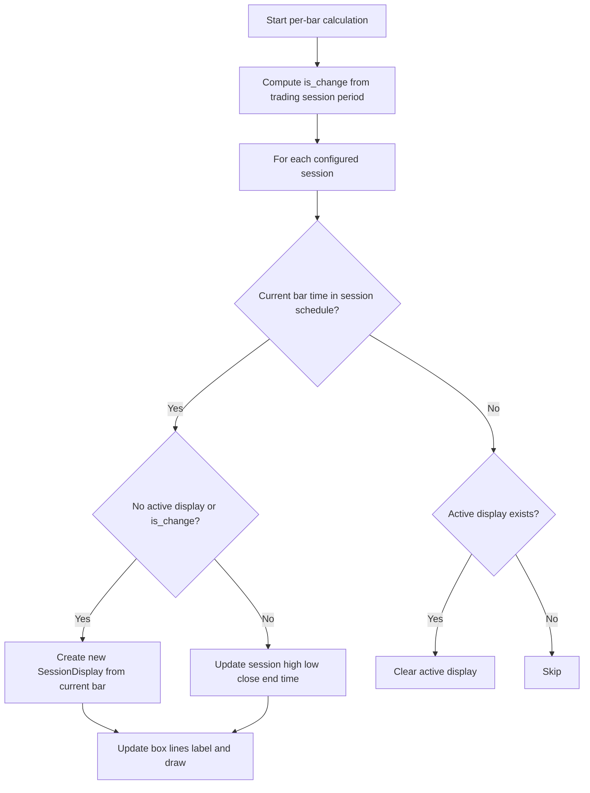

# 3 Trading Sessions - Technical Guide

> Marks up to three custom trading sessions on intraday charts with colored boxes, labels, and optional open/close/average lines.

| | |
| --- | --- |
| **Language** | Indie Script v5 |
| **Platform** | [TakeProfit](https://takeprofit.com) |
| **Category** | Other |
| **Type** | Indicator |
| **Author** | @dr_jones on TakeProfit |
| **Original** | Ported to Indie from TradingView built-in https://www.tradingview.com/support/solutions/43000729030-trading-sessions/ |
| **License** | MIT |
| **Live script** | [Open on TakeProfit](https://takeprofit.com/indicator/3-trading-sessions-25) |
| **Source file** | [3 Trading Sessions.indie5](3%20Trading%20Sessions.indie5) |

## Overview

This is ported to Indie from the TradingView built-in Trading Sessions script. The indicator divides intraday price action into up to three configurable time windows, each defined by a start time, end time, and timezone. Any bar whose timestamp falls inside a session's schedule belongs to that session. The default configuration uses Tokyo, London, and New York trading hours.

The indicator is drawn in the main chart pane as an overlay. For each active session it draws a colored rectangle bounded by the session high/low and session start/current end time. It can also draw dashed open and close lines, a dotted average price line, and a label with the session name, tick range, and average close. It is meant for observing price behavior around regional market hours on intraday charts.

## How it works

1. Parse each enabled session's time string into a ScheduleRule with start time, end time, and timezone.
2. On each bar, compute `is_change` using `self.trading_session.is_same_period` to detect a new session period.
3. For each configured session, test whether the current bar time belongs to that session's schedule.
4. If in session and no active display exists, or `is_change` is true, create a new SessionDisplay initialized with the current bar's open, high, low, close, and time.
5. Otherwise update the active display: raise high, lower low, set close, extend end_time, add close to sum, and increment bar count.
6. Update the box coordinates from start/end times and high/low, and update optional open/close and average lines.
7. Build the label text from session name, tick range, and average close if the corresponding options are enabled.
8. Draw all line segments and the label; if the bar is outside the session and a display exists, clear it.

## Mathematical model

$$
\text{tick\_range} = \frac{\text{session\_high} - \text{session\_low}}{\text{tick\_size}}
$$

$$
\text{avg} = \frac{\sum \text{close}}{\text{num\_of\_bars}}
$$

## Logic flow



## Parameters

| Parameter | Type | Default | Range | Description |
| --- | --- | --- | --- | --- |
| `show_session_names` | bool | true |  | Show session names |
| `show_session_oc` | bool | true |  | Draw session open and close lines |
| `show_session_tick_range` | bool | true |  | Show tick range for each session |
| `show_session_average` | bool | true |  | Show average price per session |
| `show_first` | bool | true |  | Show first session |
| `first_session_name` | str | Tokyo |  | First session name |
| `first_session_time` | str | 0900-1500 |  | First session time |
| `first_session_tz` | str | Asia/Tokyo |  | First session timezone |
| `show_second` | bool | true |  | Show second session |
| `second_session_name` | str | London |  | Second session name |
| `second_session_time` | str | 0830-1630 |  | Second session time |
| `second_session_tz` | str | Europe/London |  | Second session timezone |
| `show_third` | bool | true |  | Show third session |
| `third_session_name` | str | New York |  | Third session name |
| `third_session_time` | str | 0930-1600 |  | Third session time |
| `third_session_tz` | str | America/New_York |  | Third session timezone |

## Code walkthrough

### Strict parsing of session time strings

Lines 11-19 of [3 Trading Sessions.indie5](3%20Trading%20Sessions.indie5):

```python
def make_schedule(time_str: str, timezone: str) -> Schedule:
    if len(time_str) != 9 or time_str[4] != '-':
        raise IndieError('time must be of pattern "hhmm-hhmm", got: ' + time_str)
    h_start = int(time_str[0]) * 10 + int(time_str[1])
    m_start = int(time_str[2]) * 10 + int(time_str[3])
    h_end = int(time_str[5]) * 10 + int(time_str[6])
    m_end = int(time_str[7]) * 10 + int(time_str[8])
    schedule_rule = ScheduleRule(start=time(hour=h_start, minute=m_start), end=time(hour=h_end, minute=m_end))
    return Schedule(rules=[schedule_rule], timezone=timezone)
```

`make_schedule` requires exactly `hhmm-hhmm`, checking the length, the separator at index 4, and then parsing the four time digits. It constructs a `ScheduleRule` with a `time()` object and returns a `Schedule` bound to the selected timezone. Any malformed string raises `IndieError`.

### Session rectangle as four line segments

Lines 63-74 of [3 Trading Sessions.indie5](3%20Trading%20Sessions.indie5):

```python
    def update_box_coordinates(self) -> None:
        self._session_box_top.point_a = AbsolutePosition(self.start_time, self.session_high)
        self._session_box_top.point_b = AbsolutePosition(self.end_time, self.session_high)

        self._session_box_bottom.point_a = AbsolutePosition(self.start_time, self.session_low)
        self._session_box_bottom.point_b = AbsolutePosition(self.end_time, self.session_low)

        self._session_box_left.point_a = AbsolutePosition(self.start_time, self.session_high)
        self._session_box_left.point_b = AbsolutePosition(self.start_time, self.session_low)

        self._session_box_right.point_a = AbsolutePosition(self.end_time, self.session_high)
        self._session_box_right.point_b = AbsolutePosition(self.end_time, self.session_low)
```

Instead of a dedicated rectangle object, the session box is drawn from four `LineSegment` objects. `update_box_coordinates` positions the top and bottom at the session high/low and the left and right at the session start/end times. Because this is called each bar, the rectangle grows as the session progresses.

### Accumulating session values

Lines 131-139 of [3 Trading Sessions.indie5](3%20Trading%20Sessions.indie5):

```python
    def update_session_display(self) -> None:
        session_disp = self._active.get().value()
        session_disp.session_high = max(session_disp.session_high, self.ctx.high[0])
        session_disp.session_low = min(session_disp.session_low, self.ctx.low[0])
        session_disp.session_close = self.ctx.close[0]
        session_disp.end_time = self.ctx.time[0]

        self._sum_close.set(self._sum_close.get() + self.ctx.close[0])
        self._num_of_bars.set(self._num_of_bars.get() + 1)
```

When a bar is inside a session, the running session high is raised, the low is lowered, the close is refreshed, and `end_time` is moved to the current bar. The sum of closes and the bar counter are also updated here; these are later used for the average-price line and label.

### Session start/update/clear state machine

Lines 144-162 of [3 Trading Sessions.indie5](3%20Trading%20Sessions.indie5):

```python
        in_session = self.ctx.time[0] in self._schedule

        if in_session:
            if self._active.get() is None or is_change:
                self.create_session_display()
            else:
                self.update_session_display()

            # Update coordinates and draw
            active_display = self._active.get().value()
            active_display.update_box_coordinates()
            active_display.update_lines(self._sum_close.get(), self._num_of_bars.get(), show_session_oc, show_session_average)
            active_display.set_name(self._name, self._sum_close.get(), self._num_of_bars.get(),
                                    show_session_names, show_session_tick_range,
                                    show_session_average, tick_size, price_precision)
            active_display.draw_all(chart, show_session_oc, show_session_average)

        elif self._active.get() is not None:
            self._active.set(None)
```

`SessionInfo.calc` decides what to do on every bar. A bar inside the schedule creates a new display if none is active or if `is_change` signals a new period; otherwise it updates the existing display. A bar outside the schedule clears the active display, resetting state for the next session occurrence.

### Intraday restriction and session registration

Lines 183-199 of [3 Trading Sessions.indie5](3%20Trading%20Sessions.indie5):

```python
    def __init__(self,
                 show_first, first_session_name, first_session_time, first_session_tz,
                 show_second, second_session_name, second_session_time, second_session_tz,
                 show_third, third_session_name, third_session_time, third_session_tz):
        if self.time_frame.to_minutes() >= TimeFrame(1, time_frame_unit.DAY).to_minutes():
            raise IndieError('This indicator can only be used on intraday timeframes.')

        self._session_infos: list[SessionInfo] = []
        if show_first:
            self._session_infos.append(SessionInfo(self, color.BLUE, first_session_name,
                                                   make_schedule(first_session_time, first_session_tz)))
        if show_second:
            self._session_infos.append(SessionInfo(self, color.YELLOW, second_session_name,
                                                   make_schedule(second_session_time, second_session_tz)))
        if show_third:
            self._session_infos.append(SessionInfo(self, color.GREEN, third_session_name,
                                                   make_schedule(third_session_time, third_session_tz)))
```

The constructor rejects timeframes of one day or larger, since the session schedule is only meaningful on intraday bars. It then builds one `SessionInfo` per enabled session, using hardcoded blue, yellow, and green colors for the first, second, and third sessions respectively.

### Detecting a change of trading period

Lines 201-212 of [3 Trading Sessions.indie5](3%20Trading%20Sessions.indie5):

```python
    def calc(self, show_session_names, show_session_oc, show_session_tick_range, show_session_average):
        # Check for new day
        is_change = (
            not isnan(self.time[1]) and
            not self.trading_session.is_same_period(self.time[0], self.time[1])
        )

        # Update each session
        for info in self._session_infos:
            info.calc(self.chart, is_change, show_session_names, show_session_oc,
                      show_session_tick_range, show_session_average,
                      self.info.tick_size, self.info.price_precision)
```

`Main.calc` computes `is_change` by checking that the previous bar time is not NaN and that the symbol's trading session period differs from the current bar. This flag forces each session to start a fresh display at the beginning of a new period, and the `isnan` guard avoids misfiring on the very first bar.

## Reading the chart

- First session is drawn in blue, second in yellow, third in green; these colors come from `color.BLUE`, `color.YELLOW`, and `color.GREEN`.
- Each session rectangle is a four-sided box whose top and bottom are the running session high and low, and whose left and right are the session start time and the latest bar time in that session.
- When `show_session_oc` is enabled, dashed lines mark the session open price and the current session close price from start to end of the session.
- When `show_session_average` is enabled, a dotted line with width 2 is drawn at the average close price for the session.
- The label is positioned at the session start time and low price, with a bottom-right callout, and may contain the session name, `Range: <tick range>`, and `Avg: <average close>`, depending on the enabled options.
- If all three optional texts are disabled, the label is still drawn but with an empty string.

## Implementation notes

- The indicator is intraday-only: `Main.__init__` raises `IndieError` when `self.time_frame.to_minutes() >= TimeFrame(1, time_frame_unit.DAY).to_minutes()`.
- Per-session state is stored with `ctx.new_var`: `_active` is an `Optional[SessionDisplay]`, while `_sum_close` and `_num_of_bars` accumulate across bars. The state is cleared only when a bar is outside the schedule and a display exists.
- The `is_change` flag uses `isnan` on `self.time[1]` so the first bar, where the previous bar time may be NaN, does not incorrectly trigger a new-display reset.
- Time strings are parsed strictly as `hhmm-hhmm`; any other length or missing hyphen at index 4 raises `IndieError`.

## FAQ

**What time format should I use for the session time parameter?**

Use a 24-hour `hhmm-hhmm` string with leading zeros, for example `0930-1600`. The parser requires exactly 4 digits, a hyphen, and 4 more digits; otherwise the indicator raises `IndieError`.

**Can I run this on a daily chart?**

No. The constructor checks the current timeframe and raises `IndieError` if it is 1 day or longer. The indicator is designed for intraday charts only.

**Can I change the color of a session from the settings?**

There are no color parameters. The code creates the first, second, and third sessions with `color.BLUE`, `color.YELLOW`, and `color.GREEN`. To change colors, edit those constructor calls in the source.

## Full source code

Indie Script v5, as published on TakeProfit. Copy it into the platform's script editor or [open the live script](https://takeprofit.com/indicator/3-trading-sessions-25).

```python
# Ported to Indie from TradingView built-in https://www.tradingview.com/support/solutions/43000729030-trading-sessions/

# indie:lang_version = 5
from math import isnan
from datetime import time
from indie import IndieError, indicator, param, color, MainContext, Context, Color, Optional, TimeFrame, time_frame_unit, Algorithm
from indie.schedule import ScheduleRule, Schedule
from indie.drawings import LineSegment, LabelAbs, AbsolutePosition, callout_position, line_segment_style, Chart


def make_schedule(time_str: str, timezone: str) -> Schedule:
    if len(time_str) != 9 or time_str[4] != '-':
        raise IndieError('time must be of pattern "hhmm-hhmm", got: ' + time_str)
    h_start = int(time_str[0]) * 10 + int(time_str[1])
    m_start = int(time_str[2]) * 10 + int(time_str[3])
    h_end = int(time_str[5]) * 10 + int(time_str[6])
    m_end = int(time_str[7]) * 10 + int(time_str[8])
    schedule_rule = ScheduleRule(start=time(hour=h_start, minute=m_start), end=time(hour=h_end, minute=m_end))
    return Schedule(rules=[schedule_rule], timezone=timezone)


class SessionDisplay:
    def __init__(self, session_color: Color):
        # Box elements (4 lines to replace box)
        self._session_box_top = LineSegment(AbsolutePosition(0, 0), AbsolutePosition(0, 0), color=session_color)
        self._session_box_bottom = LineSegment(AbsolutePosition(0, 0), AbsolutePosition(0, 0), color=session_color)
        self._session_box_left = LineSegment(AbsolutePosition(0, 0), AbsolutePosition(0, 0), color=session_color)
        self._session_box_right = LineSegment(AbsolutePosition(0, 0), AbsolutePosition(0, 0), color=session_color)

        self._session_label = LabelAbs('', AbsolutePosition(0, 0), font_size=12, text_color=session_color,
                                       callout_position=callout_position.BOTTOM_RIGHT, bg_color=color.BLACK(0.0))

        self._open_line = LineSegment(AbsolutePosition(0, 0), AbsolutePosition(0, 0),
                                      color=session_color, line_style=line_segment_style.DASHED)
        self._close_line = LineSegment(AbsolutePosition(0, 0), AbsolutePosition(0, 0),
                                       color=session_color, line_style=line_segment_style.DASHED)
        self._avg_line = LineSegment(AbsolutePosition(0, 0), AbsolutePosition(0, 0),
                                     color=session_color, line_style=line_segment_style.DOTTED, line_width=2)

        self.session_high = 0.0
        self.session_low = 0.0
        self.session_open = 0.0
        self.session_close = 0.0
        self.start_time = 0.0
        self.end_time = 0.0

    def set_name(self, name: str, sum_close: float, num_of_bars: int,
                 show_session_names: bool, show_session_tick_range: bool,
                 show_session_average: bool, tick_size: float, price_precision: int) -> None:
        box_text: list[str] = []
        if show_session_tick_range:
            tick_range = (self.session_high - self.session_low) / tick_size
            box_text.append("Range: " + str(round(tick_range, price_precision)))
        if show_session_average and num_of_bars > 0:
            avg = sum_close / num_of_bars
            box_text.append("Avg: " + str(round(avg, price_precision)))
        if show_session_names:
            box_text.append(name)

        self._session_label.position = AbsolutePosition(self.start_time, self.session_low)
        self._session_label.text = "\n".join(box_text)

    def update_box_coordinates(self) -> None:
        self._session_box_top.point_a = AbsolutePosition(self.start_time, self.session_high)
        self._session_box_top.point_b = AbsolutePosition(self.end_time, self.session_high)

        self._session_box_bottom.point_a = AbsolutePosition(self.start_time, self.session_low)
        self._session_box_bottom.point_b = AbsolutePosition(self.end_time, self.session_low)

        self._session_box_left.point_a = AbsolutePosition(self.start_time, self.session_high)
        self._session_box_left.point_b = AbsolutePosition(self.start_time, self.session_low)

        self._session_box_right.point_a = AbsolutePosition(self.end_time, self.session_high)
        self._session_box_right.point_b = AbsolutePosition(self.end_time, self.session_low)

    def update_lines(self, sum_close: float, num_of_bars: int, show_session_oc: bool, show_session_average: bool) -> None:
        if show_session_oc:
            self._open_line.point_a = AbsolutePosition(self.start_time, self.session_open)
            self._open_line.point_b = AbsolutePosition(self.end_time, self.session_open)

            self._close_line.point_a = AbsolutePosition(self.start_time, self.session_close)
            self._close_line.point_b = AbsolutePosition(self.end_time, self.session_close)

        if show_session_average and num_of_bars > 0:
            avg = sum_close / num_of_bars
            self._avg_line.point_a = AbsolutePosition(self.start_time, avg)
            self._avg_line.point_b = AbsolutePosition(self.end_time, avg)

    def draw_all(self, chart: Chart, show_session_oc: bool, show_session_average: bool) -> None:
        # Draw box
        chart.draw(self._session_box_top)
        chart.draw(self._session_box_bottom)
        chart.draw(self._session_box_left)
        chart.draw(self._session_box_right)

        # Draw lines
        if show_session_oc:
            chart.draw(self._open_line)
            chart.draw(self._close_line)

        if show_session_average:
            chart.draw(self._avg_line)

        # Draw label
        chart.draw(self._session_label)


class SessionInfo(Algorithm):
    def __init__(self, ctx: Context, session_color: Color, name: str, schedule: Schedule):
        super().__init__(ctx)
        self._color = session_color
        self._name = name
        self._schedule = schedule
        self._active = ctx.new_var(Optional[SessionDisplay]())
        self._sum_close = ctx.new_var(0.0)
        self._num_of_bars = ctx.new_var(1)

    def create_session_display(self) -> None:
        disp = SessionDisplay(self._color)
        disp.start_time = self.ctx.time[0]
        disp.end_time = self.ctx.time[0]
        disp.session_high = self.ctx.high[0]
        disp.session_low = self.ctx.low[0]
        disp.session_open = self.ctx.open[0]
        disp.session_close = self.ctx.close[0]

        self._active.set(disp)
        self._sum_close.set(self.ctx.close[0])
        self._num_of_bars.set(1)

    def update_session_display(self) -> None:
        session_disp = self._active.get().value()
        session_disp.session_high = max(session_disp.session_high, self.ctx.high[0])
        session_disp.session_low = min(session_disp.session_low, self.ctx.low[0])
        session_disp.session_close = self.ctx.close[0]
        session_disp.end_time = self.ctx.time[0]

        self._sum_close.set(self._sum_close.get() + self.ctx.close[0])
        self._num_of_bars.set(self._num_of_bars.get() + 1)

    def calc(self, chart: Chart, is_change: bool, show_session_names: bool,
               show_session_oc: bool, show_session_tick_range: bool, show_session_average: bool,
               tick_size: float, price_precision: int) -> None:
        in_session = self.ctx.time[0] in self._schedule

        if in_session:
            if self._active.get() is None or is_change:
                self.create_session_display()
            else:
                self.update_session_display()

            # Update coordinates and draw
            active_display = self._active.get().value()
            active_display.update_box_coordinates()
            active_display.update_lines(self._sum_close.get(), self._num_of_bars.get(), show_session_oc, show_session_average)
            active_display.set_name(self._name, self._sum_close.get(), self._num_of_bars.get(),
                                    show_session_names, show_session_tick_range,
                                    show_session_average, tick_size, price_precision)
            active_display.draw_all(chart, show_session_oc, show_session_average)

        elif self._active.get() is not None:
            self._active.set(None)


@indicator('3 Trading Sessions', overlay_main_pane=True)
@param.bool('show_session_names', default=True, title='Show session names')
@param.bool('show_session_oc', default=True, title='Draw session open and close lines')
@param.bool('show_session_tick_range', default=True, title='Show tick range for each session')
@param.bool('show_session_average', default=True, title='Show average price per session')
@param.bool('show_first', default=True, title='Show first session')
@param.str('first_session_name', default='Tokyo', title='First session name')
@param.str('first_session_time', default='0900-1500', title='First session time')
@param.str('first_session_tz', default='Asia/Tokyo', title='First session timezone')
@param.bool('show_second', default=True, title='Show second session')
@param.str('second_session_name', default='London', title='Second session name')
@param.str('second_session_time', default='0830-1630', title='Second session time')
@param.str('second_session_tz', default='Europe/London', title='Second session timezone')
@param.bool('show_third', default=True, title='Show third session')
@param.str('third_session_name', default='New York', title='Third session name')
@param.str('third_session_time', default='0930-1600', title='Third session time')
@param.str('third_session_tz', default='America/New_York', title='Third session timezone')
class Main(MainContext):
    def __init__(self,
                 show_first, first_session_name, first_session_time, first_session_tz,
                 show_second, second_session_name, second_session_time, second_session_tz,
                 show_third, third_session_name, third_session_time, third_session_tz):
        if self.time_frame.to_minutes() >= TimeFrame(1, time_frame_unit.DAY).to_minutes():
            raise IndieError('This indicator can only be used on intraday timeframes.')

        self._session_infos: list[SessionInfo] = []
        if show_first:
            self._session_infos.append(SessionInfo(self, color.BLUE, first_session_name,
                                                   make_schedule(first_session_time, first_session_tz)))
        if show_second:
            self._session_infos.append(SessionInfo(self, color.YELLOW, second_session_name,
                                                   make_schedule(second_session_time, second_session_tz)))
        if show_third:
            self._session_infos.append(SessionInfo(self, color.GREEN, third_session_name,
                                                   make_schedule(third_session_time, third_session_tz)))

    def calc(self, show_session_names, show_session_oc, show_session_tick_range, show_session_average):
        # Check for new day
        is_change = (
            not isnan(self.time[1]) and
            not self.trading_session.is_same_period(self.time[0], self.time[1])
        )

        # Update each session
        for info in self._session_infos:
            info.calc(self.chart, is_change, show_session_names, show_session_oc,
                      show_session_tick_range, show_session_average,
                      self.info.tick_size, self.info.price_precision)
```
