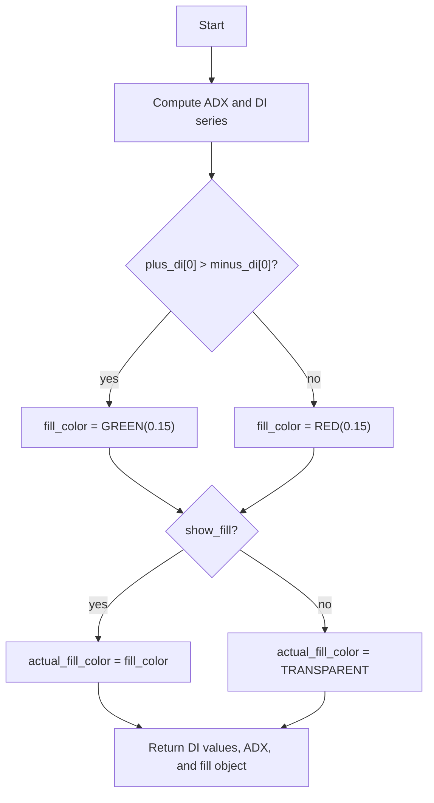

# ADX + DI (Wilder Plus) - Technical Guide

> ADX trend strength with +DI and -DI directional movement, Wilder smoothing, optional fill between DI lines.

| | |
| --- | --- |
| **Language** | Indie Script v5 |
| **Platform** | [TakeProfit](https://takeprofit.com) |
| **Category** | Trend |
| **Type** | Indicator |
| **Author** | @traderx on TakeProfit |
| **License** | MIT |
| **Live script** | [Open on TakeProfit](https://takeprofit.com/indicator/adx-di-wilder-plus-17) |
| **Source file** | [ADX + DI (Wilder Plus).indie5](ADX%20+%20DI%20(Wilder%20Plus).indie5) |

## Overview

This indicator plots the Average Directional Index (ADX) together with the +DI and -DI directional movement lines. It measures how strongly the market is trending and whether positive or negative directional movement currently dominates. The len parameter controls the smoothing period for both ADX and DI.

The chart shows three lines: green +DI, red -DI, and a thicker navy ADX line. Gray horizontal reference lines at 20, 25, and 40 are drawn with the labels Weak Trend, Trend, and Strong. An optional fill between the DI lines is available; the fill color depends on which DI line is above the other, but it does not affect the calculations.

## How it works

1. Adx.new(adx_len=len, di_len=len) computes minus_di, adx, and plus_di as series.
2. Current bar values are obtained by indexing each series with [0].
3. The fill color is chosen by comparing plus_di[0] and minus_di[0]: green if +DI is above -DI, red otherwise.
4. If show_fill is false, the actual fill color is replaced with color.TRANSPARENT, hiding the fill.
5. Main returns plus_di[0], minus_di[0], adx[0], and plot.Fill(color=actual_fill_color) matching the plot decorators.

## Logic flow



## Parameters

| Parameter | Type | Default | Range | Description |
| --- | --- | --- | --- | --- |
| `len` | int | 14 | ≥ 1 | Length |
| `show_fill` | bool | false |  | Fill between DI+ and DI- |

## Code walkthrough

### Decorators and parameter definitions

Lines 6-17 of [ADX + DI (Wilder Plus).indie5](ADX%20+%20DI%20(Wilder%20Plus).indie5):

```python
@indicator('ADX + DI (Wilder Plus)')
@param.int('len', default=14, min=1, title='Length')
@param.bool('show_fill', default=False, title='Fill between DI+ and DI-')
@level(20, line_color=color.GRAY, title='Weak Trend')
@level(25, line_color=color.GRAY, title='Trend')
@level(40, line_color=color.GRAY, title='Strong')
@plot.line('di_plus', color=color.GREEN, title='+DI')
@plot.line('di_minus', color=color.RED, title='-DI')
@plot.line(color=color.NAVY, line_width=2, title='ADX')
@plot.fill('di_plus', 'di_minus', title='DI Trend Zone')
def Main(self, len, show_fill):
    minus_di, adx, plus_di = Adx.new(adx_len=len, di_len=len)
```

The decorators define the indicator name, integer and boolean parameters, horizontal reference levels, line plots, and the optional fill. The Main function receives len and show_fill from the settings UI, and Adx.new is called with the same length for both ADX and DI.

### Dynamic fill color

Lines 17-20 of [ADX + DI (Wilder Plus).indie5](ADX%20+%20DI%20(Wilder%20Plus).indie5):

```python
    minus_di, adx, plus_di = Adx.new(adx_len=len, di_len=len)
    
    # Dynamic fill color based on DI crossover
    fill_color = color.GREEN(0.15) if plus_di[0] > minus_di[0] else color.RED(0.15)
```

Adx.new returns a tuple of series. The code reads the current bar values with [0] and picks a semi-transparent green or red fill color depending on whether plus_di[0] is above minus_di[0]. This makes the fill visually reflect the current directional bias.

### Conditional fill and return

Lines 20-24 of [ADX + DI (Wilder Plus).indie5](ADX%20+%20DI%20(Wilder%20Plus).indie5):

```python
    fill_color = color.GREEN(0.15) if plus_di[0] > minus_di[0] else color.RED(0.15)
    # Only show fill if show_fill is True
    actual_fill_color = fill_color if show_fill else color.TRANSPARENT
    
    return plus_di[0], minus_di[0], adx[0], plot.Fill(color=actual_fill_color)
```

The fill is only shown when show_fill is true; otherwise it is replaced with color.TRANSPARENT. The return tuple is ordered to match the plot decorators: plus_di, minus_di, adx, and the fill object. The Fill object carries only color information and does not alter the underlying computations.

## Reading the chart

- The green line is the +DI directional movement indicator.
- The red line is the -DI directional movement indicator.
- The navy, thicker line is the ADX value.
- Gray horizontal levels are drawn at 20, 25, and 40 with the titles "Weak Trend", "Trend", and "Strong", providing reference thresholds for reading ADX.
- The optional fill is green when plus_di[0] is above minus_di[0], red otherwise, and absent when the fill option is disabled.
- In the standard Wilder interpretation, DI crossovers indicate which direction dominates, and ADX measures overall trend strength regardless of direction.

## Implementation notes

- Adx.new returns a tuple of series; current bar values must be read with [0].
- The fill is purely visual and does not affect ADX or DI values.
- show_fill defaults to False, so only the three lines are drawn unless the option is enabled.
- The len parameter has a minimum of 1 and a default of 14, controlling both DI and ADX smoothing.

## FAQ

**How do I change the ADX period?**

Set the 'Length' parameter in the indicator settings. It defaults to 14 and is passed to Adx.new as both adx_len and di_len.

**How do I show the area between +DI and -DI?**

Enable the 'Fill between DI+ and DI-' option. The fill is drawn green when plus_di[0] is above minus_di[0], red otherwise.

**What do the gray horizontal lines mean?**

The script draws reference levels at 20, 25, and 40 with the titles Weak Trend, Trend, and Strong. They are visual guides for interpreting ADX values.

## Full source code

Indie Script v5, as published on TakeProfit. Copy it into the platform's script editor or [open the live script](https://takeprofit.com/indicator/adx-di-wilder-plus-17).

```python
# indie:lang_version = 5
from indie import indicator, param, plot, color, level
from indie.algorithms import Adx


@indicator('ADX + DI (Wilder Plus)')
@param.int('len', default=14, min=1, title='Length')
@param.bool('show_fill', default=False, title='Fill between DI+ and DI-')
@level(20, line_color=color.GRAY, title='Weak Trend')
@level(25, line_color=color.GRAY, title='Trend')
@level(40, line_color=color.GRAY, title='Strong')
@plot.line('di_plus', color=color.GREEN, title='+DI')
@plot.line('di_minus', color=color.RED, title='-DI')
@plot.line(color=color.NAVY, line_width=2, title='ADX')
@plot.fill('di_plus', 'di_minus', title='DI Trend Zone')
def Main(self, len, show_fill):
    minus_di, adx, plus_di = Adx.new(adx_len=len, di_len=len)
    
    # Dynamic fill color based on DI crossover
    fill_color = color.GREEN(0.15) if plus_di[0] > minus_di[0] else color.RED(0.15)
    # Only show fill if show_fill is True
    actual_fill_color = fill_color if show_fill else color.TRANSPARENT
    
    return plus_di[0], minus_di[0], adx[0], plot.Fill(color=actual_fill_color)
```
