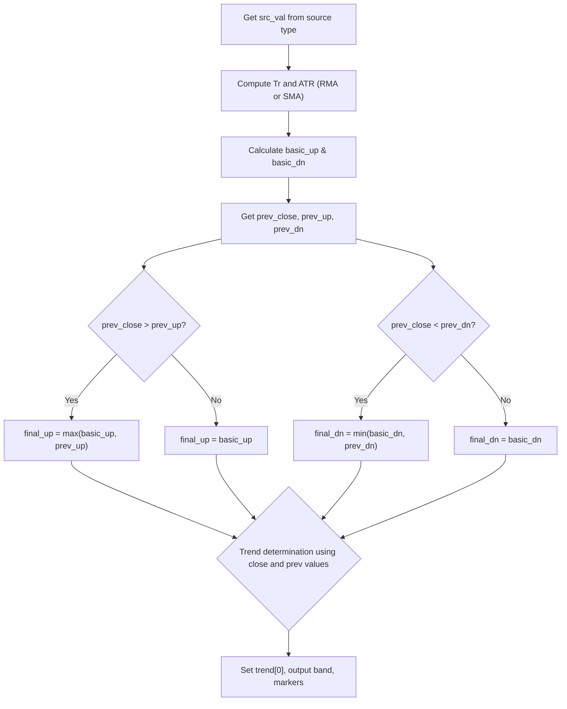

# ATR Super Trend: Multi-Source - Technical Guide

> Multi-source Supertrend indicator with customizable ATR engine (RMA/SMA), source selection, and buy/sell labels.

| | |
| --- | --- |
| **Language** | Indie Script v5 |
| **Platform** | [TakeProfit](https://takeprofit.com) |
| **Category** | Trend |
| **Type** | Indicator |
| **Author** | @insurgent on TakeProfit |
| **Original (TradingView)** | [SuperTrend](https://www.tradingview.com/script/r6dAP7yi/) by KivancOzbilgic |
| **Original license** | See the header of the Pine file |
| **Original source** | [ATR Super Trend Multi-Source.pinescript4](ATR%20Super%20Trend%20Multi-Source.pinescript4) |
| **License** | [MPL-2.0](https://mozilla.org/MPL/2.0/) (derivative work) |
| **Live script** | [Open on TakeProfit](https://takeprofit.com/indicator/atr-super-trend-multi-source-57) |
| **Source file** | [ATR Super Trend Multi-Source.indie5](ATR%20Super%20Trend%20Multi-Source.indie5) |

## Overview

This indicator is a port of KivancOzbilgic's classic Supertrend, rewritten to let the user choose the price source used for the calculation (hl2, close, hlc3, ohlc4) and the ATR smoothing method (RMA or SMA). It is designed to identify trend direction and reversals, and the step-like bands can serve as dynamic support/resistance or trailing stop levels.

The indicator draws a green line during uptrends and a red line during downtrends, forming a continuous boundary. When the trend flips, circle markers appear at the flip point. Optional 'Buy' and 'Sell' labels can be shown, and a transparent background fill between the bands and the mid line highlights the active trend direction.

## How it works

1. Route the selected price source (src_val) from hl2, close, hlc3, or ohlc4.
2. Compute the True Range (Tr) and apply the chosen ATR method (RMA or SMA) for volatility scaling.
3. Calculate basic upper and lower bands: basic_up = src_val - factor * atr[0]; basic_dn = src_val + factor * atr[0].
4. Clamp the bands using the previous bar's close: if close[1] > previous final_up then final_up = max(basic_up, prev_up), else final_up = basic_up; similarly for final_dn with min.
5. Determine trend direction: start with a persistent trend state (MutSeriesF), and flip on crossing conditions (close[0] > prev_dn or < prev_up).
6. Output the active band line (final_up if uptrend else final_dn), fill the background between the mid line and the active band, and generate markers at trend flips.
7. Optionally display 'Buy'/'Sell' labels when the trend changes along with show_signals toggle.

## Mathematical model

Source routing:

$$
\text{hl2} = \frac{\text{high} + \text{low}}{2}, \quad \text{hlc3} = \frac{\text{high} + \text{low} + \text{close}}{3}, \quad \text{ohlc4} = \frac{\text{open} + \text{high} + \text{low} + \text{close}}{4}
$$

Basic bands:

$$
\text{basic\_up} = \text{src\_val} - \text{factor} \times \text{atr}[0] \\
\text{basic\_dn} = \text{src\_val} + \text{factor} \times \text{atr}[0]
$$

Band clamping (uptrend side):

$$
\text{final\_up}[0] = \begin{cases}
\max(\text{basic\_up},\, \text{prev\_up}) & \text{if } \text{prev\_close} > \text{prev\_up} \\
\text{basic\_up} & \text{otherwise}
\end{cases}
$$

Trend logic:

$$
\text{trend}[0] = \begin{cases}
1 & \text{if } \text{prev\_trend} = -1 \text{ and } \text{close}[0] > \text{prev\_dn} \\
-1 & \text{if } \text{prev\_trend} = 1 \text{ and } \text{close}[0] < \text{prev\_up} \\
\text{prev\_trend} & \text{otherwise}
\end{cases}
$$

## Logic flow



## Parameters

| Parameter | Type | Default | Range | Description |
| --- | --- | --- | --- | --- |
| `src_type` | str | hl2 |  | Source |
| `atr_period` | int | 10 | ≥ 1 | ATR Period |
| `factor` | float | 3.0 |  | ATR Multiplier |
| `show_signals` | bool | true |  | Show Buy/Sell Signals? |
| `highlighting` | bool | true |  | Highlighter On/Off? |

## Code walkthrough

### Source Routing (lines 40–47)

Lines 40-47 of [ATR Super Trend Multi-Source.indie5](ATR%20Super%20Trend%20Multi-Source.indie5):

```python
    # src_val must be declared before the if-chain; Indie variable scope ends at indentation.
    src_val = (self.high[0] + self.low[0]) / 2   # default: hl2
    if src_type == 'close':
        src_val = self.close[0]
    elif src_type == 'hlc3':
        src_val = (self.high[0] + self.low[0] + self.close[0]) / 3
    elif src_type == 'ohlc4':
        src_val = (self.open[0] + self.high[0] + self.low[0] + self.close[0]) / 4
```

Defines src_val with a default of hl2, then overrides it based on the src_type parameter. Indie requires the variable to be declared before the if-chain to avoid scoping issues. The source is computed from OHLC/4 data, allowing the trader to choose which price representation drives the bands.

### ATR Calculation (lines 52–53)

Lines 52-53 of [ATR Super Trend Multi-Source.indie5](ATR%20Super%20Trend%20Multi-Source.indie5):

```python
    tr = Tr.new(True)
    atr = Rma.new(tr, atr_period) if ma_algorithm == 'RMA' else Sma.new(tr, atr_period)
```

Tr.new(True) computes true range with NaN handling on the first bar. Then either Rma.new or Sma.new is used to smooth the true range over atr_period, depending on the ma_algorithm parameter. This replicates Pine's atr(Periods) and sma(tr, Periods) behaviour.

### Band Clamping with MutSeriesF (lines 65–80)

Lines 65-80 of [ATR Super Trend Multi-Source.indie5](ATR%20Super%20Trend%20Multi-Source.indie5):

```python
    final_up = MutSeriesF.new(basic_up)   # [0] writable; [1] = prev bar's adjusted value
    final_dn = MutSeriesF.new(basic_dn)

    prev_close = self.close[1]
    prev_up = final_up[1] if not isnan(final_up[1]) else basic_up   # nz(up[1], up)
    prev_dn = final_dn[1] if not isnan(final_dn[1]) else basic_dn   # nz(dn[1], dn)

    if not isnan(prev_close) and prev_close > prev_up:
        final_up[0] = max(basic_up, prev_up)
    else:
        final_up[0] = basic_up

    if not isnan(prev_close) and prev_close < prev_dn:
        final_dn[0] = min(basic_dn, prev_dn)
    else:
        final_dn[0] = basic_dn
```

MutSeriesF holds a writable value that persists across bars. final_up and final_dn are initialised with basic bands. The previous bar's adjusted values are retrieved with [1] and, if NaN, replaced with the current basic band (nz equivalent). The clamping logic follows Pine's max/min rules: if close[1] is above the previous adjusted upper band, the new band is the maximum; otherwise it resets to the basic band. The same logic applies to the lower band with min.

### Trend Direction State (lines 87–95)

Lines 87-95 of [ATR Super Trend Multi-Source.indie5](ATR%20Super%20Trend%20Multi-Source.indie5):

```python
    trend = MutSeriesF.new(1.0)
    prev_trend = trend[1] if not isnan(trend[1]) else 1.0

    if prev_trend == -1.0 and self.close[0] > prev_dn:
        trend[0] = 1.0
    elif prev_trend == 1.0 and self.close[0] < prev_up:
        trend[0] = -1.0
    else:
        trend[0] = prev_trend
```

A MutSeriesF tracks the trend direction (1 uptrend, -1 downtrend). The prev_trend is initialised to 1.0 if the first bar is NaN. The trend flips only when the current close crosses the opposite band: from downtrend to uptrend if close[0] > prev_dn, and from uptrend to downtrend if close[0] < prev_up. Otherwise it persists.

### Visual Outputs (lines 104–133)

Lines 104-133 of [ATR Super Trend Multi-Source.indie5](ATR%20Super%20Trend%20Multi-Source.indie5):

```python
    # ── Visual block (unchanged from original port) ───────────────────────────
    is_uptrend = direction[0] < 0
    is_downtrend = direction[0] > 0

    st_up = st[0] if is_uptrend else nan
    st_down = st[0] if is_downtrend else nan

    ohlc4 = (self.open[0] + self.high[0] + self.low[0] + self.close[0]) / 4

    buy_signal = is_uptrend and direction[1] > 0
    sell_signal = is_downtrend and direction[1] < 0

    up_fill_color = color.GREEN(0.1) if highlighting else color.TRANSPARENT
    down_fill_color = color.RED(0.1) if highlighting else color.TRANSPARENT

    buy_circle_val = st[0] if buy_signal else nan
    sell_circle_val = st[0] if sell_signal else nan

    buy_label_val = st[0] if (buy_signal and show_signals) else nan
    sell_label_val = st[0] if (sell_signal and show_signals) else nan

    return (
        st_up, st_down, ohlc4,
        plot.Fill(color=up_fill_color),
        plot.Fill(color=down_fill_color),
        plot.Marker(value=buy_circle_val, color=color.GREEN),
        plot.Marker(value=sell_circle_val, color=color.RED),
        plot.Marker(value=buy_label_val, color=color.GREEN, text='Buy'),
        plot.Marker(value=sell_label_val, color=color.RED, text='Sell'),
    )
```

The direction is encoded as -1 for uptrend and +1 for downtrend. st_up and st_down are set to the active band value or nan to plot only the relevant line. Buy/sell signals are detected when direction[1] (previous bar’s direction) is opposite to current. The return tuple matches the order of the @plot decorators: lines, fills, circles, labels. Transparency for fills is set to 0.1 alpha when highlighting is enabled.

## Pine Script vs Indie

This Indie port faithfully reproduces the core logic of the original Pine Script v4 SuperTrend, while replacing Pine's re-assignment operators with MutSeriesF objects and adding source/algorithm selection parameters.

| Pine Script | Indie | Note |
| --- | --- | --- |
| `sma(tr, Periods)` | `Sma.new(tr, atr_period)` | Indie uses Sma.new() which returns a series; access with [0]. |
| `atr(Periods)` | `Rma.new(tr, atr_period)` | Pine's atr() is RMA; Indie allows switching via ma_algorithm. |
| `nz(up[1], up)` | `final_up[1] if not isnan(final_up[1]) else basic_up` | Explicit NaN check instead of nz(). |

### Source and ATR selection

Pine Script, lines 7-19 of [ATR Super Trend Multi-Source.pinescript4](ATR%20Super%20Trend%20Multi-Source.pinescript4):

```pine
Periods = input(title="ATR Period", type=input.integer, defval=10)

src = input(hl2, title="Source")

Multiplier = input(title="ATR Multiplier", type=input.float, step=0.1, defval=3.0)

changeATR= input(title="Change ATR Calculation Method ?", type=input.bool, defval=true)

showsignals = input(title="Show Buy/Sell Signals ?", type=input.bool, defval=true)

highlighting = input(title="Highlighter On/Off ?", type=input.bool, defval=true)

atr2 = sma(tr, Periods)
```

Indie, lines 10-34 of [ATR Super Trend Multi-Source.indie5](ATR%20Super%20Trend%20Multi-Source.indie5):

```python
@indicator('Super Trend: Multi-Source', overlay_main_pane=True)
@param.str('src_type', default='hl2', options=['close', 'hl2', 'hlc3', 'ohlc4'], title='Source')
@param.int('atr_period', default=10, min=1, title='ATR Period')
@param.float('factor', default=3.0, title='ATR Multiplier')
@param.str('ma_algorithm', default='RMA', options=['RMA', 'SMA'],
           title='ATR Method  (RMA = standard / SMA = alternate)')
@param.bool('show_signals', default=True, title='Show Buy/Sell Signals?')
@param.bool('highlighting', default=True, title='Highlighter On/Off?')
# ── plot declarations (order matches return tuple) ─────────────────────────
@plot.line('up_line', color=color.GREEN, line_width=2, title='Up Trend')
@plot.line('down_line', color=color.RED, line_width=2, title='Down Trend')
@plot.line('mid_line', color=color.TRANSPARENT, title='',
           display_options=plot.LineDisplayOptions(pane=True, status_line=False, price_label=False))
@plot.fill('mid_line', 'up_line', title='UpTrend Highlighter')
@plot.fill('mid_line', 'down_line', title='DownTrend Highlighter')
@plot.marker(style=plot.marker_style.CIRCLE, position=plot.marker_position.CENTER,
             size=7, color=color.GREEN, title='UpTrend Begins',
             display_options=plot.MarkerDisplayOptions(pane=True, status_line=False, price_label=False))
@plot.marker(style=plot.marker_style.CIRCLE, position=plot.marker_position.CENTER,
             size=7, color=color.RED, title='DownTrend Begins',
             display_options=plot.MarkerDisplayOptions(pane=True, status_line=False, price_label=False))
@plot.marker(style=plot.marker_style.LABEL, position=plot.marker_position.BELOW,
             size=7, color=color.GREEN, title='Buy',
             display_options=plot.MarkerDisplayOptions(pane=True, status_line=False, price_label=False))
@plot.marker(style=plot.marker_style.LABEL, position=plot.marker_position.ABOVE,
```

Pine uses a single input for source and a boolean to switch between atr() and sma(tr, Periods). Indie exposes an explicit list of four source types and a dropdown for the ATR method (RMA or SMA), making the selection more transparent and eliminating the boolean ambiguity.

### Band clamping via mutable state

Pine Script, lines 23-33 of [ATR Super Trend Multi-Source.pinescript4](ATR%20Super%20Trend%20Multi-Source.pinescript4):

```pine
up=src-(Multiplier*atr)

up1 = nz(up[1],up)

up := close[1] > up1 ? max(up,up1) : up

dn=src+(Multiplier*atr)

dn1 = nz(dn[1], dn)

dn := close[1] < dn1 ? min(dn, dn1) : dn
```

Indie, lines 56-80 of [ATR Super Trend Multi-Source.indie5](ATR%20Super%20Trend%20Multi-Source.indie5):

```python
    basic_up = src_val - factor * atr[0]   # candidate support  (lower band)
    basic_dn = src_val + factor * atr[0]   # candidate resistance (upper band)

    # ── 4. Clamped bands (MutSeriesF carries adjusted value to the next bar) ─
    # Pine:
    #   up1 = nz(up[1], up)
    #   up  := close[1] > up1 ? max(up, up1) : up
    #   dn1 = nz(dn[1], dn)
    #   dn  := close[1] < dn1 ? min(dn, dn1) : dn
    final_up = MutSeriesF.new(basic_up)   # [0] writable; [1] = prev bar's adjusted value
    final_dn = MutSeriesF.new(basic_dn)

    prev_close = self.close[1]
    prev_up = final_up[1] if not isnan(final_up[1]) else basic_up   # nz(up[1], up)
    prev_dn = final_dn[1] if not isnan(final_dn[1]) else basic_dn   # nz(dn[1], dn)

    if not isnan(prev_close) and prev_close > prev_up:
        final_up[0] = max(basic_up, prev_up)
    else:
        final_up[0] = basic_up

    if not isnan(prev_close) and prev_close < prev_dn:
        final_dn[0] = min(basic_dn, prev_dn)
    else:
        final_dn[0] = basic_dn
```

Both versions implement the same clamp: if previous close is above the previous upper band, take the maximum; else reset. Pine uses := reassignment and nz() to handle the first bar; Indie uses MutSeriesF with explicit NaN checks. The Indie code separates basic_up/dn from the final series, making the logic easier to follow.

### Trend determination

Pine Script, lines 35-39 of [ATR Super Trend Multi-Source.pinescript4](ATR%20Super%20Trend%20Multi-Source.pinescript4):

```pine
trend = 1

trend := nz(trend[1], trend)

trend := trend == -1 and close > dn1 ? 1 : trend == 1 and close < up1 ? -1 : trend
```

Indie, lines 82-95 of [ATR Super Trend Multi-Source.indie5](ATR%20Super%20Trend%20Multi-Source.indie5):

```python
    # ── 5. Trend direction (Pine convention: 1 = uptrend, −1 = downtrend) ───
    # Pine:
    #   trend := trend[1] == -1 and close > dn1 ?  1
    #          : trend[1] ==  1 and close < up1 ? -1
    #          : nz(trend[1], 1)
    trend = MutSeriesF.new(1.0)
    prev_trend = trend[1] if not isnan(trend[1]) else 1.0

    if prev_trend == -1.0 and self.close[0] > prev_dn:
        trend[0] = 1.0
    elif prev_trend == 1.0 and self.close[0] < prev_up:
        trend[0] = -1.0
    else:
        trend[0] = prev_trend
```

The trend logic is identical: start with 1, then flip based on close crossing the opposite band. Indie wraps the trend in a MutSeriesF and uses a local prev_trend variable, while Pine relies on the built-in series and nz(trend[1], trend). The conditions are written as explicit if-elif-else instead of nested ternary operators.

### Output and plotting

Pine Script, lines 41-65 of [ATR Super Trend Multi-Source.pinescript4](ATR%20Super%20Trend%20Multi-Source.pinescript4):

```pine
upPlot = plot(trend == 1 ? up : na, title="Up Trend", style=plot.style_linebr, linewidth=2, color=color.green)

buySignal = trend == 1 and trend[1] == -1

plotshape(buySignal ? up : na, title="UpTrend Begins", location=location.absolute, style=shape.circle, size=size.tiny, color=color.green, transp=0)

plotshape(buySignal and showsignals ? up : na, title="Buy", text="Buy", location=location.absolute, style=shape.labelup, size=size.tiny, color=color.green, textcolor=color.white, transp=0)

dnPlot = plot(trend == 1 ? na : dn, title="Down Trend", style=plot.style_linebr, linewidth=2, color=color.red)

sellSignal = trend == -1 and trend[1] == 1

plotshape(sellSignal ? dn : na, title="DownTrend Begins", location=location.absolute, style=shape.circle, size=size.tiny, color=color.red, transp=0)

plotshape(sellSignal and showsignals ? dn : na, title="Sell", text="Sell", location=location.absolute, style=shape.labeldown, size=size.tiny, color=color.red, textcolor=color.white, transp=0)

mPlot = plot(ohlc4, title="", style=plot.style_circles, linewidth=0)

longFillColor = highlighting ? (trend == 1 ? color.green : color.white) : color.white

shortFillColor = highlighting ? (trend == -1 ? color.red : color.white) : color.white

fill(mPlot, upPlot, title="UpTrend Highligter", color=longFillColor)

fill(mPlot, dnPlot, title="DownTrend Highligter", color=shortFillColor)
```

Indie, lines 104-128 of [ATR Super Trend Multi-Source.indie5](ATR%20Super%20Trend%20Multi-Source.indie5):

```python
    # ── Visual block (unchanged from original port) ───────────────────────────
    is_uptrend = direction[0] < 0
    is_downtrend = direction[0] > 0

    st_up = st[0] if is_uptrend else nan
    st_down = st[0] if is_downtrend else nan

    ohlc4 = (self.open[0] + self.high[0] + self.low[0] + self.close[0]) / 4

    buy_signal = is_uptrend and direction[1] > 0
    sell_signal = is_downtrend and direction[1] < 0

    up_fill_color = color.GREEN(0.1) if highlighting else color.TRANSPARENT
    down_fill_color = color.RED(0.1) if highlighting else color.TRANSPARENT

    buy_circle_val = st[0] if buy_signal else nan
    sell_circle_val = st[0] if sell_signal else nan

    buy_label_val = st[0] if (buy_signal and show_signals) else nan
    sell_label_val = st[0] if (sell_signal and show_signals) else nan

    return (
        st_up, st_down, ohlc4,
        plot.Fill(color=up_fill_color),
        plot.Fill(color=down_fill_color),
```

Pine uses separate plot() calls for each line and shape. Indie collects all plot objects in a single return tuple, matched by the decorator order. The visual logic (is_uptrend, buy_signal) is computed once and reused. The mid_line is plotted transparently and used for fills, analogous to Pine's mPlot with style=plot.style_circles, linewidth=0.

## Reading the chart

- **Green line**: drawn when the trend is up (price above the band). The line represents the current bar's final_up band, acting as dynamic support.
- **Red line**: drawn when the trend is down (price below the band). Represents the current bar's final_dn band, acting as dynamic resistance.
- **Green circle**: appears at the exact bar where the trend flips from downtrend to uptrend.
- **Red circle**: appears at the exact bar where the trend flips from uptrend to downtrend.
- **Green 'Buy' label**: appears below the bar when a flip to uptrend occurs (if show_signals is enabled).
- **Red 'Sell' label**: appears above the bar when a flip to downtrend occurs (if show_signals is enabled).
- **Background fill**: a transparent green fill between the mid line (ohlc4) and the green band during uptrend, and a transparent red fill between the mid line and the red band during downtrend. The fill is always drawn, but it is transparent (invisible) when highlighting is disabled.

## Implementation notes

- The indicator uses MutSeriesF to store mutable state across bars, which is the Indie equivalent of Pine's := operator. The .new() call initialises the series, and index [0] is the current bar, [1] the previous bar.
- NaN handling is explicit with isnan(): prev_up defaults to basic_up if the previous value is NaN (first bar), and trend defaults to 1.0. This matches Pine's nz() behaviour.
- The direction variable is inverted relative to the original trend: direction = -1 for uptrend, +1 for downtrend (line 102). This is a convention in the port's visual block and does not affect the logic.
- The mid_line is plotted as transparent (color.TRANSPARENT) and used only for the fill background. Its value is ohlc4 (the average of open, high, low, close).

## FAQ

**How do I change the price source used for the bands?**

Set the `Source` parameter to one of the four options: hl2 (default), close, hlc3, or ohlc4. The selected value determines the src_val used in the band calculations.

**What is the difference between RMA and SMA for the ATR method?**

RMA (the default) is a Wilder's smoothed moving average, which is the standard method used in the original SuperTrend. SMA is a simple moving average of the True Range, which can be used as an alternative for a different volatility response.

**Can I hide the Buy/Sell labels but still see the trend flip circles?**

Yes. Set `Show Buy/Sell Signals?` to false to hide the text labels. The green/red circles that mark the exact trend flip bar will still appear regardless of this setting.

## License and attribution

This Indie script is a derivative work of **SuperTrend by KivancOzbilgic** on TradingView. The Pine Script original states no license in its header; TradingView applies MPL-2.0 by default to open-source scripts. A modified version of MPL-2.0 code must stay under [MPL-2.0](https://mozilla.org/MPL/2.0/), so this file is distributed under that license (the notice is appended to the end of the source file). The original author keeps the credit for the algorithm; this page is not affiliated with or endorsed by them.

## Full source code

Indie Script v5, as published on TakeProfit. Copy it into the platform's script editor or [open the live script](https://takeprofit.com/indicator/atr-super-trend-multi-source-57).

```python
# indie:lang_version = 5
from math import nan, isnan
from indie import indicator, param, plot, color, MutSeriesF
from indie.algorithms import Tr, Rma, Sma

# Port of Pine Script v4 "Supertrend" by KivancOzbilgic

 

@indicator('Super Trend: Multi-Source', overlay_main_pane=True)
@param.str('src_type', default='hl2', options=['close', 'hl2', 'hlc3', 'ohlc4'], title='Source')
@param.int('atr_period', default=10, min=1, title='ATR Period')
@param.float('factor', default=3.0, title='ATR Multiplier')
@param.str('ma_algorithm', default='RMA', options=['RMA', 'SMA'],
           title='ATR Method  (RMA = standard / SMA = alternate)')
@param.bool('show_signals', default=True, title='Show Buy/Sell Signals?')
@param.bool('highlighting', default=True, title='Highlighter On/Off?')
# ── plot declarations (order matches return tuple) ─────────────────────────
@plot.line('up_line', color=color.GREEN, line_width=2, title='Up Trend')
@plot.line('down_line', color=color.RED, line_width=2, title='Down Trend')
@plot.line('mid_line', color=color.TRANSPARENT, title='',
           display_options=plot.LineDisplayOptions(pane=True, status_line=False, price_label=False))
@plot.fill('mid_line', 'up_line', title='UpTrend Highlighter')
@plot.fill('mid_line', 'down_line', title='DownTrend Highlighter')
@plot.marker(style=plot.marker_style.CIRCLE, position=plot.marker_position.CENTER,
             size=7, color=color.GREEN, title='UpTrend Begins',
             display_options=plot.MarkerDisplayOptions(pane=True, status_line=False, price_label=False))
@plot.marker(style=plot.marker_style.CIRCLE, position=plot.marker_position.CENTER,
             size=7, color=color.RED, title='DownTrend Begins',
             display_options=plot.MarkerDisplayOptions(pane=True, status_line=False, price_label=False))
@plot.marker(style=plot.marker_style.LABEL, position=plot.marker_position.BELOW,
             size=7, color=color.GREEN, title='Buy',
             display_options=plot.MarkerDisplayOptions(pane=True, status_line=False, price_label=False))
@plot.marker(style=plot.marker_style.LABEL, position=plot.marker_position.ABOVE,
             size=7, color=color.RED, title='Sell',
             display_options=plot.MarkerDisplayOptions(pane=True, status_line=False, price_label=False))
def Main(self, src_type, atr_period, factor, ma_algorithm, show_signals, highlighting):

    # ── 1. Source routing ────────────────────────────────────────────────────
    # src_val must be declared before the if-chain; Indie variable scope ends at indentation.
    src_val = (self.high[0] + self.low[0]) / 2   # default: hl2
    if src_type == 'close':
        src_val = self.close[0]
    elif src_type == 'hlc3':
        src_val = (self.high[0] + self.low[0] + self.close[0]) / 3
    elif src_type == 'ohlc4':
        src_val = (self.open[0] + self.high[0] + self.low[0] + self.close[0]) / 4

    # ── 2. ATR ───────────────────────────────────────────────────────────────
    # Tr(handle_na=True) returns NaN on the first bar (no prev close yet),
    # matching Pine's tr behaviour inside atr() and sma(tr, n).
    tr = Tr.new(True)
    atr = Rma.new(tr, atr_period) if ma_algorithm == 'RMA' else Sma.new(tr, atr_period)

    # ── 3. Basic bands ───────────────────────────────────────────────────────
    basic_up = src_val - factor * atr[0]   # candidate support  (lower band)
    basic_dn = src_val + factor * atr[0]   # candidate resistance (upper band)

    # ── 4. Clamped bands (MutSeriesF carries adjusted value to the next bar) ─
    # Pine:
    #   up1 = nz(up[1], up)
    #   up  := close[1] > up1 ? max(up, up1) : up
    #   dn1 = nz(dn[1], dn)
    #   dn  := close[1] < dn1 ? min(dn, dn1) : dn
    final_up = MutSeriesF.new(basic_up)   # [0] writable; [1] = prev bar's adjusted value
    final_dn = MutSeriesF.new(basic_dn)

    prev_close = self.close[1]
    prev_up = final_up[1] if not isnan(final_up[1]) else basic_up   # nz(up[1], up)
    prev_dn = final_dn[1] if not isnan(final_dn[1]) else basic_dn   # nz(dn[1], dn)

    if not isnan(prev_close) and prev_close > prev_up:
        final_up[0] = max(basic_up, prev_up)
    else:
        final_up[0] = basic_up

    if not isnan(prev_close) and prev_close < prev_dn:
        final_dn[0] = min(basic_dn, prev_dn)
    else:
        final_dn[0] = basic_dn

    # ── 5. Trend direction (Pine convention: 1 = uptrend, −1 = downtrend) ───
    # Pine:
    #   trend := trend[1] == -1 and close > dn1 ?  1
    #          : trend[1] ==  1 and close < up1 ? -1
    #          : nz(trend[1], 1)
    trend = MutSeriesF.new(1.0)
    prev_trend = trend[1] if not isnan(trend[1]) else 1.0

    if prev_trend == -1.0 and self.close[0] > prev_dn:
        trend[0] = 1.0
    elif prev_trend == 1.0 and self.close[0] < prev_up:
        trend[0] = -1.0
    else:
        trend[0] = prev_trend

    # ── 6. Wrap outputs as MutSeriesF for [0]/[1] access in the visual block ─
    # Direction convention kept from the original port:
    #   trend ==  1 (uptrend)   → direction = -1  (is_uptrend   = direction < 0)
    #   trend == -1 (downtrend) → direction = +1  (is_downtrend = direction > 0)
    st = MutSeriesF.new(final_up[0] if trend[0] == 1.0 else final_dn[0])
    direction = MutSeriesF.new(-1.0 if trend[0] == 1.0 else 1.0)

    # ── Visual block (unchanged from original port) ───────────────────────────
    is_uptrend = direction[0] < 0
    is_downtrend = direction[0] > 0

    st_up = st[0] if is_uptrend else nan
    st_down = st[0] if is_downtrend else nan

    ohlc4 = (self.open[0] + self.high[0] + self.low[0] + self.close[0]) / 4

    buy_signal = is_uptrend and direction[1] > 0
    sell_signal = is_downtrend and direction[1] < 0

    up_fill_color = color.GREEN(0.1) if highlighting else color.TRANSPARENT
    down_fill_color = color.RED(0.1) if highlighting else color.TRANSPARENT

    buy_circle_val = st[0] if buy_signal else nan
    sell_circle_val = st[0] if sell_signal else nan

    buy_label_val = st[0] if (buy_signal and show_signals) else nan
    sell_label_val = st[0] if (sell_signal and show_signals) else nan

    return (
        st_up, st_down, ohlc4,
        plot.Fill(color=up_fill_color),
        plot.Fill(color=down_fill_color),
        plot.Marker(value=buy_circle_val, color=color.GREEN),
        plot.Marker(value=sell_circle_val, color=color.RED),
        plot.Marker(value=buy_label_val, color=color.GREEN, text='Buy'),
        plot.Marker(value=sell_label_val, color=color.RED, text='Sell'),
    )

# ---------------------------------------------------------------------------
# This Source Code Form is subject to the terms of the Mozilla Public
# License, v. 2.0. If a copy of the MPL was not distributed with this
# file, You can obtain one at https://mozilla.org/MPL/2.0/
# Derived from "SuperTrend by KivancOzbilgic" (TradingView).
# ---------------------------------------------------------------------------
```
