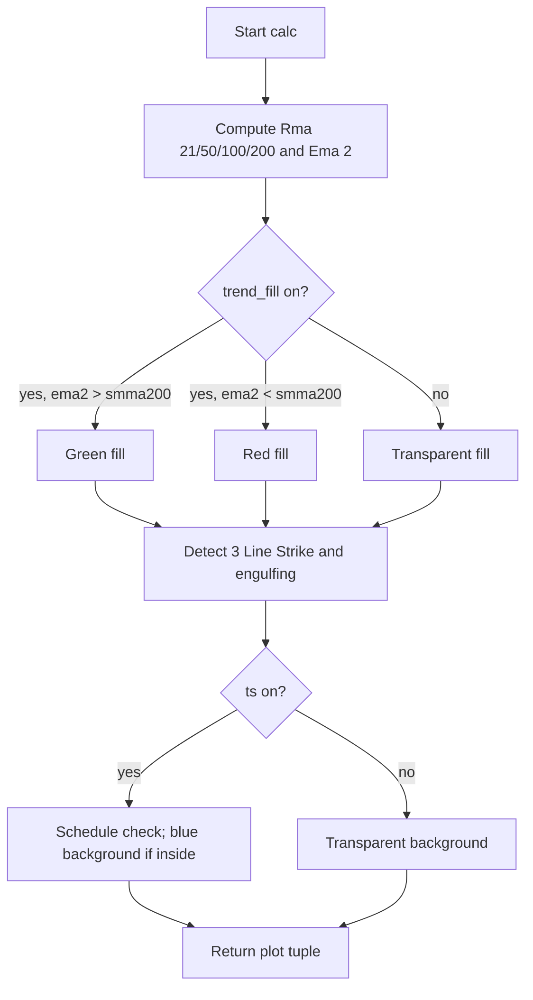

# Adaptive Trend Overlay (Enhanced TMA) - Technical Guide

> Overlay showing 21/50/100/200 SMMA lines, EMA(2)-based trend fill, 3 Line Strike and engulfing markers, and optional session background.

| | |
| --- | --- |
| **Language** | Indie Script v5 |
| **Platform** | [TakeProfit](https://takeprofit.com) |
| **Category** | Trend |
| **Type** | Indicator |
| **Author** | @insurgent on TakeProfit |
| **License** | MIT |
| **Live script** | [Open on TakeProfit](https://takeprofit.com/indicator/adaptive-trend-overlay-enhanced-tma-19) |
| **Source file** | [Adaptive Trend Overlay (Enhanced TMA).indie5](Adaptive%20Trend%20Overlay%20(Enhanced%20TMA).indie5) |

## Overview

Enhanced TMA Overlay is a main-pane trend overlay. It plots four Rma-based SMMA moving averages (21, 50, 100, 200), a transparent EMA(2) used to color a trend fill between EMA(2) and the 200 SMMA, candle-pattern markers for 3 Line Strike and engulfing signals, and an optional session background.

On the chart, the SMMA lines give a layered view of trend direction at different smoothing lengths. The green/red fill shows whether the short-term EMA(2) is above or below the 200 SMMA. Pattern markers appear near the close of the signal candle (green below, red above), and the blue session background highlights bars inside the configured analysis/trading windows.

## How it works

1. Build the weekday list from boolean parameters and create two `ScheduleRule` objects for analysis and trading windows.
2. Call `Rma.new(self.close, 21/50/100/200)` to obtain SMMA series and `Ema.new(self.close, 2)` for the fast line.
3. Read current values from each series with `[0]`; hide the 100 SMMA with `nan` when `h100` is false.
4. Set the trend fill color to green/red when `ema2` is above/below `smma200`, otherwise transparent.
5. Detect 3 Line Strike signals using either the strict canonical engulfing rules or the original simpler close-based rules.
6. Detect bullish and bearish engulfing candles using either the strict opposite-color rules or original open/close rules.
7. If `ts` is enabled, check whether the current bar time falls inside either schedule and choose the session background color.
8. Return the SMMA values, fill, pattern markers, and session background in the order expected by the plot decorators.

## Mathematical model

The two imported primitives use standard recurrences. For the Rma-based SMMA:
$$
\text{SMMA}_t = \frac{\text{close}_t + (n - 1)\cdot \text{SMMA}_{t-1}}{n}
$$
where `n` is one of 21, 50, 100, 200.

For the EMA(2):
$$
\text{EMA}_t = \frac{2}{3}\text{close}_t + \frac{1}{3}\text{EMA}_{t-1}
$$

## Logic flow



## Parameters

| Parameter | Type | Default | Range | Description |
| --- | --- | --- | --- | --- |
| `h100` | bool | true |  | Show 100 Line |
| `trend_fill` | bool | true |  | Show Trend Fill |
| `bear_s` | bool | true |  | Show Bearish 3 Line Strike |
| `bull_s` | bool | true |  | Show Bullish 3 Line Strike |
| `strict_3s` | bool | false |  | Strict 3 Line Strike (canonical) |
| `bear_e` | bool | true |  | Show Bearish Big A$$ Candles |
| `bull_e` | bool | true |  | Show Bullish Big A$$ Candles |
| `strict_eng` | bool | false |  | Strict Engulfing (require opposite color) |
| `ts` | bool | true |  | Show Trade Session |
| `start_hour` | int | 7 | 0 - 23 | Analysis Start hour |
| `start_minute` | int | 0 | 0 - 59 | Analysis Start minute |
| `start_hour2` | int | 8 | 0 - 23 | Session Start hour |
| `start_minute2` | int | 30 | 0 - 59 | Session Start minute |
| `end_hour2` | int | 12 | 0 - 23 | Session End hour |
| `end_minute2` | int | 0 | 0 - 59 | Session End minute |
| `show_mon` | bool | true |  | Monday |
| `show_tue` | bool | true |  | Tuesday |
| `show_wed` | bool | true |  | Wednesday |
| `show_thu` | bool | true |  | Thursday |
| `show_fri` | bool | true |  | Friday |
| `show_sat` | bool | false |  | Saturday |
| `show_sun` | bool | false |  | Sunday |

## Code walkthrough

### Trade session schedules

Lines 84-97 of [Adaptive Trend Overlay (Enhanced TMA).indie5](Adaptive%20Trend%20Overlay%20(Enhanced%20TMA).indie5):

```python
        if len(days) > 0:
            rule1 = ScheduleRule(
                start=time(hour=start_hour, minute=start_minute),
                end=time(hour=end_hour2, minute=end_minute2),
                days=days
            )
            self._schedule_analysis = Schedule(rules=[rule1], timezone=tz)
            
            rule2 = ScheduleRule(
                start=time(hour=start_hour2, minute=start_minute2),
                end=time(hour=end_hour2, minute=end_minute2),
                days=days
            )
            self._schedule_trading = Schedule(rules=[rule2], timezone=tz)
```

The constructor receives timezone, start/end times, and weekday booleans. If at least one day is enabled, it creates two `ScheduleRule` objects: analysis starts at `start_hour:start_minute` and the trading session at `start_hour2:start_minute2`; both end at `end_hour2:end_minute2`. These schedules are stored on `self` for use in `calc()`.

### SMMA and EMA series

Lines 99-113 of [Adaptive Trend Overlay (Enhanced TMA).indie5](Adaptive%20Trend%20Overlay%20(Enhanced%20TMA).indie5):

```python
    def calc(self, h100, trend_fill, bear_s, bull_s, strict_3s, bear_e, bull_e, strict_eng, ts):
        # === SMMA Calculations ===
        # Note: Rma.new() uses internal caching - same params return cached instance
        # This is the standard Indie pattern, not recreating each bar
        smma21 = Rma.new(self.close, 21)
        smma50 = Rma.new(self.close, 50)
        smma100 = Rma.new(self.close, 100)
        smma200 = Rma.new(self.close, 200)
        ema2_series = Ema.new(self.close, 2)
        
        smma1_val = smma21[0]
        smma2_val = smma50[0]
        smma3_val = smma100[0] if h100 else nan
        smma4_val = smma200[0]
        ema2 = ema2_series[0]
```

`Rma.new` is called for each smoothing length and `Ema.new` for length 2. The comment notes that `Rma.new` caches by parameters, so the same series is reused across bars instead of being recreated. Values are read with `[0]` for the current bar, and `smma3_val` is forced to `nan` when the 100-line toggle is off.

### Strict bearish 3 Line Strike

Lines 127-143 of [Adaptive Trend Overlay (Enhanced TMA).indie5](Adaptive%20Trend%20Overlay%20(Enhanced%20TMA).indie5):

```python
        if strict_3s:
            # STRICT (Canonical) Logic:
            # Bearish 3 Line Strike:
            # - 3 consecutive BULLISH candles (close > open)
            # - Bodies going progressively HIGHER (close[3] < close[2] < close[1])
            # - 4th candle is BEARISH
            # - 4th candle ENGULFS all 3 bodies: open[0] > close[1] AND close[0] < open[3]
            three_bulls = (self.close[3] > self.open[3] and 
                           self.close[2] > self.open[2] and 
                           self.close[1] > self.open[1])
            bodies_rising = (self.close[3] < self.close[2] and 
                             self.close[2] < self.close[1])
            fourth_bearish = self.close[0] < self.open[0]
            engulfs_bulls = (self.open[0] > self.close[1] and 
                             self.close[0] < self.open[3])
            
            bear_sig = three_bulls and bodies_rising and fourth_bearish and engulfs_bulls
```

In strict mode, the bearish signal requires three previous bullish candles with rising closes and a current bearish candle that engulfs all three bodies. The four boolean conditions are combined into `bear_sig`; the mirrored bullish version follows below using `three_bears`, `bodies_falling`, `fourth_bullish`, and `engulfs_bears`.

### Original 3 Line Strike fallback

Lines 160-172 of [Adaptive Trend Overlay (Enhanced TMA).indie5](Adaptive%20Trend%20Overlay%20(Enhanced%20TMA).indie5):

```python
        else:
            # ORIGINAL (Pine) Logic - simpler, more signals:
            # Bearish: 3 bullish candles, 4th closes below open[1]
            bear_sig = (self.close[3] > self.open[3] and 
                        self.close[2] > self.open[2] and 
                        self.close[1] > self.open[1] and 
                        self.close[0] < self.open[1])
            
            # Bullish: 3 bearish candles, 4th closes above open[1]
            bull_sig = (self.close[3] < self.open[3] and 
                        self.close[2] < self.open[2] and 
                        self.close[1] < self.open[1] and 
                        self.close[0] > self.open[1])
```

When `strict_3s` is false, the signal only requires three consecutive bullish candles and the current close below the previous bar's open (`open[1]`). This less restrictive definition does not require rising bodies or a full engulfing candle; the same pattern is mirrored for bullish signals.

### Strict engulfing checks

Lines 194-209 of [Adaptive Trend Overlay (Enhanced TMA).indie5](Adaptive%20Trend%20Overlay%20(Enhanced%20TMA).indie5):

```python
            prev_is_bearish = close_prev < open_prev
            bullish_engulfing = (prev_is_bearish and
                                open_curr <= close_prev and 
                                open_curr < open_prev and 
                                close_curr > open_prev)
            
            # Bearish Engulfing:
            # - Previous candle MUST be BULLISH (close[1] > open[1])
            # - Current opens at or above previous close
            # - Current opens above previous open
            # - Current closes below previous open
            prev_is_bullish = close_prev > open_prev
            bearish_engulfing = (prev_is_bullish and
                                open_curr >= close_prev and 
                                open_curr > open_prev and 
                                close_curr < open_prev)
```

This strict engulfing branch first verifies that the prior candle is the opposite color. For a bullish signal, the current candle must open at or below the prior close, open below the prior open, and close above the prior open. The bearish branch mirrors these conditions.

### Session background and return tuple

Lines 240-254 of [Adaptive Trend Overlay (Enhanced TMA).indie5](Adaptive%20Trend%20Overlay%20(Enhanced%20TMA).indie5):

```python
            if in_analysis or in_trading:
                session_bg = plot.Background(color=session_color)

        return (
            smma1_val,                                              # 21 SMMA
            smma2_val,                                              # 50 SMMA
            smma3_val,                                              # 100 SMMA
            smma4_val,                                              # 200 SMMA
            ema2,                                                   # EMA(2)
            plot.Fill(color=fill_color),                            # Trend Fill
            plot.Marker(bull_3s_marker, text='3s-Bull'),            # 3 Line Strike Up
            plot.Marker(bear_3s_marker, text='3s-Bear'),            # 3 Line Strike Down
            plot.Marker(bull_eng_marker),                           # Engulfing Up
            plot.Marker(bear_eng_marker),                           # Engulfing Down
            session_bg,                                             # Session Background
```

If either schedule contains the current bar's time, `session_bg` is set to a translucent blue `plot.Background`; otherwise it stays transparent. The returned tuple lines up with the `@plot.*` decorators: four SMMA values, EMA(2), fill, two 3 Line Strike markers, two engulfing markers, and the background.

## Reading the chart

- The four moving-average lines are drawn as: white 21 SMMA, light-green 50 SMMA, yellow 100 SMMA (disabled when `Show 100 Line` is off), and red 200 SMMA.
- The EMA(2) line is drawn with `color.rgba(46, 204, 113, 0)`, which is fully transparent, so it has no visible line; it only participates in the trend fill.
- The trend fill colors the region between EMA(2) and the 200 SMMA: green `rgba(0,128,0,0.15)` when `ema2 > smma200`, red `rgba(255,0,0,0.15)` when `ema2 < smma200`, transparent otherwise.
- Below the bar: a green label `3s-Bull` marks a bullish 3 Line Strike signal, and a green circle marks a bullish engulfing signal. Above the bar: a red label `3s-Bear` marks a bearish 3 Line Strike, and a red circle marks a bearish engulfing signal.
- The session background is blue `rgba(25,118,210,0.12)` when the current bar time is inside either the analysis or trading schedule; otherwise it is fully transparent.

## Implementation notes

- The series returned by `Rma.new` and `Ema.new` are cached by parameters; repeated calls with the same length reuse the same instance, which is the standard Indie pattern for per-bar calculations.
- NaN values (`nan`) are used for the optional 100 SMMA and for absent markers, so no line or marker is painted on those bars.
- The strict/simple flags produce different signal sets: strict adds body/color and engulfing conditions, while the original mode only checks open/close relationships.
- If no weekday is enabled, both schedules remain `None`; enabling `Show Trade Session` without any selected day will not produce a background.

## FAQ

**Why is the EMA(2) not visible?**

The `@plot.line` decorator for `ema2_plot` uses `color.rgba(46, 204, 113, 0)`, which is fully transparent. It has no visible line and only feeds the trend fill between EMA(2) and the 200 SMMA.

**How do I hide the 100 SMMA?**

Turn off `Show 100 Line`. In `calc()`, `smma3_val` becomes `nan`, so the yellow 100 SMMA is not drawn.

**What do the strict pattern flags change?**

For 3 Line Strike, strict mode requires progressively rising/falling bodies and a fourth candle that engulfs all three bodies. For engulfing, strict mode requires the previous candle to be the opposite color; the non-strict modes only use the open/close comparisons.

## Full source code

Indie Script v5, as published on TakeProfit. Copy it into the platform's script editor or [open the live script](https://takeprofit.com/indicator/adaptive-trend-overlay-enhanced-tma-19).

```python
# indie:lang_version = 5
from datetime import time
from math import nan
from indie import indicator, MainContext, param, plot, color, Optional
from indie.algorithms import Ema, Rma
from indie.schedule import Schedule, ScheduleRule, week_day


@indicator('Enhanced TMA Overlay', overlay_main_pane=True)
# === Smoothed MA Inputs ===
@param.bool('h100', default=True, title='Show 100 Line')
@param.bool('trend_fill', default=True, title='Show Trend Fill')

# === 3 Line Strike ===
@param.bool('bear_s', default=True, title='Show Bearish 3 Line Strike')
@param.bool('bull_s', default=True, title='Show Bullish 3 Line Strike')
@param.bool('strict_3s', default=False, title='Strict 3 Line Strike (canonical)')

# === Big A$$ Candles (Engulfing) ===
@param.bool('bear_e', default=True, title='Show Bearish Big A$$ Candles')
@param.bool('bull_e', default=True, title='Show Bullish Big A$$ Candles')
@param.bool('strict_eng', default=False, title='Strict Engulfing (require opposite color)')

# === Trade Session ===
@param.bool('ts', default=True, title='Show Trade Session')
@param.str('tz', default='America/Chicago', title='Timezone',
           options=['Asia/Sydney', 'Asia/Tokyo', 'Europe/Frankfurt', 'Europe/London', 
                    'UTC', 'America/New_York', 'America/Chicago'])
@param.int('start_hour', default=7, min=0, max=23, title='Analysis Start hour')
@param.int('start_minute', default=0, min=0, max=59, title='Analysis Start minute')
@param.int('start_hour2', default=8, min=0, max=23, title='Session Start hour')
@param.int('start_minute2', default=30, min=0, max=59, title='Session Start minute')
@param.int('end_hour2', default=12, min=0, max=23, title='Session End hour')
@param.int('end_minute2', default=0, min=0, max=59, title='Session End minute')
@param.bool('show_mon', default=True, title='Monday')
@param.bool('show_tue', default=True, title='Tuesday')
@param.bool('show_wed', default=True, title='Wednesday')
@param.bool('show_thu', default=True, title='Thursday')
@param.bool('show_fri', default=True, title='Friday')
@param.bool('show_sat', default=False, title='Saturday')
@param.bool('show_sun', default=False, title='Sunday')

# === Plot decorators ===
@plot.line('smma21', color=color.WHITE, line_width=2, title='21 SMMA')
@plot.line('smma50', color=color.rgba(106, 255, 0, 1.0), line_width=2, title='50 SMMA')
@plot.line('smma100', color=color.YELLOW, line_width=2, title='100 SMMA')
@plot.line('smma200', color=color.rgba(255, 5, 0, 1.0), line_width=2, title='200 SMMA')
@plot.line('ema2_plot', color=color.rgba(46, 204, 113, 0), title='EMA(2)')
@plot.fill('ema2_plot', 'smma200', title='Trend Fill')
@plot.marker(style=plot.marker_style.LABEL, position=plot.marker_position.BELOW, 
             color=color.GREEN, size=4, title='3 Line Strike Up')
@plot.marker(style=plot.marker_style.LABEL, position=plot.marker_position.ABOVE, 
             color=color.RED, size=4, title='3 Line Strike Down')
@plot.marker(style=plot.marker_style.CIRCLE, position=plot.marker_position.BELOW, 
             color=color.GREEN, size=2, title='Big Ass Candle Up')
@plot.marker(style=plot.marker_style.CIRCLE, position=plot.marker_position.ABOVE, 
             color=color.RED, size=2, title='Big Ass Candle Down')
@plot.background(title='Session Background')
class Main(MainContext):
    def __init__(self, tz, start_hour, start_minute, start_hour2, start_minute2, 
                 end_hour2, end_minute2, show_mon, show_tue, show_wed, show_thu, 
                 show_fri, show_sat, show_sun):
        # Build weekdays list for schedule
        days: list[week_day] = []
        if show_mon:
            days.append(week_day.MONDAY)
        if show_tue:
            days.append(week_day.TUESDAY)
        if show_wed:
            days.append(week_day.WEDNESDAY)
        if show_thu:
            days.append(week_day.THURSDAY)
        if show_fri:
            days.append(week_day.FRIDAY)
        if show_sat:
            days.append(week_day.SATURDAY)
        if show_sun:
            days.append(week_day.SUNDAY)

        # Two independent schedules matching Pine's two bgcolor() calls
        self._schedule_analysis: Optional[Schedule] = None
        self._schedule_trading: Optional[Schedule] = None
        
        if len(days) > 0:
            rule1 = ScheduleRule(
                start=time(hour=start_hour, minute=start_minute),
                end=time(hour=end_hour2, minute=end_minute2),
                days=days
            )
            self._schedule_analysis = Schedule(rules=[rule1], timezone=tz)
            
            rule2 = ScheduleRule(
                start=time(hour=start_hour2, minute=start_minute2),
                end=time(hour=end_hour2, minute=end_minute2),
                days=days
            )
            self._schedule_trading = Schedule(rules=[rule2], timezone=tz)

    def calc(self, h100, trend_fill, bear_s, bull_s, strict_3s, bear_e, bull_e, strict_eng, ts):
        # === SMMA Calculations ===
        # Note: Rma.new() uses internal caching - same params return cached instance
        # This is the standard Indie pattern, not recreating each bar
        smma21 = Rma.new(self.close, 21)
        smma50 = Rma.new(self.close, 50)
        smma100 = Rma.new(self.close, 100)
        smma200 = Rma.new(self.close, 200)
        ema2_series = Ema.new(self.close, 2)
        
        smma1_val = smma21[0]
        smma2_val = smma50[0]
        smma3_val = smma100[0] if h100 else nan
        smma4_val = smma200[0]
        ema2 = ema2_series[0]
        
        # === Trend Fill - explicit RGBA for consistent alpha ===
        fill_color = color.TRANSPARENT
        if trend_fill:
            if ema2 > smma4_val:
                fill_color = color.rgba(0, 128, 0, 0.15)  # Green with 15% opacity
            elif ema2 < smma4_val:
                fill_color = color.rgba(255, 0, 0, 0.15)  # Red with 15% opacity

        # === 3 Line Strike ===
        bear_sig = False
        bull_sig = False
        
        if strict_3s:
            # STRICT (Canonical) Logic:
            # Bearish 3 Line Strike:
            # - 3 consecutive BULLISH candles (close > open)
            # - Bodies going progressively HIGHER (close[3] < close[2] < close[1])
            # - 4th candle is BEARISH
            # - 4th candle ENGULFS all 3 bodies: open[0] > close[1] AND close[0] < open[3]
            three_bulls = (self.close[3] > self.open[3] and 
                           self.close[2] > self.open[2] and 
                           self.close[1] > self.open[1])
            bodies_rising = (self.close[3] < self.close[2] and 
                             self.close[2] < self.close[1])
            fourth_bearish = self.close[0] < self.open[0]
            engulfs_bulls = (self.open[0] > self.close[1] and 
                             self.close[0] < self.open[3])
            
            bear_sig = three_bulls and bodies_rising and fourth_bearish and engulfs_bulls
            
            # Bullish 3 Line Strike:
            # - 3 consecutive BEARISH candles (close < open)
            # - Bodies going progressively LOWER (close[3] > close[2] > close[1])
            # - 4th candle is BULLISH
            # - 4th candle ENGULFS all 3 bodies: open[0] < close[1] AND close[0] > open[3]
            three_bears = (self.close[3] < self.open[3] and 
                           self.close[2] < self.open[2] and 
                           self.close[1] < self.open[1])
            bodies_falling = (self.close[3] > self.close[2] and 
                              self.close[2] > self.close[1])
            fourth_bullish = self.close[0] > self.open[0]
            engulfs_bears = (self.open[0] < self.close[1] and 
                             self.close[0] > self.open[3])
            
            bull_sig = three_bears and bodies_falling and fourth_bullish and engulfs_bears
        else:
            # ORIGINAL (Pine) Logic - simpler, more signals:
            # Bearish: 3 bullish candles, 4th closes below open[1]
            bear_sig = (self.close[3] > self.open[3] and 
                        self.close[2] > self.open[2] and 
                        self.close[1] > self.open[1] and 
                        self.close[0] < self.open[1])
            
            # Bullish: 3 bearish candles, 4th closes above open[1]
            bull_sig = (self.close[3] < self.open[3] and 
                        self.close[2] < self.open[2] and 
                        self.close[1] < self.open[1] and 
                        self.close[0] > self.open[1])
        
        # Markers for 3 Line Strike
        bull_3s_marker = self.close[0] if (bull_s and bull_sig) else nan
        bear_3s_marker = self.close[0] if (bear_s and bear_sig) else nan

        # === Engulfing Candles (Big A$$ Candles) ===
        open_prev = self.open[1]
        close_prev = self.close[1]
        open_curr = self.open[0]
        close_curr = self.close[0]
        
        bullish_engulfing = False
        bearish_engulfing = False
        
        if strict_eng:
            # STRICT Logic - require opposite color candle (reversal confirmation)
            # Bullish Engulfing:
            # - Previous candle MUST be BEARISH (close[1] < open[1])
            # - Current opens at or below previous close
            # - Current opens below previous open  
            # - Current closes above previous open
            prev_is_bearish = close_prev < open_prev
            bullish_engulfing = (prev_is_bearish and
                                open_curr <= close_prev and 
                                open_curr < open_prev and 
                                close_curr > open_prev)
            
            # Bearish Engulfing:
            # - Previous candle MUST be BULLISH (close[1] > open[1])
            # - Current opens at or above previous close
            # - Current opens above previous open
            # - Current closes below previous open
            prev_is_bullish = close_prev > open_prev
            bearish_engulfing = (prev_is_bullish and
                                open_curr >= close_prev and 
                                open_curr > open_prev and 
                                close_curr < open_prev)
        else:
            # ORIGINAL (Pine) Logic - no color filter on previous candle
            # Bullish Engulfing
            bullish_engulfing = (open_curr <= close_prev and 
                                open_curr < open_prev and 
                                close_curr > open_prev)
            
            # Bearish Engulfing
            bearish_engulfing = (open_curr >= close_prev and 
                                open_curr > open_prev and 
                                close_curr < open_prev)
        
        # Markers for Engulfing
        bull_eng_marker = self.close[0] if (bull_e and bullish_engulfing) else nan
        bear_eng_marker = self.close[0] if (bear_e and bearish_engulfing) else nan

        # === Trading Session Background ===
        session_color = color.rgba(25, 118, 210, 0.12)
        session_bg = plot.Background(color=color.TRANSPARENT)
        
        if ts:
            in_analysis = False
            in_trading = False
            
            if self._schedule_analysis is not None:
                in_analysis = self.time[0] in self._schedule_analysis.value()
            
            if self._schedule_trading is not None:
                in_trading = self.time[0] in self._schedule_trading.value()
            
            if in_analysis or in_trading:
                session_bg = plot.Background(color=session_color)

        return (
            smma1_val,                                              # 21 SMMA
            smma2_val,                                              # 50 SMMA
            smma3_val,                                              # 100 SMMA
            smma4_val,                                              # 200 SMMA
            ema2,                                                   # EMA(2)
            plot.Fill(color=fill_color),                            # Trend Fill
            plot.Marker(bull_3s_marker, text='3s-Bull'),            # 3 Line Strike Up
            plot.Marker(bear_3s_marker, text='3s-Bear'),            # 3 Line Strike Down
            plot.Marker(bull_eng_marker),                           # Engulfing Up
            plot.Marker(bear_eng_marker),                           # Engulfing Down
            session_bg,                                             # Session Background
        )
```
