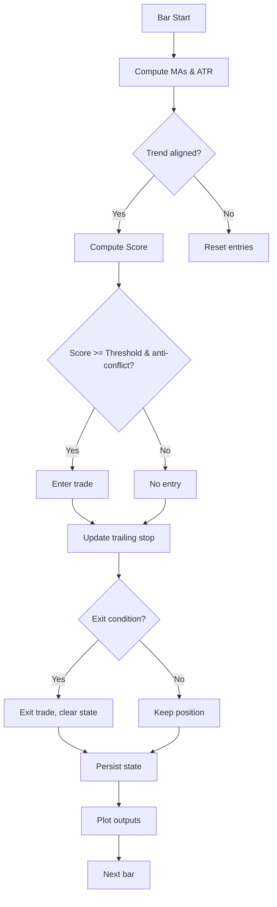

# Adaptive Triple Moving Average crossover - Technical Guide

> Trend-following system using Hull and EMA crossovers with adaptive scoring and ATR-based trailing stops.

| | |
| --- | --- |
| **Language** | Indie Script v5 |
| **Platform** | [TakeProfit](https://takeprofit.com) |
| **Category** | Trend |
| **Type** | Indicator |
| **Author** | @chartjunkie on TakeProfit |
| **License** | MIT |
| **Live script** | [Open on TakeProfit](https://takeprofit.com/indicator/adaptive-triple-moving-average-crossover-58) |
| **Source file** | [Adaptive Triple Moving Average crossover.indie5](Adaptive%20Triple%20Moving%20Average%20crossover.indie5) |

## Overview

This indicator combines three moving averages (a fast Hull Moving Average, a mid-term EMA, and a slow EMA) to define the prevailing trend direction. It then computes a directional score from up to five factors: trend persistence, pullback distance, impulse breakout, volume confirmation, and volatility expansion. Entries are taken only when the trend is aligned and the score meets a user-defined threshold, with an anti-conflict guard to prevent simultaneous long and short signals. Risk management is handled by an ATR-based trailing stop that can ratchet up/down and optionally move to breakeven after a sufficient profit.

On the chart, three moving average lines are plotted (orange fast HMA, blue mid EMA, red slow EMA). Entry signals appear as green circles (long) or red crosses (short) with a text label showing the current score out of the maximum possible (e.g. "4/7"). Exit signals are red crosses for long exits and green circles for short exits, labelled "EXIT". While in a trade, a dashed gray line shows the current trailing stop level.

## How it works

1. Compute fast HMA (Hull Moving Average), mid EMA, and slow EMA from closing price.
2. Calculate ATR (Average True Range) for risk sizing and scoring.
3. Determine trend direction: all three MAs must be stacked in order (fast > mid > slow for long, opposite for short).
4. Calculate a directional score from five factors: persistence (+1), pullback zone (+2), impulse breakout (+2), volume spike (+1), and volatility z-score (+1).
5. Entry occurs only if trend is aligned, score meets the threshold, and no position is already open (anti-conflict ensures only the stronger side enters).
6. On entry, set entry price and initial ATR-based stop; on subsequent bars, ratchet the stop and optionally move to breakeven.
7. Exit when price hits the stop or the maximum number of bars in trade is exceeded.
8. Plot the three MAs, entry/exit markers with score text, and gray dashed stop lines only while in a trade.

## Mathematical model

$$
\text{HMA}(n) = \text{WMA}\big( 2 \cdot \text{WMA}(n/2) - \text{WMA}(n),\ \sqrt{n} \big)
$$

$$
\text{distance} = \frac{|\text{close} - \text{midMA}|}{\text{ATR}}
$$

$$
\text{impulse:}\quad \text{close}[0] > \text{high}[1]\ \text{and}\ (\text{high}[0]-\text{low}[0]) > \text{ATR} \cdot \text{impulse\_atr}
$$

$$
\text{volume\_spike:}\quad \text{volume}[0] > \text{SMA(volume, 30)} \cdot 1.2
$$

$$
\text{volatility\_z:}\quad \frac{\text{ATR}_0 - \text{SMA(ATR, 100)}}{\text{StdDev(ATR, 100)}}
$$

## Logic flow



## Parameters

| Parameter | Type | Default | Range | Description |
| --- | --- | --- | --- | --- |
| `fast_len` | int | 20 | ≥ 1 | Fast MA Length |
| `mid_len` | int | 50 | ≥ 1 | Mid MA Length |
| `slow_len` | int | 200 | ≥ 1 | Slow MA Length |
| `atr_len` | int | 14 | ≥ 1 | ATR Length |
| `atr_mult` | float | 2.0 | ≥ 0.1 | ATR Multiplier |
| `pullback_atr` | float | 1.5 | 1.0 - 3.0 | Pullback Distance (ATR) |
| `impulse_atr` | float | 0.5 | 0.1 - 2.0 | Impulse Threshold (ATR) |
| `score_threshold` | int | 3 | 1 - 7 | Score Threshold (1-7) |
| `persist_bars` | int | 5 | ≥ 1 | Persistence Bars |
| `max_bars_trade` | int | 80 | ≥ 1 | Max Bars in Trade |
| `use_pullback` | bool | true |  | Pullback Filter (+2) |
| `use_impulse` | bool | true |  | Impulse Filter (+2) |
| `use_volume` | bool | true |  | Volume Filter (+1) |
| `use_volatility` | bool | true |  | Volatility Filter (+1) |
| `use_breakeven` | bool | true |  | Breakeven Logic |

## Code walkthrough

### Hull Moving Average Definition

Lines 12-20 of [Adaptive Triple Moving Average crossover.indie5](Adaptive%20Triple%20Moving%20Average%20crossover.indie5):

```python
@algorithm
def Hma(self, src: SeriesF, length: int) -> SeriesF:
    '''Hull Moving Average'''
    half     = max(1, length // 2)
    sqrt_len = max(1, int(sqrt(length)))
    wma_half = Wma.new(src, half)
    wma_full = Wma.new(src, length)
    diff     = MutSeriesF.new(2.0 * wma_half[0] - wma_full[0])
    return Wma.new(diff, sqrt_len)
```

The custom `Hma` algorithm implements Hull's moving average: a weighted moving average of the difference between 2 * WMA(half length) and WMA(full length), with a final WMA using sqrt(length). The code uses `Wma.new` from the indie.algorithms library and `MutSeriesF` to hold the intermediate difference series.

### Score Calculation – Factors 1-3

Lines 142-168 of [Adaptive Triple Moving Average crossover.indie5](Adaptive%20Triple%20Moving%20Average%20crossover.indie5):

```python
        # --- Factor 1: Trend persistence (+1, directional, always active) ---
        if mid_ma[0] > mid_ma[persist_bars]:
            score_long = score_long + 1
        if mid_ma[0] < mid_ma[persist_bars]:
            score_short = score_short + 1

        # --- Factor 2: Pullback zone (+2, directional) ---
        # Price must be pulling back toward mid MA from the correct side.
        # distance = abs(close - midMA) / ATR; want < pullback_atr (default 1.5)
        distance: float = 999.0
        if atr_val > 0.0:
            distance = abs(close[0] - mid_ma[0]) / atr_val
        # Long pullback: price is above mid MA but close enough (returning from above)
        if use_pullback and distance < pullback_atr and close[0] > mid_ma[0]:
            score_long = score_long + 2
        # Short pullback: price is below mid MA but close enough (returning from below)
        if use_pullback and distance < pullback_atr and close[0] < mid_ma[0]:
            score_short = score_short + 2

        # --- Factor 3: Impulse breakout (+2, directional, always asymmetric) ---
        rng           = self.high[0] - self.low[0]
        impulse_long  = close[0] > self.high[1] and rng > atr_val * impulse_atr
        impulse_short = close[0] < self.low[1]  and rng > atr_val * impulse_atr
        if use_impulse and impulse_long:
            score_long = score_long + 2
        if use_impulse and impulse_short:
            score_short = score_short + 2
```

The score is built incrementally. Factor 1 checks if the mid MA is higher/lower than `persist_bars` bars ago (persistence). Factor 2 measures the distance from price to mid MA relative to ATR; if within the pullback threshold and on the correct side, it adds 2 points. Factor 3 detects an impulse breakout when price breaks beyond the previous bar's high/low with a bar range exceeding ATR times the impulse threshold.

### Entry Conditions with Anti-Conflict

Lines 189-209 of [Adaptive Triple Moving Average crossover.indie5](Adaptive%20Triple%20Moving%20Average%20crossover.indie5):

```python
        # =========================
        # ENTRY: trend required + score >= threshold + anti-conflict guard
        # Anti-conflict: if both sides somehow score >= threshold, take the stronger one only.
        # =========================
        long_signal  = trend_long  and score_long  >= score_threshold and score_long  > score_short
        short_signal = trend_short and score_short >= score_threshold and score_short > score_long

        enter_long  = long_signal  and not in_long and not in_short
        enter_short = short_signal and not in_long and not in_short

        if enter_long:
            in_long     = True
            entry_price = close[0]
            entry_bar   = self.bar_index
            long_stop   = close[0] - atr_val * atr_mult

        if enter_short:
            in_short    = True
            entry_price = close[0]
            entry_bar   = self.bar_index
            short_stop  = close[0] + atr_val * atr_mult
```

Entry requires the trend to be aligned AND the directional score to meet the threshold AND the score to be strictly greater on one side to avoid conflicting signals. The anti-conflict guard ensures only the stronger side enters when both scores happen to pass the threshold. Upon entry, the entry price, bar index, and initial stop are recorded.

### Trailing Stop and Breakeven Logic

Lines 218-230 of [Adaptive Triple Moving Average crossover.indie5](Adaptive%20Triple%20Moving%20Average%20crossover.indie5):

```python
        if in_long and not isnan(entry_price):
            profit = close[0] - entry_price
            if use_breakeven and profit > atr_val and long_stop < entry_price:
                long_stop = entry_price          # promote stop to breakeven
            trail     = close[0] - atr_val * atr_mult
            long_stop = max(long_stop, trail)    # ratchet upward

        if in_short and not isnan(entry_price):
            profit = entry_price - close[0]
            if use_breakeven and profit > atr_val and short_stop > entry_price:
                short_stop = entry_price         # promote stop to breakeven
            trail      = close[0] + atr_val * atr_mult
            short_stop = min(short_stop, trail)  # ratchet downward
```

While in a trade, the trailing stop is ratcheted: for long positions, the stop is the maximum of the current stop and `close - ATR * multiplier`; for short, the minimum. Optionally, if profit exceeds one ATR, the stop is promoted to breakeven before continuing the ratchet, locking in profit.

### State Persistence

Lines 258-266 of [Adaptive Triple Moving Average crossover.indie5](Adaptive%20Triple%20Moving%20Average%20crossover.indie5):

```python
        # =========================
        # Persist state for next bar
        # =========================
        _in_long.set(in_long)
        _in_short.set(in_short)
        _entry_price.set(entry_price)
        _entry_bar.set(entry_bar)
        _long_stop.set(long_stop)
        _short_stop.set(short_stop)
```

Indie requires persistent variables to be stored via `Var` objects. The code reads the previous values at the beginning of `calc` and writes back updated values at the end using `.set()`. This pattern allows the indicator to remember whether it is in a trade across bars.

### Building Output Plots

Lines 287-297 of [Adaptive Triple Moving Average crossover.indie5](Adaptive%20Triple%20Moving%20Average%20crossover.indie5):

```python
        return (
            fast_ma[0],           # [0] Fast MA (HMA)          — orange line
            mid_ma[0],            # [1] Mid MA  (EMA)          — blue line
            slow_ma[0],           # [2] Slow MA (EMA)          — red line
            long_entry_marker,    # [3] green circle below bar — long entry  (text="score/max")
            short_entry_marker,   # [4] red cross above bar    — short entry (text="score/max")
            long_exit_marker,     # [5] red cross above bar    — long exit   (text="EXIT")
            short_exit_marker,    # [6] green circle below bar — short exit  (text="EXIT")
            long_stop_plot,       # [7] gray dashed line       — long stop
            short_stop_plot,      # [8] gray dashed line       — short stop
        )
```

The `return` tuple order must match the decorator order exactly. Entry and exit markers use `plot.Marker` with a `text` parameter to display the score or "EXIT". Stop lines are set to `nan` when not in a trade so they disappear from the chart.

## Reading the chart

- **Orange line**: Fast Hull Moving Average (HMA).
- **Blue line**: Mid-term Exponential Moving Average (EMA).
- **Red line**: Slow Exponential Moving Average (EMA).
- **Green circle below bar**: Long entry, with text showing current score (e.g. `4/7`).
- **Red cross above bar**: Short entry, with text showing current score.
- **Red cross above bar (with "EXIT")**: Long exit signal.
- **Green circle below bar (with "EXIT")**: Short exit signal.
- **Gray dashed line**: Trailing stop level, visible only while a position is open (disappears when flat).
- The three moving average lines together define the trend stack: when orange > blue > red, trend is up; reversed when all are descending.

## Implementation notes

- Persistent state (in trade flags, stops) is stored with `Var` objects and must be read/written inside `calc()` every bar.
- The score threshold defaults to 3 out of a maximum of 7 (1 from persistence, plus 2 from pullback, 2 from impulse, 1 from volume, and 1 from volatility).
- Stop lines are set to `NaN` when not in a trade to avoid plotting unnecessary dashes on the chart.
- The anti-conflict guard (`score_long > score_short`) prevents simultaneous long and short entries even if both pass the threshold.

## FAQ

**How is the indicator adaptive?**

The scoring system adapts by using multiple filters that can be individually toggled (pullback, impulse, volume, volatility). The threshold is fixed, but the maximum possible score changes with enabled factors, making the entry criteria more or less strict.

**Can I change the moving average types?**

Yes, but it requires modifying the source. The fast MA uses the custom HMA algorithm, while mid and slow use EMA. You can replace the algorithm calls (e.g., `Ema.new`) with other available indicators like `Sma` or `Wma`.

**How are the trailing stops calculated?**

Initial stop is entry price ± ATR × multiplier. On each bar while in trade, the stop ratchets: for long, it is the max of the current stop and (close - ATR×mult); for short, the min. Optional breakeven logic moves the stop to entry price once profit exceeds one ATR.

## Full source code

Indie Script v5, as published on TakeProfit. Copy it into the platform's script editor or [open the live script](https://takeprofit.com/indicator/adaptive-triple-moving-average-crossover-58).

```python
# indie:lang_version = 5
from math import nan, sqrt, isnan
from indie import indicator, param, MainContext, Var, MutSeriesF, SeriesF, color, plot, algorithm, line_style
from indie.algorithms import Ema, Sma, Wma, Atr, StdDev


# =========================
# Hull Moving Average
# HMA(n) = WMA( 2*WMA(n/2) - WMA(n), sqrt(n) )
# =========================

@algorithm
def Hma(self, src: SeriesF, length: int) -> SeriesF:
    '''Hull Moving Average'''
    half     = max(1, length // 2)
    sqrt_len = max(1, int(sqrt(length)))
    wma_half = Wma.new(src, half)
    wma_full = Wma.new(src, length)
    diff     = MutSeriesF.new(2.0 * wma_half[0] - wma_full[0])
    return Wma.new(diff, sqrt_len)


# =========================
# Decorator order (top → bottom) = return tuple (index 0 → last):
#   [0] fast_ma             @plot.line   orange
#   [1] mid_ma              @plot.line   blue
#   [2] slow_ma             @plot.line   red
#   [3] long_entry_marker   @plot.marker green circle, below bar  (text = "score/max")
#   [4] short_entry_marker  @plot.marker red cross, above bar     (text = "score/max")
#   [5] long_exit_marker    @plot.marker red cross, above bar     (text = "EXIT")
#   [6] short_exit_marker   @plot.marker green circle, below bar  (text = "EXIT")
#   [7] long_stop_plot      @plot.line   gray dashed
#   [8] short_stop_plot     @plot.line   gray dashed
#
# NOTE: Score is NOT plotted as a line (it would break price-scale on overlay).
#       Score is shown as text directly on entry markers, e.g. "4/7".
# =========================

@indicator('Adaptive Triple MA Crossover', overlay_main_pane=True)
# MA lengths
@param.int('fast_len',        default=20,  min=1,            title='Fast MA Length')
@param.int('mid_len',         default=50,  min=1,            title='Mid MA Length')
@param.int('slow_len',        default=200, min=1,            title='Slow MA Length')
# ATR risk engine
@param.int('atr_len',         default=14,  min=1,            title='ATR Length')
@param.float('atr_mult',      default=2.0, min=0.1,          title='ATR Multiplier')
# Score filter parameters
@param.float('pullback_atr',  default=1.5, min=1.0, max=3.0, title='Pullback Distance (ATR)')
@param.float('impulse_atr',   default=0.5, min=0.1, max=2.0, title='Impulse Threshold (ATR)')
@param.int('score_threshold', default=3,   min=1,   max=7,   title='Score Threshold (1-7)')
@param.int('persist_bars',    default=5,   min=1,            title='Persistence Bars')
@param.int('max_bars_trade',  default=80,  min=1,            title='Max Bars in Trade')
# Filter toggles
@param.bool('use_pullback',   default=True,                   title='Pullback Filter (+2)')
@param.bool('use_impulse',    default=True,                   title='Impulse Filter (+2)')
@param.bool('use_volume',     default=True,                   title='Volume Filter (+1)')
@param.bool('use_volatility', default=True,                   title='Volatility Filter (+1)')
@param.bool('use_breakeven',  default=True,                   title='Breakeven Logic')
# Plots — order must match return tuple exactly
@plot.line(title='Fast MA (HMA)',  color=color.ORANGE)
@plot.line(title='Mid MA (EMA)',   color=color.BLUE)
@plot.line(title='Slow MA (EMA)',  color=color.RED)
@plot.marker(title='Long Entry',   color=color.GREEN,
             style=plot.marker_style.CIRCLE, position=plot.marker_position.BELOW)
@plot.marker(title='Short Entry',  color=color.RED,
             style=plot.marker_style.CROSS,  position=plot.marker_position.ABOVE)
@plot.marker(title='Long Exit',    color=color.RED,
             style=plot.marker_style.CROSS,  position=plot.marker_position.ABOVE)
@plot.marker(title='Short Exit',   color=color.GREEN,
             style=plot.marker_style.CIRCLE, position=plot.marker_position.BELOW)
@plot.line(title='Long Stop',      color=color.GRAY,   line_style=line_style.DASHED)
@plot.line(title='Short Stop',     color=color.GRAY,   line_style=line_style.DASHED)
class Main(MainContext):

    def calc(self, fast_len, mid_len, slow_len, atr_len, atr_mult,
             pullback_atr, impulse_atr, score_threshold, persist_bars, max_bars_trade,
             use_pullback, use_impulse, use_volume, use_volatility, use_breakeven):

        close = self.close

        # =========================
        # Persistent state
        # Var.new() is syntactic sugar — must be in calc(), not __init__()
        # =========================
        _in_long     = Var[bool].new(init=False)
        _in_short    = Var[bool].new(init=False)
        _entry_price = Var[float].new(init=nan)
        _entry_bar   = Var[int].new(init=0)
        _long_stop   = Var[float].new(init=nan)
        _short_stop  = Var[float].new(init=nan)

        in_long     = _in_long.get()
        in_short    = _in_short.get()
        entry_price = _entry_price.get()
        entry_bar   = _entry_bar.get()
        long_stop   = _long_stop.get()
        short_stop  = _short_stop.get()

        # =========================
        # Moving averages
        # =========================
        fast_ma = Hma.new(close, fast_len)
        mid_ma  = Ema.new(close, mid_len)
        slow_ma = Ema.new(close, slow_len)

        # =========================
        # ATR
        # =========================
        atr     = Atr.new(atr_len)
        atr_val = atr[0]

        # =========================
        # CORE TREND FILTER (required gate — no trend, no entry allowed)
        # =========================
        trend_long  = fast_ma[0] > mid_ma[0] and mid_ma[0] > slow_ma[0]
        trend_short = fast_ma[0] < mid_ma[0] and mid_ma[0] < slow_ma[0]

        # =========================
        # SCORE SYSTEM
        # All variables pre-declared before if-blocks (Indie block-level scoping).
        # Scores are directional — each filter only credits the side it confirms.
        # =========================
        score_long  = 0
        score_short = 0

        # Max possible score from all enabled filters:
        #   persistence = +1  (always on)
        #   pullback    = +2  (if use_pullback)
        #   impulse     = +2  (if use_impulse)
        #   volume      = +1  (if use_volume)
        #   volatility  = +1  (if use_volatility)
        max_score = 1
        if use_pullback:
            max_score = max_score + 2
        if use_impulse:
            max_score = max_score + 2
        if use_volume:
            max_score = max_score + 1
        if use_volatility:
            max_score = max_score + 1

        # --- Factor 1: Trend persistence (+1, directional, always active) ---
        if mid_ma[0] > mid_ma[persist_bars]:
            score_long = score_long + 1
        if mid_ma[0] < mid_ma[persist_bars]:
            score_short = score_short + 1

        # --- Factor 2: Pullback zone (+2, directional) ---
        # Price must be pulling back toward mid MA from the correct side.
        # distance = abs(close - midMA) / ATR; want < pullback_atr (default 1.5)
        distance: float = 999.0
        if atr_val > 0.0:
            distance = abs(close[0] - mid_ma[0]) / atr_val
        # Long pullback: price is above mid MA but close enough (returning from above)
        if use_pullback and distance < pullback_atr and close[0] > mid_ma[0]:
            score_long = score_long + 2
        # Short pullback: price is below mid MA but close enough (returning from below)
        if use_pullback and distance < pullback_atr and close[0] < mid_ma[0]:
            score_short = score_short + 2

        # --- Factor 3: Impulse breakout (+2, directional, always asymmetric) ---
        rng           = self.high[0] - self.low[0]
        impulse_long  = close[0] > self.high[1] and rng > atr_val * impulse_atr
        impulse_short = close[0] < self.low[1]  and rng > atr_val * impulse_atr
        if use_impulse and impulse_long:
            score_long = score_long + 2
        if use_impulse and impulse_short:
            score_short = score_short + 2

        # --- Factor 4: Volume confirmation (+1, directional by bar close) ---
        vol_ma    = Sma.new(self.volume, 30)
        vol_spike = self.volume[0] > vol_ma[0] * 1.2
        # Volume confirms the direction of the current bar's close
        if use_volume and vol_spike and close[0] > close[1]:
            score_long = score_long + 1
        if use_volume and vol_spike and close[0] < close[1]:
            score_short = score_short + 1

        # --- Factor 5: Volatility / ATR Z-score (+1, symmetric — confirms market activity) ---
        atr_mean = Sma.new(atr, 100)[0]
        atr_std  = StdDev.new(atr, 100)[0]
        atr_z: float = 0.0
        if atr_std > 0.0:
            atr_z = (atr_val - atr_mean) / atr_std
        if use_volatility and atr_z > 0.0:
            score_long  = score_long  + 1
            score_short = score_short + 1

        # =========================
        # ENTRY: trend required + score >= threshold + anti-conflict guard
        # Anti-conflict: if both sides somehow score >= threshold, take the stronger one only.
        # =========================
        long_signal  = trend_long  and score_long  >= score_threshold and score_long  > score_short
        short_signal = trend_short and score_short >= score_threshold and score_short > score_long

        enter_long  = long_signal  and not in_long and not in_short
        enter_short = short_signal and not in_long and not in_short

        if enter_long:
            in_long     = True
            entry_price = close[0]
            entry_bar   = self.bar_index
            long_stop   = close[0] - atr_val * atr_mult

        if enter_short:
            in_short    = True
            entry_price = close[0]
            entry_bar   = self.bar_index
            short_stop  = close[0] + atr_val * atr_mult

        # =========================
        # ATR RISK ENGINE: trailing stop + optional breakeven
        # Pre-declare profit/trail before if-blocks (Indie block-level scoping)
        # =========================
        profit: float = 0.0
        trail: float  = 0.0

        if in_long and not isnan(entry_price):
            profit = close[0] - entry_price
            if use_breakeven and profit > atr_val and long_stop < entry_price:
                long_stop = entry_price          # promote stop to breakeven
            trail     = close[0] - atr_val * atr_mult
            long_stop = max(long_stop, trail)    # ratchet upward

        if in_short and not isnan(entry_price):
            profit = entry_price - close[0]
            if use_breakeven and profit > atr_val and short_stop > entry_price:
                short_stop = entry_price         # promote stop to breakeven
            trail      = close[0] + atr_val * atr_mult
            short_stop = min(short_stop, trail)  # ratchet downward

        # =========================
        # EXIT: stop hit or max bars elapsed
        # bars_in_trade is gated by in_long / in_short so entry_bar=0 harmless when flat
        # =========================
        bars_in_trade = self.bar_index - entry_bar
        time_exit     = bars_in_trade > max_bars_trade

        exit_long  = in_long  and (close[0] < long_stop  or time_exit)
        exit_short = in_short and (close[0] > short_stop or time_exit)

        # Capture exit booleans BEFORE resetting state (needed for exit markers below)
        show_long_exit  = exit_long
        show_short_exit = exit_short

        if exit_long:
            in_long     = False
            entry_price = nan
            entry_bar   = 0
            long_stop   = nan

        if exit_short:
            in_short    = False
            entry_price = nan
            entry_bar   = 0
            short_stop  = nan

        # =========================
        # Persist state for next bar
        # =========================
        _in_long.set(in_long)
        _in_short.set(in_short)
        _entry_price.set(entry_price)
        _entry_bar.set(entry_bar)
        _long_stop.set(long_stop)
        _short_stop.set(short_stop)

        # =========================
        # BUILD OUTPUTS
        # =========================

        # Entry markers with score text e.g. "4/7"
        score_text_long  = str(score_long)  + '/' + str(max_score)
        score_text_short = str(score_short) + '/' + str(max_score)

        long_entry_marker  = plot.Marker(close[0], text=score_text_long)  if enter_long  else plot.Marker(nan)
        short_entry_marker = plot.Marker(close[0], text=score_text_short) if enter_short else plot.Marker(nan)

        # Exit markers
        long_exit_marker  = plot.Marker(close[0], text='EXIT') if show_long_exit  else plot.Marker(nan)
        short_exit_marker = plot.Marker(close[0], text='EXIT') if show_short_exit else plot.Marker(nan)

        # Stop lines — visible only while in a trade
        long_stop_plot  = long_stop  if in_long  else nan
        short_stop_plot = short_stop if in_short else nan

        return (
            fast_ma[0],           # [0] Fast MA (HMA)          — orange line
            mid_ma[0],            # [1] Mid MA  (EMA)          — blue line
            slow_ma[0],           # [2] Slow MA (EMA)          — red line
            long_entry_marker,    # [3] green circle below bar — long entry  (text="score/max")
            short_entry_marker,   # [4] red cross above bar    — short entry (text="score/max")
            long_exit_marker,     # [5] red cross above bar    — long exit   (text="EXIT")
            short_exit_marker,    # [6] green circle below bar — short exit  (text="EXIT")
            long_stop_plot,       # [7] gray dashed line       — long stop
            short_stop_plot,      # [8] gray dashed line       — short stop
        )
```
