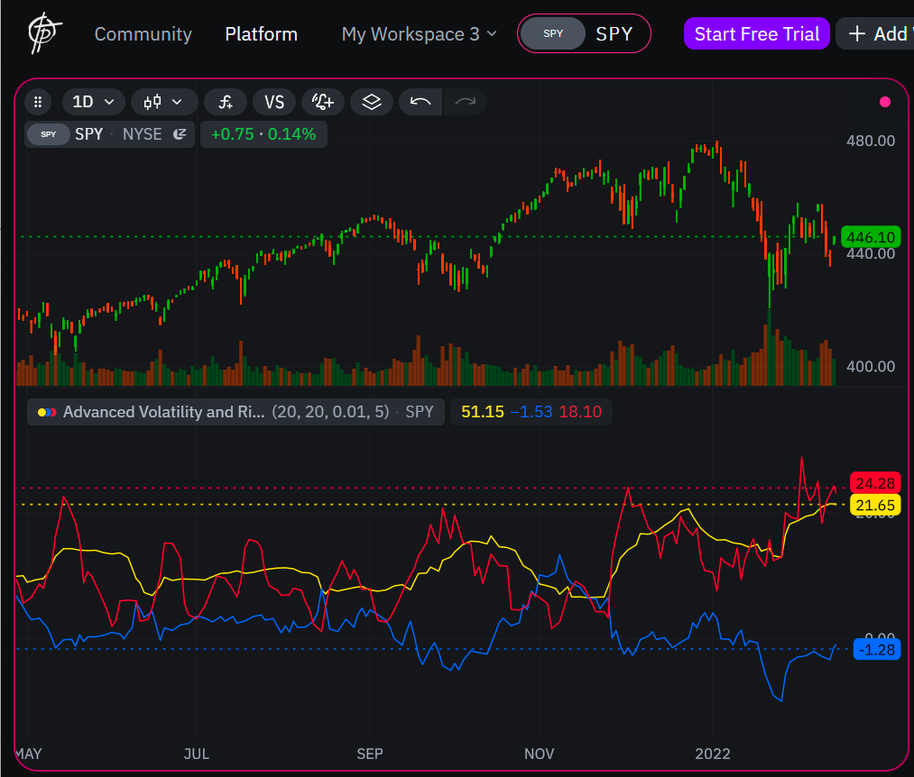

**Advanced Volatility and Risk-Adjusted Return Indicator**
---

###### *Educational Tool for Traders & Indie Language Learners* `v1.0 | For educational use | All experience levels`

### **What This Indicator Does**

This tool combines **three foundational financial concepts** into a single visualization, bridging technical analysis with portfolio theory:

| Metric | Formula/Core Concept | What It Reveals |
| ------ | -------------------- | --------------- |
| **Standard Deviation** (Yellow) | `σ = √[Σ(x - μ)² / N]` | Price volatility risk over time |
| **Sharpe Ratio** (Blue) | `(Return - Risk-Free Rate) / σ` | Quality of risk-adjusted returns |
| **ARCH Volatility** (Red) | Nobel-winning volatility clustering model | Market turbulence regimes |

***

### **Why It Matters for Traders**

1. **Risk Awareness**:
    * Rising StdDev → Expanding risk (prepare for larger swings)
    * High Sharpe → Efficient capital allocation (validate strategy edges)
    * ARCH spikes → Early warning for volatility regimes (hedging signals)
2. **Cross-Market Insights**:
    * Works on **stocks**, **crypto**, **forex** (adjust `vol_scale` per asset)
    * Compare assets: Higher Sharpe = better risk/reward profile
3. **Educational Value**:
    * Visualizes Robert Engle’s Nobel-winning ARCH model in action
    * Demonstrates modern portfolio theory (MPT) fundamentals

***

### **Code Logic for Developers**

**Key Indie Language Features Demonstrated**:

```python
# 1. Parameterization with decorators
@param.int('stddev_length', default=20)
@param.float('risk_free_rate', default=0.01)
# 2. Series handling & mutable data
returns = MutSeriesF.new(0)
returns[0] = (self.close[0] - self.close[1]) / self.close[1]
# 3. Built-in algorithms
stddev = StdDev.new(returns, stddev_length)[0]
# 4. Annualization logic (real-world scaling)
daily_rf = (1 + risk_free_rate) ** (1/252) - 1
sharpe_ratio = (annual_return - risk_free_rate) / annual_volatility
```

**Best Practices Illustrated**:

* Parameter validation (`min=1` guards)
* Safe division checks (`if ... != 0`)
* Volatility scaling for visual clarity

***

### **Learning Pathways**

**For Traders**:

* Study ARCH spikes during FOMC/news events
* Backtest strategies when Sharpe > 1.5
* Compare StdDev vs. ARCH to detect "quiet before storm" patterns

**For Indie Developers**:

* Learn series mutation with `MutSeriesF`
* Practice timeframe conversions (daily→annual)
* Explore decorator-based parameter systems

***

### **Visualization Tips**


*Color coding: Yellow=StdDev, Blue=Sharpe, Red=ARCH*

1. **Crypto (1D)**: Use `vol_scale=100`, watch ARCH during BTC halvings
2. **Stocks (1H)**: Set `risk_free_rate=0.03` (T-bill rate), track sector rotations
3. **Forex (15M)**: `arch_lag=3` for intraday volatility clusters

***

### **Theoretical Foundation**

* **Modern Portfolio Theory (MPT)**: Sharpe Ratio optimization
* **Volatility Clustering**: Engle’s ARCH model (Nobel 2003)
* **Risk-Adjusted Returns**: `Excess Return / Unit Risk` framework\*"This isn’t just an indicator—it’s a window into how quants model markets."\*

***


<br>
## Indie v5 Script code

```python
#education purpose
# indie:lang_version = 5
import math
from indie import indicator, param, plot, color, MutSeriesF
from indie.algorithms import StdDev, Sma

@indicator('Advanced Volatility and Risk-Adjusted Return Indicator', overlay_main_pane=False)
@param.int('stddev_length', default=20, min=1, title='Standard Deviation Length')
@param.int('sharpe_length', default=20, min=1, title='Return Period for Sharpe Ratio')
@param.float('risk_free_rate', default=0.01, title='Risk-Free Rate (annual)')
@param.int('arch_lag', default=5, min=1, title='ARCH Lag')
@param.float('vol_scale', default=100.0, min=1.0, title='Volatility Scaling Factor')
@plot.line(color=color.YELLOW, title='Standard Deviation')
@plot.line(color=color.BLUE, title='Sharpe Ratio')
@plot.line(color=color.RED, title='ARCH Volatility')
def Main(self, stddev_length, sharpe_length, risk_free_rate, arch_lag, vol_scale):
    # 1. Calculation of daily returns
    returns = MutSeriesF.new(0)
    if len(self.close) > 1 and self.close[1] != 0:
        returns[0] = (self.close[0] - self.close[1]) / self.close[1]
    
    # 2. Annual risk-free rate → daily
    daily_rf = (1 + risk_free_rate) ** (1/252) - 1
    
    # 3. Volatility (standard deviation)
    stddev_daily = StdDev.new(returns, stddev_length)[0]
    stddev_annual = stddev_daily * math.sqrt(252) * vol_scale
    
    # 4. Sharpe Ratio
    avg_return_daily = Sma.new(returns, sharpe_length)[0]
    avg_return_annual = avg_return_daily * 252
    sharpe_ratio = (avg_return_annual - risk_free_rate) / (stddev_annual / vol_scale) if (stddev_annual / vol_scale) != 0 else 0
    
    # 5. ARCH volatility
    mean_return = Sma.new(returns, arch_lag)[0]
    squared_dev = (returns[0] - mean_return) ** 2
    arch_vol_daily = math.sqrt(Sma.new(MutSeriesF.new(squared_dev), arch_lag)[0])
    arch_vol_annual = arch_vol_daily * math.sqrt(252) * vol_scale
    
    return stddev_annual, sharpe_ratio, arch_vol_annual
```

## Pine Script 5 code

```
//@version=5
indicator("Advanced Volatility and Risk-Adjusted Return Indicator", overlay=false)

// Input parameters
stddev_length = input.int(20, title="Standard Deviation Length", minval=1)
sharpe_length = input.int(20, title="Return Period for Sharpe Ratio", minval=1)
risk_free_rate = input.float(0.01, title="Risk-Free Rate (annual)")
arch_lag = input.int(5, title="ARCH Lag", minval=1)
vol_scale = input.float(100.0, title="Volatility Scaling Factor", minval=1.0)

// 1. Daily returns
returns = nz(close / close[1] - 1)

// 2. Convert annual risk-free rate to daily
daily_rf = math.pow(1 + risk_free_rate, 1 / 252) - 1

// 3. Volatility (standard deviation)
stddev_daily = ta.stdev(returns, stddev_length)
stddev_annual = stddev_daily * math.sqrt(252) * vol_scale

// 4. Sharpe Ratio
avg_return_daily = ta.sma(returns, sharpe_length)
avg_return_annual = avg_return_daily * 252
sharpe_ratio = (avg_return_annual - risk_free_rate) / (stddev_annual / vol_scale)
sharpe_ratio := na(stddev_annual / vol_scale) or (stddev_annual / vol_scale == 0) ? 0 : sharpe_ratio

// 5. ARCH Volatility
mean_return = ta.sma(returns, arch_lag)
squared_dev = math.pow(returns - mean_return, 2)
arch_vol_daily = math.sqrt(ta.sma(squared_dev, arch_lag))
arch_vol_annual = arch_vol_daily * math.sqrt(252) * vol_scale

// Plotting
plot(stddev_annual, color=color.yellow, title="Standard Deviation")
plot(sharpe_ratio, color=color.blue, title="Sharpe Ratio")
plot(arch_vol_annual, color=color.red, title="ARCH Volatility")

```

**Sources**: [repo](https://github.com/Indie-script/indie-script.github.io/tree/main/indicators/Advanced%20Volatility%20And%20Risk-adjusted%20Return%20Indicator)

**License**: CC BY-NC 4.0 (Educational use)
**Documentation**: [Indie Language Wiki](https://takeprofit.com/docs/indie/What-is-Indie)
**Contributions**: Open-source @ \*Created for the TakeProfit.com Community by **Pavel Medd**