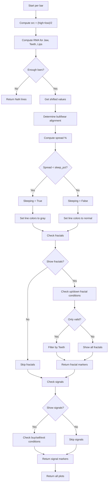

# Alligator + Fractals + Signals - Technical Guide

> Bill Williams' Alligator with smoothed moving averages, fractals, and entry/exit signals.

| | |
| --- | --- |
| **Language** | Indie Script v5 |
| **Platform** | [TakeProfit](https://takeprofit.com) |
| **Category** | Trend |
| **Type** | Indicator |
| **Author** | @julia_tiulikhova on TakeProfit |
| **License** | MIT |
| **Live script** | [Open on TakeProfit](https://takeprofit.com/indicator/alligator-fractals-signals-82) |
| **Source file** | [Alligator + Fractals + Signals.indie5](Alligator%20+%20Fractals%20+%20Signals.indie5) |

## Overview

This indicator implements Bill Williams' classic Alligator, consisting of three smoothed moving averages (SMMA) of the median price (hl2) shifted forward: Jaw (13/8), Teeth (8/5), and Lips (5/3). It automatically detects market phases by measuring the spread between the lines as a percentage of price. When the spread is below a user-defined threshold, the lines turn gray, indicating a sleeping (ranging) market. When the lines are properly stacked (bullish: Lips > Teeth > Jaw; bearish: Lips < Teeth < Jaw) and the spread exceeds the threshold, the market is considered awake and trending.

The indicator also plots 5-bar fractals (high/low) optionally filtered to only show those outside the mouth (above Teeth for up fractals, below Teeth for down fractals). It generates buy/sell signals when the Alligator wakes up (lines align, not sleeping, and price closes on the correct side of Lips) and exit signals when price crosses the Teeth line (trend break). All signals are plotted as markers on the chart.

## How it works

1. Compute median price (hl2) as the source for all three averages.
2. Calculate three SMMA (Wilder's RMA) of the source with lengths jaw_len, teeth_len, lips_len.
3. Shift each average forward by its offset (jaw_off, teeth_off, lips_off) to get current bar values.
4. Determine market state: bullish if Lips > Teeth > Jaw, bearish if Lips < Teeth < Jaw, sleeping if the spread (max-min)/close*100 is below sleep_pct.
5. Detect 5-bar fractals: up fractal if high[2] is the highest of the five bars, down fractal if low[2] is the lowest. Optionally filter to only show fractals outside the Teeth line.
6. Generate buy signal when bullish alignment just started (not previous bar), not sleeping, and close > Lips. Sell signal when bearish alignment just started, not sleeping, and close < Lips.
7. Generate exit long signal when previous bar was bullish and close crosses below Teeth. Exit short when previous bar was bearish and close crosses above Teeth.
8. Return plot lines (colored gray if sleeping, otherwise blue/red/green) and markers for fractals and signals.

## Logic flow



## Parameters

| Parameter | Type | Default | Range | Description |
| --- | --- | --- | --- | --- |
| `jaw_len` | int | 13 | ≥ 1 | Jaw: length |
| `jaw_off` | int | 8 | ≥ 0 | Jaw: offset |
| `teeth_len` | int | 8 | ≥ 1 | Teeth: length |
| `teeth_off` | int | 5 | ≥ 0 | Teeth: offset |
| `lips_len` | int | 5 | ≥ 1 | Lips: length |
| `lips_off` | int | 3 | ≥ 0 | Lips: offset |
| `sleep_pct` | float | 0.25 | ≥ 0.0 | Sleep threshold (line spread, % of price) |
| `show_signals` | bool | true |  | Show Buy/Sell signals |
| `show_fractals` | bool | true |  | Show fractals |
| `only_valid` | bool | true |  | Only valid fractals (outside the mouth) |

## Code walkthrough

### Source and SMMA computation

Lines 36-42 of [Alligator + Fractals + Signals.indie5](Alligator%20+%20Fractals%20+%20Signals.indie5):

```python
    src = MutSeriesF.new(0)
    src[0] = (self.high[0] + self.low[0]) / 2

    # SMMA (Williams' smoothed MA) == Wilder's RMA
    jaw   = Rma.new(src, jaw_len)
    teeth = Rma.new(src, teeth_len)
    lips  = Rma.new(src, lips_len)
```

The source is the median price (hl2). Three SMMA are computed using Rma.new, which implements Wilder's RMA (same as SMMA). The lengths are user-configurable parameters.

### Bar count check and offset values

Lines 45-54 of [Alligator + Fractals + Signals.indie5](Alligator%20+%20Fractals%20+%20Signals.indie5):

```python
    need = max(jaw_off, teeth_off, lips_off) + jaw_len + 5
    if self.bar_index < need:
        return (plot.Line(nan), plot.Line(nan), plot.Line(nan),
                nan, nan,
                plot.Marker(nan), plot.Marker(nan),
                nan, nan)

    # Line values as they are visible on the current bar (offset applied)
    jaw_v,   teeth_v,   lips_v   = jaw[jaw_off],     teeth[teeth_off],     lips[lips_off]
    jaw_p,   teeth_p,   lips_p   = jaw[jaw_off + 1], teeth[teeth_off + 1], lips[lips_off + 1]
```

To avoid drawing before enough history, the indicator checks bar_index against a required minimum. Once enough bars exist, it retrieves the shifted values for the current bar and the previous bar (for signal detection).

### Market state detection

Lines 57-63 of [Alligator + Fractals + Signals.indie5](Alligator%20+%20Fractals%20+%20Signals.indie5):

```python
    bull   = lips_v > teeth_v and teeth_v > jaw_v          # lips > teeth > jaw
    bear   = lips_v < teeth_v and teeth_v < jaw_v          # lips < teeth < jaw
    bull_p = lips_p > teeth_p and teeth_p > jaw_p
    bear_p = lips_p < teeth_p and teeth_p < jaw_p

    spread   = (max(lips_v, teeth_v, jaw_v) - min(lips_v, teeth_v, jaw_v)) / self.close[0] * 100
    sleeping = spread < sleep_pct                          # lines intertwined — alligator sleeps
```

Bullish and bearish alignments are determined by comparing the three lines. The spread is calculated as the percentage difference between the highest and lowest line relative to the close. If the spread is below sleep_pct, the market is considered sleeping.

### Fractal detection and filtering

Lines 66-71 of [Alligator + Fractals + Signals.indie5](Alligator%20+%20Fractals%20+%20Signals.indie5):

```python
    h, l = self.high, self.low
    up_fr = h[2] > h[0] and h[2] > h[1] and h[2] > h[3] and h[2] > h[4]
    dn_fr = l[2] < l[0] and l[2] < l[1] and l[2] < l[3] and l[2] < l[4]
    teeth_at_fr = teeth[teeth_off + 2]
    up_ok = up_fr and (not only_valid or h[2] > teeth_at_fr)
    dn_ok = dn_fr and (not only_valid or l[2] < teeth_at_fr)
```

Standard 5-bar fractals are detected by comparing the middle bar (index 2) to its neighbors. The only_valid flag filters fractals: up fractals are shown only if the high is above the Teeth line, down fractals only if the low is below the Teeth line.

### Signal generation

Lines 74-78 of [Alligator + Fractals + Signals.indie5](Alligator%20+%20Fractals%20+%20Signals.indie5):

```python
    close, close_p = self.close[0], self.close[1]
    buy        = bull and not bull_p and not sleeping and close > lips_v
    sell       = bear and not bear_p and not sleeping and close < lips_v
    exit_long  = bull_p and close < teeth_v and close_p >= teeth_p
    exit_short = bear_p and close > teeth_v and close_p <= teeth_p
```

Buy and sell signals fire when the alignment just started (previous bar was not aligned), the Alligator is not sleeping, and price closed on the correct side of Lips. Exit signals occur when price crosses the Teeth line in the opposite direction of the prior trend.

### Return tuple with plots

Lines 85-95 of [Alligator + Fractals + Signals.indie5](Alligator%20+%20Fractals%20+%20Signals.indie5):

```python
    return (
        jaw_line,
        teeth_line,
        lips_line,
        h[2] if show_fractals and up_ok else nan,
        l[2] if show_fractals and dn_ok else nan,
        plot.Marker(value=self.low[0],  text="BUY")  if show_signals and buy  else plot.Marker(nan),
        plot.Marker(value=self.high[0], text="SELL") if show_signals and sell else plot.Marker(nan),
        self.high[0] if show_signals and exit_long  else nan,
        self.low[0]  if show_signals and exit_short else nan,
    )
```

The function returns a tuple of plot objects: three lines (with gray color when sleeping), two fractal markers (up/down), two signal markers (Buy/Sell), and two exit markers (Exit Long/Short). NaN values are used to hide plots when conditions are not met.

## Reading the chart

- **Jaw line** (blue, width 2): shifted SMMA of length 13, offset 8.
- **Teeth line** (red, width 2): shifted SMMA of length 8, offset 5.
- **Lips line** (green, width 2): shifted SMMA of length 5, offset 3.
- When the market is **sleeping** (spread below threshold), all three lines turn **gray**.
- **Up fractals**: gray circle markers plotted above the bar when a valid up fractal is detected.
- **Down fractals**: gray circle markers plotted below the bar when a valid down fractal is detected.
- **Buy signal**: green "BUY" label marker plotted below the bar.
- **Sell signal**: red "SELL" label marker plotted above the bar.
- **Exit Long**: green cross marker plotted above the bar.
- **Exit Short**: red cross marker plotted below the bar.

## Implementation notes

- The indicator uses Rma (Wilder's RMA) for smoothing, which is equivalent to SMMA. The first values are NaN until enough bars exist.
- Fractals are confirmed two bars after the pattern (bar_index-2). The indicator uses the high/low at that bar for plotting.
- Signal conditions rely on the previous bar's alignment (bull_p, bear_p) to detect the moment the Alligator wakes up.
- All markers and lines return NaN when conditions are not met, ensuring nothing is drawn on irrelevant bars.

## FAQ

**How do I adjust the sensitivity of the sleeping detection?**

Change the 'Sleep threshold' parameter (sleep_pct). Lower values make the indicator more sensitive (less likely to sleep), higher values make it sleep more often. Typical values: crypto 0.5-1%, forex 0.1-0.3%, stocks 0.3-0.5%.

**What price source does the Alligator use?**

The indicator uses the median price (hl2 = (high + low) / 2) as the source for all three moving averages, following Bill Williams' original specification.

**Can I use a different price source like close or open?**

Not directly through the parameters. You would need to modify line 37 in the source code to change `self.high[0] + self.low[0]) / 2` to your desired source, e.g., `self.close[0]`.

## Full source code

Indie Script v5, as published on TakeProfit. Copy it into the platform's script editor or [open the live script](https://takeprofit.com/indicator/alligator-fractals-signals-82).

```python
# indie:lang_version = 5
# Alligator Pro — Williams Alligator + Fractals + Signals (Indie v5)
from math import nan
from indie import indicator, param, plot, color, MutSeriesF
from indie.algorithms import Rma


@indicator("Alligator Pro", overlay_main_pane=True)
# ── Alligator ──
@param.int("jaw_len",   default=13, min=1, title="Jaw: length")
@param.int("jaw_off",   default=8,  min=0, title="Jaw: offset")
@param.int("teeth_len", default=8,  min=1, title="Teeth: length")
@param.int("teeth_off", default=5,  min=0, title="Teeth: offset")
@param.int("lips_len",  default=5,  min=1, title="Lips: length")
@param.int("lips_off",  default=3,  min=0, title="Lips: offset")
# ── Signals ──
@param.float("sleep_pct",   default=0.25, min=0.0, title="Sleep threshold (line spread, % of price)")
@param.bool("show_signals", default=True, title="Show Buy/Sell signals")
# ── Fractals ──
@param.bool("show_fractals", default=True, title="Show fractals")
@param.bool("only_valid",    default=True, title="Only valid fractals (outside the mouth)")
# ── Plots (order must match the return tuple) ──
@plot.line(title="Jaw",   line_width=2)
@plot.line(title="Teeth", line_width=2)
@plot.line(title="Lips",  line_width=2)
@plot.marker(title="Up fractal",   style=plot.marker_style.CIRCLE, position=plot.marker_position.ABOVE, color=color.GRAY)
@plot.marker(title="Down fractal", style=plot.marker_style.CIRCLE, position=plot.marker_position.BELOW, color=color.GRAY)
@plot.marker(title="Buy",          style=plot.marker_style.LABEL,  position=plot.marker_position.BELOW, color=color.GREEN)
@plot.marker(title="Sell",         style=plot.marker_style.LABEL,  position=plot.marker_position.ABOVE, color=color.RED)
@plot.marker(title="Exit Long",    style=plot.marker_style.CROSS,  position=plot.marker_position.ABOVE, color=color.GREEN(0.6))
@plot.marker(title="Exit Short",   style=plot.marker_style.CROSS,  position=plot.marker_position.BELOW, color=color.RED(0.6))
def Main(self, jaw_len, jaw_off, teeth_len, teeth_off, lips_len, lips_off,
         sleep_pct, show_signals, show_fractals, only_valid):

    # Source: hl2 (median price), as in the original Alligator
    src = MutSeriesF.new(0)
    src[0] = (self.high[0] + self.low[0]) / 2

    # SMMA (Williams' smoothed MA) == Wilder's RMA
    jaw   = Rma.new(src, jaw_len)
    teeth = Rma.new(src, teeth_len)
    lips  = Rma.new(src, lips_len)

    # Not enough history yet — draw nothing (types must match the main return)
    need = max(jaw_off, teeth_off, lips_off) + jaw_len + 5
    if self.bar_index < need:
        return (plot.Line(nan), plot.Line(nan), plot.Line(nan),
                nan, nan,
                plot.Marker(nan), plot.Marker(nan),
                nan, nan)

    # Line values as they are visible on the current bar (offset applied)
    jaw_v,   teeth_v,   lips_v   = jaw[jaw_off],     teeth[teeth_off],     lips[lips_off]
    jaw_p,   teeth_p,   lips_p   = jaw[jaw_off + 1], teeth[teeth_off + 1], lips[lips_off + 1]

    # ── Market state ──
    bull   = lips_v > teeth_v and teeth_v > jaw_v          # lips > teeth > jaw
    bear   = lips_v < teeth_v and teeth_v < jaw_v          # lips < teeth < jaw
    bull_p = lips_p > teeth_p and teeth_p > jaw_p
    bear_p = lips_p < teeth_p and teeth_p < jaw_p

    spread   = (max(lips_v, teeth_v, jaw_v) - min(lips_v, teeth_v, jaw_v)) / self.close[0] * 100
    sleeping = spread < sleep_pct                          # lines intertwined — alligator sleeps

    # ── Fractals (5-bar, confirmed 2 bars later) ──
    h, l = self.high, self.low
    up_fr = h[2] > h[0] and h[2] > h[1] and h[2] > h[3] and h[2] > h[4]
    dn_fr = l[2] < l[0] and l[2] < l[1] and l[2] < l[3] and l[2] < l[4]
    teeth_at_fr = teeth[teeth_off + 2]
    up_ok = up_fr and (not only_valid or h[2] > teeth_at_fr)
    dn_ok = dn_fr and (not only_valid or l[2] < teeth_at_fr)

    # ── Signals ──
    close, close_p = self.close[0], self.close[1]
    buy        = bull and not bull_p and not sleeping and close > lips_v
    sell       = bear and not bear_p and not sleeping and close < lips_v
    exit_long  = bull_p and close < teeth_v and close_p >= teeth_p
    exit_short = bear_p and close > teeth_v and close_p <= teeth_p

    # Lines turn gray while the alligator sleeps
    jaw_line   = plot.Line(jaw_v,   color=color.GRAY if sleeping else color.BLUE)
    teeth_line = plot.Line(teeth_v, color=color.GRAY if sleeping else color.RED)
    lips_line  = plot.Line(lips_v,  color=color.GRAY if sleeping else color.GREEN)

    return (
        jaw_line,
        teeth_line,
        lips_line,
        h[2] if show_fractals and up_ok else nan,
        l[2] if show_fractals and dn_ok else nan,
        plot.Marker(value=self.low[0],  text="BUY")  if show_signals and buy  else plot.Marker(nan),
        plot.Marker(value=self.high[0], text="SELL") if show_signals and sell else plot.Marker(nan),
        self.high[0] if show_signals and exit_long  else nan,
        self.low[0]  if show_signals and exit_short else nan,
    )
```
