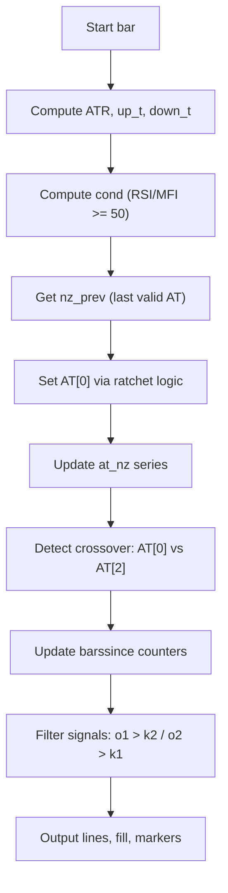

# AlphaTrend (Indie Port) - Technical Guide

> ATR-based adaptive trend line with MFI/RSI momentum filter and buy/sell signals.

| | |
| --- | --- |
| **Language** | Indie Script v5 |
| **Platform** | [TakeProfit](https://takeprofit.com) |
| **Category** | Trend |
| **Type** | Indicator |
| **Author** | @insurgent on TakeProfit |
| **Original** | Ported from TradingView Pine Script by KivancOzbilgic (MPL 2.0) |
| **License** | MPL-2.0 (see the header of the source file) |
| **Live script** | [Open on TakeProfit](https://takeprofit.com/indicator/alphatrend-indie-port-22) |
| **Source file** | [AlphaTrend (Indie Port).indie5](AlphaTrend%20(Indie%20Port).indie5) |

## Overview

AlphaTrend is a trend-following indicator that dynamically adjusts to market volatility using ATR. It computes an upper and lower bound around price, then applies a ratcheting mechanism to produce a single trend line that only moves in the direction of the prevailing trend. A momentum filter (MFI or RSI when volume is unavailable) determines the trend direction.

The indicator plots two lines: the current AlphaTrend value and its value from two bars ago, with a colored fill between them to show trend strength. Buy and sell markers appear when the trend line crosses over its two-bar-old value, with a duplicate-signal filter that prevents consecutive signals without a reversal. It is designed for trend confirmation and reversal detection on any timeframe.

## How it works

1. Compute ATR (SMA-based) over the common period and multiply by the multiplier to get dynamic bands.
2. Calculate up_t = low - ATR * coeff and down_t = high + ATR * coeff.
3. Determine trend direction using RSI (or MFI if volume data is available) >= 50.
4. Set AlphaTrend: in bullish mode, use the higher of previous value and up_t; in bearish mode, use the lower of previous value and down_t.
5. Propagate the last valid AlphaTrend value through NaN gaps (nz emulation).
6. Detect crossover/crossunder of current AlphaTrend vs its value two bars ago to generate raw buy/sell signals.
7. Filter signals using barssince counters: only show a buy if the previous buy occurred before the last sell (and vice versa).
8. Plot the current AlphaTrend line, the two-bar-old line, a fill between them, and markers at the two-bar-old level.

## Mathematical model

The AlphaTrend value is computed as:
$$
\text{ATR} = \text{SMA}(\text{TR}, \text{period})
$$
$$
\text{up\_t} = \text{low} - \text{ATR} \cdot \text{coeff}
$$
$$
\text{down\_t} = \text{high} + \text{ATR} \cdot \text{coeff}
$$
$$
\text{cond} = \begin{cases}
\text{RSI}(\text{src}, \text{period}) \geq 50 & \text{if no\_volume\_data} \\
\text{MFI}(\text{hlc3}, \text{period}) \geq 50 & \text{otherwise}
\end{cases}
$$
$$
\text{AT}[0] = \begin{cases}
\text{nz\_prev} & \text{if cond and up\_t} < \text{nz\_prev} \\
\text{up\_t} & \text{if cond and up\_t} \geq \text{nz\_prev} \\
\text{nz\_prev} & \text{if not cond and down\_t} > \text{nz\_prev} \\
\text{down\_t} & \text{if not cond and down\_t} \leq \text{nz\_prev}
\end{cases}
$$

## Logic flow



## Parameters

| Parameter | Type | Default | Range | Description |
| --- | --- | --- | --- | --- |
| `coeff` | float | 1.0 | ≥ 0.1 | Multiplier |
| `period` | int | 14 | ≥ 1 | Common Period |
| `src` | source | source.CLOSE |  | Source |
| `show_signals` | bool | true |  | Show Signals? |
| `no_volume_data` | bool | false |  | Change calculation (no volume data)? |

## Code walkthrough

### ATR and Trend Bounds

Lines 34-36 of [AlphaTrend (Indie Port).indie5](AlphaTrend%20(Indie%20Port).indie5):

```python
        atr = Atr.new(period, ma_algorithm='SMA')[0]
        up_t = self.low[0] - atr * coeff
        down_t = self.high[0] + atr * coeff
```

The ATR is computed using the SMA algorithm over the common period. The lower bound (up_t) is placed below the low, and the upper bound (down_t) above the high, scaled by the multiplier. These bounds define the dynamic channel that the trend line will follow.

### Trend Condition with RSI/MFI

Lines 38-39 of [AlphaTrend (Indie Port).indie5](AlphaTrend%20(Indie%20Port).indie5):

```python
        # Trend condition: RSI or MFI >= 50
        cond = Rsi.new(src, period)[0] >= 50 if no_volume_data else Mfi.new(self.hlc3, period)[0] >= 50
```

The trend direction is determined by whether the RSI (or MFI when volume is available) is above or equal to 50. This acts as a momentum filter: when the oscillator is bullish (>=50), the indicator uses up_t; otherwise it uses down_t.

### AlphaTrend Ratchet Logic

Lines 45-48 of [AlphaTrend (Indie Port).indie5](AlphaTrend%20(Indie%20Port).indie5):

```python
        # AlphaTrend calculation
        # Bullish: upT < prev ? prev : upT (ratchet up)
        # Bearish: downT > prev ? prev : downT (ratchet down)
        at[0] = (nz_prev if up_t < nz_prev else up_t) if cond else (nz_prev if down_t > nz_prev else down_t)
```

The core calculation implements a ratchet mechanism. In bullish mode, the new value is the maximum of the previous value and up_t, preventing the line from falling. In bearish mode, it is the minimum of the previous value and down_t, preventing the line from rising. This creates a smooth trend line that only moves in the direction of the trend.

### NaN Propagation (nz Emulation)

Lines 50-51 of [AlphaTrend (Indie Port).indie5](AlphaTrend%20(Indie%20Port).indie5):

```python
        # Update nz series with current value
        at_nz[0] = at[0] if not isnan(at[0]) else at_nz[1]
```

The at_nz series stores the last valid AlphaTrend value, mimicking Pine Script's nz() function. If the current value is NaN, it carries forward the previous valid value. This ensures the crossover detection and plotting have continuous data even when the calculation produces NaN (e.g., on the first bars).

### Crossover Detection

Lines 74-76 of [AlphaTrend (Indie Port).indie5](AlphaTrend%20(Indie%20Port).indie5):

```python
        if not isnan(at2_nz) and not isnan(at3_nz):
            is_buy = at0 > at2_nz and at1_nz <= at3_nz
            is_sell = at0 < at2_nz and at1_nz >= at3_nz
```

A buy signal is generated when the current AlphaTrend crosses above its value from two bars ago, and the previous bar's value was not above the three-bar-old value. This is a simplified crossover detection that requires four valid bars of data. The same logic applies for sell signals with the opposite condition.

### Duplicate Signal Filter

Lines 95-98 of [AlphaTrend (Indie Port).indie5](AlphaTrend%20(Indie%20Port).indie5):

```python
        # Signal filter: prevents duplicate signals without reversal
        # BUY requires previous buy further back than last sell
        show_buy = is_buy and show_signals and (not isnan(o1)) and (not isnan(k2)) and (o1 > k2)
        show_sell = is_sell and show_signals and (not isnan(o2)) and (not isnan(k1)) and (o2 > k1)
```

To avoid repeated signals without a trend reversal, the indicator compares barssince counters. A buy is only shown if the last buy signal (o1) occurred before the last sell signal (k2), meaning a sell must have happened in between. This ensures alternating buy/sell signals.

## Reading the chart

- **Cyan line (k1)**: Current AlphaTrend value. It moves up during bullish trends and down during bearish trends.
- **Orange line (k2)**: AlphaTrend value from two bars ago. The distance between k1 and k2 indicates trend momentum.
- **Fill color**: Cyan fill when k1 > k2 (bullish momentum), orange fill when k1 < k2 (bearish momentum). The fill uses the two-bar-old comparison for stability.
- **Blue 'BUY' marker**: Appears at the k2 level when a bullish crossover is detected and the duplicate signal filter passes.
- **Orange 'SELL' marker**: Appears at the k2 level when a bearish crossunder is detected and the filter passes.
- Markers are placed slightly offset (0.9999x / 1.0001x) to avoid overlapping the line.

## Implementation notes

- The indicator requires at least 4 bars of data to generate signals due to the crossover detection using at_nz[2] and at_nz[3].
- NaN values are propagated using a custom nz emulation (at_nz series) that carries forward the last valid value, not zero.
- The duplicate signal filter uses barssince counters that reset on each signal, preventing consecutive buy or sell markers without an intervening opposite signal.
- When no_volume_data is true, the indicator uses RSI instead of MFI, making it suitable for tickers without volume information.

## FAQ

**What does the 'Multiplier' parameter do?**

The multiplier scales the ATR value used to compute the upper and lower bounds. A higher multiplier makes the trend line less sensitive to price movements, while a lower multiplier makes it react more quickly.

**How does the indicator handle volume data?**

By default, the indicator uses MFI (Money Flow Index) which requires volume. If the 'Change calculation (no volume data)?' checkbox is enabled, it switches to RSI, which only needs price data.

**Why do I sometimes see no signals for many bars?**

Signals only appear when the AlphaTrend line crosses its two-bar-old value and the duplicate filter condition is met. In strong trends, the line may not cross for extended periods, and the filter prevents repeated signals without a reversal.

## Full source code

Indie Script v5, as published on TakeProfit. Copy it into the platform's script editor or [open the live script](https://takeprofit.com/indicator/alphatrend-indie-port-22).

```python
# indie:lang_version = 5
# =============================================================================
# AlphaTrend Indicator
# Ported from TradingView Pine Script by KivancOzbilgic (MPL 2.0)
# Alerts not ported (8 conditions in original)
# =============================================================================

from math import nan, isnan
from indie import indicator, param, plot, MainContext, color, MutSeriesF, source
from indie.algorithms import Atr, Rsi, Mfi

@indicator('AT', overlay_main_pane=True)
@param.float('coeff', default=1.0, title='Multiplier', min=0.1, step=0.1)
@param.int('period', default=14, title='Common Period', min=1)
@param.source('src', default=source.CLOSE, title='Source')
@param.bool('show_signals', default=True, title='Show Signals?')
@param.bool('no_volume_data', default=False, title='Change calculation (no volume data)?')
@plot.line('k1', color=color.rgba(0, 200, 220), line_width=3)
@plot.line('k2', color=color.rgba(255, 140, 0), line_width=3)
@plot.fill('k1', 'k2', id='fill')
@plot.marker('buy_marker', style=plot.marker_style.LABEL, position=plot.marker_position.CENTER, color=color.rgba(0, 180, 255))
@plot.marker('sell_marker', style=plot.marker_style.LABEL, position=plot.marker_position.CENTER, color=color.rgba(255, 100, 0))
class Main(MainContext):
    def calc(self, coeff, period, src, show_signals, no_volume_data):
        # Series state
        at = MutSeriesF.new(nan, size=4)
        at_nz = MutSeriesF.new(nan, size=4)  # nz() emulation: last valid value
        bs_buy = MutSeriesF.new(nan)
        bs_sell = MutSeriesF.new(nan)
        bs_buy_prev = MutSeriesF.new(nan)
        bs_sell_prev = MutSeriesF.new(nan)
        
        # ATR and trend bounds
        atr = Atr.new(period, ma_algorithm='SMA')[0]
        up_t = self.low[0] - atr * coeff
        down_t = self.high[0] + atr * coeff
        
        # Trend condition: RSI or MFI >= 50
        cond = Rsi.new(src, period)[0] >= 50 if no_volume_data else Mfi.new(self.hlc3, period)[0] >= 50
        
        # nz(AlphaTrend[1]) - returns last valid value, not 0.0
        # Pine nz() propagates last known value through nan gaps
        nz_prev = at_nz[1] if not isnan(at_nz[1]) else 0.0
        
        # AlphaTrend calculation
        # Bullish: upT < prev ? prev : upT (ratchet up)
        # Bearish: downT > prev ? prev : downT (ratchet down)
        at[0] = (nz_prev if up_t < nz_prev else up_t) if cond else (nz_prev if down_t > nz_prev else down_t)
        
        # Update nz series with current value
        at_nz[0] = at[0] if not isnan(at[0]) else at_nz[1]
        
        # Historical values for crossover detection
        at0 = at[0]
        at1_nz = at_nz[1] if not isnan(at_nz[1]) else nan
        at2_nz = at_nz[2] if not isnan(at_nz[2]) else nan
        at3_nz = at_nz[3] if not isnan(at_nz[3]) else nan
        
        # Fill color using stabilized series
        bull_color = color.rgba(0, 200, 220, 0.3)
        bear_color = color.rgba(255, 120, 50, 0.3)
        
        fill_c = bull_color if (not isnan(at0) and not isnan(at2_nz) and at0 > at2_nz) else (
            bear_color if (not isnan(at0) and not isnan(at2_nz) and at0 < at2_nz) else (
                bull_color if (not isnan(at1_nz) and not isnan(at3_nz) and at1_nz > at3_nz) else bear_color
            )
        )
        
        # Crossover/crossunder - requires 4 valid bars
        # Pine ta.crossover returns false if any value is na
        is_buy = False
        is_sell = False
        
        if not isnan(at2_nz) and not isnan(at3_nz):
            is_buy = at0 > at2_nz and at1_nz <= at3_nz
            is_sell = at0 < at2_nz and at1_nz >= at3_nz
        
        # barssince counters
        bs_buy[0] = 0.0 if is_buy else (bs_buy[1] + 1.0 if not isnan(bs_buy[1]) else nan)
        bs_sell[0] = 0.0 if is_sell else (bs_sell[1] + 1.0 if not isnan(bs_sell[1]) else nan)
        
        k1 = bs_buy[0]
        k2 = bs_sell[0]
        
        # barssince(signal[1]) - separate counters for previous bar signals
        buy_prev = not isnan(bs_buy[1]) and bs_buy[1] == 0.0
        sell_prev = not isnan(bs_sell[1]) and bs_sell[1] == 0.0
        
        bs_buy_prev[0] = 0.0 if buy_prev else (bs_buy_prev[1] + 1.0 if not isnan(bs_buy_prev[1]) else nan)
        bs_sell_prev[0] = 0.0 if sell_prev else (bs_sell_prev[1] + 1.0 if not isnan(bs_sell_prev[1]) else nan)
        
        o1 = bs_buy_prev[0]
        o2 = bs_sell_prev[0]
        
        # Signal filter: prevents duplicate signals without reversal
        # BUY requires previous buy further back than last sell
        show_buy = is_buy and show_signals and (not isnan(o1)) and (not isnan(k2)) and (o1 > k2)
        show_sell = is_sell and show_signals and (not isnan(o2)) and (not isnan(k1)) and (o2 > k1)
        
        # Marker position: absolute Y at AlphaTrend[2] level
        buy_val = at2_nz * 0.9999 if (show_buy and not isnan(at2_nz)) else nan
        sell_val = at2_nz * 1.0001 if (show_sell and not isnan(at2_nz)) else nan
        
        # Output: k1=AlphaTrend, k2=AlphaTrend[2], fill, markers
        return (
            plot.Line(at0),
            plot.Line(at2_nz),
            plot.Fill(fill_c),
            plot.Marker(buy_val, text='BUY'),
            plot.Marker(sell_val, text='SELL')
        )
```
