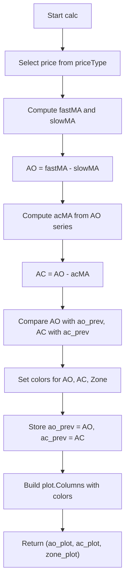

# Awesome / Accelerator / Zone Oscillator - Technical Guide

> Computes Awesome Oscillator, Accelerator Oscillator, and a Zone histogram with color-coded momentum.

| | |
| --- | --- |
| **Language** | Indie Script v5 |
| **Platform** | [TakeProfit](https://takeprofit.com) |
| **Category** | Oscillators |
| **Type** | Indicator |
| **Author** | @insurgent on TakeProfit |
| **License** | MIT |
| **Live script** | [Open on TakeProfit](https://takeprofit.com/indicator/awesome-accelerator-zone-oscillator-38) |
| **Source file** | [Awesome - Accelerator - Zone Oscillator.indie5](Awesome%20-%20Accelerator%20-%20Zone%20Oscillator.indie5) |

## Overview

This indicator combines three related oscillators in a single pane: the Awesome Oscillator (AO), the Accelerator Oscillator (AC), and a Zone histogram. The AO measures the difference between a fast and a slow moving average of price. The AC measures the difference between the AO and its own moving average, representing acceleration. The Zone histogram colors the AO bars based on the joint direction of AO and AC, highlighting periods of accelerating momentum (green), decelerating momentum (red), or neutral (gray).

The indicator is designed to identify changes in momentum and potential trend reversals. The AO shows the basic momentum, the AC shows whether that momentum is accelerating or decelerating, and the Zone provides a quick visual summary of the overall state. It is commonly used in conjunction with other tools for trend-following or mean-reversion strategies.

## How it works

1. Select the price series based on the chosen price type (e.g., hl2, close).
2. Compute the fast and slow moving averages of the price series using the selected MA type.
3. Calculate the Awesome Oscillator (AO) as the difference between the fast and slow MA.
4. Compute a moving average of the AO series using the AC length and same MA type.
5. Calculate the Accelerator Oscillator (AC) as the difference between AO and its moving average.
6. Determine colors for AO, AC, and Zone based on whether each value increased or decreased from the previous bar.
7. Store the current AO and AC values for comparison on the next bar.
8. Return three column plots (AO, AC, Zone) with the computed colors, hiding any that are toggled off.

## Mathematical model

$$
\text{AO} = \text{MA}_{\text{fast}}(\text{price}) - \text{MA}_{\text{slow}}(\text{price})
$$
$$
\text{AC} = \text{AO} - \text{MA}_{\text{ac}}(\text{AO})
$$

## Logic flow



## Parameters

| Parameter | Type | Default | Range | Description |
| --- | --- | --- | --- | --- |
| `hideAwesome` | bool | false |  | Hide AO |
| `hideAccelerator` | bool | false |  | Hide AC |
| `hideZone` | bool | true |  | Hide Zone Histogram |
| `fastLength` | int | 5 | ≥ 1 | Fast MA Length |
| `slowLength` | int | 34 | ≥ 1 | Slow MA Length |
| `acLength` | int | 5 | ≥ 1 | AC MA Length |

## Code walkthrough

### Price Selection

Lines 28-44 of [Awesome - Accelerator - Zone Oscillator.indie5](Awesome%20-%20Accelerator%20-%20Zone%20Oscillator.indie5):

```python
        price = 0.0
        if priceType == 'close':
            price = self.close[0]
        elif priceType == 'hl2':
            price = self.hl2[0]
        elif priceType == 'hlc3':
            price = self.hlc3[0]
        elif priceType == 'ohlc4':
            price = self.ohlc4[0]
        elif priceType == 'lhcc4':
            price = (self.low[0] + self.high[0] + self.close[0] + self.close[0]) / 4
        elif priceType == 'open':
            price = self.open[0]
        elif priceType == 'high':
            price = self.high[0]
        else:  # 'low'
            price = self.low[0]
```

The price used for calculations is chosen from a set of common OHLC combinations. The `lhcc4` option is a custom variant that averages low, high, and close twice, giving extra weight to the close. This selection is done once per bar and stored in the `price` variable.

### AO and AC Calculation

Lines 46-55 of [Awesome - Accelerator - Zone Oscillator.indie5](Awesome%20-%20Accelerator%20-%20Zone%20Oscillator.indie5):

```python
        # AO calculation
        price_series = MutSeriesF.new(price)
        fastMA = Ma.new(price_series, fastLength, maType)[0]
        slowMA = Ma.new(price_series, slowLength, maType)[0]
        ao = fastMA - slowMA
        
        # AC calculation
        ao_series = MutSeriesF.new(ao)
        acMA = Ma.new(ao_series, acLength, maType)[0]
        ac = ao - acMA
```

The AO is the difference between a fast and slow moving average of the price series. The AC is the difference between the AO and its own moving average. Both use the same MA type (SMA, EMA, etc.) but different lengths. The `MutSeriesF.new()` creates a series from the current scalar value so that `Ma.new()` can compute a moving average over it.

### Color Logic

Lines 57-71 of [Awesome - Accelerator - Zone Oscillator.indie5](Awesome%20-%20Accelerator%20-%20Zone%20Oscillator.indie5):

```python
        # Красивые цвета как в TradingView
        # AO colors - cyan/navy (светлый/темный синий)
        aoColor = color.rgba(0, 230, 255) if ao > self.ao_prev.get() else color.rgba(0, 50, 150)
        
        # AC colors - magenta/purple (яркий розовый/фиолетовый)
        acColor = color.rgba(255, 0, 255) if ac > self.ac_prev.get() else color.rgba(150, 0, 150)
        
        # Zone colors - green/red/gray (зеленый/красный/серый)
        zoneColor = color.GRAY
        if ao > self.ao_prev.get() and ac > self.ac_prev.get():
            zoneColor = color.rgba(0, 200, 100)  # Яркий зеленый
        elif ao < self.ao_prev.get() and ac < self.ac_prev.get():
            zoneColor = color.rgba(255, 50, 100)  # Яркий красный
        else:
            zoneColor = color.rgba(120, 120, 140)  # Серый
```

Colors are assigned based on whether the current value is greater or less than the previous bar's value. AO uses cyan/navy, AC uses magenta/purple. The Zone histogram uses green when both AO and AC are increasing, red when both are decreasing, and gray otherwise. This mimics the classic TradingView color scheme.

### Plot Hiding and Return

Lines 78-82 of [Awesome - Accelerator - Zone Oscillator.indie5](Awesome%20-%20Accelerator%20-%20Zone%20Oscillator.indie5):

```python
        ao_plot = plot.Columns(0, color=color.TRANSPARENT) if hideAwesome else plot.Columns(ao, color=aoColor)
        ac_plot = plot.Columns(0, color=color.TRANSPARENT) if hideAccelerator else plot.Columns(ac, color=acColor)
        zone_plot = plot.Columns(0, color=color.TRANSPARENT) if hideZone else plot.Columns(ao, color=zoneColor)
        
        return ao_plot, ac_plot, zone_plot
```

Each of the three plots can be hidden via parameters. When hidden, a column with value 0 and transparent color is returned, effectively drawing nothing. The function returns a tuple of three `plot.Columns` objects, which are rendered as separate histograms in the indicator pane.

## Reading the chart

- **Awesome Oscillator (AO)**: Cyan columns indicate AO is higher than the previous bar (upward momentum); navy columns indicate AO is lower (downward momentum).
- **Accelerator Oscillator (AC)**: Magenta columns indicate AC is higher than the previous bar (acceleration increasing); purple columns indicate AC is lower (acceleration decreasing).
- **Zone Histogram**: Green columns appear when both AO and AC are rising (strong bullish momentum); red columns when both are falling (strong bearish momentum); gray columns when they are moving in opposite directions (neutral or mixed momentum).
- The three histograms are stacked in the same pane, allowing easy comparison of momentum, acceleration, and the overall zone state.

## Implementation notes

- The indicator uses `MutSeriesF.new()` to create a series from a scalar value, which is necessary because `Ma.new()` expects a series input. This means only the current bar's value is used for the moving average calculation, not a historical series.
- State is maintained between bars via `self.ao_prev` and `self.ac_prev`, which are created by `self.new_var(0.0)`. The first bar's comparison will be against 0, which may produce unexpected colors until enough bars have passed.
- The `lhcc4` price type is a non-standard calculation: (low + high + close + close) / 4, effectively weighting the close double. This is not a typical OHLC average and may behave differently from standard price types.
- When a plot is hidden, a `plot.Columns` with value 0 and `color.TRANSPARENT` is returned. This ensures the plot area remains allocated but nothing is drawn.

## FAQ

**How can I change the colors of the AO, AC, or Zone histograms?**

The colors are hardcoded in the `calc` method. To customize them, modify the `color.rgba()` calls in lines 59, 62, and 67-71. You can also use named colors from the `color` module.

**What moving average types are available and how do they affect the indicator?**

The `maType` parameter supports SMA, EMA, RMA, WMA, and VWMA. SMA gives equal weight to all bars, EMA gives more weight to recent bars, RMA is a smoothed EMA, WMA is weighted by position, and VWMA weights by volume. The choice affects the smoothness and responsiveness of both AO and AC.

**Why does the Zone histogram default to hidden?**

The `hideZone` parameter defaults to `True` to reduce visual clutter, as the Zone histogram is derived from the AO and AC and may be redundant for some users. You can set it to `False` in the indicator settings to display it.

## Full source code

Indie Script v5, as published on TakeProfit. Copy it into the platform's script editor or [open the live script](https://takeprofit.com/indicator/awesome-accelerator-zone-oscillator-38).

```python
# indie:lang_version = 5
from indie import indicator, param, plot, color, MutSeriesF, Var, MainContext
from indie.algorithms import Ma

@indicator('Awesome / Accelerator / Accelerator', overlay_main_pane=False)
@param.bool('hideAwesome', default=False, title='Hide AO')
@param.bool('hideAccelerator', default=False, title='Hide AC')
@param.bool('hideZone', default=True, title='Hide Zone Histogram')
@param.str('maType', default='SMA', title='Moving Average Type',
           options=['SMA', 'EMA', 'RMA', 'WMA', 'VWMA'])
@param.int('fastLength', default=5, min=1, title='Fast MA Length')
@param.int('slowLength', default=34, min=1, title='Slow MA Length')
@param.int('acLength', default=5, min=1, title='AC MA Length')
@param.str('priceType', default='hl2', title='Price Type',
           options=['close', 'hl2', 'hlc3', 'ohlc4', 'lhcc4', 'open', 'high', 'low'])
@plot.columns(title='AO')
@plot.columns(title='AC')
@plot.columns(title='Zone')
class Main(MainContext):
    def __init__(self):
        self.ao_prev = self.new_var(0.0)
        self.ac_prev = self.new_var(0.0)
    
    def calc(self, hideAwesome, hideAccelerator, hideZone,
             maType, fastLength, slowLength, acLength, priceType):
        
        # Price selection
        price = 0.0
        if priceType == 'close':
            price = self.close[0]
        elif priceType == 'hl2':
            price = self.hl2[0]
        elif priceType == 'hlc3':
            price = self.hlc3[0]
        elif priceType == 'ohlc4':
            price = self.ohlc4[0]
        elif priceType == 'lhcc4':
            price = (self.low[0] + self.high[0] + self.close[0] + self.close[0]) / 4
        elif priceType == 'open':
            price = self.open[0]
        elif priceType == 'high':
            price = self.high[0]
        else:  # 'low'
            price = self.low[0]
        
        # AO calculation
        price_series = MutSeriesF.new(price)
        fastMA = Ma.new(price_series, fastLength, maType)[0]
        slowMA = Ma.new(price_series, slowLength, maType)[0]
        ao = fastMA - slowMA
        
        # AC calculation
        ao_series = MutSeriesF.new(ao)
        acMA = Ma.new(ao_series, acLength, maType)[0]
        ac = ao - acMA
        
        # Красивые цвета как в TradingView
        # AO colors - cyan/navy (светлый/темный синий)
        aoColor = color.rgba(0, 230, 255) if ao > self.ao_prev.get() else color.rgba(0, 50, 150)
        
        # AC colors - magenta/purple (яркий розовый/фиолетовый)
        acColor = color.rgba(255, 0, 255) if ac > self.ac_prev.get() else color.rgba(150, 0, 150)
        
        # Zone colors - green/red/gray (зеленый/красный/серый)
        zoneColor = color.GRAY
        if ao > self.ao_prev.get() and ac > self.ac_prev.get():
            zoneColor = color.rgba(0, 200, 100)  # Яркий зеленый
        elif ao < self.ao_prev.get() and ac < self.ac_prev.get():
            zoneColor = color.rgba(255, 50, 100)  # Яркий красный
        else:
            zoneColor = color.rgba(120, 120, 140)  # Серый
        
        # Store current values for next iteration
        self.ao_prev.set(ao)
        self.ac_prev.set(ac)
        
        # Plots
        ao_plot = plot.Columns(0, color=color.TRANSPARENT) if hideAwesome else plot.Columns(ao, color=aoColor)
        ac_plot = plot.Columns(0, color=color.TRANSPARENT) if hideAccelerator else plot.Columns(ac, color=acColor)
        zone_plot = plot.Columns(0, color=color.TRANSPARENT) if hideZone else plot.Columns(ao, color=zoneColor)
        
        return ao_plot, ac_plot, zone_plot
```
