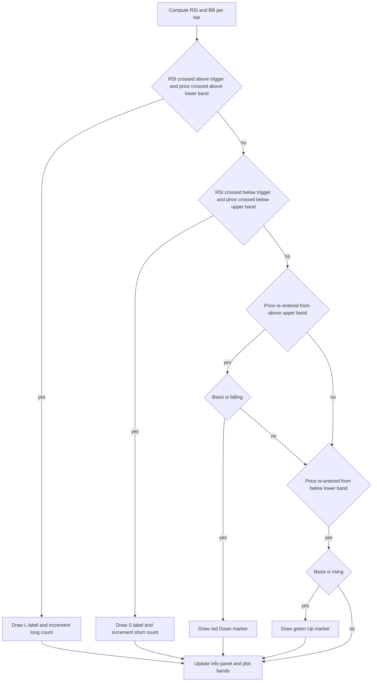

# BB + RSI Double Cross Strategy - Technical Guide

> Computes Bollinger Bands and RSI, plots L/S signals when RSI crosses the trigger while price crosses a band edge, and draws trend markers.

| | |
| --- | --- |
| **Language** | Indie Script v5 |
| **Platform** | [TakeProfit](https://takeprofit.com) |
| **Category** | Oscillators |
| **Type** | Indicator |
| **Author** | @insurgent on TakeProfit |
| **Original** | Based on ChartArt's strategy concept (v1.1) |
| **License** | MIT |
| **Live script** | [Open on TakeProfit](https://takeprofit.com/indicator/bb-rsi-double-cross-strategy-8) |
| **Source file** | [BB + RSI Double Cross Strategy.indie5](BB%20+%20RSI%20Double%20Cross%20Strategy.indie5) |

## Overview

An overlay indicator that draws Bollinger Bands with a filled zone and marks mean-reversion signals when RSI and price confirm each other. It is intended for setups where price reaches a band extreme and RSI starts to turn through its trigger level.

On every bar, the script computes RSI and Bollinger Bands and draws `L` labels at the lower band when RSI crosses above the trigger while price crosses above the lower band. It draws `S` labels at the upper band when RSI crosses below the trigger while price crosses below the upper band. Optional trend markers appear when price re-enters the bands and the basis line is moving in the same direction.

## How it works

1. Computes `Rsi.new(self.close, rsi_length)` and `Bb.new(self.close, bb_length, bb_mult)`; reading `[0]` gives the current bar value and `[1]` the previous bar.
2. Long signal: `cross_over(vrsi, float(rsi_level))` and `cross_over(self.close, bb_lower)` are both true on the same bar.
3. Short signal: `cross_under(vrsi, float(rsi_level))` and `cross_under(self.close, bb_upper)` are both true on the same bar.
4. Trend red: previous close was above the upper band and current close is below it while `bb_basis[0] < bb_basis[1]`.
5. Trend green: previous close was at the lower band and current close is above it while `bb_basis[0] > bb_basis[1]`.
6. If `show_signals` is on, draws `L` at `bb_lower[0]` or `S` at `bb_upper[0]` and increments `long_count` / `short_count`.
7. If `show_trend_marks` is on, draws `Down` at `high[0]` or `Up` at `low[0]` for the corresponding marker.
8. Returns the current lower, basis, and upper values plus `plot.Fill()` to complete the plotted band and fill.

## Mathematical model

$$
b_t = \frac{1}{n}\sum_{i=0}^{n-1} c_{t-i}
$$
$$
u_t = b_t + m\,\sigma_t,\quad l_t = b_t - m\,\sigma_t,\quad \sigma_t = \sqrt{\frac{1}{n}\sum_{i=0}^{n-1}\left(c_{t-i} - b_t\right)^2}
$$
$$
RSI_t = 100 - \frac{100}{1 + RS_t},\quad RS_t = \frac{SMA(\max(c_t - c_{t-1},0),n)}{SMA(\max(c_{t-1} - c_t,0),n)}
$$

## Logic flow



## Parameters

| Parameter | Type | Default | Range | Description |
| --- | --- | --- | --- | --- |
| `rsi_length` | int | 6 | ≥ 1 | RSI Period |
| `bb_length` | int | 200 | ≥ 1 | BB Period |
| `bb_mult` | float | 2.0 | 0.001 - 50.0 | BB StdDev |
| `rsi_level` | int | 50 | 0 - 100 | RSI Trigger Level |
| `show_signals` | bool | true |  | Show Signal Labels |
| `show_trend_marks` | bool | true |  | Show Trend Markers |

## Code walkthrough

### Indicator declaration and plot setup

Lines 30-40 of [BB + RSI Double Cross Strategy.indie5](BB%20+%20RSI%20Double%20Cross%20Strategy.indie5):

```python
@indicator('BB + RSI Double Strategy', overlay_main_pane=True)
@param.int('rsi_length', default=6, min=1, title='RSI Period')
@param.int('bb_length', default=200, min=1, title='BB Period')
@param.float('bb_mult', default=2.0, min=0.001, max=50.0, title='BB StdDev')
@param.int('rsi_level', default=50, min=0, max=100, title='RSI Trigger Level')
@param.bool('show_signals', default=True, title='Show Signal Labels')
@param.bool('show_trend_marks', default=True, title='Show Trend Markers')
@plot.line('lower', color=color.SILVER, title='BB Lower')
@plot.line('basis', color=color.AQUA, title='BB Basis')
@plot.line('upper', color=color.SILVER, title='BB Upper')
@plot.fill('lower', 'upper', color=color.SILVER(0.1), title='BB Zone')
```

The decorators define the indicator name, main-pane overlay, user-facing parameters, and the three plotted series. `@plot.fill('lower', 'upper', ...)` creates the translucent zone between the lower and upper bands.

### State and info label

Lines 42-51 of [BB + RSI Double Cross Strategy.indie5](BB%20+%20RSI%20Double%20Cross%20Strategy.indie5):

```python
    def __init__(self):
        self.long_count = 0
        self.short_count = 0
        self.info_label = LabelRel(
            "",
            RelativePosition(va.TOP, ha.RIGHT, 0.02, 0.98),
            font_size=11,
            text_color=color.WHITE,
            bg_color=color.rgba(30, 30, 60, 0.9)
        )
```

`long_count` and `short_count` are instance fields, so they survive across bars. The info label is a `LabelRel` anchored to the top-right corner and redrawn every bar.

### Signal computation

Lines 55-66 of [BB + RSI Double Cross Strategy.indie5](BB%20+%20RSI%20Double%20Cross%20Strategy.indie5):

```python
        vrsi = Rsi.new(self.close, rsi_length)
        bb_lower, bb_basis, bb_upper = Bb.new(self.close, bb_length, bb_mult)
        
        # LONG: RSI crosses above level AND price crosses above lower BB
        rsi_cross_up = cross_over(vrsi, float(rsi_level))
        price_cross_up_lower = cross_over(self.close, bb_lower)
        long_signal = rsi_cross_up and price_cross_up_lower
        
        # SHORT: RSI crosses below level AND price crosses below upper BB
        rsi_cross_down = cross_under(vrsi, float(rsi_level))
        price_cross_down_upper = cross_under(self.close, bb_upper)
        short_signal = rsi_cross_down and price_cross_down_upper
```

`Rsi.new` and `Bb.new` return series; `[0]` is the current bar and `[1]` is the previous bar. `cross_over` / `cross_under` compare the latest bar with the previous one. Both legs of the long and short conditions must be true on the same bar.

### Trend marker conditions

Lines 68-70 of [BB + RSI Double Cross Strategy.indie5](BB%20+%20RSI%20Double%20Cross%20Strategy.indie5):

```python
        # Trend color conditions
        trend_red = (self.close[1] > bb_upper[1] and self.close[0] < bb_upper[0]) and (bb_basis[0] < bb_basis[1])
        trend_green = (self.close[1] < bb_lower[1] and self.close[0] > bb_lower[0]) and (bb_basis[0] > bb_basis[1])
```

A red marker needs the close to fall back inside the upper band while the basis is declining. A green marker needs the close to rise back inside the lower band while the basis is rising.

### Drawing signal labels

Lines 72-94 of [BB + RSI Double Cross Strategy.indie5](BB%20+%20RSI%20Double%20Cross%20Strategy.indie5):

```python
        # Draw signal labels
        if show_signals:
            if long_signal:
                self.long_count += 1
                self.chart.draw(LabelAbs(
                    "L",
                    AbsolutePosition(self.time[0], bb_lower[0]),
                    font_size=12,
                    text_color=color.WHITE,
                    bg_color=color.GREEN,
                    callout_position=cp.TOP_RIGHT
                ))
            
            if short_signal:
                self.short_count += 1
                self.chart.draw(LabelAbs(
                    "S",
                    AbsolutePosition(self.time[0], bb_upper[0]),
                    font_size=12,
                    text_color=color.WHITE,
                    bg_color=color.RED,
                    callout_position=cp.BOTTOM_RIGHT
                ))
```

Labels are placed at the band price that triggered the signal. Long labels are green with white text and short labels are red, with callout positions pointing to the relevant band.

### Info panel and return values

Lines 117-133 of [BB + RSI Double Cross Strategy.indie5](BB%20+%20RSI%20Double%20Cross%20Strategy.indie5):

```python
        # Update info panel
        info_text = "BB + RSI Strategy"
        info_text += "\n─────────────"
        info_text += "\nRSI(" + str(rsi_length) + "): " + str(round(vrsi[0], 1))
        info_text += "\nBB(" + str(bb_length) + "): " + str(round(bb_basis[0], 2))
        info_text += "\n─────────────"
        info_text += "\nLONG: " + str(self.long_count)
        info_text += "\nSHORT: " + str(self.short_count)
        
        self.info_label.text = info_text
        self.chart.draw(self.info_label)
        
        return (
            bb_lower[0],
            bb_basis[0],
            bb_upper[0],
            plot.Fill()
```

The info panel is a single `LabelRel` whose text is replaced every bar. The tuple returned from `calc` supplies the current values of the three bands plus an empty fill marker for the decorated plot.

## Reading the chart

- The silver lines are the lower and upper Bollinger Bands; the aqua line is the SMA basis. The translucent silver fill visually marks the band zone.
- A white `L` on a green label at the lower band means the long signal fired on that bar. A white `S` on a red label at the upper band means the short signal fired.
- A red `Down` label at the high appears when price closes back below the upper band while the basis is falling.
- A green `Up` label at the low appears when price closes back above the lower band while the basis is rising.
- The top-right panel shows the current RSI value, the current BB basis, and the cumulative number of `L` and `S` labels drawn.

## Implementation notes

- `long_count` and `short_count` are initialized once in `__init__`, so they count every signal drawn across the life of the indicator.
- Signal and trend labels are only drawn when the corresponding boolean parameters are enabled; the calculations still run every bar.
- The info panel uses one `LabelRel` object whose text is updated and redrawn on each bar, so only the latest values are visible.
- Band plots return `[0]` values from `calc`, so the chart receives one scalar per series per bar.

## FAQ

**What do the L and S labels represent?**

`L` means the long signal condition fired: RSI crossed above the trigger level and price crossed above the lower band. `S` means the short signal condition fired: RSI crossed below the trigger and price crossed below the upper band.

**Does this code open or close trades?**

No. It only computes signals and draws labels and an info panel. There is no order execution or position management in the source.

**How can I make the signals react faster or slower?**

Lowering `rsi_length` makes RSI more responsive; raising `bb_length` or `bb_mult` makes the bands wider so triggers happen less often. The exact effect depends on the chart timeframe and the market.

## Full source code

Indie Script v5, as published on TakeProfit. Copy it into the platform's script editor or [open the live script](https://takeprofit.com/indicator/bb-rsi-double-cross-strategy-8).

```python
# indie:lang_version = 5
#
# Bollinger Bands + RSI Double Cross Strategy Indicator
# Based on ChartArt's strategy concept (v1.1)
#
# This indicator combines RSI momentum with Bollinger Bands volatility to identify
# high-probability reversal points. Signals are generated only when BOTH conditions
# align simultaneously, filtering out false signals common in single-indicator systems.
#
# SIGNAL LOGIC:
# - LONG:  RSI crosses ABOVE 50 AND Price crosses ABOVE lower BB (bullish reversal)
# - SHORT: RSI crosses BELOW 50 AND Price crosses BELOW upper BB (bearish reversal)
#
# The strategy targets mean-reversion setups where price has reached BB extremes
# and RSI confirms momentum shift through the 50 centerline.
#
# TREND COLOR MARKERS:
# - Red (Down ▼):  Price re-enters from above upper BB while basis is declining
# - Green (Up ▲): Price re-enters from below lower BB while basis is rising
#
from indie import indicator, param, color, plot, MainContext
from indie.algorithms import Rsi, Bb
from indie.math import cross_over, cross_under
from indie.drawings import (
    LabelAbs, LabelRel, AbsolutePosition, RelativePosition,
    vertical_anchor as va, horizontal_anchor as ha, callout_position as cp
)


@indicator('BB + RSI Double Strategy', overlay_main_pane=True)
@param.int('rsi_length', default=6, min=1, title='RSI Period')
@param.int('bb_length', default=200, min=1, title='BB Period')
@param.float('bb_mult', default=2.0, min=0.001, max=50.0, title='BB StdDev')
@param.int('rsi_level', default=50, min=0, max=100, title='RSI Trigger Level')
@param.bool('show_signals', default=True, title='Show Signal Labels')
@param.bool('show_trend_marks', default=True, title='Show Trend Markers')
@plot.line('lower', color=color.SILVER, title='BB Lower')
@plot.line('basis', color=color.AQUA, title='BB Basis')
@plot.line('upper', color=color.SILVER, title='BB Upper')
@plot.fill('lower', 'upper', color=color.SILVER(0.1), title='BB Zone')
class Main(MainContext):
    def __init__(self):
        self.long_count = 0
        self.short_count = 0
        self.info_label = LabelRel(
            "",
            RelativePosition(va.TOP, ha.RIGHT, 0.02, 0.98),
            font_size=11,
            text_color=color.WHITE,
            bg_color=color.rgba(30, 30, 60, 0.9)
        )

    def calc(self, rsi_length, bb_length, bb_mult, rsi_level, show_signals, show_trend_marks):
        # Calculate indicators
        vrsi = Rsi.new(self.close, rsi_length)
        bb_lower, bb_basis, bb_upper = Bb.new(self.close, bb_length, bb_mult)
        
        # LONG: RSI crosses above level AND price crosses above lower BB
        rsi_cross_up = cross_over(vrsi, float(rsi_level))
        price_cross_up_lower = cross_over(self.close, bb_lower)
        long_signal = rsi_cross_up and price_cross_up_lower
        
        # SHORT: RSI crosses below level AND price crosses below upper BB
        rsi_cross_down = cross_under(vrsi, float(rsi_level))
        price_cross_down_upper = cross_under(self.close, bb_upper)
        short_signal = rsi_cross_down and price_cross_down_upper
        
        # Trend color conditions
        trend_red = (self.close[1] > bb_upper[1] and self.close[0] < bb_upper[0]) and (bb_basis[0] < bb_basis[1])
        trend_green = (self.close[1] < bb_lower[1] and self.close[0] > bb_lower[0]) and (bb_basis[0] > bb_basis[1])
        
        # Draw signal labels
        if show_signals:
            if long_signal:
                self.long_count += 1
                self.chart.draw(LabelAbs(
                    "L",
                    AbsolutePosition(self.time[0], bb_lower[0]),
                    font_size=12,
                    text_color=color.WHITE,
                    bg_color=color.GREEN,
                    callout_position=cp.TOP_RIGHT
                ))
            
            if short_signal:
                self.short_count += 1
                self.chart.draw(LabelAbs(
                    "S",
                    AbsolutePosition(self.time[0], bb_upper[0]),
                    font_size=12,
                    text_color=color.WHITE,
                    bg_color=color.RED,
                    callout_position=cp.BOTTOM_RIGHT
                ))
        
        # Draw trend markers
        if show_trend_marks:
            if trend_red:
                self.chart.draw(LabelAbs(
                    "Down",
                    AbsolutePosition(self.time[0], self.high[0]),
                    font_size=12,
                    text_color=color.RED,
                    bg_color=color.rgba(0, 0, 0, 0),
                    callout_position=cp.BOTTOM_RIGHT
                ))
            elif trend_green:
                self.chart.draw(LabelAbs(
                    "Up",
                    AbsolutePosition(self.time[0], self.low[0]),
                    font_size=12,
                    text_color=color.GREEN,
                    bg_color=color.rgba(0, 0, 0, 0),
                    callout_position=cp.TOP_RIGHT
                ))
        
        # Update info panel
        info_text = "BB + RSI Strategy"
        info_text += "\n─────────────"
        info_text += "\nRSI(" + str(rsi_length) + "): " + str(round(vrsi[0], 1))
        info_text += "\nBB(" + str(bb_length) + "): " + str(round(bb_basis[0], 2))
        info_text += "\n─────────────"
        info_text += "\nLONG: " + str(self.long_count)
        info_text += "\nSHORT: " + str(self.short_count)
        
        self.info_label.text = info_text
        self.chart.draw(self.info_label)
        
        return (
            bb_lower[0],
            bb_basis[0],
            bb_upper[0],
            plot.Fill()
        )
```
