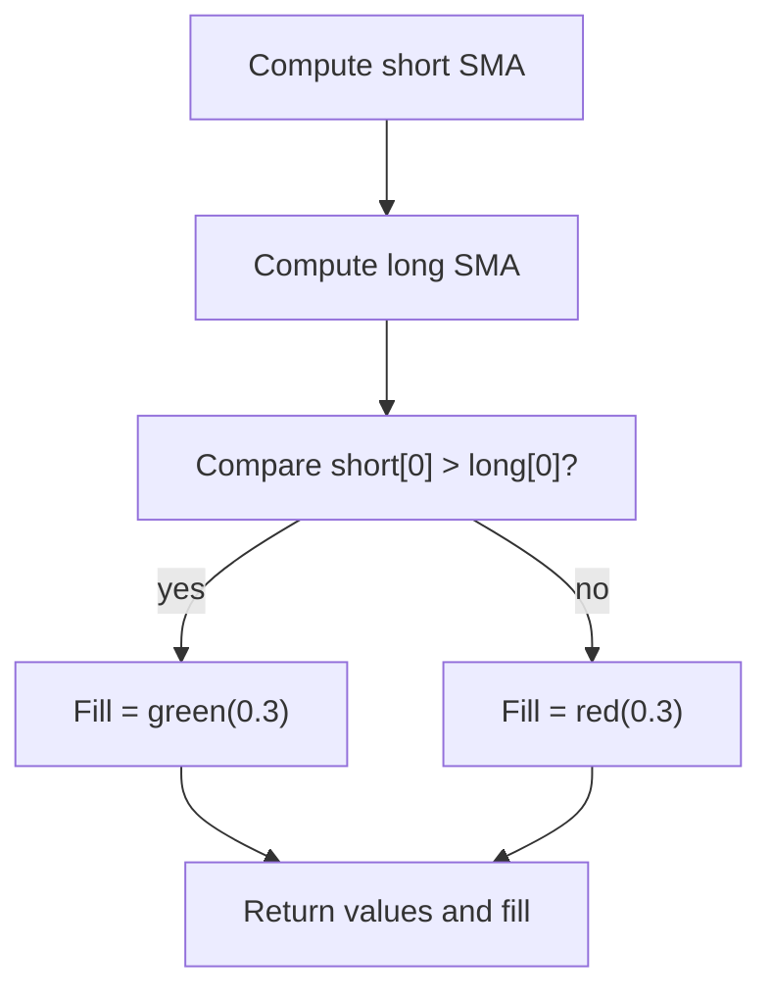

# Band Trend Indicator - Technical Guide

> Plots two SMAs (short and long) with a colored fill between them to indicate trend direction.

| | |
| --- | --- |
| **Language** | Indie Script v5 |
| **Platform** | [TakeProfit](https://takeprofit.com) |
| **Category** | Moving averages |
| **Type** | Indicator |
| **Author** | @mustermann84 on TakeProfit |
| **License** | MIT |
| **Live script** | [Open on TakeProfit](https://takeprofit.com/indicator/band-trend-indicator-87) |
| **Source file** | [Band Trend Indicator.indie5](Band%20Trend%20Indicator.indie5) |

## Overview

This indicator displays two simple moving averages (SMA) of the close price: a short-term (default 20) and a long-term (default 50). The area between these two lines is filled with a transparent color – green when the short SMA is above the long SMA, red when it is below. This visual band helps traders quickly assess the current trend direction.

The indicator is designed to be used as a standalone trend filter or combined with other indicators such as RSI or candlestick patterns for entry signals. It overlays directly on the main price chart and updates on every bar.

## How it works

1. Computes the short SMA of the close price using the `short_length` parameter (default 20).
2. Computes the long SMA of the close price using the `long_length` parameter (default 50).
3. Compares the current values of the two SMAs (index [0]).
4. Sets the fill color to green (alpha 0.3) if short SMA > long SMA, otherwise red (alpha 0.3).
5. Returns the long SMA value, the short SMA value, and a Fill object with the chosen color.
6. The fill is drawn between the two SMA lines on the chart.

## Mathematical model

The indicator uses the standard Simple Moving Average (SMA):

$$
\text{SMA}_n = \frac{1}{n} \sum_{i=0}^{n-1} \text{close}_{-i}
$$

where $n$ is either `long_length` or `short_length`. The fill color is determined by comparing the current values:

$$
\text{color} = \begin{cases} \text{green}(0.3) & \text{if } \text{SMA}_{short}[0] > \text{SMA}_{long}[0] \\ \text{red}(0.3) & \text{otherwise} \end{cases}
$$

## Logic flow



## Parameters

| Parameter | Type | Default | Range | Description |
| --- | --- | --- | --- | --- |
| `long_length` | int | 50 |  |  |
| `short_length` | int | 20 |  |  |

## Code walkthrough

### Indicator definition and parameters

Lines 5-11 of [Band Trend Indicator.indie5](Band%20Trend%20Indicator.indie5):

```python
@indicator('Farbwechsel-Band-Indikator', overlay_main_pane=True)
@param.int('long_length', default=50)
@param.int('short_length', default=20)
@plot.line('long_sma')
@plot.line('short_sma')
@plot.fill('long_sma', 'short_sma', id='#fill_2')
def Main(self, long_length, short_length):
```

The `@indicator` decorator sets the display name to 'Farbwechsel-Band-Indikator' and marks it as an overlay on the main chart pane. Two integer parameters (`long_length`, `short_length`) are defined with default values 50 and 20, which control the SMA periods.

### SMA computation and fill color logic

Lines 12-17 of [Band Trend Indicator.indie5](Band%20Trend%20Indicator.indie5):

```python
    long_sma = Sma.new(self.close, long_length)
    short_sma = Sma.new(self.close, short_length)

    band_color = color.GREEN(0.3) if short_sma[0] > long_sma[0] else color.RED(0.3)

    return long_sma[0], short_sma[0], plot.Fill(color=band_color)
```

Inside `Main`, two SMA series are created using `Sma.new(self.close, length)`. The current bar's SMA values are accessed via index `[0]`. The fill color is determined by comparing these two values: green when the short SMA is above the long SMA, red otherwise. The alpha channel is set to 0.3 for transparency. The function returns the two SMA values and a `plot.Fill` object that instructs the chart to fill the area between the two SMA lines with the chosen color.

## Reading the chart

* Two moving average lines are drawn on the chart: the short SMA (default 20 periods) and the long SMA (default 50 periods).
* The area between these two lines is filled with a semi-transparent color:
  - **Green fill** indicates the short SMA is above the long SMA, suggesting an uptrend.
  - **Red fill** indicates the short SMA is below the long SMA, suggesting a downtrend.
* The intensity of the fill is controlled by an alpha value of 0.3, making it subtle so underlying price action remains visible.
* The indicator is intended to be used as a trend filter; the direction of the cross between the two SMAs can be used as a potential trend change signal.

## Implementation notes

- The indicator uses `Sma.new` which returns a series; accessing `[0]` gives the value for the current (most recent) bar.
- The fill transparency is hardcoded to 0.3 (30% opacity) and cannot be adjusted from the settings UI without modifying the source code.
- Both SMAs are computed on the close price of the current chart's timeframe; there is no multi-timeframe logic.
- No repainting occurs since SMAs are based on historical data and are stable once a bar closes (standard non-repainting behavior).

## FAQ

**Can I change the SMA periods after adding the indicator?**

Yes, the `long_length` and `short_length` parameters are exposed in the indicator settings UI (via the `@param.int` decorators), so you can adjust them without modifying the code.

**Does this indicator repaint on historical bars?**

No, standard SMAs are deterministic and do not change once a bar closes. The fill color updates only on new bars.

**How can I use this indicator for entry signals?**

The most common use is to watch for the fill color change: green to red suggests a downtrend (short SMA crossing below long SMA), and red to green suggests an uptrend (short SMA crossing above long SMA). Combine with other tools like RSI or candlestick patterns for confirmation.

## Full source code

Indie Script v5, as published on TakeProfit. Copy it into the platform's script editor or [open the live script](https://takeprofit.com/indicator/band-trend-indicator-87).

```python
# indie:lang_version = 5
from indie import indicator, plot, color, param
from indie.algorithms import Sma

@indicator('Farbwechsel-Band-Indikator', overlay_main_pane=True)
@param.int('long_length', default=50)
@param.int('short_length', default=20)
@plot.line('long_sma')
@plot.line('short_sma')
@plot.fill('long_sma', 'short_sma', id='#fill_2')
def Main(self, long_length, short_length):
    long_sma = Sma.new(self.close, long_length)
    short_sma = Sma.new(self.close, short_length)

    band_color = color.GREEN(0.3) if short_sma[0] > long_sma[0] else color.RED(0.3)

    return long_sma[0], short_sma[0], plot.Fill(color=band_color)
```
