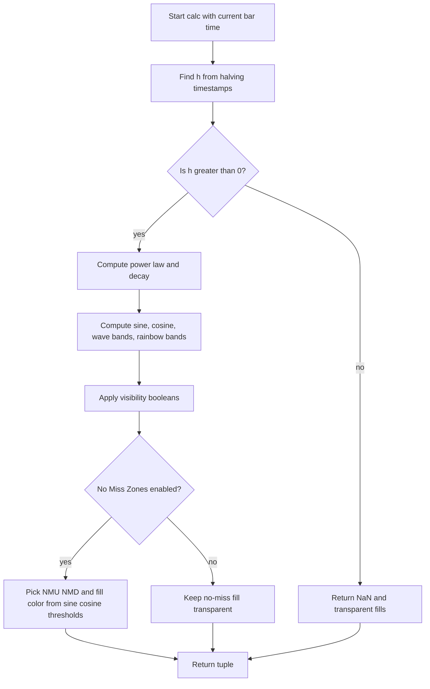

# Bitcoin Sine Wave Power Law Model - Technical Guide

> Overlays BTC price with a log-scale power-law trend, rainbow limit bands, and a sinusoidal halving-cycle wave with optional no-miss zones.

| | |
| --- | --- |
| **Language** | Indie Script v5 |
| **Platform** | [TakeProfit](https://takeprofit.com) |
| **Category** | Trend |
| **Type** | Indicator |
| **Author** | @everbane on TakeProfit |
| **License** | [MPL-2.0](https://mozilla.org/MPL/2.0/) (derivative work) |
| **Live script** | [Open on TakeProfit](https://takeprofit.com/indicator/bitcoin-sine-wave-power-law-model-53) |
| **Source file** | [Bitcoin Sine Wave Power Law Model.indie5](Bitcoin%20Sine%20Wave%20Power%20Law%20Model.indie5) |

## Overview

Based on the "Bitcoin Rainbow Wave" indicator by leoum on Tradingview, this overlay draws a long-term power-law model for Bitcoin on a log-scale chart. It uses only time, not price, to place a central power-law trend, rainbow limit bands around it, and a secondary sinusoidal wave tied to the halving cycle.

The rainbow bands are exponentially spaced by a decay factor, while the wave bands are offset around the same power-law center using the sine of the cycle phase. The script includes optional colored fills for rainbow fair-value zones, wave fair-value zones, and phase-dependent no-miss zones. The halving/fib vertical line code is commented out and not drawn.

## How it works

1. Read self.time[0] and convert it to milliseconds.
2. Find the halving-cycle index h by locating the current time among hardcoded timestamps H0116...H425 and interpolating with the stored durations.
3. Compute the power-law center P = 10^(a + b*log10(h)) and the band decay D = 0.79^(h+1).
4. Build the rainbow bands as B_k = P * 10^(k*D/3) for k from -3 to 5.
5. Build the wave bands from sin(2*pi*h - h^-1.4) and cos(2*pi*h - h^-1.4), adding offsets 0, ±5/12, and ±5/6.
6. Apply the miner profitability floor by replacing the lower wave terms with max(-1.0, sine - offset).
7. Apply visibility booleans: disabled lines become math.nan, and disabled fills become transparent colors.
8. If s36 is enabled and h > 0.37, choose the NMU/NMD boundaries and no-miss fill color from sine/cosine thresholds.

## Mathematical model

$$
h = h_n + \frac{t - T_n}{D_n}
$$

where \(T_n\) is a hardcoded anchor timestamp and \(D_n\) is the duration per unit of \(h\).

$$
P(h) = 10^{\,a + b \log_{10} h}, \quad a=1.47,\ b=5.38
$$

$$
D(h) = 0.79^{\,h+1}
$$

Rainbow bands:

$$
B_k(h) = P(h) \cdot 10^{\,k D(h)/3}, \quad k=-3,-2,-1,0,1,2,3,4,5
$$

Wave bands:

$$
S(h) = \sin(2\pi h - h^{-1.4}), \quad C(h) = \cos(2\pi h - h^{-1.4})
$$

$$
W_c(h) = P(h) \cdot 10^{\,D(h)(S(h)+c)}, \quad c \in \left\{0,\ \pm \tfrac{5}{12},\ \pm \tfrac{5}{6}\right\}
$$

With the miner floor:

$$
W_{\text{lower},c}(h) = P(h) \cdot 10^{\,D(h)\max(-1,\ S(h)+c)}
$$

## Logic flow



## Parameters

| Parameter | Type | Default | Range | Description |
| --- | --- | --- | --- | --- |
| `s11` | bool | true |  | Power Law Line |
| `s12` | bool | true |  | Power Law Limit Bands |
| `s14` | bool | true |  | Rainbow lines |
| `s13` | bool | false |  | Rainbow Fair Value |
| `s21` | bool | true |  | Sine Wave Line |
| `s22` | bool | true |  | Sine Wave Limit Bands |
| `s23` | bool | true |  | Sine Wave Fair Value |
| `s25` | bool | true |  | Miners profitability floor |
| `s36` | bool | false |  | Show No Miss Zones |

## Code walkthrough

### Halving timestamp anchors

Lines 81-99 of [Bitcoin Sine Wave Power Law Model.indie5](Bitcoin%20Sine%20Wave%20Power%20Law%20Model.indie5):

```python
        self.H0116 = 1254760888000.0
        self.H025 = 1271938534000.0
        self.H050 = 1296211307000.0
        self.H075 = 1323880077000.0
        self.H100 = 1354119878000.0
        self.H125 = 1381296502000.0
        self.H150 = 1407726365000.0
        self.H175 = 1438184738000.0
        self.H200 = 1468104373000.0
        self.H225 = 1498203831000.0
        self.H250 = 1527632682000.0
        self.H275 = 1558661861000.0
        self.H300 = 1589232223000.0
        self.H325 = 1620444011000.0
        self.H350 = 1651753413000.0
        self.H375 = 1682787978000.0
        self.H400 = 1713578967000.0
        self.H425 = 1744743372000.0
        self.halving_dur_after_h0116 = (self.H025 - self.H0116) / (0.25 - 0.116)
```

These hardcoded millisecond timestamps define the halving-cycle anchors. The first interval derives a duration from the 0.116 anchor up to the 0.25 anchor; later durations are multiplied by 4 to convert quarter-cycle deltas into full cycle deltas.

### Computing the current cycle index

Lines 158-180 of [Bitcoin Sine Wave Power Law Model.indie5](Bitcoin%20Sine%20Wave%20Power%20Law%20Model.indie5):

```python
        h = 0.0
        if current_time_ms >= self.H425:
            h = 4.25 + (current_time_ms - self.H425) / self.halving_dur_after_h425
        elif current_time_ms >= self.H400:
            h = 4.00 + (current_time_ms - self.H400) / self.halving_dur_after_h400
        elif current_time_ms >= self.H375:
            h = 3.75 + (current_time_ms - self.H375) / self.halving_dur_after_h375
        elif current_time_ms >= self.H350:
            h = 3.50 + (current_time_ms - self.H350) / self.halving_dur_after_h350
        elif current_time_ms >= self.H325:
            h = 3.25 + (current_time_ms - self.H325) / self.halving_dur_after_h325
        elif current_time_ms >= self.H300:
            h = 3.00 + (current_time_ms - self.H300) / self.halving_dur_after_h300
        elif current_time_ms >= self.H275:
            h = 2.75 + (current_time_ms - self.H275) / self.halving_dur_after_h275
        elif current_time_ms >= self.H250:
            h = 2.50 + (current_time_ms - self.H250) / self.halving_dur_after_h250
        elif current_time_ms >= self.H225:
            h = 2.25 + (current_time_ms - self.H225) / self.halving_dur_after_h225
        elif current_time_ms >= self.H200:
            h = 2.00 + (current_time_ms - self.H200) / self.halving_dur_after_h200
        elif current_time_ms >= self.H175:
            h = 1.75 + (current_time_ms - self.H175) / self.halving_dur_after_h175
```

The current bar time is converted from seconds to milliseconds and compared against the anchors from newest to oldest. Each branch linearly interpolates h, so h is continuous. The chain continues down to the oldest H0116 anchor in the else branch.

### Power-law center and wave math

Lines 210-231 of [Bitcoin Sine Wave Power Law Model.indie5](Bitcoin%20Sine%20Wave%20Power%20Law%20Model.indie5):

```python
            BTC_t = math.pow(10, self.a + self.b * math.log10(h))
            decay = math.pow(self.decay_base, h + 1)
            decay_div_3 = decay / 3.0
            
            phase = math.pow(h, -1.4)
            sine_component = math.sin(2 * math.pi * h - phase)
            cos_component = math.cos(2 * math.pi * h - phase)
            
            wave_upper2 = BTC_t * math.pow(10, decay * (sine_component + self.FIVE_SIXTHS))
            wave_upper_mid = BTC_t * math.pow(10, decay * (sine_component + self.FIVE_TWELFTHS))
            wave_middle = BTC_t * math.pow(10, decay * sine_component)
            wave_lower_mid = BTC_t * math.pow(10, decay * (sine_component - self.FIVE_TWELFTHS))
            wave_lower2 = BTC_t * math.pow(10, decay * (sine_component - self.FIVE_SIXTHS))
            
            wave_lower_mid_c = BTC_t * math.pow(10, decay * max(-1.0, sine_component - self.FIVE_TWELFTHS))
            wave_lower2_c = BTC_t * math.pow(10, decay * max(-1.0, sine_component - self.FIVE_SIXTHS))

            tVal_3 = BTC_t * math.pow(10, -3.0 * decay_div_3)
            tVal_2 = BTC_t * math.pow(10, -2.0 * decay_div_3)
            tVal_1 = BTC_t * math.pow(10, -1.0 * decay_div_3)
            tVal0 = BTC_t
            tVal1 = BTC_t * math.pow(10, 1.0 * decay_div_3)
```

The power-law center BTC_t is a pure function of h. decay = 0.79^(h+1) sets the band spacing, and decay_div_3 spreads the rainbow bands evenly in log space. The wave uses a sine with a phase lag of h^-1.4; lower variants use max(-1.0) for the miner floor.

### Visibility and fill decisions

Lines 237-260 of [Bitcoin Sine Wave Power Law Model.indie5](Bitcoin%20Sine%20Wave%20Power%20Law%20Model.indie5):

```python
            plot_t_3 = tVal_3 if self.s12 else math.nan
            plot_t_2 = tVal_2 if self.s13 or self.s14 else math.nan
            plot_t_1 = tVal_1 if self.s13 or self.s14 else math.nan
            plot_t0 = tVal0 if self.s11 else math.nan
            plot_t1 = tVal1 if self.s13 or self.s14 else math.nan
            plot_t2 = tVal2 if self.s13 or self.s14 else math.nan
            plot_t3 = tVal3 if self.s14 else math.nan
            plot_t4 = tVal4 if self.s14 else math.nan
            plot_t5 = tVal5 if self.s12 else math.nan
            
            plot_wave_middle = wave_middle if self.s21 else math.nan
            plot_wave_upper = wave_upper2 if self.s22 else math.nan
            plot_wave_upper_mid = wave_upper_mid if self.s23 else math.nan
            
            plot_wave_lower_mid = wave_lower_mid_c if self.s25 else wave_lower_mid
            if not self.s23:
                plot_wave_lower_mid = math.nan
                
            plot_wave_lower = wave_lower2_c if self.s25 else wave_lower2
            if not self.s22:
                plot_wave_lower = math.nan

            rainbow_fill_color_1 = color.BLUE(0.2) if self.s13 else color.rgba(0, 0, 0, 0)
            rainbow_fill_color_2 = color.GREEN(0.2) if self.s13 else color.rgba(0, 0, 0, 0)
```

Each plot value is set to math.nan when its controlling input is disabled, hiding that line. Rainbow fill color variables are set based on the fair-value option, and later used to create the fill objects. The same pattern is used for wave and no-miss fills later.

### No-miss zone boundary selection

Lines 284-305 of [Bitcoin Sine Wave Power Law Model.indie5](Bitcoin%20Sine%20Wave%20Power%20Law%20Model.indie5):

```python
            if self.s36:
                if sine_component > -0.33333 and sine_component < self.ONE_TWELFTH and cos_component < 0:
                    NMU = tVal_1
                elif sine_component > 0.5 and cos_component < 0.55:
                    NMU = wave_upper2
                elif sine_component > 0.49 and cos_component < 0.57:
                    NMU = wave_upper_mid
                else:
                    NMU = wave_middle

                if sine_component > -0.25 and sine_component < self.ONE_TWELFTH and cos_component < 0:
                    NMD = wave_lower_mid
                elif sine_component > -0.66667 and sine_component < -0.25 and cos_component < 0:
                    NMD = tVal_2
                elif sine_component > 0 and sine_component < self.FIVE_TWELFTHS and cos_component > 0:
                    NMD = tVal0
                elif sine_component > self.FIVE_TWELFTHS and sine_component < 0.75 and cos_component > 0:
                    NMD = wave_lower_mid
                elif sine_component > 0.49 and cos_component < 0.57:
                    NMD = wave_upper_mid
                else:
                    NMD = wave_middle
```

When s36 is active, NMU and NMD are assigned from different model bands depending on sine and cosine ranges. These invisible series become the upper and lower edges of the no-miss fill. If s36 is off, the values stay NaN and the fill remains transparent.

## Reading the chart

- The thick yellow `power_law` line is the model center. Price above it sits above the power-law fit; price below it sits below it.
- The `band_*` lines are concentric rainbow bands. `band_minus_3` and `band_plus_5` are the outer limit bands controlled by `Power Law Limit Bands`.
- The fuchsia `wave_middle`, maroon `wave_upper`, aqua `wave_lower`, orange `wave_upper_mid`, and green `wave_lower_mid` form the sinusoidal channel.
- `rainbow_fill_*` appear only when `Rainbow Fair Value` is enabled, coloring the spaces between the inner rainbow bands.
- `wave_fill_*` appear only when `Sine Wave Fair Value` is enabled, filling the areas between `wave_lower_mid`/`wave_middle` and `wave_upper_mid`/`wave_middle`.
- With `Show No Miss Zones` enabled and h > 0.37, the fill between the invisible `NMU` and `NMD` lines is green when cos < -0.75 and sin < 1/3, yellow when cos > 0.6, and red otherwise.

## Implementation notes

- calc() does not read price; the model is a pure function of bar time and constants.
- When a visibility input is off, the corresponding series is math.nan, and the fill colors are transparent rgba(0,0,0,0).
- The commented-out s31/s32 blocks show that halving vertical lines and fib labels are not active in this version.
- NMUe and NMDe are never assigned, so the nmz_fill_e pair is always empty.

## FAQ

**Can this indicator be used on charts other than BTCUSD?**

The script does not check the chart symbol, but the coefficients and halving timestamps are hardcoded for Bitcoin. It will draw the same time-based model on any symbol.

**What does the "Miners profitability floor" input change?**

It switches the lower wave bands to clamped versions: wave_lower_mid is clamped with max(-1.0, sine - 5/12) and wave_lower with max(-1.0, sine - 5/6). This keeps the lower wave bands from going below a fixed exponential floor.

**Why are no halving vertical lines or fib labels visible?**

The s31 and s32 inputs are commented out, along with all LineSegment/LabelAbs drawing code. In this version only the plotted lines and fills are active.

## License and attribution

This Indie script is a derivative work of **Bitcoin Rainbow Wave by leoum** on TradingView. This is a port of an open-source TradingView script whose header we could not retrieve; TradingView applies MPL-2.0 by default to open-source scripts, so that license is assumed. A modified version of MPL-2.0 code must stay under [MPL-2.0](https://mozilla.org/MPL/2.0/), so this file is distributed under that license (the notice is appended to the end of the source file). The original author keeps the credit for the algorithm; this page is not affiliated with or endorsed by them.

## Full source code

Indie Script v5, as published on TakeProfit. Copy it into the platform's script editor or [open the live script](https://takeprofit.com/indicator/bitcoin-sine-wave-power-law-model-53).

```python
# indie:lang_version = 5
# TODO: fix error caused by disabling of halving/fib lines
from indie import indicator, param, MainContext, plot, color
from indie.color import rgba
from indie.drawings import LineSegment, LabelAbs, AbsolutePosition
import math

# --- INDICATOR AND DECORATORS ---
@indicator('Bitcoin Rainbow Wave', overlay_main_pane=True)
@plot.line(id='band_minus_3', title='PL Band -3', color=rgba(100, 0, 251, 1.0), line_width=2)
@plot.line(id='band_minus_2', title='PL Band -2', color=color.BLUE, line_width=1)
@plot.line(id='band_minus_1', title='PL Band -1', color=color.GREEN, line_width=1)
@plot.line(id='power_law', title='Power Law Trend', color=color.YELLOW, line_width=3)
@plot.line(id='band_plus_1', title='PL Band +1', color=color.GREEN, line_width=1)
@plot.line(id='band_plus_2', title='PL Band +2', color=color.YELLOW, line_width=1)
@plot.line(id='band_plus_3', title='PL Band +3', color=rgba(255, 165, 0, 1.0), line_width=1)
@plot.line(id='band_plus_4', title='PL Band +4', color=rgba(255, 165, 0, 1.0), line_width=1)
@plot.line(id='band_plus_5', title='PL Band +5', color=color.RED, line_width=2)
@plot.line(id='wave_middle', title='Wave Middle', color=color.FUCHSIA, line_width=1)
@plot.line(id='wave_upper', title='Wave Upper Band', color=color.MAROON, line_width=2)
@plot.line(id='wave_lower', title='Wave Lower Band', color=color.AQUA, line_width=2)
@plot.line(id='wave_upper_mid', title='Wave Upper Mid', color=rgba(255, 165, 0, 1.0), line_width=1)
@plot.line(id='wave_lower_mid', title='Wave Lower Mid', color=color.GREEN, line_width=1)
@plot.fill('band_minus_1', 'band_minus_2', id='rainbow_fill_1')
@plot.fill('power_law', 'band_minus_1', id='rainbow_fill_2')
@plot.fill('band_plus_1', 'power_law', id='rainbow_fill_3')
@plot.fill('band_plus_2', 'band_plus_1', id='rainbow_fill_4')
@plot.fill('wave_lower_mid', 'wave_middle', id='wave_fill_1')
@plot.fill('wave_upper_mid', 'wave_middle', id='wave_fill_2')
@plot.line(id='nmu', title='NMU', color=color.rgba(0,0,0,0))
@plot.line(id='nmd', title='NMD', color=color.rgba(0,0,0,0))
@plot.line(id='nmue', title='NMUe', color=color.rgba(0,0,0,0))
@plot.line(id='nmde', title='NMDe', color=color.rgba(0,0,0,0))
@plot.fill('nmu', 'nmd', id='nmz_fill')
@plot.fill('nmue', 'nmde', id='nmz_fill_e')

# --- INPUTS ---
@param.bool('s11', title='Power Law Line', default=True)
@param.bool('s12', title='Power Law Limit Bands', default=True)
@param.bool('s14', title='Rainbow lines', default=True)
@param.bool('s13', title='Rainbow Fair Value', default=False)
@param.bool('s21', title='Sine Wave Line', default=True)
@param.bool('s22', title='Sine Wave Limit Bands', default=True)
@param.bool('s23', title='Sine Wave Fair Value', default=True)
@param.bool('s25', title='Miners profitability floor', default=True)
# --- COMMENTED OUT ---
# @param.bool('s31', title='Show Halvings and time fibs', default=True)
# @param.bool('s32', title='Show 25%,50%,75% of Halvings', default=True)
# --- END COMMENT ---
@param.bool('s36', title='Show No Miss Zones', default=False)


class Main(MainContext):
    # FIX: Removed s31 and s32 from the signature
    def __init__(self, s11, s12, s13, s14, s21, s22, s23, s25, s36):
        self.s11 = s11
        self.s12 = s12
        self.s13 = s13
        self.s14 = s14
        self.s21 = s21
        self.s22 = s22
        self.s23 = s23
        self.s25 = s25
        # --- COMMENTED OUT ---
        # self.s31 = s31
        # self.s32 = s32
        # self.prev_s31 = s31
        # self.prev_s32 = s32
        # --- END COMMENT ---
        self.s36 = s36
        
        self.is_first_calc = True
        
        self.a = 1.47
        self.b = 5.38
        self.decay_base = 0.79
        self.width = 0.7
        self.FIVE_SIXTHS = 5.0 / 6.0
        self.FIVE_TWELFTHS = 5.0 / 12.0
        self.ONE_TWELFTH = 1.0 / 12.0
        self.H0116 = 1254760888000.0
        self.H025 = 1271938534000.0
        self.H050 = 1296211307000.0
        self.H075 = 1323880077000.0
        self.H100 = 1354119878000.0
        self.H125 = 1381296502000.0
        self.H150 = 1407726365000.0
        self.H175 = 1438184738000.0
        self.H200 = 1468104373000.0
        self.H225 = 1498203831000.0
        self.H250 = 1527632682000.0
        self.H275 = 1558661861000.0
        self.H300 = 1589232223000.0
        self.H325 = 1620444011000.0
        self.H350 = 1651753413000.0
        self.H375 = 1682787978000.0
        self.H400 = 1713578967000.0
        self.H425 = 1744743372000.0
        self.halving_dur_after_h0116 = (self.H025 - self.H0116) / (0.25 - 0.116)
        self.halving_dur_after_h025 = (self.H050 - self.H025) * 4
        self.halving_dur_after_h050 = (self.H075 - self.H050) * 4
        self.halving_dur_after_h075 = (self.H100 - self.H075) * 4
        self.halving_dur_after_h100 = (self.H125 - self.H100) * 4
        self.halving_dur_after_h125 = (self.H150 - self.H125) * 4
        self.halving_dur_after_h150 = (self.H175 - self.H150) * 4
        self.halving_dur_after_h175 = (self.H200 - self.H175) * 4
        self.halving_dur_after_h200 = (self.H225 - self.H200) * 4
        self.halving_dur_after_h225 = (self.H250 - self.H225) * 4
        self.halving_dur_after_h250 = (self.H275 - self.H250) * 4
        self.halving_dur_after_h275 = (self.H300 - self.H275) * 4
        self.halving_dur_after_h300 = (self.H325 - self.H300) * 4
        self.halving_dur_after_h325 = (self.H350 - self.H325) * 4
        self.halving_dur_after_h350 = (self.H375 - self.H350) * 4
        self.halving_dur_after_h375 = (self.H400 - self.H375) * 4
        self.halving_dur_after_h400 = (self.H425 - self.H400) * 4
        self.halving_dur_after_h425 = (self.H425 - self.H325)

        # --- COMMENTED OUT ---
        # self.halving_lines: list[LineSegment] = []
        # self.halving_labels: list[LabelAbs] = []
        # self.halving_is_dashed: list[bool] = []
        
        # H0382 = int(0.472*self.H025 + 0.528*self.H050)
        # H0618 = int(0.472*self.H075 + 0.528*self.H050)
        # H1382 = int(0.472*self.H125 + 0.528*self.H150)
        # H1618 = int(0.472*self.H175 + 0.528*self.H150)
        # H2382 = int(0.472*self.H225 + 0.528*self.H250)
        # H2618 = int(0.472*self.H275 + 0.528*self.H250)
        # H3382 = int(0.472*self.H325 + 0.528*self.H350)
        # H3618 = int(0.472*self.H375 + 0.528*self.H350)

        # line_x_coords = [self.H025, H0382, self.H050, H0618, self.H075, self.H100, self.H125, H1382, self.H150, H1618, self.H175, self.H200, self.H225, H2382, self.H250, H2618, self.H275, self.H300, self.H325, H3382, self.H350, H3618, self.H375, self.H400, self.H425]
        # line_h_values = [0.25, 0.382, 0.50, 0.618, 0.75, 1.00, 1.25, 1.382, 1.50, 1.618, 1.75, 2.00, 2.25, 2.382, 2.50, 2.618, 2.75, 3.00, 3.25, 3.382, 3.50, 3.618, 3.75, 4.00, 4.25]
        # is_dashed_list = [True, True, True, True, True, False, True, True, True, True, True, False, True, True, True, True, True, False, True, True, True, True, True, False, True]
        
        # for i in range(len(line_x_coords)):
        #     h_val = line_h_values[i]
        #     x_coord = line_x_coords[i] / 1000.0
            
        #     decay = math.pow(self.decay_base, h_val + 1)
        #     log_power = self.a + self.b * math.log10(h_val)
            
        #     y1 = math.pow(10, log_power - decay)
        #     y2 = math.pow(10, log_power + (5.0/3.0) * decay)

        #     line = LineSegment(AbsolutePosition(x_coord, y1), AbsolutePosition(x_coord, y2))
        #     label = LabelAbs(text="H " + str(h_val), position=AbsolutePosition(x_coord, y1))
            
        #     self.halving_lines.append(line)
        #     self.halving_labels.append(label)
        #     self.halving_is_dashed.append(is_dashed_list[i])
        # --- END COMMENT ---

    def calc(self):
        # ... (all calculations and plotting logic remains the same)
        current_time_ms = self.time[0] * 1000
        
        h = 0.0
        if current_time_ms >= self.H425:
            h = 4.25 + (current_time_ms - self.H425) / self.halving_dur_after_h425
        elif current_time_ms >= self.H400:
            h = 4.00 + (current_time_ms - self.H400) / self.halving_dur_after_h400
        elif current_time_ms >= self.H375:
            h = 3.75 + (current_time_ms - self.H375) / self.halving_dur_after_h375
        elif current_time_ms >= self.H350:
            h = 3.50 + (current_time_ms - self.H350) / self.halving_dur_after_h350
        elif current_time_ms >= self.H325:
            h = 3.25 + (current_time_ms - self.H325) / self.halving_dur_after_h325
        elif current_time_ms >= self.H300:
            h = 3.00 + (current_time_ms - self.H300) / self.halving_dur_after_h300
        elif current_time_ms >= self.H275:
            h = 2.75 + (current_time_ms - self.H275) / self.halving_dur_after_h275
        elif current_time_ms >= self.H250:
            h = 2.50 + (current_time_ms - self.H250) / self.halving_dur_after_h250
        elif current_time_ms >= self.H225:
            h = 2.25 + (current_time_ms - self.H225) / self.halving_dur_after_h225
        elif current_time_ms >= self.H200:
            h = 2.00 + (current_time_ms - self.H200) / self.halving_dur_after_h200
        elif current_time_ms >= self.H175:
            h = 1.75 + (current_time_ms - self.H175) / self.halving_dur_after_h175
        elif current_time_ms >= self.H150:
            h = 1.50 + (current_time_ms - self.H150) / self.halving_dur_after_h150
        elif current_time_ms >= self.H125:
            h = 1.25 + (current_time_ms - self.H125) / self.halving_dur_after_h125
        elif current_time_ms >= self.H100:
            h = 1.00 + (current_time_ms - self.H100) / self.halving_dur_after_h100
        elif current_time_ms >= self.H075:
            h = 0.75 + (current_time_ms - self.H075) / self.halving_dur_after_h075
        elif current_time_ms >= self.H050:
            h = 0.50 + (current_time_ms - self.H050) / self.halving_dur_after_h050
        elif current_time_ms >= self.H025:
            h = 0.25 + (current_time_ms - self.H025) / self.halving_dur_after_h025
        else:
            h = 0.116 + (current_time_ms - self.H0116) / self.halving_dur_after_h0116

        plot_t_3 = plot_t_2 = plot_t_1 = plot_t0 = plot_t1 = plot_t2 = plot_t3 = plot_t4 = plot_t5 = math.nan
        plot_wave_middle = plot_wave_upper = plot_wave_lower = plot_wave_upper_mid = plot_wave_lower_mid = math.nan
        NMU = NMD = NMUe = NMDe = math.nan
        
        rainbow_fill_1 = plot.Fill(color=color.rgba(0,0,0,0))
        rainbow_fill_2 = plot.Fill(color=color.rgba(0,0,0,0))
        rainbow_fill_3 = plot.Fill(color=color.rgba(0,0,0,0))
        rainbow_fill_4 = plot.Fill(color=color.rgba(0,0,0,0))
        wave_fill_1 = plot.Fill(color=color.rgba(0,0,0,0))
        wave_fill_2 = plot.Fill(color=color.rgba(0,0,0,0))
        nmz_fill = plot.Fill(color=color.rgba(0,0,0,0))
        nmz_fill_e = plot.Fill(color=color.rgba(0,0,0,0))

        if h > 0:
            BTC_t = math.pow(10, self.a + self.b * math.log10(h))
            decay = math.pow(self.decay_base, h + 1)
            decay_div_3 = decay / 3.0
            
            phase = math.pow(h, -1.4)
            sine_component = math.sin(2 * math.pi * h - phase)
            cos_component = math.cos(2 * math.pi * h - phase)
            
            wave_upper2 = BTC_t * math.pow(10, decay * (sine_component + self.FIVE_SIXTHS))
            wave_upper_mid = BTC_t * math.pow(10, decay * (sine_component + self.FIVE_TWELFTHS))
            wave_middle = BTC_t * math.pow(10, decay * sine_component)
            wave_lower_mid = BTC_t * math.pow(10, decay * (sine_component - self.FIVE_TWELFTHS))
            wave_lower2 = BTC_t * math.pow(10, decay * (sine_component - self.FIVE_SIXTHS))
            
            wave_lower_mid_c = BTC_t * math.pow(10, decay * max(-1.0, sine_component - self.FIVE_TWELFTHS))
            wave_lower2_c = BTC_t * math.pow(10, decay * max(-1.0, sine_component - self.FIVE_SIXTHS))

            tVal_3 = BTC_t * math.pow(10, -3.0 * decay_div_3)
            tVal_2 = BTC_t * math.pow(10, -2.0 * decay_div_3)
            tVal_1 = BTC_t * math.pow(10, -1.0 * decay_div_3)
            tVal0 = BTC_t
            tVal1 = BTC_t * math.pow(10, 1.0 * decay_div_3)
            tVal2 = BTC_t * math.pow(10, 2.0 * decay_div_3)
            tVal3 = BTC_t * math.pow(10, 3.0 * decay_div_3)
            tVal4 = BTC_t * math.pow(10, 4.0 * decay_div_3)
            tVal5 = BTC_t * math.pow(10, 5.0 * decay_div_3)

            plot_t_3 = tVal_3 if self.s12 else math.nan
            plot_t_2 = tVal_2 if self.s13 or self.s14 else math.nan
            plot_t_1 = tVal_1 if self.s13 or self.s14 else math.nan
            plot_t0 = tVal0 if self.s11 else math.nan
            plot_t1 = tVal1 if self.s13 or self.s14 else math.nan
            plot_t2 = tVal2 if self.s13 or self.s14 else math.nan
            plot_t3 = tVal3 if self.s14 else math.nan
            plot_t4 = tVal4 if self.s14 else math.nan
            plot_t5 = tVal5 if self.s12 else math.nan
            
            plot_wave_middle = wave_middle if self.s21 else math.nan
            plot_wave_upper = wave_upper2 if self.s22 else math.nan
            plot_wave_upper_mid = wave_upper_mid if self.s23 else math.nan
            
            plot_wave_lower_mid = wave_lower_mid_c if self.s25 else wave_lower_mid
            if not self.s23:
                plot_wave_lower_mid = math.nan
                
            plot_wave_lower = wave_lower2_c if self.s25 else wave_lower2
            if not self.s22:
                plot_wave_lower = math.nan

            rainbow_fill_color_1 = color.BLUE(0.2) if self.s13 else color.rgba(0, 0, 0, 0)
            rainbow_fill_color_2 = color.GREEN(0.2) if self.s13 else color.rgba(0, 0, 0, 0)
            rainbow_fill_color_3 = color.GREEN(0.2) if self.s13 else color.rgba(0, 0, 0, 0)
            rainbow_fill_color_4 = color.YELLOW(0.2) if self.s13 else color.rgba(0, 0, 0, 0)
            
            wave_fill_color_1 = color.GREEN(0.25) if self.s23 else color.rgba(0, 0, 0, 0)
            wave_fill_color_2 = rgba(255, 165, 0, 0.25) if self.s23 else color.rgba(0, 0, 0, 0)

            nmz_fill_color = color.rgba(0,0,0,0)
            if self.s36 and h > 0.37:
                if cos_component < -0.75 and sine_component < (1.0/3.0):
                    nmz_fill_color = color.GREEN(0.3)
                elif cos_component > 0.6:
                    nmz_fill_color = color.YELLOW(0.3)
                else:
                    nmz_fill_color = color.RED(0.3)
            
            rainbow_fill_1 = plot.Fill(color=rainbow_fill_color_1)
            rainbow_fill_2 = plot.Fill(color=rainbow_fill_color_2)
            rainbow_fill_3 = plot.Fill(color=rainbow_fill_color_3)
            rainbow_fill_4 = plot.Fill(color=rainbow_fill_color_4)
            wave_fill_1 = plot.Fill(color=wave_fill_color_1)
            wave_fill_2 = plot.Fill(color=wave_fill_color_2)
            nmz_fill = plot.Fill(color=nmz_fill_color)
            
            if self.s36:
                if sine_component > -0.33333 and sine_component < self.ONE_TWELFTH and cos_component < 0:
                    NMU = tVal_1
                elif sine_component > 0.5 and cos_component < 0.55:
                    NMU = wave_upper2
                elif sine_component > 0.49 and cos_component < 0.57:
                    NMU = wave_upper_mid
                else:
                    NMU = wave_middle

                if sine_component > -0.25 and sine_component < self.ONE_TWELFTH and cos_component < 0:
                    NMD = wave_lower_mid
                elif sine_component > -0.66667 and sine_component < -0.25 and cos_component < 0:
                    NMD = tVal_2
                elif sine_component > 0 and sine_component < self.FIVE_TWELFTHS and cos_component > 0:
                    NMD = tVal0
                elif sine_component > self.FIVE_TWELFTHS and sine_component < 0.75 and cos_component > 0:
                    NMD = wave_lower_mid
                elif sine_component > 0.49 and cos_component < 0.57:
                    NMD = wave_upper_mid
                else:
                    NMD = wave_middle
        
        # --- COMMENTED OUT ---
        # settings_changed = self.s31 != self.prev_s31 or self.s32 != self.prev_s32
        # if self.is_first_calc or settings_changed:
        #     for i in range(len(self.halving_lines)):
        #         line = self.halving_lines[i]
        #         label = self.halving_labels[i]
        #         is_dashed = self.halving_is_dashed[i]
                
        #         should_be_visible = self.s31 and (self.s32 or not is_dashed)
                
        #         if should_be_visible:
        #             self.chart.draw(line)
        #             self.chart.draw(label)
        #         else:
        #             self.chart.erase(line)
        #             self.chart.erase(label)
            
        #     self.is_first_calc = False
        #     self.prev_s31 = self.s31
        #     self.prev_s32 = self.s32
        # --- END COMMENT ---

        return (plot_t_3, plot_t_2, plot_t_1, plot_t0, plot_t1, plot_t2, plot_t3, plot_t4, plot_t5, 
                plot_wave_middle, plot_wave_upper, plot_wave_lower, plot_wave_upper_mid, plot_wave_lower_mid,
                rainbow_fill_1, rainbow_fill_2, rainbow_fill_3, rainbow_fill_4, 
                wave_fill_1, wave_fill_2,
                NMU, NMD, NMUe, NMDe,
                nmz_fill, nmz_fill_e)

# ---------------------------------------------------------------------------
# This Source Code Form is subject to the terms of the Mozilla Public
# License, v. 2.0. If a copy of the MPL was not distributed with this
# file, You can obtain one at https://mozilla.org/MPL/2.0/
# Derived from "Bitcoin Rainbow Wave by leoum" (TradingView).
# ---------------------------------------------------------------------------
```
