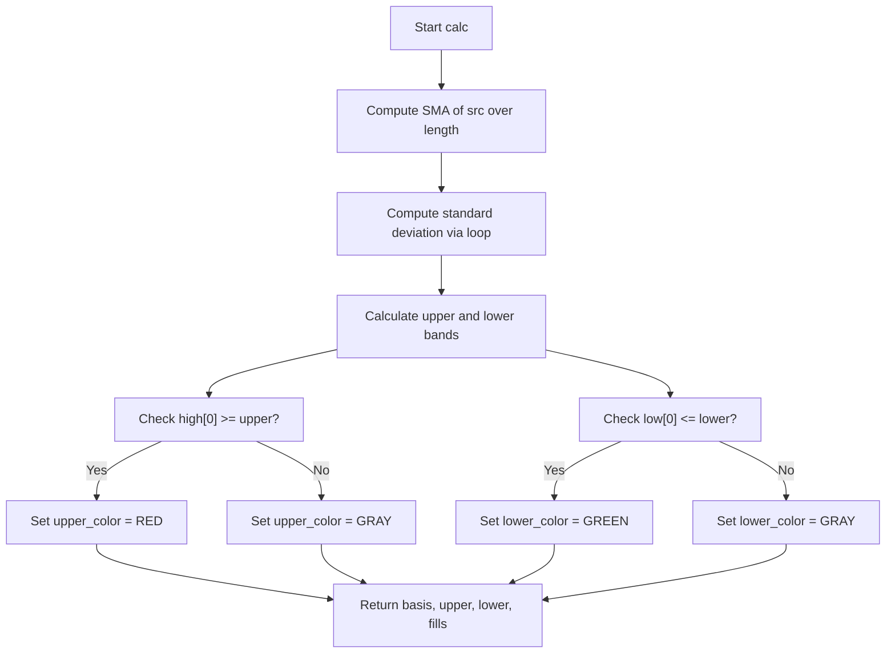

# Bollinger Band Touch Marker - Technical Guide

> Bollinger Bands that change color when price touches or breaks the upper or lower band.

| | |
| --- | --- |
| **Language** | Indie Script v5 |
| **Platform** | [TakeProfit](https://takeprofit.com) |
| **Category** | Volatility |
| **Type** | Indicator |
| **Author** | @mustermann84 on TakeProfit |
| **License** | MIT |
| **Live script** | [Open on TakeProfit](https://takeprofit.com/indicator/bollinger-band-touch-marker-6) |
| **Source file** | [Bollinger Band Touch Marker.indie5](Bollinger%20Band%20Touch%20Marker.indie5) |

## Overview

This indicator plots Bollinger Bands (center SMA, upper and lower bands at a multiple of standard deviation) directly on the price chart. Its distinctive feature is that the upper band line turns red when the current bar's high touches or exceeds the upper band, and the lower band line turns green when the current bar's low touches or falls below the lower band. Otherwise both bands are drawn in gray.

The color change provides an immediate visual cue of volatility extremes and potential breakout or reversal points. It is intended for traders who want to see at a glance when price is interacting with the bands, without having to compare price levels manually.

## How it works

1. Compute the simple moving average (SMA) of the selected source over the given period.
2. Calculate the standard deviation of the source over the same period using the SMA as the mean.
3. Set the upper band as SMA + multiplier × standard deviation, and the lower band as SMA – multiplier × standard deviation.
4. Check if the current bar's high is greater than or equal to the upper band; if so, color the upper band red, otherwise gray.
5. Check if the current bar's low is less than or equal to the lower band; if so, color the lower band green, otherwise gray.
6. Return the basis line (gray), the colored upper and lower lines, and two transparent fills between the bands.

## Mathematical model

$$
\text{SMA} = \frac{1}{n} \sum_{i=0}^{n-1} \text{src}[i]
$$

$$
\sigma = \sqrt{\frac{1}{n} \sum_{i=0}^{n-1} (\text{src}[i] - \text{SMA})^2}
$$

$$
\text{Upper} = \text{SMA} + m \cdot \sigma \quad \text{Lower} = \text{SMA} - m \cdot \sigma
$$

## Logic flow



## Parameters

| Parameter | Type | Default | Range | Description |
| --- | --- | --- | --- | --- |
| `src` | source | source.CLOSE |  |  |
| `length` | int | 20 | 1 - 100 | Perioden |
| `mult` | float | 2.0 | 0.5 - 3.0 | Multiplikator |

## Code walkthrough

### SMA Calculation

Lines 30-31 of [Bollinger Band Touch Marker.indie5](Bollinger%20Band%20Touch%20Marker.indie5):

```python
        sma = Sma.new(self.src, self.length)
        basis = sma[0]
```

The simple moving average is computed using the built-in `Sma.new` algorithm, which returns a series. The current bar's SMA value is accessed with `[0]`. This is the center line of the Bollinger Bands.

### Standard Deviation Loop

Lines 34-38 of [Bollinger Band Touch Marker.indie5](Bollinger%20Band%20Touch%20Marker.indie5):

```python
        sum_sq = 0.0
        for i in range(self.length):
            diff = self.src[i] - basis
            sum_sq += diff * diff
        stdev = (sum_sq / self.length) ** 0.5
```

The standard deviation is calculated manually by summing the squared differences between each source value and the SMA, then dividing by the period and taking the square root. This loop runs every bar and uses historical values of `self.src` via indexing.

### Band Calculation

Lines 40-42 of [Bollinger Band Touch Marker.indie5](Bollinger%20Band%20Touch%20Marker.indie5):

```python
        # Bänder berechnen
        upper = basis + self.mult * stdev
        lower = basis - self.mult * stdev
```

The upper and lower bands are computed by adding or subtracting the product of the multiplier and the standard deviation from the SMA. These are the classic Bollinger Band formulas.

### Color Logic and Return

Lines 45-54 of [Bollinger Band Touch Marker.indie5](Bollinger%20Band%20Touch%20Marker.indie5):

```python
        upper_color = color.RED if self.high[0] >= upper else color.GRAY
        lower_color = color.GREEN if self.low[0] <= lower else color.GRAY

        return (
            basis,
            plot.Line(upper, color=upper_color),
            plot.Line(lower, color=lower_color),
            plot.Fill(color=color.BLACK(0.1)),
            plot.Fill(color=color.BLACK(0.1))
        )
```

The color of each band is determined by comparing the current bar's high/low with the band levels. The return statement packages the basis line (always gray), the two colored lines (using `plot.Line` with the chosen color), and two transparent fills (alpha 0.1 black) that shade the areas between the bands.

## Reading the chart

- The **basis line** (center SMA) is always drawn in gray.
- The **upper band** is gray by default; it turns **red** on bars where the high touches or exceeds the upper band.
- The **lower band** is gray by default; it turns **green** on bars where the low touches or falls below the lower band.
- The fills between the bands are semi-transparent black (10% opacity), providing a subtle background shading.
- A red upper band signals that price is reaching an overextended level (potential resistance or breakout). A green lower band signals that price is reaching an oversold level (potential support or breakdown).

## Implementation notes

- The standard deviation is recalculated from scratch each bar using a loop over `length` elements, which may be computationally heavy for large periods.
- The `std_dev` mut series created in `__init__` is never used in `calc`; it appears to be a leftover from a previous version.
- The color change is based solely on the current bar's high/low, not on closing prices or future bars, so the indicator does not repaint.
- The fills are drawn with a fixed color (`color.BLACK(0.1)`) regardless of the band colors; they do not change when bands change color.

## FAQ

**How can I change the colors of the bands when they are touched?**

Modify the `color.RED` and `color.GREEN` values in lines 45 and 46 to any other color from the `color` module, e.g., `color.ORANGE` or `color.BLUE`.

**What does the 'Multiplikator' parameter do?**

It sets the number of standard deviations used to calculate the upper and lower bands. A higher multiplier makes the bands wider, reducing the frequency of touches; a lower multiplier makes them narrower, increasing touches.

**Can I use a different source than the closing price?**

Yes, the `src` parameter allows you to select any available source (e.g., open, high, low, close, HL2, etc.) from the indicator's settings panel.

## Full source code

Indie Script v5, as published on TakeProfit. Copy it into the platform's script editor or [open the live script](https://takeprofit.com/indicator/bollinger-band-touch-marker-6).

```python
# indie:lang_version = 5
from indie import (
    indicator,
    param,
    plot,
    source,
    MainContext,
    color
)
from indie.algorithms import Sma

@indicator('Bollinger Bands Pro', overlay_main_pane=True)
@param.source('src', default=source.CLOSE)
@param.int('length', default=20, title='Perioden', min=1, max=100)
@param.float('mult', default=2.0, title='Multiplikator', min=0.5, max=3.0)
@plot.line('Basis', color=color.rgba(128, 128, 128, 1))
@plot.line('Oberes Band')
@plot.line('Unteres Band')
@plot.fill('Basis', 'Oberes Band', id='#fill_3')
@plot.fill('Basis', 'Unteres Band', id='#fill_4')
class Main(MainContext):
    def __init__(self, src, length, mult):
        self.src = src
        self.length = length
        self.mult = mult
        self.std_dev = self.new_mut_series_f()

    def calc(self):
        # SMA-Berechnung
        sma = Sma.new(self.src, self.length)
        basis = sma[0]

        # Standardabweichung
        sum_sq = 0.0
        for i in range(self.length):
            diff = self.src[i] - basis
            sum_sq += diff * diff
        stdev = (sum_sq / self.length) ** 0.5

        # Bänder berechnen
        upper = basis + self.mult * stdev
        lower = basis - self.mult * stdev

        # Farbwechsel-Logik
        upper_color = color.RED if self.high[0] >= upper else color.GRAY
        lower_color = color.GREEN if self.low[0] <= lower else color.GRAY

        return (
            basis,
            plot.Line(upper, color=upper_color),
            plot.Line(lower, color=lower_color),
            plot.Fill(color=color.BLACK(0.1)),
            plot.Fill(color=color.BLACK(0.1))
        )
```
