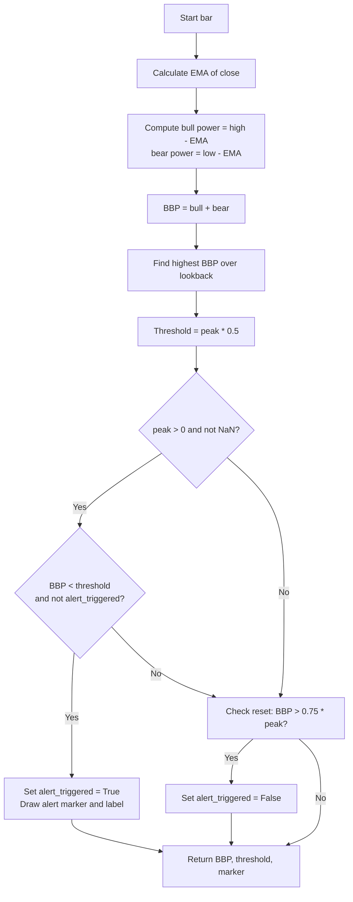

# Bull Bear Power 50% alert - Technical Guide

> Computes Bull Bear Power (BBP) from EMA and alerts when BBP falls below 50% of its recent peak.

| | |
| --- | --- |
| **Language** | Indie Script v5 |
| **Platform** | [TakeProfit](https://takeprofit.com) |
| **Category** | Oscillators |
| **Type** | Indicator |
| **Author** | @reinner on TakeProfit |
| **License** | MIT |
| **Live script** | [Open on TakeProfit](https://takeprofit.com/indicator/bull-bear-power-50-alert-13) |
| **Source file** | [Bull Bear Power 50% alert.indie5](Bull%20Bear%20Power%2050%%20alert.indie5) |

## Overview

The Bull Bear Power indicator measures the relative strength of bulls and bears by comparing the high and low prices to an exponential moving average (EMA) of the close. The sum of bull power (high - EMA) and bear power (low - EMA) forms the BBP line, which oscillates around zero. A positive BBP indicates bullish dominance, negative indicates bearish dominance.

This indicator is designed to detect weakening momentum and potential reversal zones. When BBP drops below 50% of its most recent peak (over a configurable lookback period), an alert is triggered, suggesting that the prevailing trend may be losing strength. A hysteresis mechanism (75% recovery) prevents alert spam. The indicator plots the BBP line, a 50% threshold line, and optional alert markers and labels.

## How it works

1. Calculate the EMA of the closing price over the specified length.
2. Compute bull power as current high minus EMA, and bear power as current low minus EMA.
3. Sum bull and bear power to get the Bull Bear Power (BBP) value.
4. Track the highest BBP value over the lookback period using a rolling peak.
5. Set the 50% threshold as half of that recent peak.
6. If BBP is below the threshold and no alert has been triggered for the current cycle, fire an alert.
7. Reset the alert flag when BBP recovers above 75% of the peak (hysteresis).
8. Draw an alert marker and a label on the chart when the alert condition is met.

## Mathematical model

$$
\text{EMA}_{t} = \text{EMA}(\text{close}, \text{length})_t
$$

$$
\text{BullPower}_t = \text{high}_t - \text{EMA}_t
$$

$$
\text{BearPower}_t = \text{low}_t - \text{EMA}_t
$$

$$
\text{BBP}_t = \text{BullPower}_t + \text{BearPower}_t
$$

$$
\text{Peak} = \max(\text{BBP}_{t-\text{lookback}+1}, \dots, \text{BBP}_t)
$$

$$
\text{Threshold}_t = 0.5 \times \text{Peak}
$$

## Logic flow



## Parameters

| Parameter | Type | Default | Range | Description |
| --- | --- | --- | --- | --- |
| `length` | int | 13 | ≥ 1 | EMA Length |
| `lookback` | int | 20 | ≥ 1 | Peak Lookback Period |
| `show_alerts` | bool | true |  | Show Alert Markers |
| `show_threshold` | bool | true |  | Show 50% Threshold Line |

## Code walkthrough

### Core BBP Calculation

Lines 21-24 of [Bull Bear Power 50% alert.indie5](Bull%20Bear%20Power%2050%%20alert.indie5):

```python
        ema_close = Ema.new(self.close, length)
        bear_power = self.low[0] - ema_close[0]
        bull_power = self.high[0] - ema_close[0]
        bbp = bull_power + bear_power
```

The EMA of the closing price is computed using the built-in `Ema.new` algorithm. Bull power is the difference between the current high and the EMA; bear power is the difference between the current low and the EMA. Their sum gives the Bull Bear Power (BBP) value for the current bar.

### Peak Tracking and Threshold

Lines 27-33 of [Bull Bear Power 50% alert.indie5](Bull%20Bear%20Power%2050%%20alert.indie5):

```python
        bbp_series = MutSeriesF.new(bbp)
        
        # Find the recent peak over lookback period
        recent_peak = Highest.new(bbp_series, lookback)[0]
        
        # Calculate 50% threshold
        threshold_50pct = recent_peak * 0.5
```

The BBP value is stored in a `MutSeriesF` so it can be used by the `Highest` algorithm to find the maximum over the lookback period. The 50% threshold is then computed as half of that recent peak. This threshold serves as the alert trigger level.

### Alert Condition with State

Lines 36-40 of [Bull Bear Power 50% alert.indie5](Bull%20Bear%20Power%2050%%20alert.indie5):

```python
        alert_condition = False
        if not isnan(recent_peak) and not isnan(bbp) and recent_peak > 0:
            if bbp < threshold_50pct and not self._alert_triggered:
                alert_condition = True
                self._alert_triggered = True
```

The alert condition checks that the peak is positive and not NaN, that the current BBP is below the threshold, and that no alert has already been triggered for the current cycle (`_alert_triggered` is False). When the condition is met, the flag is set to True to prevent repeated alerts.

### Hysteresis Reset

Lines 43-45 of [Bull Bear Power 50% alert.indie5](Bull%20Bear%20Power%2050%%20alert.indie5):

```python
        if not isnan(recent_peak) and not isnan(bbp) and recent_peak > 0:
            if bbp > recent_peak * 0.75:
                self._alert_triggered = False
```

To avoid alert spam when BBP oscillates near the threshold, the alert flag is reset only when BBP recovers above 75% of the recent peak. This hysteresis ensures that a new alert can only fire after a meaningful recovery.

### Drawing Alert Label

Lines 53-57 of [Bull Bear Power 50% alert.indie5](Bull%20Bear%20Power%2050%%20alert.indie5):

```python
        if alert_condition and show_alerts:
            pos = AbsolutePosition(time=self.time[0], price=bbp)
            label = LabelAbs('ALERT: Bull Power Weakened', pos, 
                           font_size=12, text_color=color.WHITE, bg_color=color.RED)
            self.chart.draw(label)
```

When an alert condition is met and `show_alerts` is enabled, a label with the text 'ALERT: Bull Power Weakened' is drawn at the current bar's time and BBP price level. The label uses white text on a red background for visibility.

## Reading the chart

- **BBP Line (blue)**: Oscillates around zero. Positive values indicate bullish pressure (high above EMA), negative values indicate bearish pressure (low below EMA).
- **50% Threshold Line (red)**: Plotted only when `show_threshold` is enabled. Represents half of the most recent BBP peak. When BBP crosses below this line, it signals weakening momentum.
- **Alert Markers (red)**: Shown only when `show_alerts` is enabled. A marker appears at the BBP value when the alert condition fires.
- **Alert Label**: A red label reading 'ALERT: Bull Power Weakened' appears at the alert bar, providing a clear visual cue.
- **Hysteresis**: After an alert, no new alerts will fire until BBP recovers above 75% of the peak, preventing repeated signals during sideways movement.

## Implementation notes

- The indicator uses `MutSeriesF` to store BBP values for the `Highest` algorithm, which requires a series input. This is necessary because `Highest` operates on a rolling window.
- NaN handling is explicit: the alert condition and reset logic both check `isnan` to avoid errors when the peak or BBP is undefined (e.g., at the start of the chart).
- The alert state (`_alert_triggered`) is a boolean instance variable that persists across bars, enabling the hysteresis mechanism. It is initialized to `False` in `__init__`.
- The indicator is drawn in a separate pane (`overlay_main_pane=False`) because BBP is a derived oscillator, not overlaid on price.

## FAQ

**How can I adjust the sensitivity of the alerts?**

Decrease the 'EMA Length' parameter to make the EMA more responsive, or decrease the 'Peak Lookback Period' to react to shorter-term peaks. Both changes will cause the threshold to adjust more quickly.

**What does the alert 'ALERT: Bull Power Weakened' mean?**

It means the Bull Bear Power (BBP) has dropped below 50% of its most recent peak, indicating that the bullish momentum is weakening and a potential reversal or pullback may occur.

**Why doesn't the alert fire again immediately after the first one?**

The indicator uses hysteresis: after an alert, it waits until BBP recovers above 75% of the peak before resetting the alert flag. This prevents repeated alerts when BBP oscillates near the threshold.

## Full source code

Indie Script v5, as published on TakeProfit. Copy it into the platform's script editor or [open the live script](https://takeprofit.com/indicator/bull-bear-power-50-alert-13).

```python
# indie:lang_version = 5
from indie import indicator, MainContext, param, plot, color, MutSeriesF, Var
from indie.algorithms import Ema, Highest
from indie.drawings import LabelAbs, AbsolutePosition
from math import isnan

@indicator('BBP Alert', overlay_main_pane=False)
@param.int('length', default=13, min=1, title='EMA Length')
@param.int('lookback', default=20, min=1, title='Peak Lookback Period')
@param.bool('show_alerts', default=True, title='Show Alert Markers')
@param.bool('show_threshold', default=True, title='Show 50% Threshold Line')
@plot.line('bbp', color=color.BLUE, title='Bull Bear Power')
@plot.line('threshold', color=color.RED, title='50% Threshold')
@plot.marker('alert', color=color.RED, size=7)
class Main(MainContext):
    def __init__(self, length, lookback, show_alerts, show_threshold):
        self._alert_triggered: bool = False  # Track if alert already triggered for current cycle
        
    def calc(self, length, lookback, show_alerts, show_threshold):
        # Calculate Bull Bear Power
        ema_close = Ema.new(self.close, length)
        bear_power = self.low[0] - ema_close[0]
        bull_power = self.high[0] - ema_close[0]
        bbp = bull_power + bear_power
        
        # Store BBP in a series for peak tracking
        bbp_series = MutSeriesF.new(bbp)
        
        # Find the recent peak over lookback period
        recent_peak = Highest.new(bbp_series, lookback)[0]
        
        # Calculate 50% threshold
        threshold_50pct = recent_peak * 0.5
        
        # Check alert condition: current BBP < 50% of recent peak
        alert_condition = False
        if not isnan(recent_peak) and not isnan(bbp) and recent_peak > 0:
            if bbp < threshold_50pct and not self._alert_triggered:
                alert_condition = True
                self._alert_triggered = True
        
        # Reset alert flag when BBP recovers above 75% of peak (hysteresis to avoid spam)
        if not isnan(recent_peak) and not isnan(bbp) and recent_peak > 0:
            if bbp > recent_peak * 0.75:
                self._alert_triggered = False
        
        # Prepare return values
        bbp_value = bbp
        threshold_value = threshold_50pct if show_threshold and not isnan(threshold_50pct) else 0.0
        alert_marker = bbp if (alert_condition and show_alerts) else 0.0
        
        # Draw alert label when condition is met
        if alert_condition and show_alerts:
            pos = AbsolutePosition(time=self.time[0], price=bbp)
            label = LabelAbs('ALERT: Bull Power Weakened', pos, 
                           font_size=12, text_color=color.WHITE, bg_color=color.RED)
            self.chart.draw(label)
        
        return bbp_value, threshold_value, alert_marker
```
