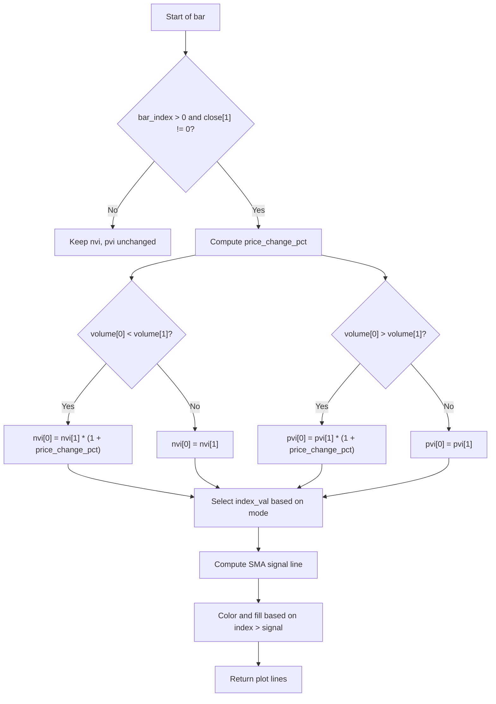

# Classic NVI/PVI Fosback - Technical Guide

> Computes Negative Volume Index (NVI) or Positive Volume Index (PVI) with a signal line and trend coloring.

| | |
| --- | --- |
| **Language** | Indie Script v5 |
| **Platform** | [TakeProfit](https://takeprofit.com) |
| **Category** | Volume |
| **Type** | Indicator |
| **Author** | @insurgent on TakeProfit |
| **License** | MIT |
| **Live script** | [Open on TakeProfit](https://takeprofit.com/indicator/classic-nvi-pvi-fosback-48) |
| **Source file** | [Classic NVI-PVI Fosback.indie5](Classic%20NVI-PVI%20Fosback.indie5) |

## Overview

This indicator implements the classic NVI (Negative Volume Index) and PVI (Positive Volume Index) as popularized by Norman Fosback. It tracks cumulative price changes only on days when volume decreases (NVI) or increases (PVI), isolating the effect of smart money (NVI) or crowd behavior (PVI). The indicator is plotted in a separate pane below the price chart.

The main line (index value) is colored green when above its signal line (a simple moving average) and red when below, with a corresponding fill between the two lines. This helps visualize the trend of the selected volume index relative to its smoothed baseline.

## How it works

1. Compute the daily percentage price change from the previous close.
2. If volume decreased from the previous bar, update NVI by multiplying its previous value by (1 + price change); otherwise keep NVI unchanged.
3. If volume increased from the previous bar, update PVI by multiplying its previous value by (1 + price change); otherwise keep PVI unchanged.
4. Select the appropriate index (NVI or PVI) based on the user-chosen mode.
5. Calculate a simple moving average of the selected index over the specified period to form the signal line.
6. Color the index line green when it is above the signal line, red when below, and fill the area between them with a semi-transparent version of the same color.

## Mathematical model

$$
\text{price\_change\_pct} = \frac{\text{close}[0] - \text{close}[1]}{\text{close}[1]}
$$

$$
\text{NVI}[0] = \begin{cases}
\text{NVI}[1] \times (1 + \text{price\_change\_pct}) & \text{if volume}[0] < \text{volume}[1] \\
\text{NVI}[1] & \text{otherwise}
\end{cases}
$$

$$
\text{PVI}[0] = \begin{cases}
\text{PVI}[1] \times (1 + \text{price\_change\_pct}) & \text{if volume}[0] > \text{volume}[1] \\
\text{PVI}[1] & \text{otherwise}
\end{cases}
$$

## Logic flow



## Parameters

| Parameter | Type | Default | Range | Description |
| --- | --- | --- | --- | --- |
| `mode` | str | NVI |  | Indicator Type |
| `ma_length` | int | 255 | ≥ 1 | Signal Line Period (SMA) |
| `start_val` | float | 100.0 |  | Starting Value |

## Code walkthrough

### Price change and volume conditions

Lines 18-31 of [Classic NVI-PVI Fosback.indie5](Classic%20NVI-PVI%20Fosback.indie5):

```python
    if self.bar_index > 0 and self.close[1] != 0:
        price_change_pct = (self.close[0] - self.close[1]) / self.close[1]

        # NVI: update only when volume decreases
        if self.volume[0] < self.volume[1]:
            nvi[0] = nvi[1] * (1.0 + price_change_pct)
        else:
            nvi[0] = nvi[1]

        # PVI: update only when volume increases
        if self.volume[0] > self.volume[1]:
            pvi[0] = pvi[1] * (1.0 + price_change_pct)
        else:
            pvi[0] = pvi[1]
```

The percentage price change is computed only when there is a previous bar and its close is non-zero. Then, depending on volume direction, the NVI or PVI series is updated multiplicatively. If volume does not meet the condition, the index remains unchanged. This implements the classic Fosback logic.

### Mode selection and signal line

Lines 34-38 of [Classic NVI-PVI Fosback.indie5](Classic%20NVI-PVI%20Fosback.indie5):

```python
    index_val = nvi[0] if mode == 'NVI' else pvi[0]

    # Signal line
    index_series = MutSeriesF.new(index_val)
    sig_line = Sma.new(index_series, ma_length)[0]
```

The chosen index (NVI or PVI) is selected based on the `mode` parameter. A new MutSeriesF is created from the current index value to feed into the SMA algorithm. The signal line is the SMA of that series over `ma_length` bars, accessed with `[0]` for the current bar.

### Trend coloring and fill

Lines 41-43 of [Classic NVI-PVI Fosback.indie5](Classic%20NVI-PVI%20Fosback.indie5):

```python
    is_bull = index_val > sig_line
    line_col = color.GREEN if is_bull else color.RED
    fill_col = color.GREEN(0.1) if is_bull else color.RED(0.1)
```

The index line is colored green when it is above the signal line (bullish), red when below (bearish). A semi-transparent fill is added between the index line and signal line using the same color at 10% opacity, making the relationship visually clear.

## Reading the chart

- **Index Line**: The cumulative NVI or PVI value. Color changes: green when above the signal line, red when below.
- **Signal Line**: A gray SMA of the index line over the chosen period (default 255).
- **Fill**: Semi-transparent green or red area between the index line and signal line, reinforcing the trend direction.
- When the index line crosses above the signal line, it may indicate a bullish shift; a cross below suggests bearish conditions.

## Implementation notes

- The indicator uses `MutSeriesF` to persist NVI and PVI values across bars, initialized to `start_val` (default 100).
- On the first bar (`bar_index == 0`), no price change is computed, so both indices remain at the starting value.
- If `close[1]` is zero, the price change calculation is skipped to avoid division by zero; the indices remain unchanged for that bar.
- The signal line is computed using `Sma.new` on a series that is recreated each bar from the current index value – this is a valid pattern in Indie for rolling calculations.

## FAQ

**What is the difference between NVI and PVI?**

NVI updates only on days when volume decreases, aiming to track smart money movements. PVI updates only on days when volume increases, reflecting crowd behavior. Choose the mode that matches your analysis focus.

**How should I interpret the signal line crossover?**

When the index line crosses above the signal line, it turns green and may indicate a bullish trend. A cross below turns it red, suggesting a bearish trend. The signal line is a simple moving average, so it lags behind the index.

**Can I change the starting value or signal line period?**

Yes, the `start_val` parameter sets the initial index value (default 100). The `ma_length` parameter controls the SMA period for the signal line (default 255). Adjust these to suit your chart timeframe and preferences.

## Full source code

Indie Script v5, as published on TakeProfit. Copy it into the platform's script editor or [open the live script](https://takeprofit.com/indicator/classic-nvi-pvi-fosback-48).

```python
# indie:lang_version = 5
from indie import indicator, param, plot, color, MainContext, MutSeriesF
from indie.algorithms import Sma

@indicator('NVI/PVI Fosback', overlay_main_pane=False)
@param.str('mode', default='NVI', options=['NVI', 'PVI'], title='Indicator Type')
@param.int('ma_length', default=255, min=1, title='Signal Line Period (SMA)')
@param.float('start_val', default=100.0, title='Starting Value')
@plot.line(id='index_line', title='Index Value')
@plot.line(id='signal_line', color=color.GRAY, title='Signal MA')
@plot.fill('index_line', 'signal_line')
def Main(self, mode: str, ma_length: int, start_val: float):
    # Persistent series that carry values forward
    nvi = MutSeriesF.new(init=start_val)
    pvi = MutSeriesF.new(init=start_val)

    # Calculate price change
    if self.bar_index > 0 and self.close[1] != 0:
        price_change_pct = (self.close[0] - self.close[1]) / self.close[1]

        # NVI: update only when volume decreases
        if self.volume[0] < self.volume[1]:
            nvi[0] = nvi[1] * (1.0 + price_change_pct)
        else:
            nvi[0] = nvi[1]

        # PVI: update only when volume increases
        if self.volume[0] > self.volume[1]:
            pvi[0] = pvi[1] * (1.0 + price_change_pct)
        else:
            pvi[0] = pvi[1]

    # Mode selection
    index_val = nvi[0] if mode == 'NVI' else pvi[0]

    # Signal line
    index_series = MutSeriesF.new(index_val)
    sig_line = Sma.new(index_series, ma_length)[0]

    # Trend colors
    is_bull = index_val > sig_line
    line_col = color.GREEN if is_bull else color.RED
    fill_col = color.GREEN(0.1) if is_bull else color.RED(0.1)

    return (
        plot.Line(index_val, color=line_col),
        sig_line,
        plot.Fill(color=fill_col)
    )
```
