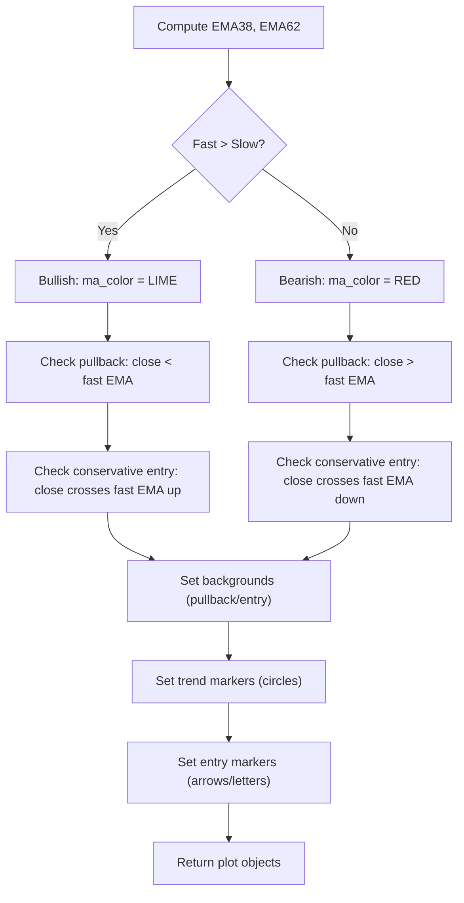

# Classic SlingShot Trend Logic - Technical Guide

> Dual EMA trend-following system identifying pullbacks and continuation entries with visual markers.

| | |
| --- | --- |
| **Language** | Indie Script v5 |
| **Platform** | [TakeProfit](https://takeprofit.com) |
| **Category** | Trend |
| **Type** | Indicator |
| **Author** | @chartjunkie on TakeProfit |
| **Original** | Original author: ChrisMoody (10-05-2014) Ported to Indie language |
| **License** | MIT |
| **Live script** | [Open on TakeProfit](https://takeprofit.com/indicator/classic-slingshot-trend-logic-37) |
| **Source file** | [Classic SlingShot Trend Logic.indie5](Classic%20SlingShot%20Trend%20Logic.indie5) |

## Overview

The SlingShot Trend System uses two exponential moving averages (EMA 38 and EMA 62) to define the dominant trend direction. It is designed for trend-following traders who want to enter on pullbacks within an established trend, filtering out counter-trend noise. The indicator highlights temporary retracements toward the fast EMA (aggressive pullback zones) and marks confirmed continuation entries when price crosses back above or below the fast EMA in the direction of the trend.

On the chart, the two EMAs are plotted with a fill between them, colored lime when the fast EMA is above the slow EMA (bullish) and red when below (bearish). Background highlights appear in yellow during pullback zones and aqua during conservative entry signals. Trend state is shown with small circles near price (lime below for uptrend, red above for downtrend). Entry signals are displayed as arrows (▲/▼) or letters (B/S) offset from price, with mutual exclusion between the two styles.

## How it works

1. Compute EMA 38 and EMA 62 from the closing price.
2. Determine trend direction: bullish if fast EMA >= slow EMA, bearish if fast EMA < slow EMA.
3. Identify aggressive pullback: close is on the opposite side of the fast EMA relative to the trend direction.
4. Identify conservative entry: close crosses the fast EMA in the direction of the trend (previous bar below, current bar above for bullish; opposite for bearish).
5. Set background colors: yellow for pullback zones, aqua for conservative entries, based on user toggles.
6. Plot trend markers: lime circle below price during uptrend, red circle above price during downtrend.
7. Plot entry markers (arrows or letters) with an offset based on half the bar range, respecting mutual exclusion settings.

## Logic flow



## Parameters

| Parameter | Type | Default | Range | Description |
| --- | --- | --- | --- | --- |
| `sae` | bool | true |  | Show Aggressive Entry |
| `sce` | bool | true |  | Show Conservative Entry |
| `st` | bool | true |  | Show Trend Arrows |
| `def_` | bool | false |  | Only Choose 1 - Arrows or Letters |
| `pa` | bool | true |  | Show Conservative Entry Arrows |
| `sl` | bool | false |  | Show 'B'-'S' Letters |

## Code walkthrough

### EMA Calculation

Lines 47-51 of [Classic SlingShot Trend Logic.indie5](Classic%20SlingShot%20Trend%20Logic.indie5):

```python
        ema_slow = Ema.new(self.close, 62)
        ema_fast = Ema.new(self.close, 38)

        ema_slow_0 = ema_slow[0]
        ema_fast_0 = ema_fast[0]
```

Two exponential moving averages are computed using the built-in Ema algorithm. The slow EMA uses period 62 and the fast EMA uses period 38. The current values are accessed with [0] to get the latest bar's value.

### Trend Color Logic

Lines 57-61 of [Classic SlingShot Trend Logic.indie5](Classic%20SlingShot%20Trend%20Logic.indie5):

```python
        ma_color = color.YELLOW
        if ema_fast_0 > ema_slow_0:
            ma_color = color.LIME
        elif ema_fast_0 < ema_slow_0:
            ma_color = color.RED
```

The moving average line color is determined by comparing the fast and slow EMAs. If fast > slow, color is lime (bullish); if fast < slow, color is red (bearish); otherwise yellow (neutral, though unlikely). This color is applied to both EMA lines. The fill uses a fixed silver color.

### Pullback and Entry Conditions

Lines 64-78 of [Classic SlingShot Trend Logic.indie5](Classic%20SlingShot%20Trend%20Logic.indie5):

```python
        pullback_up = ema_fast_0 > ema_slow_0 and close_0 < ema_fast_0
        pullback_dn = ema_fast_0 < ema_slow_0 and close_0 > ema_fast_0

        # === Conservative entry (price crosses fast EMA) ===
        entry_up = (
            ema_fast_0 > ema_slow_0 and
            close_1 < ema_fast_0 and
            close_0 > ema_fast_0
        )

        entry_dn = (
            ema_fast_0 < ema_slow_0 and
            close_1 > ema_fast_0 and
            close_0 < ema_fast_0
        )
```

Aggressive pullback is defined as price being on the opposite side of the fast EMA relative to the trend direction. Conservative entry requires a cross of the fast EMA in the trend direction: previous close on one side, current close on the other. Both conditions are boolean flags used later for backgrounds and markers.

### Mutual Exclusion for Entry Markers

Lines 106-128 of [Classic SlingShot Trend Logic.indie5](Classic%20SlingShot%20Trend%20Logic.indie5):

```python
        show_arrows = pa and not def_
        show_letters = sl and def_

        # === Price offset for entry markers ===
        atr_offset = (self.high[0] - self.low[0]) * 0.5

        # === Entry arrows ===
        buy_arrow = plot.Marker(nan)
        if show_arrows and codiff == 1:
            buy_arrow = plot.Marker(self.low[0] - atr_offset, color=color.LIME, text='▲')

        sell_arrow = plot.Marker(nan)
        if show_arrows and codiff2 == 1:
            sell_arrow = plot.Marker(self.high[0] + atr_offset, color=color.RED, text='▼')

        # === Entry letters B / S ===
        buy_letter = plot.Marker(nan)
        if show_letters and codiff == 1:
            buy_letter = plot.Marker(self.low[0] - atr_offset, color=color.LIME, text='B')

        sell_letter = plot.Marker(nan)
        if show_letters and codiff2 == 1:
            sell_letter = plot.Marker(self.high[0] + atr_offset, color=color.RED, text='S')
```

The parameter 'def_' controls whether arrows or letters are shown. When def_ is false, arrows are displayed if 'pa' is true. When def_ is true, letters are displayed if 'sl' is true. The offset for markers is half the bar's high-low range, calculated each bar. Markers are set to nan when no signal, which hides them on the chart.

### Return Tuple

Lines 130-142 of [Classic SlingShot Trend Logic.indie5](Classic%20SlingShot%20Trend%20Logic.indie5):

```python
        return (
            plot.Line(ema_slow_0, color=ma_color),
            plot.Line(ema_fast_0, color=ma_color),
            plot.Fill(),
            bg_pullback,
            bg_entry,
            trend_up,
            trend_dn,
            buy_arrow,
            sell_arrow,
            buy_letter,
            sell_letter
        )
```

All plot objects are returned as a tuple matching the order of the decorators. This includes two lines, a fill, two backgrounds, two trend markers, two entry arrows, and two entry letters. The indicator overlays on the main price pane.

## Reading the chart

- **EMA Lines & Fill**: Lime when fast EMA > slow EMA (bullish), red when fast < slow (bearish). The fill between them is silver with 50% opacity.
- **Background Colors**: Yellow background appears during aggressive pullback zones (if enabled). Aqua background appears during conservative entry signals (if enabled).
- **Trend Circles**: A lime circle below the bar indicates an uptrend; a red circle above indicates a downtrend. Only shown if trend markers are enabled.
- **Entry Arrows/Letters**: When a conservative entry is detected, a green ▲ or 'B' is placed below the bar for buy signals, or a red ▼ or 'S' above for sell signals. The offset is half the bar range. Only one style (arrows or letters) is shown based on the 'def_' parameter.
- **No Signal**: If no condition is met, the corresponding marker is hidden (NaN).

## Implementation notes

- The indicator uses Ema.new which returns a series; current and previous values are accessed with [0] and [1] respectively.
- Background colors are set via plot.Background() calls; the default color from the decorator is used when no explicit color is passed.
- Entry markers are mutually exclusive between arrows and letters controlled by the 'def_' parameter; both cannot be shown simultaneously.
- The offset for entry markers uses half the current bar's range (high - low) * 0.5, which may produce large offsets on volatile bars.

## FAQ

**How do I enable or disable the aggressive pullback highlighting?**

Toggle the 'Show Aggressive Entry' parameter (sae) in the indicator settings. When enabled, yellow background bars appear during pullback zones.

**How can I switch between arrows and letters for entry signals?**

Set the 'Only Choose 1 - Arrows or Letters' parameter (def_) to true to use letters, then enable 'Show B-S Letters' (sl). Set def_ to false and enable 'Show Conservative Entry Arrows' (pa) to use arrows.

**What do the background colors mean?**

Yellow background indicates an aggressive pullback zone (price retracing toward the fast EMA within the trend). Aqua background indicates a conservative entry signal (price crossing the fast EMA in the trend direction).

## Full source code

Indie Script v5, as published on TakeProfit. Copy it into the platform's script editor or [open the live script](https://takeprofit.com/indicator/classic-slingshot-trend-logic-37).

```python
# indie:lang_version = 5
# Original author: ChrisMoody (10-05-2014)
# Ported to Indie language

from indie import indicator, param, MainContext
from indie.algorithms import Ema
from indie import plot, color
from math import nan


@indicator('SlingShot System', overlay_main_pane=True)

# --- Moving averages
@plot.line('ema_slow', title='Slow MA', line_width=4)
@plot.line('ema_fast', title='Fast MA', line_width=2)
@plot.fill('ema_slow', 'ema_fast', color=color.SILVER(0.5))

# --- Background highlight
@plot.background(title='Backgorund pullback', color=color.YELLOW(0.35))
@plot.background(title='Background entry', color=color.AQUA(0.45))

# --- Trend markers (circles near price)
@plot.marker(title='Trend Up', style=plot.marker_style.CIRCLE, position=plot.marker_position.BELOW, size=4)
@plot.marker(title='Trend Down', style=plot.marker_style.CIRCLE, position=plot.marker_position.ABOVE, size=4)

# --- Entry arrows (larger, with offset)
@plot.marker(title='Buy Arrow', style=plot.marker_style.LABEL, position=plot.marker_position.BELOW, size=7)
@plot.marker(title='Sell Arrow', style=plot.marker_style.LABEL, position=plot.marker_position.ABOVE, size=7)

# --- Entry letters B / S
@plot.marker(title='Buy Letter', style=plot.marker_style.LABEL, position=plot.marker_position.BELOW, size=7)
@plot.marker(title='Sell Letter', style=plot.marker_style.LABEL, position=plot.marker_position.ABOVE, size=7)

# --- Input parameters (1:1 with Pine Script)
@param.bool('sae', default=True, title='Show Aggressive Entry')
@param.bool('sce', default=True, title='Show Conservative Entry')
@param.bool('st', default=True, title='Show Trend Arrows')
@param.bool('def_', default=False, title="Only Choose 1 - Arrows or Letters")
@param.bool('pa', default=True, title='Show Conservative Entry Arrows')
@param.bool('sl', default=False, title="Show 'B'-'S' Letters")


class Main(MainContext):
    def calc(self, sae: bool, sce: bool, st: bool, def_: bool, pa: bool, sl: bool):

        # === EMA calculations ===
        ema_slow = Ema.new(self.close, 62)
        ema_fast = Ema.new(self.close, 38)

        ema_slow_0 = ema_slow[0]
        ema_fast_0 = ema_fast[0]

        close_0 = self.close[0]
        close_1 = self.close[1]

        # === Trend color (exact Pine logic) ===
        ma_color = color.YELLOW
        if ema_fast_0 > ema_slow_0:
            ma_color = color.LIME
        elif ema_fast_0 < ema_slow_0:
            ma_color = color.RED

        # === Aggressive entry (pullback zone) ===
        pullback_up = ema_fast_0 > ema_slow_0 and close_0 < ema_fast_0
        pullback_dn = ema_fast_0 < ema_slow_0 and close_0 > ema_fast_0

        # === Conservative entry (price crosses fast EMA) ===
        entry_up = (
            ema_fast_0 > ema_slow_0 and
            close_1 < ema_fast_0 and
            close_0 > ema_fast_0
        )

        entry_dn = (
            ema_fast_0 < ema_slow_0 and
            close_1 > ema_fast_0 and
            close_0 < ema_fast_0
        )

        # === Entry signals ===
        codiff = 1 if entry_up else 0
        codiff2 = 1 if entry_dn else 0

        # === Trend definition ===
        up_trend = ema_fast_0 >= ema_slow_0
        down_trend = ema_fast_0 < ema_slow_0

        # === Background color (barcolor equivalent) ===
        bg_pullback = plot.Background(color=color.TRANSPARENT)
        bg_entry = plot.Background(color=color.TRANSPARENT)
        if sae and (pullback_up or pullback_dn):
            bg_pullback = plot.Background()
        if sce and (entry_up or entry_dn):
            bg_entry = plot.Background()

        # === Trend markers (circles near price) ===
        trend_up = plot.Marker(nan)
        if st and up_trend:
            trend_up = plot.Marker(self.low[0], color=color.LIME)

        trend_dn = plot.Marker(nan)
        if st and down_trend:
            trend_dn = plot.Marker(self.high[0], color=color.RED)

        # === Mutual exclusion for arrows vs letters ===
        show_arrows = pa and not def_
        show_letters = sl and def_

        # === Price offset for entry markers ===
        atr_offset = (self.high[0] - self.low[0]) * 0.5

        # === Entry arrows ===
        buy_arrow = plot.Marker(nan)
        if show_arrows and codiff == 1:
            buy_arrow = plot.Marker(self.low[0] - atr_offset, color=color.LIME, text='▲')

        sell_arrow = plot.Marker(nan)
        if show_arrows and codiff2 == 1:
            sell_arrow = plot.Marker(self.high[0] + atr_offset, color=color.RED, text='▼')

        # === Entry letters B / S ===
        buy_letter = plot.Marker(nan)
        if show_letters and codiff == 1:
            buy_letter = plot.Marker(self.low[0] - atr_offset, color=color.LIME, text='B')

        sell_letter = plot.Marker(nan)
        if show_letters and codiff2 == 1:
            sell_letter = plot.Marker(self.high[0] + atr_offset, color=color.RED, text='S')

        return (
            plot.Line(ema_slow_0, color=ma_color),
            plot.Line(ema_fast_0, color=ma_color),
            plot.Fill(),
            bg_pullback,
            bg_entry,
            trend_up,
            trend_dn,
            buy_arrow,
            sell_arrow,
            buy_letter,
            sell_letter
        )
```
