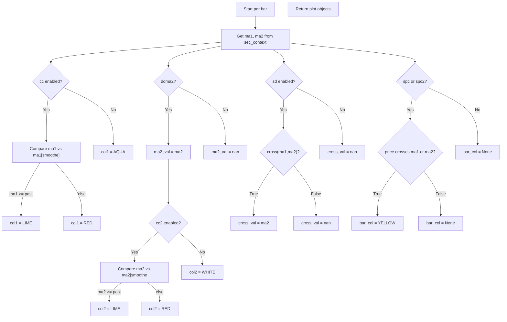

# Classic Ultimate MA MTF (CM Style) - Technical Guide

> Multi-timeframe moving average indicator with 8 types, directional coloring, cross markers, and bar crossing highlights.

| | |
| --- | --- |
| **Language** | Indie Script v5 |
| **Platform** | [TakeProfit](https://takeprofit.com) |
| **Category** | Moving averages |
| **Type** | Indicator |
| **Author** | @insurgent on TakeProfit |
| **License** | MIT |
| **Live script** | [Open on TakeProfit](https://takeprofit.com/indicator/classic-ultimate-ma-mtf-cm-style-91) |
| **Source file** | [Classic Ultimate MA MTF (CM Style).indie5](Classic%20Ultimate%20MA%20MTF%20(CM%20Style).indie5) |

## Overview

The Ultimate MA MTF (CM Style) plots one or two moving averages on the chart, each selectable from 8 types (SMA, EMA, WMA, Hull, VWMA, RMA, TEMA, T3). It can run on the current chart timeframe or a custom higher timeframe via a secondary context, allowing multi-timeframe analysis in a single pane. The indicator is designed to help identify trend direction (via MA slope coloring), generate crossover signals, and highlight bars where price crosses a moving average.

On the chart, MA1 is drawn as a thick line, color-coded lime (rising) or red (falling) when direction coloring is enabled. MA2 appears as circle markers. An aqua cross marker appears whenever the two moving averages cross. Bar colors can turn yellow when the open-close range crosses above or below MA1 or MA2. Optional smoothing of the direction color uses a configurable lookback.

## How it works

1. Select the base timeframe: current chart resolution or a user-defined custom timeframe.
2. Compute MA1 and MA2 via the secondary context `SecMain`, which runs on the selected timeframe and returns both series.
3. In `SecMain`, choose the moving average type for each MA based on parameters (`atype`, `atype2`), applying the respective algorithm (Sma, Ema, Wma, HullMa, Vwma, Rma, Tema, TilsonT3).
4. Apply directional color to MA1 (and optionally MA2) by comparing the current MA value to its value `smoothe` bars ago; if current >= past, color is lime, else red.
5. Detect crosses between MA1 and MA2 using `cross()` and emit an aqua cross marker when a crossover occurs.
6. Optionally color bars yellow when the price open and close straddle MA1 or MA2, indicating a price–MA cross.

## Mathematical model

The indicator uses several custom moving average algorithms:

**Hull Moving Average**

$$
\text{HullMA}(src, n) = \text{WMA}\Big(2 \cdot \text{WMA}(src, \lfloor n/2 \rfloor) - \text{WMA}(src, n), \; \lfloor \sqrt{n} \rfloor \Big)
$$

**TEMA (Triple Exponential Moving Average)**

$$
\text{TEMA}(src, n) = 3(E_1 - E_2) + E_3
$$

where $E_1 = \text{EMA}(src, n)$, $E_2 = \text{EMA}(E_1, n)$, $E_3 = \text{EMA}(E_2, n)$.

**Tilson T3 (direct 6-EMA formulation)**

$$
\begin{aligned}
T3 &= -f^3 \cdot e_6 + (3f^2 + 3f^3) \cdot e_5 - (6f^2 + 3f + 3f^3) \cdot e_4 + (1 + 3f + f^3 + 3f^2) \cdot e_3 \\
\text{where } f &= \text{factor} \times 0.1
\end{aligned}
$$

## Logic flow



## Parameters

| Parameter | Type | Default | Range | Description |
| --- | --- | --- | --- | --- |
| `use_current_res` | bool | true |  | Use Current Chart Resolution? |
| `sec_time_frame` | time_frame | 1D |  | Custom Timeframe (uncheck box above) |
| `length` | int | 20 | ≥ 1 | MA Length (Lookback Period) |
| `atype` | int | 1 | 1 - 8 | MA Type (1=SMA 2=EMA 3=WMA 4=Hull 5=VWMA 6=RMA 7=TEMA 8=T3) |
| `factor_t3` | int | 7 | ≥ 0 | T3 Factor (*0.10, so 7=0.7) |
| `spc` | bool | false |  | Highlight Bar When Price Crosses MA1? |
| `cc` | bool | true |  | Color MA1 by Direction? |
| `smoothe` | int | 2 | 1 - 10 | Color Smoothing (1=none) |
| `doma2` | bool | false |  | Show Optional 2nd MA? |
| `spc2` | bool | false |  | Highlight Bar When Price Crosses MA2? |
| `length2` | int | 50 | ≥ 1 | 2nd MA Length |
| `sfactor_t3` | int | 7 | ≥ 0 | 2nd MA T3 Factor (*0.10) |
| `atype2` | int | 1 | 1 - 8 | 2nd MA Type (1=SMA 2=EMA 3=WMA 4=Hull 5=VWMA 6=RMA 7=TEMA 8=T3) |
| `cc2` | bool | true |  | Color MA2 by Direction? |
| `sd` | bool | false |  | Show Cross Markers on MA Cross? |

## Code walkthrough

### Hull Moving Average Algorithm

Lines 12-18 of [Classic Ultimate MA MTF (CM Style).indie5](Classic%20Ultimate%20MA%20MTF%20(CM%20Style).indie5):

```python
@algorithm
def HullMa(self, src: SeriesF, length: int) -> SeriesF:
    half = max(1, length // 2)
    wma_h = Wma.new(src, half)
    wma_f = Wma.new(src, length)
    raw = MutSeriesF.new(2 * wma_h[0] - wma_f[0])
    return Wma.new(raw, max(1, floor(sqrt(length))))
```

The `HullMa` algorithm implements the Hull Moving Average, which reduces lag compared to a standard WMA. It computes two WMAs (half-length and full-length), combines them as 2×WMA_half − WMA_full, and then applies a final WMA with period √(length). The result is returned as a `SeriesF` via `MutSeriesF.new(...)`.

### Tilson T3 Algorithm

Lines 30-42 of [Classic Ultimate MA MTF (CM Style).indie5](Classic%20Ultimate%20MA%20MTF%20(CM%20Style).indie5):

```python
# ─── Tilson T3 (direct 6-EMA formulation, equivalent to cascaded GD) ─────────
@algorithm
def TilsonT3(self, src: SeriesF, length: int, factor: float) -> SeriesF:
    f2 = factor * factor
    f3 = f2 * factor
    e1 = Ema.new(src, length)
    e2 = Ema.new(e1, length)
    e3 = Ema.new(e2, length)
    e4 = Ema.new(e3, length)
    e5 = Ema.new(e4, length)
    e6 = Ema.new(e5, length)
    val = (-f3) * e6[0] + (3 * f2 + 3 * f3) * e5[0] + (-(6 * f2 + 3 * factor + 3 * f3)) * e4[0] + (1 + 3 * factor + f3 + 3 * f2) * e3[0]
    return MutSeriesF.new(val)
```

The `TilsonT3` algorithm computes the T3 moving average using a 6-EMA cascade with a user-adjustable factor. The formula combines six EMAs (e1 through e6) with polynomial coefficients derived from the factor. The final value is returned as a `MutSeriesF`.

### Secondary Context – Multi-Timeframe MA Computation

Lines 45-89 of [Classic Ultimate MA MTF (CM Style).indie5](Classic%20Ultimate%20MA%20MTF%20(CM%20Style).indie5):

```python
# ─── Secondary Context: compute only the selected MA per slot ─────────────────
@sec_context
@param_ref('length')
@param_ref('atype')
@param_ref('factor_t3')
@param_ref('length2')
@param_ref('atype2')
@param_ref('sfactor_t3')
def SecMain(self, length, atype, factor_t3, length2, atype2, sfactor_t3):
    src = self.close
    factor = factor_t3 * 0.1
    sfactor = sfactor_t3 * 0.1

    ma1: float = nan
    if atype == 2:
        ma1 = Ema.new(src, length)[0]
    elif atype == 3:
        ma1 = Wma.new(src, length)[0]
    elif atype == 4:
        ma1 = HullMa.new(src, length)[0]
    elif atype == 5:
        ma1 = Vwma.new(src, length)[0]
    elif atype == 6:
        ma1 = Rma.new(src, length)[0]
    elif atype == 7:
        ma1 = Tema.new(src, length)[0]
    elif atype == 8:
        ma1 = TilsonT3.new(src, length, factor)[0]
    else:
        ma1 = Sma.new(src, length)[0]

    ma2: float = nan
    if atype2 == 2:
        ma2 = Ema.new(src, length2)[0]
    elif atype2 == 3:
        ma2 = Wma.new(src, length2)[0]
    elif atype2 == 4:
        ma2 = HullMa.new(src, length2)[0]
    elif atype2 == 5:
        ma2 = Vwma.new(src, length2)[0]
    elif atype2 == 6:
        ma2 = Rma.new(src, length2)[0]
    elif atype2 == 7:
        ma2 = Tema.new(src, length2)[0]
    elif atype2 == 8:
```

The `SecMain` function is marked with `@sec_context` and decorators that link its parameters to the main indicator's parameters (`@param_ref`). It runs on either the chart timeframe or a user-chosen custom timeframe. For each bar, it computes `ma1` and `ma2` by selecting the appropriate moving average type from a series of `if-elif` branches, defaulting to SMA. The result is returned as a tuple of two floats.

### Main Calc – Directional Coloring and Cross Detection

Lines 138-178 of [Classic Ultimate MA MTF (CM Style).indie5](Classic%20Ultimate%20MA%20MTF%20(CM%20Style).indie5):

```python
    def calc(self):
        ma1 = self._ma1[0]
        ma2 = self._ma2[0]

        col1: Color = color.AQUA
        if self._cc:
            if ma1 >= self._ma1[self._smoothe]:
                col1 = color.LIME
            else:
                col1 = color.RED

        ma2_val: float = nan
        if self._doma2:
            ma2_val = ma2

        col2: Color = color.WHITE
        if self._cc2:
            if ma2 >= self._ma2[self._smoothe]:
                col2 = color.LIME
            else:
                col2 = color.RED

        cross_val: float = nan
        if self._sd:
            if cross(self._ma1, self._ma2):
                cross_val = ma2

        bar_col: Optional[Color] = None
        if self._spc or self._spc2:
            o = self.open[0]
            c = self.close[0]
            if self._spc and ((o < ma1) != (c < ma1)):
                bar_col = color.YELLOW
            elif self._spc2 and ((o < ma2) != (c < ma2)):
                bar_col = color.YELLOW

        return (
            plot.Line(ma1, color=col1),
            plot.Marker(ma2_val, color=col2),
            plot.Marker(cross_val),
            plot.BarColor(bar_col),
```

The `calc` method retrieves `ma1` and `ma2` from the secondary context. If directional coloring is enabled (`_cc`), it compares the current MA value to its value `_smoothe` bars ago (using the `self._ma1[self._smoothe]` index) to determine lime/red. Similar logic applies to MA2 if enabled. Cross detection uses the `cross()` function from `indie.math`, and when a cross occurs, a marker value is set to `ma2`. Bar coloring checks if the open and close straddle the MA, coloring the bar yellow.

### Return Statement for Plot Objects

Lines 174-179 of [Classic Ultimate MA MTF (CM Style).indie5](Classic%20Ultimate%20MA%20MTF%20(CM%20Style).indie5):

```python
        return (
            plot.Line(ma1, color=col1),
            plot.Marker(ma2_val, color=col2),
            plot.Marker(cross_val),
            plot.BarColor(bar_col),
        )
```

The method returns a tuple of four plot objects: a `plot.Line` for MA1 (with computed color), a `plot.Marker` for MA2 (circle marker with computed color), a `plot.Marker` for cross signal (cross marker, color set in decorator), and a `plot.BarColor` for optional bar highlight. This tuple is rendered by the platform.

## Reading the chart

- **MA1 Line**: A thick line representing the primary moving average. Its color turns **lime** when the MA is rising (current value >= its value `smoothe` bars ago) and **red** when falling. If direction coloring is disabled, it defaults to aqua.
- **MA2 Circles**: If enabled, circle markers are drawn at the MA2 value. They share the same coloring logic (lime/red) when `cc2` is on, otherwise white.
- **Cross Markers**: An aqua cross marker appears at the MA2 value on bars where MA1 and MA2 cross. This identifies potential trend reversal or momentum change points.
- **Bar Coloring**: When enabled, bars are painted **yellow** if the opening and closing prices straddle either MA1 or MA2 (i.e., the price crossed the MA during the bar). This highlights bars with significant intra-MA interaction.

## Implementation notes

- The `smoothe` parameter (1–10) controls how far back the MA value is retrieved for direction comparison. A value of 1 compares to the previous bar; higher values smooth the color transitions.
- The T3 `factor` parameters are multiplied by 0.1 inside the code, so a UI value of 7 becomes 0.7. This scaling is not visible in the parameter title.
- The secondary context (`SecMain`) can run on a different timeframe than the main chart, enabling multi-timeframe MA analysis. The platform ensures the higher timeframe value is known, but repainting behavior depends on platform handling.
- All moving average algorithms (Hull, TEMA, T3) are implemented as `@algorithm` functions returning `SeriesF` via `MutSeriesF.new()`, which stores per-bar values in a rolling series accessible by index.

## FAQ

**How do I switch between moving average types?**

Use the 'MA Type' parameter (values 1–8) for MA1 and the '2nd MA Type' for MA2. The mapping is: 1=SMA, 2=EMA, 3=WMA, 4=Hull, 5=VWMA, 6=RMA, 7=TEMA, 8=T3.

**Can I apply this to a higher timeframe than the chart?**

Yes. Uncheck 'Use Current Chart Resolution?' and select a custom timeframe from the dropdown. The MAs will be computed on that timeframe but displayed on the current chart, giving a multi-timeframe view.

**What does the T3 Factor parameter do?**

The T3 Factor (scaled by 0.1, so 7 becomes 0.7) controls the volume factor in the Tilson T3 moving average. Higher values produce a smoother, more filtered MA at the cost of increased lag.

## Full source code

Indie Script v5, as published on TakeProfit. Copy it into the platform's script editor or [open the live script](https://takeprofit.com/indicator/classic-ultimate-ma-mtf-cm-style-91).

```python
# indie:lang_version = 5
from math import floor, sqrt, nan
from indie import (
    indicator, MainContext, sec_context, param, param_ref,
    plot, color, MutSeriesF, algorithm, SeriesF, Optional, Color
)
from indie.algorithms import Sma, Ema, Wma, Vwma, Rma
from indie.math import cross


# ─── Hull Moving Average ──────────────────────────────────────────────────────
@algorithm
def HullMa(self, src: SeriesF, length: int) -> SeriesF:
    half = max(1, length // 2)
    wma_h = Wma.new(src, half)
    wma_f = Wma.new(src, length)
    raw = MutSeriesF.new(2 * wma_h[0] - wma_f[0])
    return Wma.new(raw, max(1, floor(sqrt(length))))


# ─── Triple EMA ───────────────────────────────────────────────────────────────
@algorithm
def Tema(self, src: SeriesF, length: int) -> SeriesF:
    e1 = Ema.new(src, length)
    e2 = Ema.new(e1, length)
    e3 = Ema.new(e2, length)
    return MutSeriesF.new(3 * (e1[0] - e2[0]) + e3[0])


# ─── Tilson T3 (direct 6-EMA formulation, equivalent to cascaded GD) ─────────
@algorithm
def TilsonT3(self, src: SeriesF, length: int, factor: float) -> SeriesF:
    f2 = factor * factor
    f3 = f2 * factor
    e1 = Ema.new(src, length)
    e2 = Ema.new(e1, length)
    e3 = Ema.new(e2, length)
    e4 = Ema.new(e3, length)
    e5 = Ema.new(e4, length)
    e6 = Ema.new(e5, length)
    val = (-f3) * e6[0] + (3 * f2 + 3 * f3) * e5[0] + (-(6 * f2 + 3 * factor + 3 * f3)) * e4[0] + (1 + 3 * factor + f3 + 3 * f2) * e3[0]
    return MutSeriesF.new(val)


# ─── Secondary Context: compute only the selected MA per slot ─────────────────
@sec_context
@param_ref('length')
@param_ref('atype')
@param_ref('factor_t3')
@param_ref('length2')
@param_ref('atype2')
@param_ref('sfactor_t3')
def SecMain(self, length, atype, factor_t3, length2, atype2, sfactor_t3):
    src = self.close
    factor = factor_t3 * 0.1
    sfactor = sfactor_t3 * 0.1

    ma1: float = nan
    if atype == 2:
        ma1 = Ema.new(src, length)[0]
    elif atype == 3:
        ma1 = Wma.new(src, length)[0]
    elif atype == 4:
        ma1 = HullMa.new(src, length)[0]
    elif atype == 5:
        ma1 = Vwma.new(src, length)[0]
    elif atype == 6:
        ma1 = Rma.new(src, length)[0]
    elif atype == 7:
        ma1 = Tema.new(src, length)[0]
    elif atype == 8:
        ma1 = TilsonT3.new(src, length, factor)[0]
    else:
        ma1 = Sma.new(src, length)[0]

    ma2: float = nan
    if atype2 == 2:
        ma2 = Ema.new(src, length2)[0]
    elif atype2 == 3:
        ma2 = Wma.new(src, length2)[0]
    elif atype2 == 4:
        ma2 = HullMa.new(src, length2)[0]
    elif atype2 == 5:
        ma2 = Vwma.new(src, length2)[0]
    elif atype2 == 6:
        ma2 = Rma.new(src, length2)[0]
    elif atype2 == 7:
        ma2 = Tema.new(src, length2)[0]
    elif atype2 == 8:
        ma2 = TilsonT3.new(src, length2, sfactor)[0]
    else:
        ma2 = Sma.new(src, length2)[0]

    return ma1, ma2


# ─── Main Indicator ───────────────────────────────────────────────────────────
@indicator('Ultimate MA MTF', overlay_main_pane=True)
@param.bool('use_current_res', default=True, title='Use Current Chart Resolution?')
@param.time_frame('sec_time_frame', default='1D', title='Custom Timeframe (uncheck box above)')
@param.int('length', default=20, min=1, title='MA Length (Lookback Period)')
@param.int('atype', default=1, min=1, max=8, title='MA Type (1=SMA 2=EMA 3=WMA 4=Hull 5=VWMA 6=RMA 7=TEMA 8=T3)')
@param.int('factor_t3', default=7, min=0, title='T3 Factor (*0.10, so 7=0.7)')
@param.bool('spc', default=False, title='Highlight Bar When Price Crosses MA1?')
@param.bool('cc', default=True, title='Color MA1 by Direction?')
@param.int('smoothe', default=2, min=1, max=10, title='Color Smoothing (1=none)')
@param.bool('doma2', default=False, title='Show Optional 2nd MA?')
@param.bool('spc2', default=False, title='Highlight Bar When Price Crosses MA2?')
@param.int('length2', default=50, min=1, title='2nd MA Length')
@param.int('sfactor_t3', default=7, min=0, title='2nd MA T3 Factor (*0.10)')
@param.int('atype2', default=1, min=1, max=8, title='2nd MA Type (1=SMA 2=EMA 3=WMA 4=Hull 5=VWMA 6=RMA 7=TEMA 8=T3)')
@param.bool('cc2', default=True, title='Color MA2 by Direction?')
@param.bool('sd', default=False, title='Show Cross Markers on MA Cross?')
@plot.line(line_width=4, title='MA1')
@plot.marker(style=plot.marker_style.CIRCLE, position=plot.marker_position.CENTER, size=4, title='MA2')
@plot.marker(style=plot.marker_style.CROSS, position=plot.marker_position.CENTER, size=7, color=color.AQUA, title='MA Cross')
@plot.bar_color()
class Main(MainContext):
    def __init__(
        self,
        use_current_res, sec_time_frame,
        length, atype, factor_t3,
        spc, cc, smoothe,
        doma2, spc2,
        length2, sfactor_t3, atype2, cc2,
        sd
    ):
        tf = None if use_current_res else sec_time_frame
        self._ma1, self._ma2 = self.calc_on(SecMain, time_frame=tf)
        self._spc = spc
        self._cc = cc
        self._smoothe = smoothe
        self._doma2 = doma2
        self._spc2 = spc2
        self._cc2 = cc2
        self._sd = sd

    def calc(self):
        ma1 = self._ma1[0]
        ma2 = self._ma2[0]

        col1: Color = color.AQUA
        if self._cc:
            if ma1 >= self._ma1[self._smoothe]:
                col1 = color.LIME
            else:
                col1 = color.RED

        ma2_val: float = nan
        if self._doma2:
            ma2_val = ma2

        col2: Color = color.WHITE
        if self._cc2:
            if ma2 >= self._ma2[self._smoothe]:
                col2 = color.LIME
            else:
                col2 = color.RED

        cross_val: float = nan
        if self._sd:
            if cross(self._ma1, self._ma2):
                cross_val = ma2

        bar_col: Optional[Color] = None
        if self._spc or self._spc2:
            o = self.open[0]
            c = self.close[0]
            if self._spc and ((o < ma1) != (c < ma1)):
                bar_col = color.YELLOW
            elif self._spc2 and ((o < ma2) != (c < ma2)):
                bar_col = color.YELLOW

        return (
            plot.Line(ma1, color=col1),
            plot.Marker(ma2_val, color=col2),
            plot.Marker(cross_val),
            plot.BarColor(bar_col),
        )
```
