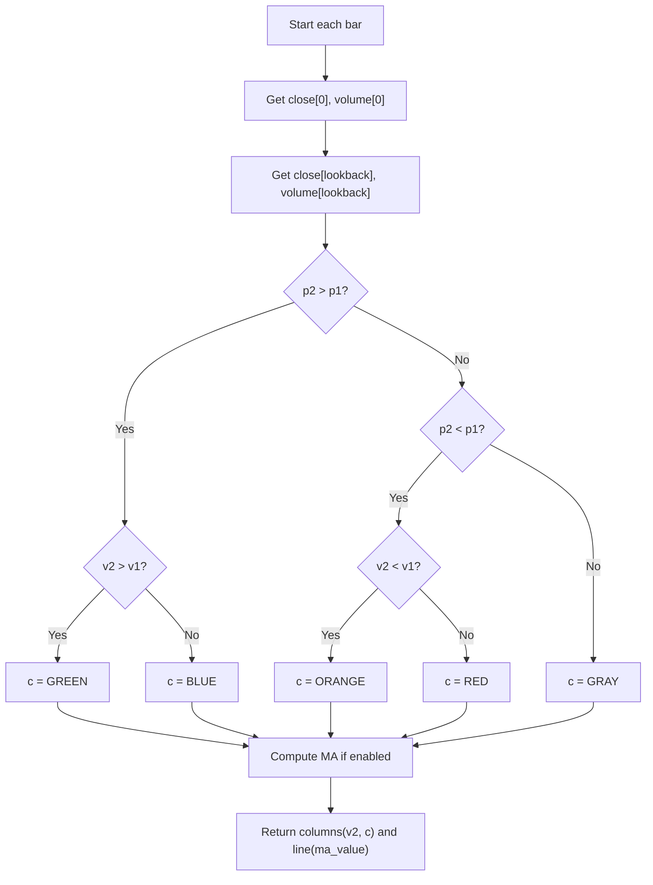

# Colored Volume Bars - Technical Guide

> Colors volume bars based on whether price and volume increased or decreased relative to a lookback period, highlighting market strength.

| | |
| --- | --- |
| **Language** | Indie Script v5 |
| **Platform** | [TakeProfit](https://takeprofit.com) |
| **Category** | Volume |
| **Type** | Indicator |
| **Author** | @pavel_medvedev on TakeProfit |
| **Original (TradingView)** | [Colored Volume Bars [LazyBear]](https://www.tradingview.com/scripts/lazybear/) by LazyBear (author's script list; the original page was not located) |
| **License** | MIT |
| **Live script** | [Open on TakeProfit](https://takeprofit.com/indicator/colored-volume-bars-1) |
| **Source file** | [Colored Volume Bars.indie5](Colored%20Volume%20Bars.indie5) |

## Overview

Colored Volume Bars is a volume analysis indicator that compares the current bar's close price and volume to those from a configurable number of bars ago (the lookback period). It assigns one of four colors to each volume bar based on the combination of price and volume direction: green (price up, volume up), blue (price up, volume down), orange (price down, volume down), or red (price down, volume up). When price and volume are unchanged, the bar is drawn in gray.

The indicator is intended to help traders quickly identify momentum shifts, confirm breakouts, and filter low-quality signals by showing the strength behind price moves. On the chart it draws colored volume columns (histogram) and, optionally, a volume moving average line that smooths volume data for additional context.

## How it works

1. Retrieve the current bar's close price and volume.
2. Retrieve the close price and volume from 'lookback' bars ago.
3. Compare the current price to the lookback price and the current volume to the lookback volume.
4. Assign a color based on the four possible combinations of price and volume direction.
5. If the 'show_ma' setting is enabled, compute a simple moving average of volume over the 'length_ma' period.
6. Return the volume column with the assigned color and, optionally, the moving average line.

## Logic flow



## Parameters

| Parameter | Type | Default | Range | Description |
| --- | --- | --- | --- | --- |
| `lookback` | int | 10 | ≥ 1 | Lookback |
| `show_ma` | bool | false |  | Show MA |
| `length_ma` | int | 20 | ≥ 1 | MA Length |

## Code walkthrough

### Retrieving current and lookback values

Lines 15-18 of [Colored Volume Bars.indie5](Colored%20Volume%20Bars.indie5):

```python
    p2 = self.close[0]
    v2 = self.volume[0]
    p1 = self.close[lookback]
    v1 = self.volume[lookback]
```

Lines 15-18 fetch the current close and volume (index 0) and the close and volume from 'lookback' bars ago (index lookback). These four values are the basis for the color decision.

### Color assignment logic

Lines 20-28 of [Colored Volume Bars.indie5](Colored%20Volume%20Bars.indie5):

```python
    c: Color = color.GRAY
    if p2 > p1 and v2 > v1:
        c = color.GREEN
    elif p2 > p1 and v2 < v1:
        c = color.BLUE
    elif p2 < p1 and v2 < v1:
        c = color.ORANGE
    elif p2 < p1 and v2 > v1:
        c = color.RED
```

Lines 20-28 implement the four color conditions using if-elif. The default color is GRAY, which applies when price is unchanged. The comparisons are strict greater/less, so equal values fall through to gray.

### Volume moving average computation

Lines 30-30 of [Colored Volume Bars.indie5](Colored%20Volume%20Bars.indie5):

```python
    ma_value = Sma.new(self.volume, length_ma)[0] if show_ma else nan
```

Line 30 computes a simple moving average of volume using Sma.new, but only if 'show_ma' is true. The result is accessed with [0] to get the current bar's value. If the MA is disabled, ma_value is set to nan, which prevents the line from being drawn.

### Returning the plot elements

Lines 32-32 of [Colored Volume Bars.indie5](Colored%20Volume%20Bars.indie5):

```python
    return plot.Columns(value=v2, color=c), plot.Line(ma_value)
```

Line 32 returns a tuple containing a Columns object (the volume bar with its color) and a Line object (the MA line). The Columns value is the current volume, and the Line value is the MA or nan. The @plot decorators define the default appearance.

## Reading the chart

- **Green bar**: Price increased and volume increased – strong bullish confirmation.
- **Blue bar**: Price increased but volume decreased – weak bullish move, possible lack of conviction.
- **Orange bar**: Price decreased and volume decreased – weak bearish move, selling pressure fading.
- **Red bar**: Price decreased and volume increased – strong selling pressure, bearish confirmation.
- **Gray bar**: Price was unchanged – neutral or unclear signal.
- **Volume MA line** (optional): Shows the trend of volume over the chosen period; spikes above the line indicate above-average activity.

## Implementation notes

- The lookback comparison uses absolute bar index offset, not percentage change, so it is sensitive to the chosen lookback period.
- When price and volume are equal to the lookback values, the bar is gray because none of the strict comparisons are true.
- The volume MA uses Sma.new, which returns a series; [0] gives the current bar's value. If show_ma is false, ma_value is nan and the line is not plotted.
- The indicator repaints historically because it uses future data? No, it only uses current and past data (lookback bars ago), so it does not repaint.

## FAQ

**How do I adjust the sensitivity of the color changes?**

Change the 'lookback' parameter. A smaller lookback makes the indicator react to more recent changes, while a larger lookback compares against older bars, producing fewer color changes.

**What does the optional volume moving average line represent?**

The volume MA is a simple moving average of volume over the 'MA Length' period. It helps identify whether current volume is above or below its recent average, adding context to volume spikes.

**Can I use this indicator on intraday or multi-timeframe charts?**

Yes, the indicator uses the chart's own close and volume data. It works on any timeframe. There is no multi-timeframe logic in this code, so it only evaluates the current chart's bars.

## Attribution

Inspired by the idea of LazyBear's Colored Volume Bars. Not affiliated with or endorsed by the original author.

## Full source code

Indie Script v5, as published on TakeProfit. Copy it into the platform's script editor or [open the live script](https://takeprofit.com/indicator/colored-volume-bars-1).

```python
# indie:lang_version = 5
# Colored volume based on price and volume changes. Inspired by the original concept by LazyBear.
from math import nan
from indie import indicator, format, param, plot, color, Color
from indie.algorithms import Sma


@indicator('Colored Volume Bars', format=format.VOLUME)
@param.int('lookback', default=10, min=1, title='Lookback')
@param.bool('show_ma', default=False, title='Show MA')
@param.int('length_ma', default=20, min=1, title='MA Length')
@plot.columns(title='Volume')
@plot.line(color=color.rgba(128, 0, 0, 1.0), title='Volume MA')
def Main(self, lookback, show_ma, length_ma):
    p2 = self.close[0]
    v2 = self.volume[0]
    p1 = self.close[lookback]
    v1 = self.volume[lookback]

    c: Color = color.GRAY
    if p2 > p1 and v2 > v1:
        c = color.GREEN
    elif p2 > p1 and v2 < v1:
        c = color.BLUE
    elif p2 < p1 and v2 < v1:
        c = color.ORANGE
    elif p2 < p1 and v2 > v1:
        c = color.RED

    ma_value = Sma.new(self.volume, length_ma)[0] if show_ma else nan

    return plot.Columns(value=v2, color=c), plot.Line(ma_value)
```
