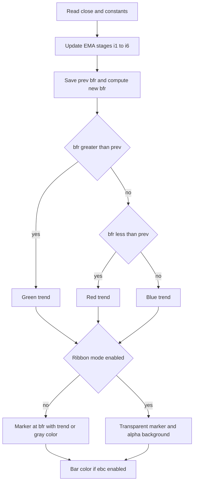

# Coral Trend (6-Stage EMA) - Technical Guide

> Six-stage EMA cascade with a polynomial weighting scheme that draws a green/red/blue trend line and optional ribbon or bar coloring.

| | |
| --- | --- |
| **Language** | Indie Script v5 |
| **Platform** | [TakeProfit](https://takeprofit.com) |
| **Category** | Trend |
| **Type** | Indicator |
| **Author** | @insurgent on TakeProfit |
| **License** | MIT |
| **Live script** | [Open on TakeProfit](https://takeprofit.com/indicator/coral-trend-6-stage-ema-36) |
| **Source file** | [Coral Trend (6-Stage EMA).indie5](Coral%20Trend%20(6-Stage%20EMA).indie5) |

## Overview

Coral Trend is an overlay indicator that smooths price through six recursively applied EMA stages and then combines the last four stages with polynomial weights controlled by `cd`. It produces a single trend curve (`bfr`) that reflects the dominant directional structure while filtering high-frequency noise. In normal mode the chart shows a circle marker on the curve: green when the curve rose, red when it fell, blue when unchanged.

Optional ribbon mode replaces the visible marker with a semi-transparent background shaded by the current direction, and optional bar-color mode paints candles with the same direction colors. The two user inputs, `sm` and `cd`, control smoothing length and the weighting balance of the final bandpass combination. The indicator is intended as a structural trend filter rather than a standalone entry trigger.

## How it works

1. Compute `di`, `c1`, `c2`, `c3`, `c4`, `c5` from the `sm` and `cd` inputs.
2. Create six `MutSeriesF` EMA stages (`i1` through `i6`) with initial value `0.0`.
3. Update `i1` from close with `c1`/`c2`, then cascade `i2` through `i6`, each stage being an EMA of the previous stage.
4. Save the previous bar's `bfr` value into `prev_bfr` before recalculating.
5. Calculate new `bfr` as a weighted polynomial combination of `i6`, `i5`, `i4`, and `i3`.
6. Compare new `bfr` with `prev_bfr` to assign green (rising), red (falling), or blue (flat).
7. Assemble marker, background, and bar-color outputs according to the `ribm` and `ebc` flags.

## Mathematical model

$$
d = cd,\quad di=\frac{sm-1}{2}+1,\quad c1=\frac{2}{di+1},\quad c2=1-c1
$$

$$
p_0 = s\;(\text{close}),\quad p_k = c1\,p_{k-1} + c2\,p_k',\quad k=1,\dots,6
$$

$$
bfr = -d^3 p_6 + 3(d^2+d^3)p_5 - 3(2d^2+d+d^3)p_4 + (3d+1+d^3+3d^2)p_3
$$

## Logic flow



## Parameters

| Parameter | Type | Default | Range | Description |
| --- | --- | --- | --- | --- |
| `sm` | int | 21 | ≥ 1 | Smoothing Period |
| `cd` | float | 0.4 |  | Constant D |
| `ebc` | bool | false |  | Color Bars |
| `ribm` | bool | false |  | Ribbon Mode |

## Code walkthrough

### Parameter and coefficient setup

Lines 22-27 of [Coral Trend (6-Stage EMA).indie5](Coral%20Trend%20(6-Stage%20EMA).indie5):

```python
    di = (sm - 1.0) / 2.0 + 1.0
    c1 = 2.0 / (di + 1.0)
    c2 = 1.0 - c1
    c3 = 3.0 * (cd * cd + cd * cd * cd)
    c4 = -3.0 * (2.0 * cd * cd + cd + cd * cd * cd)
    c5 = 3.0 * cd + 1.0 + cd * cd * cd + 3.0 * cd * cd
```

These lines derive all smoothing constants from the user inputs. `di` converts `sm` into a period-like value, `c1` is the standard EMA alpha `2/(di+1)`, and `c2` is its complement. `c3`, `c4`, and `c5` are polynomial coefficients that weight the later EMA stages in the final bandpass combination; changing `cd` reshapes this weighting.

### Six-stage recursive EMA chain

Lines 29-46 of [Coral Trend (6-Stage EMA).indie5](Coral%20Trend%20(6-Stage%20EMA).indie5):

```python
    # Recursive EMA chain (i1 through i6)
    i1 = MutSeriesF.new(init=0.0)
    i1[0] = c1 * src + c2 * i1[0]

    i2 = MutSeriesF.new(init=0.0)
    i2[0] = c1 * i1[0] + c2 * i2[0]

    i3 = MutSeriesF.new(init=0.0)
    i3[0] = c1 * i2[0] + c2 * i3[0]

    i4 = MutSeriesF.new(init=0.0)
    i4[0] = c1 * i3[0] + c2 * i4[0]

    i5 = MutSeriesF.new(init=0.0)
    i5[0] = c1 * i4[0] + c2 * i5[0]

    i6 = MutSeriesF.new(init=0.0)
    i6[0] = c1 * i5[0] + c2 * i6[0]
```

Each `i1..i6` is a `MutSeriesF` that retains its previous bar's value. `i1` is an EMA of close, and each subsequent stage is an EMA of the previous stage, producing a six-level cascade. The right-hand `i1[0]` is read before the assignment, so it acts as the previous bar value. This cascade is the core noise-reduction mechanism.

### Bandpass result and trend direction

Lines 48-58 of [Coral Trend (6-Stage EMA).indie5](Coral%20Trend%20(6-Stage%20EMA).indie5):

```python
    # Bandpass filter result
    bfr = MutSeriesF.new(init=0.0)
    prev_bfr = bfr[0]
    bfr[0] = -cd * cd * cd * i6[0] + c3 * i5[0] + c4 * i4[0] + c5 * i3[0]

    # Trend color: green=rising, red=falling, blue=flat
    trend_color = color.BLUE
    if bfr[0] > prev_bfr:
        trend_color = color.GREEN
    elif bfr[0] < prev_bfr:
        trend_color = color.RED
```

`bfr` is another `MutSeriesF`. The old `bfr` value is saved to `prev_bfr` before the new value is computed. The new `bfr` is a weighted sum of the last four EMA stages using `c3`, `c4`, `c5`, and `-cd^3`. Comparing the new and previous `bfr` assigns green for rising, red for falling, or blue if equal.

### Output construction

Lines 61-76 of [Coral Trend (6-Stage EMA).indie5](Coral%20Trend%20(6-Stage%20EMA).indie5):

```python
    marker_color = color.TRANSPARENT
    marker_value = self.close[0]
    if not ribm:
        marker_color = color.GRAY if ebc else trend_color
        marker_value = bfr[0]
    marker_result = plot.Marker(value=marker_value, color=marker_color)

    # Background: colored ribbon when in ribbon mode
    bg_color = trend_color(0.5) if ribm else color.TRANSPARENT
    bg_result = plot.Background(color=bg_color)

    # Bar color: color bars when enabled
    bar_c = trend_color if ebc else None
    bar_result = plot.BarColor(color=bar_c)

    return marker_result, bg_result, bar_result
```

The output tuple is assembled according to flags. In normal mode, a circle marker is drawn at `bfr`, colored by trend, or gray when `ebc` is on so bar colors carry the direction. In ribbon mode, the marker becomes transparent and the background is a semi-transparent trend color. Bar color is applied only when `ebc` is true.

## Reading the chart

- **Green marker/background** means the `bfr` value increased from the previous bar.
- **Red marker/background** means the `bfr` value decreased from the previous bar.
- **Blue marker/background** means `bfr` is exactly equal to the previous bar's `bfr`; this is rare with floating-point prices.
- **Gray markers** appear only when Color Bars (`ebc`) is enabled and Ribbon Mode is off; the marker color is suppressed so candles carry the green/red/blue direction.
- **Ribbon Mode** turns off the visible marker and instead tints the chart background with a semi-transparent version of the current trend color.
- **Bar coloring** paints the current candle in the trend color when `ebc` is true.

## Implementation notes

- All `MutSeriesF` values start at `0.0`, so early bars are a warm-up until the EMA cascade and `bfr` converge.
- The flat blue state only occurs when consecutive `bfr` values are exactly equal, which is rare with floating-point arithmetic.
- In ribbon mode the marker is still created but uses `color.TRANSPARENT`, so it is invisible.
- The decorator constrains `sm` with `min=1` while `cd` has no min/max; `isnan` is imported but never called, so there is no explicit NaN guard.

## FAQ

**What does the Constant D (`cd`) input change?**

`cd` appears only in the `bfr` combination: it directly sets the negative `i6` coefficient and is used to build `c3`, `c4`, and `c5`. Changing it shifts the weighting balance among the later EMA stages.

**Why do some markers appear blue?**

Blue is assigned when the new `bfr` value is neither greater nor less than the previous bar's `bfr`, meaning the trend is exactly flat. With float arithmetic this state is seldom seen.

**How do I show the ribbon instead of the line?**

Set the Ribbon Mode (`ribm`) input to `true`. The marker becomes transparent and the chart background is colored with a semi-transparent trend color, so the `bfr` curve is not drawn.

## Full source code

Indie Script v5, as published on TakeProfit. Copy it into the platform's script editor or [open the live script](https://takeprofit.com/indicator/coral-trend-6-stage-ema-36).

```python
# indie:lang_version = 5
from math import isnan
from indie import indicator, MutSeriesF, param, plot, color


@indicator('Coral Trend', overlay_main_pane=True)
@param.int('sm', default=21, min=1, title='Smoothing Period')
@param.float('cd', default=0.4, title='Constant D')
@param.bool('ebc', default=False, title='Color Bars')
@param.bool('ribm', default=False, title='Ribbon Mode')
@plot.marker(
    style=plot.marker_style.CIRCLE,
    position=plot.marker_position.CENTER,
    size=5,
    title='Trend',
)
@plot.background(title='Ribbon')
@plot.bar_color(title='Bar Color')
def Main(self, sm, cd, ebc, ribm):
    src = self.close[0]

    di = (sm - 1.0) / 2.0 + 1.0
    c1 = 2.0 / (di + 1.0)
    c2 = 1.0 - c1
    c3 = 3.0 * (cd * cd + cd * cd * cd)
    c4 = -3.0 * (2.0 * cd * cd + cd + cd * cd * cd)
    c5 = 3.0 * cd + 1.0 + cd * cd * cd + 3.0 * cd * cd

    # Recursive EMA chain (i1 through i6)
    i1 = MutSeriesF.new(init=0.0)
    i1[0] = c1 * src + c2 * i1[0]

    i2 = MutSeriesF.new(init=0.0)
    i2[0] = c1 * i1[0] + c2 * i2[0]

    i3 = MutSeriesF.new(init=0.0)
    i3[0] = c1 * i2[0] + c2 * i3[0]

    i4 = MutSeriesF.new(init=0.0)
    i4[0] = c1 * i3[0] + c2 * i4[0]

    i5 = MutSeriesF.new(init=0.0)
    i5[0] = c1 * i4[0] + c2 * i5[0]

    i6 = MutSeriesF.new(init=0.0)
    i6[0] = c1 * i5[0] + c2 * i6[0]

    # Bandpass filter result
    bfr = MutSeriesF.new(init=0.0)
    prev_bfr = bfr[0]
    bfr[0] = -cd * cd * cd * i6[0] + c3 * i5[0] + c4 * i4[0] + c5 * i3[0]

    # Trend color: green=rising, red=falling, blue=flat
    trend_color = color.BLUE
    if bfr[0] > prev_bfr:
        trend_color = color.GREEN
    elif bfr[0] < prev_bfr:
        trend_color = color.RED

    # Marker: circles when not in ribbon mode
    marker_color = color.TRANSPARENT
    marker_value = self.close[0]
    if not ribm:
        marker_color = color.GRAY if ebc else trend_color
        marker_value = bfr[0]
    marker_result = plot.Marker(value=marker_value, color=marker_color)

    # Background: colored ribbon when in ribbon mode
    bg_color = trend_color(0.5) if ribm else color.TRANSPARENT
    bg_result = plot.Background(color=bg_color)

    # Bar color: color bars when enabled
    bar_c = trend_color if ebc else None
    bar_result = plot.BarColor(color=bar_c)

    return marker_result, bg_result, bar_result
```
