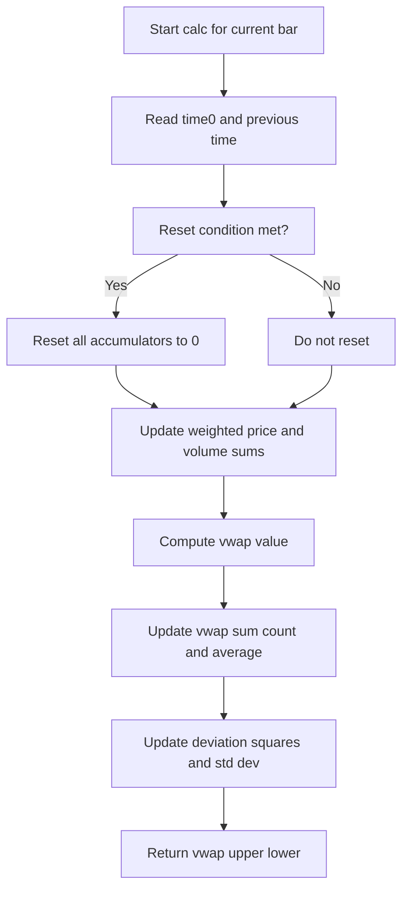

# Custom VWAP - usage example of indie.Schedule class - Technical Guide

> Computes a volume-weighted average price with upper and lower standard deviation bands, using configurable calendar, session, or custom schedule anchors.

| | |
| --- | --- |
| **Language** | Indie Script v5 |
| **Platform** | [TakeProfit](https://takeprofit.com) |
| **Category** | Demos & templates |
| **Type** | Indicator |
| **Author** | @TakeProfit on TakeProfit |
| **License** | licensed under the MIT License (see the header of the source file) |
| **Live script** | [Open on TakeProfit](https://takeprofit.com/indicator/custom-vwap-usage-example-of-indie-schedule-class-23) |
| **Source file** | [Custom VWAP - usage example of indie.Schedule class.indie5](Custom%20VWAP%20-%20usage%20example%20of%20indie.Schedule%20class.indie5) |

## Overview

Custom VWAP computes a volume-weighted average price in a configurable anchor window and plots it as a blue line on the main chart. Green lines show the VWAP plus/minus one standard deviation band, and a semi-transparent green fill is drawn between them.

The anchor can be the trading session, calendar day/week/month/year, or a custom `Schedule`. The example schedule is a 24-hour rule starting at 00:00 in `America/New_York`, so the VWAP resets at midnight New York time instead of the default platform session boundary. The `offset` parameter shifts the plotted lines by a number of bars without changing the calculation.

## How it works

1. In `Main.__init__`, create a custom `Schedule` with a 24-hour `ScheduleRule` from midnight to midnight in `America/New_York`.
2. Initialize persistent accumulator variables using `Var.new` for weighted price, volume, VWAP sum/count, and squared deviations.
3. Convert `ctx.time[0]` and previous bar time to UTC datetimes for calendar anchor comparisons.
4. Check reset conditions: `Schedule` and `Session` use `is_same_period`; `Day`, `Week`, `Month`, and `Year` compare calendar fields.
5. If reset is needed, zero all accumulators with `.set(0)`.
6. Update cumulative weighted price and cumulative volume, then compute `vwap_value` as their ratio.
7. Update running VWAP sum/count, average, squared deviations, and `vwap_std_dev`.
8. Build `MutSeriesF` outputs for VWAP, upper, and lower bands, and return them for plotting.

## Mathematical model

$$
\text{VWAP} = \frac{\sum \text{src}_i \cdot \text{volume}_i}{\sum \text{volume}_i}
$$

$$
\mathrm{vwap\_avg} = \frac{\sum \mathrm{vwap\_value}_i}{n}
$$

$$
\sigma = \sqrt{\frac{\mathrm{vwap\_dev\_squares}}{n}}
$$

$$
\mathrm{vwap\_dev\_squares} \leftarrow \mathrm{vwap\_dev\_squares} + (\mathrm{vwap\_value} - \mathrm{vwap\_avg})^2
$$

## Logic flow



## Parameters

| Parameter | Type | Default | Range | Description |
| --- | --- | --- | --- | --- |
| `src` | source | source.HLC3 |  | Source |
| `anchor` | str | Schedule |  | Anchor |
| `offset` | int | 0 | -500 - 500 | Offset |

## Code walkthrough

### Persistent Vars and timestamps

Lines 20-28 of [Custom VWAP - usage example of indie.Schedule class.indie5](Custom%20VWAP%20-%20usage%20example%20of%20indie.Schedule%20class.indie5):

```python
    cum_weighted_price = Var[float].new(0)
    cum_volume = Var[float].new(0)
    vwap_sum = Var[float].new(0)
    vwap_count = Var[int].new(0)
    vwap_dev_squares = Var[float].new(0)

    current_datetime = datetime.utcfromtimestamp(self.ctx.time[0])
    prev_datetime = datetime.utcfromtimestamp(self.ctx.time.get(1, 0))
    need_reset = False
```

`Var[float].new(0)` and `Var[int].new(0)` hold state across bars. The algorithm reads the current bar's epoch time and the previous bar's epoch time with `ctx.time.get(1, 0)`, then uses `utcfromtimestamp` to work with UTC datetimes for calendar comparisons.

### Schedule and Session reset detection

Lines 30-38 of [Custom VWAP - usage example of indie.Schedule class.indie5](Custom%20VWAP%20-%20usage%20example%20of%20indie.Schedule%20class.indie5):

```python
    if anchor == 'Schedule' and schedule is None:
        raise IndieError("Schedule parameter cannot be None when anchor is set to 'Schedule'")

    if anchor == 'Schedule' and \
            not schedule.value().is_same_period(self.ctx.time[0], self.ctx.time.get(1, 0)):
        need_reset = True
    if anchor == 'Session' and \
            not self.ctx.trading_session.is_same_period(self.ctx.time[0], self.ctx.time.get(1, 0)):
        need_reset = True
```

If `anchor` is `Schedule`, `schedule.value().is_same_period` compares the current and previous timestamps; if they are not in the same scheduled period, `need_reset` is set. For `Session`, the same logic uses `ctx.trading_session.is_same_period`. A missing schedule with `Schedule` anchor raises `IndieError`.

### Calendar anchor reset logic

Lines 39-49 of [Custom VWAP - usage example of indie.Schedule class.indie5](Custom%20VWAP%20-%20usage%20example%20of%20indie.Schedule%20class.indie5):

```python
    if anchor == 'Day' and (current_datetime.day != prev_datetime.day or
                            (current_datetime-prev_datetime).days >= 1):
        need_reset = True
    elif anchor == 'Week' and ((current_datetime.weekday() == 0 and prev_datetime.weekday() != 0) or
                               (current_datetime-prev_datetime).days >= 7):
        need_reset = True
    elif anchor == 'Month' and (current_datetime.month != prev_datetime.month or
                                (current_datetime-prev_datetime).days >= 31):
        need_reset = True
    elif anchor == 'Year' and current_datetime.year != prev_datetime.year:
        need_reset = True
```

This branch handles `Day`, `Week`, `Month`, and `Year`. A week resets when the current day is Monday and the previous day was not, or when the gap is at least seven days. Month resets on a month change or a 31-day gap, while year only compares the year field.

### Resetting and computing VWAP

Lines 51-60 of [Custom VWAP - usage example of indie.Schedule class.indie5](Custom%20VWAP%20-%20usage%20example%20of%20indie.Schedule%20class.indie5):

```python
    if need_reset:
        cum_weighted_price.set(0)
        cum_volume.set(0)
        vwap_sum.set(0)
        vwap_count.set(0)
        vwap_dev_squares.set(0)

    cum_weighted_price.set(cum_weighted_price.get() + src[0] * self.ctx.volume[0])
    cum_volume.set(cum_volume.get() + self.ctx.volume[0])
    vwap_value = cum_weighted_price.get() / cum_volume.get()
```

When a reset is detected, all accumulators are zeroed before processing the current bar. Then the current `src[0] * ctx.volume[0]` is added to the weighted-price accumulator, `ctx.volume[0]` is added to the volume accumulator, and `vwap_value` is the division of the two.

### Running average, deviation, and return

Lines 62-72 of [Custom VWAP - usage example of indie.Schedule class.indie5](Custom%20VWAP%20-%20usage%20example%20of%20indie.Schedule%20class.indie5):

```python
    vwap_sum.set(vwap_sum.get() + vwap_value)
    vwap_count.set(vwap_count.get() + 1)
    vwap_avg = vwap_sum.get() / vwap_count.get()
    vwap_dev_squares.set(vwap_dev_squares.get() + (vwap_value - vwap_avg) ** 2)
    vwap_std_dev = sqrt(vwap_dev_squares.get() / vwap_count.get())

    std_dev = std_dev_mult * vwap_std_dev
    lower = MutSeriesF.new(vwap_value - std_dev)
    upper = MutSeriesF.new(vwap_value + std_dev)

    return MutSeriesF.new(vwap_value), upper, lower
```

The script maintains a running average of the VWAP values themselves. Each new VWAP value is added to `vwap_dev_squares` using the updated mean, then `sqrt(vwap_dev_squares / vwap_count)` gives the standard deviation. `MutSeriesF.new` creates series values so `Main.calc` can read them with `[0]`.

### Schedule creation in Main.__init__

Lines 83-88 of [Custom VWAP - usage example of indie.Schedule class.indie5](Custom%20VWAP%20-%20usage%20example%20of%20indie.Schedule%20class.indie5):

```python
    def __init__(self, src, anchor, offset):
        rule = ScheduleRule(start=time(hour=0), end=time(hour=0)) # 24-hour rule
        self.schedule = Schedule(rules=[rule], timezone='America/New_York')
        self.src = src
        self.anchor = anchor
        self.offset = offset
```

The custom schedule is built once in `__init__` rather than on every bar. A `ScheduleRule` with equal start and end times represents a 24-hour cycle, and the `timezone='America/New_York'` argument places the reset boundary at midnight New York time.

## Reading the chart

- The blue line is `vwap`; its value is cumulative `src * volume` divided by cumulative volume since the last reset.
- The green lines are `upper` and `lower`, drawn at `vwap_value +/- std_dev`, where `std_dev` comes from `sqrt(vwap_dev_squares / vwap_count)` multiplied by `std_dev_mult = 1.0`.
- The semi-transparent green fill between the green lines is rendered by `plot1.Fill()`.
- If `offset` is non-zero, the plotted lines are shifted horizontally by that many bars; the underlying calculation is unaffected.
- At each anchor boundary the accumulators are zeroed, so the VWAP and bands restart from the current bar.

## Implementation notes

- The `Schedule` object is built in `Main.__init__` because recreating it inside `calc` on every bar would be inefficient.
- `std_dev_mult` is accepted by `Vwap.new` but `Main.calc` passes the literal `1.0`, so the UI does not expose it.
- The deviation accumulator adds `(vwap_value - vwap_avg)^2` using the updated average, so it is not an exact full recomputation of the standard deviation.
- If cumulative volume remains zero, `vwap_value` divides by zero; the script has no explicit guard for this edge case.

## FAQ

**How can I change the custom reset time?**

Edit the `ScheduleRule` in `Main.__init__`; for example, change `start=time(hour=0), end=time(hour=0)` to `start=time(hour=16), end=time(hour=16)` for 16:00 New York time. The timezone is set by the `Schedule` constructor's `timezone` argument.

**Can I use the platform's normal session instead of a custom schedule?**

Yes. Select `Session` in the anchor parameter. The reset boundary is then determined by `ctx.trading_session.is_same_period` instead of the custom schedule. The script defaults to `Schedule`.

**Why is there no UI setting for the standard deviation multiplier?**

`std_dev_mult` is a parameter of `Vwap`, but `Main.calc` passes a literal `1.0`. To expose it, add a parameter decorator in `Main.__init__` and pass that value instead of `1.0`.

## Full source code

Indie Script v5, as published on TakeProfit. Copy it into the platform's script editor or [open the live script](https://takeprofit.com/indicator/custom-vwap-usage-example-of-indie-schedule-class-23).

```python
# Copyright (c) 2024 @TakeProfit. All rights reserved.

# This work is licensed under the MIT License.
# For a copy, see <https://opensource.org/licenses/MIT>.

# indie:lang_version = 5
from math import sqrt
from datetime import datetime, time
from indie import algorithm, SeriesF, MutSeriesF, Var, Optional, IndieError, MainContext, plot as plot1
from indie import indicator, param, source, plot, color
from indie.schedule import Schedule, ScheduleRule


@algorithm
def Vwap(self, src: SeriesF, anchor: str, std_dev_mult: float, schedule: Optional[Schedule] = None) -> tuple[SeriesF, SeriesF, SeriesF]:
    '''
    Custom Volume Weighted Average Price
    anchor can be 'Session', 'Day', 'Week', 'Month', 'Year', 'Schedule'
    '''
    cum_weighted_price = Var[float].new(0)
    cum_volume = Var[float].new(0)
    vwap_sum = Var[float].new(0)
    vwap_count = Var[int].new(0)
    vwap_dev_squares = Var[float].new(0)

    current_datetime = datetime.utcfromtimestamp(self.ctx.time[0])
    prev_datetime = datetime.utcfromtimestamp(self.ctx.time.get(1, 0))
    need_reset = False
    
    if anchor == 'Schedule' and schedule is None:
        raise IndieError("Schedule parameter cannot be None when anchor is set to 'Schedule'")

    if anchor == 'Schedule' and \
            not schedule.value().is_same_period(self.ctx.time[0], self.ctx.time.get(1, 0)):
        need_reset = True
    if anchor == 'Session' and \
            not self.ctx.trading_session.is_same_period(self.ctx.time[0], self.ctx.time.get(1, 0)):
        need_reset = True
    if anchor == 'Day' and (current_datetime.day != prev_datetime.day or
                            (current_datetime-prev_datetime).days >= 1):
        need_reset = True
    elif anchor == 'Week' and ((current_datetime.weekday() == 0 and prev_datetime.weekday() != 0) or
                               (current_datetime-prev_datetime).days >= 7):
        need_reset = True
    elif anchor == 'Month' and (current_datetime.month != prev_datetime.month or
                                (current_datetime-prev_datetime).days >= 31):
        need_reset = True
    elif anchor == 'Year' and current_datetime.year != prev_datetime.year:
        need_reset = True

    if need_reset:
        cum_weighted_price.set(0)
        cum_volume.set(0)
        vwap_sum.set(0)
        vwap_count.set(0)
        vwap_dev_squares.set(0)

    cum_weighted_price.set(cum_weighted_price.get() + src[0] * self.ctx.volume[0])
    cum_volume.set(cum_volume.get() + self.ctx.volume[0])
    vwap_value = cum_weighted_price.get() / cum_volume.get()

    vwap_sum.set(vwap_sum.get() + vwap_value)
    vwap_count.set(vwap_count.get() + 1)
    vwap_avg = vwap_sum.get() / vwap_count.get()
    vwap_dev_squares.set(vwap_dev_squares.get() + (vwap_value - vwap_avg) ** 2)
    vwap_std_dev = sqrt(vwap_dev_squares.get() / vwap_count.get())

    std_dev = std_dev_mult * vwap_std_dev
    lower = MutSeriesF.new(vwap_value - std_dev)
    upper = MutSeriesF.new(vwap_value + std_dev)

    return MutSeriesF.new(vwap_value), upper, lower

@indicator('Custom VWAP', overlay_main_pane=True)  # Volume Weighted Average Price
@param.source('src', default=source.HLC3, title='Source')
@param.str('anchor', default='Schedule', options=['Session', 'Day', 'Week', 'Month', 'Year', 'Schedule'], title='Anchor')
@param.int('offset', default=0, min=-500, max=500, title='Offset')
@plot.line('vwap', title='VWAP', color=color.BLUE)
@plot.line('upper', title='Upper band', color=color.GREEN)
@plot.line('lower', title='Lower band', color=color.GREEN)
@plot1.fill('upper', 'lower', color=color.GREEN(0.1), title='Background', id='#fill_3')
class Main(MainContext):
    def __init__(self, src, anchor, offset):
        rule = ScheduleRule(start=time(hour=0), end=time(hour=0)) # 24-hour rule
        self.schedule = Schedule(rules=[rule], timezone='America/New_York')
        self.src = src
        self.anchor = anchor
        self.offset = offset

    def calc(self):
        std_dev_mult = 1.0
        main_line, upper, lower = Vwap.new(self.src, self.anchor, std_dev_mult, self.schedule)
        return (
            plot1.Line(main_line[0], offset=self.offset),
            plot1.Line(upper[0], offset=self.offset),
            plot1.Line(lower[0], offset=self.offset),
            plot1.Fill(),
        )
```
