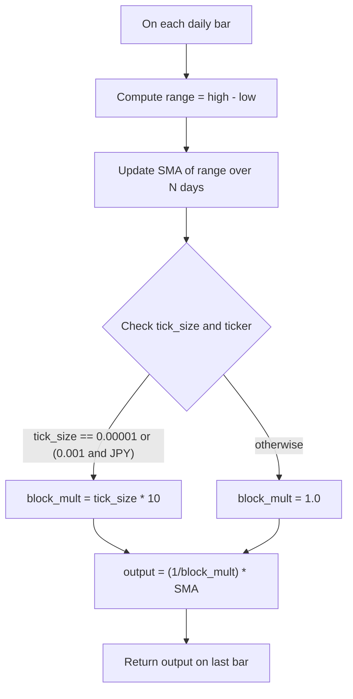

# Daily Range - Technical Guide

> Computes the average daily range over a configurable number of days (default 50) as a take-profit reference.

| | |
| --- | --- |
| **Language** | Indie Script v5 |
| **Platform** | [TakeProfit](https://takeprofit.com) |
| **Category** | Volatility |
| **Type** | Indicator |
| **Author** | @dr_jones on TakeProfit |
| **Original** | Ported to Indie from https://www.tradingview.com/v/XwKEDE3y/ created by @AndreSolbach |
| **License** | MPL-2.0 (see the header of the source file) |
| **Live script** | [Open on TakeProfit](https://takeprofit.com/indicator/daily-range-48) |
| **Source file** | [Daily Range.indie5](Daily%20Range.indie5) |

## Overview

This indicator calculates the simple moving average of the daily high-low range, scaled based on the instrument's tick size, which yields pips only for certain tick sizes. It is designed to provide a volatility estimate that can be used as a potential take-profit target, as referenced in Stefan Kassing's trading system.

The indicator plots a single line on the main chart pane. The line updates on each bar, reflecting the average daily range over the specified period. Higher values indicate higher recent volatility, while lower values suggest calmer market conditions.

## How it works

1. On each daily bar, compute the difference between the high and low prices.
2. Maintain a simple moving average (SMA) of these daily ranges over a user-defined number of days (default 50).
3. Scale the SMA by a factor derived from the instrument's tick size: for JPY pairs with tick_size 0.001, multiply by 100; for tick_size 0.00001, multiply by 10000; otherwise no scaling (raw price units).
4. The calculation is performed on the daily timeframe using `sec_context` and then mapped to the current chart's timeframe with `lookahead=True`.
5. The result is returned only for the last bar (`is_last_bar`) and plotted as a line on the main chart pane.

## Mathematical model

$$
\text{block\_mult} = \begin{cases} 
tick\_size \times 10 & \text{if } tick\_size = 0.00001 \text{ or } (tick\_size = 0.001 \text{ and } \text{'JPY' in ticker}) \\
1.0 & \text{otherwise}
\end{cases}
$$

$$
\text{output} = \frac{1}{\text{block\_mult}} \times \text{SMA}(\text{high} - \text{low}, N)
$$

## Logic flow



## Parameters

| Parameter | Type | Default | Range | Description |
| --- | --- | --- | --- | --- |
| `days_used_for_calculation` | int | 50 | ≥ 1 | Days used for calculation |

## Code walkthrough

### HighLowSma function – scaling and SMA computation

Lines 15-21 of [Daily Range.indie5](Daily%20Range.indie5):

```python
def HighLowSma(self, days_used_for_calculation):
    block_mult = nan
    if self.is_last_bar:
        block_mult = 1.0
        if self.info.tick_size == 0.00001 or self.info.tick_size == 0.001 and 'JPY' in self.info.ticker:
            block_mult = self.info.tick_size * 10
    return 1 / block_mult * Sma.new(MutSeriesF.new(self.high[0] - self.low[0]), days_used_for_calculation)[0]
```

This function is executed on the daily timeframe. Only on the last bar, it determines a scaling factor `block_mult` based on the instrument's tick size and whether the ticker contains 'JPY'; otherwise `block_mult` remains `nan`. For typical forex pairs with tick_size 0.0001, `block_mult` remains 1.0, so no scaling. For JPY pairs (tick_size 0.001) or 5-decimal pairs (tick_size 0.00001), `block_mult` is set to tick_size * 10, resulting in a multiplication factor of 100 or 10000 respectively to convert the raw range into pips. The function then returns the SMA of the daily high-low difference multiplied by the inverse of `block_mult`.

### Main class – indicator definition and daily calculation

Lines 23-31 of [Daily Range.indie5](Daily%20Range.indie5):

```python
@indicator('Daily Range', format=format.PRICE, precision=2, overlay_main_pane=True)
@param.int('days_used_for_calculation', default=50, min=1, title='Days used for calculation')
@plot.line(color=color.rgba(233, 30, 99), display_options=plot.LineDisplayOptions(status_line=True))
class Main(MainContext):
    def __init__(self):
        self._high_low_sma = self.calc_on(time_frame=TimeFrame.from_str('1D'), sec_context=HighLowSma, lookahead=True)

    def calc(self):
        return self._high_low_sma[0] if self.is_last_bar else nan
```

The `Main` class defines the indicator with a single line plot (color rgba(233,30,99)) and a user-configurable integer parameter `days_used_for_calculation` (default 50). In `__init__`, it uses `self.calc_on` to run the `HighLowSma` function on the daily timeframe with `lookahead=True`, meaning the daily value is available on the current chart's bar even before the daily close. The `calc` method returns the SMA value only when `self.is_last_bar` is true, otherwise `nan` to avoid plotting on historical bars that are not the current one.

## Reading the chart

* The indicator plots a single line on the main chart pane, colored magenta (rgba(233,30,99)).
* The line represents the average daily range over the selected period; it is scaled to pips only for tick_size 0.00001 or JPY pairs with tick_size 0.001, otherwise it is the raw price range.
* Higher line values indicate higher recent volatility; lower values indicate lower volatility.
* The line can be used as a reference for potential take-profit levels, as the daily range often acts as a price target within a day.

## Implementation notes

- The indicator uses `lookahead=True` to bring daily data to lower timeframes, meaning the value updates intraday as the current daily high and low develop, causing repainting on the current day.
- The scaling to pips depends on the instrument's tick size and ticker symbol; for instruments without a standard pip definition (e.g., stocks, indices), the scaling may not be meaningful.
- The SMA is computed using `MutSeriesF.new` which maintains a rolling series of daily ranges; the result is read with `[0]` for the current bar.
- The indicator only returns a value on the latest bar (`is_last_bar`); on historical bars it returns `nan`, so the plot does not form a continuous historical line.

## FAQ

**How can I change the number of days used for the average?**

Adjust the `days_used_for_calculation` parameter in the indicator settings. The default is 50, and it can be set to any integer greater than or equal to 1.

**Does the indicator repaint on the current day?**

Yes, because it uses `lookahead=True` and computes the SMA using the current day's high and low as they develop. The value will change throughout the day until the daily close.

**What does the line represent for non-forex instruments?**

For instruments without a standard pip definition (e.g., stocks, indices), the scaling factor may be 1, so the line shows the raw average daily range in price units. The indicator is primarily designed for forex pairs.

## Full source code

Indie Script v5, as published on TakeProfit. Copy it into the platform's script editor or [open the live script](https://takeprofit.com/indicator/daily-range-48).

```python
# Ported to Indie from https://www.tradingview.com/v/XwKEDE3y/ created by @AndreSolbach

# This Source Code Form is subject to the terms of the Mozilla Public License, v. 2.0.  
# If a copy of the MPL was not distributed with this file, you can obtain one at  
# <https://mozilla.org/MPL/2.0/>.


# indie:lang_version = 5
from math import nan
from indie import indicator, sec_context, param, format, MutSeriesF, param_ref, MainContext, TimeFrame, plot, color
from indie.algorithms import Sma

@sec_context
@param_ref('days_used_for_calculation')
def HighLowSma(self, days_used_for_calculation):
    block_mult = nan
    if self.is_last_bar:
        block_mult = 1.0
        if self.info.tick_size == 0.00001 or self.info.tick_size == 0.001 and 'JPY' in self.info.ticker:
            block_mult = self.info.tick_size * 10
    return 1 / block_mult * Sma.new(MutSeriesF.new(self.high[0] - self.low[0]), days_used_for_calculation)[0]

@indicator('Daily Range', format=format.PRICE, precision=2, overlay_main_pane=True)
@param.int('days_used_for_calculation', default=50, min=1, title='Days used for calculation')
@plot.line(color=color.rgba(233, 30, 99), display_options=plot.LineDisplayOptions(status_line=True))
class Main(MainContext):
    def __init__(self):
        self._high_low_sma = self.calc_on(time_frame=TimeFrame.from_str('1D'), sec_context=HighLowSma, lookahead=True)

    def calc(self):
        return self._high_low_sma[0] if self.is_last_bar else nan
```
