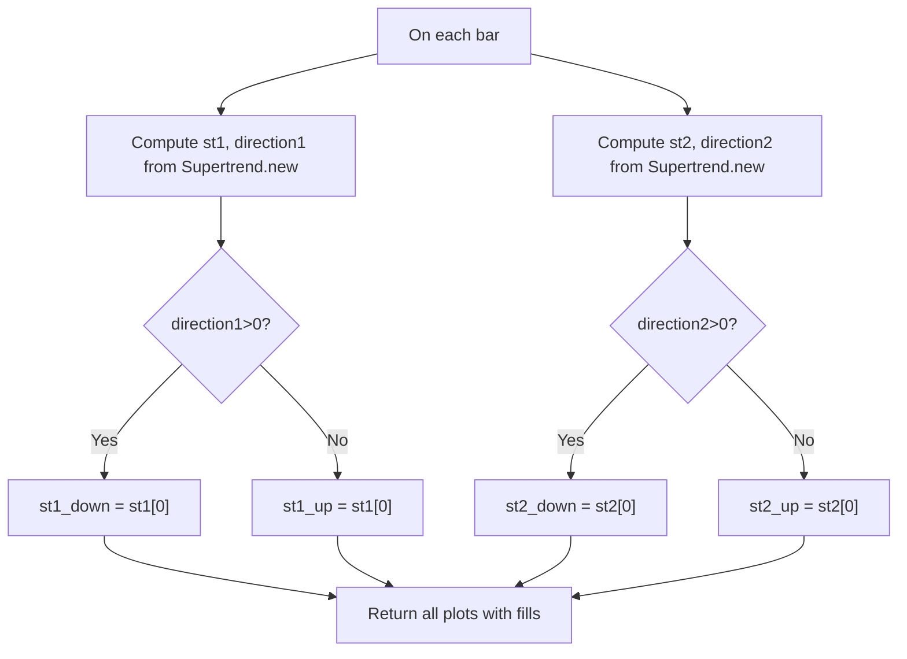

# Double - Supertrend - Technical Guide

> Combines two Supertrend calculations (fast/slow) to identify trend strength and consolidation phases.

| | |
| --- | --- |
| **Language** | Indie Script v5 |
| **Platform** | [TakeProfit](https://takeprofit.com) |
| **Category** | Trend |
| **Type** | Indicator |
| **Author** | @reinner on TakeProfit |
| **License** | MIT |
| **Live script** | [Open on TakeProfit](https://takeprofit.com/indicator/double-supertrend-45) |
| **Source file** | [Double - Supertrend.indie5](Double%20-%20Supertrend.indie5) |

## Overview

The Double Supertrend overlays two independent Supertrend lines on the price chart. The first Supertrend (ST1) uses shorter ATR period and multiplier, while the second (ST2) uses longer settings, making it react slower. This dual-layer approach helps distinguish strong trends (both lines agree) from noise or consolidation (disagreement).

When both Supertrend lines indicate an uptrend (ST1 green, ST2 light gray) and are below price, the uptrend is considered strong and confirmed. When both indicate a downtrend (ST1 red, ST2 dark gray) and are above price, a solid downtrend is present. Disagreement between the two lines signals a neutral or choppy market. The indicator also fills the area between each Supertrend line and a middle line (average of open and close) for visual clarity.

## How it works

1. Two Supertrend instances are created with user-configurable ATR periods, multipliers, and moving average algorithms.
2. For each Supertrend, the direction value from the algorithm determines whether the line is drawn as uptrend (green for ST1, light gray for ST2) or downtrend (red for ST1, dark gray for ST2).
3. Current bar value st[0] is assigned to the appropriate plot variable, or NaN (not drawn) if direction does not match.
4. A middle line is computed as (open + close) / 2 and used as the base for filled regions between it and each trend line.
5. Color-coded fills (partially transparent) are applied between the middle line and the up/down trend lines for visual separation.

## Mathematical model

$$
\text{middle} = \frac{\text{open} + \text{close}}{2}
$$

## Logic flow



## Parameters

| Parameter | Type | Default | Range | Description |
| --- | --- | --- | --- | --- |
| `atr_period_1` | int | 10 | ≥ 1 |  |
| `factor_1` | float | 2.0 |  |  |
| `ma_algorithm_1` | str | RMA |  |  |
| `atr_period_2` | int | 20 | ≥ 1 |  |
| `factor_2` | float | 8.5 |  |  |
| `ma_algorithm_2` | str | RMA |  |  |

## Code walkthrough

### Parameter and Plot Decorators

Lines 9-31 of [Double - Supertrend.indie5](Double%20-%20Supertrend.indie5):

```python
# Supertrend 1
@param.int('atr_period_1', default=10, min=1)
@param.float('factor_1', default=2.0)
@param.str('ma_algorithm_1', default='RMA', options=['RMA', 'SMA', 'EMA', 'WMA'])

# Supertrend 2
@param.int('atr_period_2', default=20, min=1)
@param.float('factor_2', default=8.5)
@param.str('ma_algorithm_2', default='RMA', options=['RMA', 'SMA', 'EMA', 'WMA'])

# ST1
@plot.line('middle_1', color=color.GRAY(0.5), title='Body Middle 1')
@plot.line('down_1', color=color.RED, title='Down Trend 1')
@plot.line('up_1', color=color.GREEN, title='Up Trend 1')
@plot.fill('down_1', 'middle_1', color=color.RED(0.1), title='Down-Middle Fill 1')
@plot.fill('middle_1', 'up_1', color=color.GREEN(0.1), title='Middle-Up Fill 1')

# ST2
@plot.line('middle_2', color=color.GRAY(0.7), title='Body Middle 2')
@plot.line('down_2', color=color.GRAY(0.4), title='Down Trend 2')
@plot.line('up_2', color=color.GRAY(0.2), title='Up Trend 2')
@plot.fill('down_2', 'middle_2', color=color.GRAY(0.08), title='Down-Middle Fill 2')
@plot.fill('middle_2', 'up_2', color=color.GRAY(0.08), title='Middle-Up Fill 2')
```

Two sets of parameters control the two Supertrends: ATR period, multiplier, and moving average algorithm. Plots are defined for each Supertrend: one middle line (50% gray), a downtrend line, and an uptrend line, plus fills between middle and each trend line. ST1 uses red/green, while ST2 uses different gray shades to distinguish them.

### Computation and Direction Assignment

Lines 33-43 of [Double - Supertrend.indie5](Double%20-%20Supertrend.indie5):

```python
def Main(self, factor_1, atr_period_1, ma_algorithm_1,
               factor_2, atr_period_2, ma_algorithm_2):

    st1, direction1 = Supertrend.new(factor_1, atr_period_1, ma_algorithm_1)
    st2, direction2 = Supertrend.new(factor_2, atr_period_2, ma_algorithm_2)

    st1_down = st1[0] if direction1[0] > 0 else nan
    st1_up   = st1[0] if direction1[0] < 0 else nan

    st2_down = st2[0] if direction2[0] > 0 else nan
    st2_up   = st2[0] if direction2[0] < 0 else nan
```

The Main function receives parameters and calls Supertrend.new twice to obtain the Supertrend value and direction. Based on direction[0] (positive = downtrend, negative = uptrend), the current value st[0] is assigned to either the downtrend or uptrend plot variable; the other is set to NaN so it doesn't draw.

### Middle Line and Return

Lines 45-51 of [Double - Supertrend.indie5](Double%20-%20Supertrend.indie5):

```python
    middle_1 = (self.open[0] + self.close[0]) / 2
    middle_2 = middle_1

    return (
        middle_1, st1_down, st1_up, plot.Fill(), plot.Fill(),
        middle_2, st2_down, st2_up, plot.Fill(), plot.Fill()
    )
```

The middle line is the average of open and close of the current bar, used as a reference for the fills. Both Supertrends share the same middle value. The return statement packs all ten plot values: middle_1, down_1, up_1, two Fill objects, then the same for ST2. The Fill objects connect the trend lines to the middle line.

## Reading the chart

- **ST1 (short-term)**: Green line when price is above Supertrend (uptrend), Red line when price is below (downtrend). Fills: red fill between middle and down line, green fill between middle and up line.
- **ST2 (long-term)**: Gray lines: darker gray for downtrend, lighter gray for uptrend. Fills: subtle gray fills.
- **Agreement**: If both ST1 and ST2 are on the same side of price and same direction (both uptrend or both downtrend) = strong trend. Disagreement = sideways/choppy market.
- **The middle line** is a simple (open+close)/2 and acts as an anchor for the fills, not a trading signal.

## Implementation notes

- Uses NaN to suppress the line when the direction doesn't match – this avoids drawing overlapping or misleading lines.
- Both Supertrends are computed independently and may have different lookback periods; they are not smoothed or averaged together.
- The fill transparency (0.1 for ST1, 0.08 for ST2) is hardcoded in the decorator and cannot be adjusted by the user.
- The indicator uses the Supertrend algorithm from indie.algorithms, which internally applies an ATR-based trailing stop.

## FAQ

**How do I adjust the sensitivity of the two Supertrends?**

Change the ATR period (atr_period_1/2) and multiplier (factor_1/2). Smaller period and lower multiplier make the line hug price more closely; larger values smooth it out.

**What does it mean when the two Supertrends show opposite directions?**

It indicates a neutral or consolidating market. The shorter-term Supertrend may be catching minor moves while the longer-term one remains in the previous trend. Caution is advised.

**Can I change the colors of the lines?**

Yes, modify the color arguments in the @plot.line decorators (e.g., change color.RED to color.BLUE). The fill colors are set independently in the @plot.fill decorators and do not automatically inherit the line colors.

## Full source code

Indie Script v5, as published on TakeProfit. Copy it into the platform's script editor or [open the live script](https://takeprofit.com/indicator/double-supertrend-45).

```python
# indie:lang_version = 5
from math import nan
from indie import indicator, param, plot, color
from indie.algorithms import Supertrend


@indicator('2x Supertrend', overlay_main_pane=True)

# Supertrend 1
@param.int('atr_period_1', default=10, min=1)
@param.float('factor_1', default=2.0)
@param.str('ma_algorithm_1', default='RMA', options=['RMA', 'SMA', 'EMA', 'WMA'])

# Supertrend 2
@param.int('atr_period_2', default=20, min=1)
@param.float('factor_2', default=8.5)
@param.str('ma_algorithm_2', default='RMA', options=['RMA', 'SMA', 'EMA', 'WMA'])

# ST1
@plot.line('middle_1', color=color.GRAY(0.5), title='Body Middle 1')
@plot.line('down_1', color=color.RED, title='Down Trend 1')
@plot.line('up_1', color=color.GREEN, title='Up Trend 1')
@plot.fill('down_1', 'middle_1', color=color.RED(0.1), title='Down-Middle Fill 1')
@plot.fill('middle_1', 'up_1', color=color.GREEN(0.1), title='Middle-Up Fill 1')

# ST2
@plot.line('middle_2', color=color.GRAY(0.7), title='Body Middle 2')
@plot.line('down_2', color=color.GRAY(0.4), title='Down Trend 2')
@plot.line('up_2', color=color.GRAY(0.2), title='Up Trend 2')
@plot.fill('down_2', 'middle_2', color=color.GRAY(0.08), title='Down-Middle Fill 2')
@plot.fill('middle_2', 'up_2', color=color.GRAY(0.08), title='Middle-Up Fill 2')

def Main(self, factor_1, atr_period_1, ma_algorithm_1,
               factor_2, atr_period_2, ma_algorithm_2):

    st1, direction1 = Supertrend.new(factor_1, atr_period_1, ma_algorithm_1)
    st2, direction2 = Supertrend.new(factor_2, atr_period_2, ma_algorithm_2)

    st1_down = st1[0] if direction1[0] > 0 else nan
    st1_up   = st1[0] if direction1[0] < 0 else nan

    st2_down = st2[0] if direction2[0] > 0 else nan
    st2_up   = st2[0] if direction2[0] < 0 else nan

    middle_1 = (self.open[0] + self.close[0]) / 2
    middle_2 = middle_1

    return (
        middle_1, st1_down, st1_up, plot.Fill(), plot.Fill(),
        middle_2, st2_down, st2_up, plot.Fill(), plot.Fill()
    )
```
