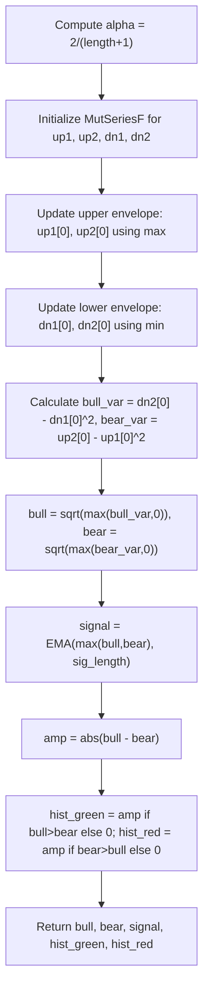

# Dynamic Andean Oscillator - Technical Guide

> Computes bull/bear volatility components via exponential envelope smoothing and displays a colored histogram.

| | |
| --- | --- |
| **Language** | Indie Script v5 |
| **Platform** | [TakeProfit](https://takeprofit.com) |
| **Category** | Oscillators |
| **Type** | Indicator |
| **Author** | @pavelmedd on TakeProfit |
| **License** | licensed under the Attribution-NonCommercial-ShareAlike 4.0 International (CC BY-NC-SA 4.0) (see the header of the source file) |
| **Live script** | [Open on TakeProfit](https://takeprofit.com/indicator/dynamic-andean-oscillator-5) |
| **Source file** | [Dynamic Andean Oscillator.indie5](Dynamic%20Andean%20Oscillator.indie5) |

## Overview

The Dynamic Andean Oscillator measures the relative strength of upward and downward price movements using an exponential envelope smoothing technique. It is designed for momentum and trend-following strategies, providing a visual representation of volatility asymmetry between bullish and bearish forces.

The indicator plots two lines: a green Bullish Component and a red Bearish Component, representing the standard deviation-like metrics of price deviations from the envelope mean. A yellow Signal line (EMA of the larger component) aids in crossover analysis. A dual histogram shows the absolute difference between the components, colored green when bulls dominate and red when bears dominate, creating a symmetrical waveform visualization.

## How it works

1. Compute the smoothing coefficient alpha = 2 / (length + 1).
2. Initialize four MutSeriesF series for recursive exponential envelope tracking of price and squared price for both upper and lower bands.
3. Update upper envelope as max(close, open, previous envelope minus alpha-weighted deviation from close).
4. Update lower envelope as min(close, open, previous envelope plus alpha-weighted deviation from close).
5. Calculate bull variance as lower squared envelope minus square of lower envelope; bear variance similarly from upper envelopes.
6. Take square root of each variance (clamped to zero if negative) to obtain bull and bear components.
7. Compute signal line as EMA of the maximum of bull and bear over the signal length period.
8. Set histogram amplitude as absolute difference between bull and bear, colored green if bull > bear, red if bear > bull.

## Mathematical model

$$
alpha = \frac{2}{\text{length} + 1}
$$

$$
\text{up1}[0] = \max\left(\text{close}, \text{open},\; \text{prev\_up1} - (\text{prev\_up1} - \text{close}) \cdot \alpha\right)
$$

$$
\text{up2}[0] = \max\left(\text{close}^2, \text{open}^2,\; \text{prev\_up2} - (\text{prev\_up2} - \text{close}^2) \cdot \alpha\right)
$$

$$
\text{dn1}[0] = \min\left(\text{close}, \text{open},\; \text{prev\_dn1} + (\text{close} - \text{prev\_dn1}) \cdot \alpha\right)
$$

$$
\text{dn2}[0] = \min\left(\text{close}^2, \text{open}^2,\; \text{prev\_dn2} + (\text{close}^2 - \text{prev\_dn2}) \cdot \alpha\right)
$$

$$
\text{bull\_var} = \text{dn2}[0] - (\text{dn1}[0])^2 \quad ; \quad \text{bear\_var} = \text{up2}[0] - (\text{up1}[0])^2
$$

$$
\text{bull} = \sqrt{\max(\text{bull\_var}, 0)} \quad ; \quad \text{bear} = \sqrt{\max(\text{bear\_var}, 0)}
$$

$$
\text{signal} = \text{EMA}(\max(\text{bull}, \text{bear}), \, \text{sig\_length})
$$

$$
\text{amp} = |\text{bull} - \text{bear}|
$$

## Logic flow



## Code walkthrough

### Smoothing coefficient and state initialization

Lines 24-30 of [Dynamic Andean Oscillator.indie5](Dynamic%20Andean%20Oscillator.indie5):

```python
    alpha = 2 / (length + 1)

    # Mutable time series to retain recursive envelope values
    up1 = MutSeriesF.new(self.close[0])  # Exponential smoothing of max(close, open)
    up2 = MutSeriesF.new(self.close[0] * self.close[0])  # Squared smoothing (for variance-like calc)
    dn1 = MutSeriesF.new(self.close[0])
    dn2 = MutSeriesF.new(self.close[0] * self.close[0])
```

The smoothing coefficient alpha is derived from the length parameter. Four MutSeriesF objects are created to hold recursive envelope values for price (up1, dn1) and squared price (up2, dn2), initialized with the current close and its square.

### Recursive exponential envelope update

Lines 38-44 of [Dynamic Andean Oscillator.indie5](Dynamic%20Andean%20Oscillator.indie5):

```python
    # Recursive exponential envelope update (upper band)
    up1[0] = max(self.close[0], self.open[0], prev_up1 - (prev_up1 - self.close[0]) * alpha)
    up2[0] = max(self.close[0]**2, self.open[0]**2, prev_up2 - (prev_up2 - self.close[0]**2) * alpha)

    # Recursive exponential envelope update (lower band)
    dn1[0] = min(self.close[0], self.open[0], prev_dn1 + (self.close[0] - prev_dn1) * alpha)
    dn2[0] = min(self.close[0]**2, self.open[0]**2, prev_dn2 + (self.close[0]**2 - prev_dn2) * alpha)
```

The upper envelope (up1, up2) is updated as the maximum of the current price/open and a decayed version of the previous envelope. The lower envelope (dn1, dn2) uses the minimum. This creates a dynamic band that tracks price extremes with exponential smoothing.

### Variance-like calculation and square root

Lines 46-52 of [Dynamic Andean Oscillator.indie5](Dynamic%20Andean%20Oscillator.indie5):

```python
    # Deviation from the envelope mean (bull/bear volatility proxy)
    bull_var = dn2[0] - dn1[0] * dn1[0]
    bear_var = up2[0] - up1[0] * up1[0]

    # Square root of variance, safely clamped to avoid math domain errors
    bull = sqrt(bull_var) if bull_var > 0 else 0.0
    bear = sqrt(bear_var) if bear_var > 0 else 0.0
```

Bull and bear variances are computed as the difference between the squared envelope and the square of the envelope mean. The square root is taken only if the variance is positive; otherwise it is clamped to zero to avoid math domain errors.

### Signal line via EMA

Lines 54-56 of [Dynamic Andean Oscillator.indie5](Dynamic%20Andean%20Oscillator.indie5):

```python
    # Signal line: EMA of the max component (trend highlight)
    signal_input = MutSeriesF.new(max(bull, bear))
    signal = Ema.new(signal_input, sig_length)[0]
```

A new MutSeriesF is created from the maximum of bull and bear components. The Ema algorithm computes the signal line over the specified signal length, providing a smoothed trigger for crossover analysis.

### Amplitude and histogram coloring

Lines 58-63 of [Dynamic Andean Oscillator.indie5](Dynamic%20Andean%20Oscillator.indie5):

```python
    # Amplitude: difference in bull/bear strengths
    amp = abs(bull - bear)

    # Colored histogram: green if bull > bear, red otherwise
    hist_green = amp if bull > bear else 0.0
    hist_red = amp if bear > bull else 0.0
```

The absolute difference between bull and bear is used as histogram amplitude. If bull exceeds bear, the green histogram column is set to the amplitude (red column zero); if bear exceeds bull, the red column gets the amplitude. This creates a colored waveform centered at zero.

## Reading the chart

- **Bullish Component (green line)**: Represents the standard deviation of price deviations from the lower envelope. Higher values indicate increasing upward volatility.
- **Bearish Component (red line)**: Represents the standard deviation of price deviations from the upper envelope. Higher values indicate increasing downward volatility.
- **Signal (yellow line)**: EMA of the larger component. Crossovers of the signal with the bull/bear lines can indicate shifts in momentum.
- **Histogram**: Green bars appear when the bullish component dominates (bull > bear); red bars when bearish dominates. Bar height equals the absolute difference between components, showing the strength of the dominant force.
- **When bull line is above bear line and histogram is green**, bullish momentum is stronger. Conversely, when bear line is above bull line and histogram is red, bearish momentum prevails.

## Implementation notes

- The MutSeriesF objects maintain state across bars; the recursive update uses previous values accessed via [1].
- The sqrt is guarded against negative variance (bull_var or bear_var) to prevent math domain errors; values are clamped to 0.0.
- The histogram uses plot.columns with base_value=0.0, so bars extend from zero upward or downward depending on the amplitude.
- The signal line is computed using the Ema algorithm from indie.algorithms, which returns a series; [0] gets the current bar value.

## FAQ

**What do the length and signal length parameters control?**

Length (default 50) sets the smoothing coefficient alpha = 2/(length+1) for the exponential envelope. A larger length produces a smoother envelope. Signal length (default 9) is the period for the EMA applied to the maximum of bull and bear components.

**How can I use this indicator for trading signals?**

Look for crossovers between the bull/bear lines and the signal line. A bullish signal occurs when the bull line crosses above the signal line while the histogram turns green. A bearish signal occurs when the bear line crosses above the signal line with a red histogram.

**Can I modify the histogram colors or line widths?**

Yes, the plot decorators accept parameters like color and line_width. You can change the RGBA values in the histogram color definitions or adjust line widths in the line plots. The base_value for columns can also be changed to shift the histogram center.

## Full source code

Indie Script v5, as published on TakeProfit. Copy it into the platform's script editor or [open the live script](https://takeprofit.com/indicator/dynamic-andean-oscillator-5).

```python
# This work is licensed under the Attribution-NonCommercial-ShareAlike 4.0 International (CC BY-NC-SA 4.0)
# https://creativecommons.org/licenses/by-nc-sa/4.0/
# Inspired by the original concept by © alexgrover
# Indie version rewritten and enhanced by Pavel Medd

# indie:lang_version = 5
from indie import indicator, param, plot, color, MutSeriesF
from indie.algorithms import Ema
from math import sqrt

# Indicator declaration and parameters
@indicator('Dynamic Andean Oscillator')
@param.int('length', default=50)  # Base length for smoothing
@param.int('sig_length', default=9, title='Signal Length')  # EMA period for signal line

# Plotting configuration
@plot.line('bull_line', title='Bullish Component', color=color.GREEN, line_width=2)
@plot.line('bear_line', title='Bearish Component', color=color.RED, line_width=2)
@plot.line(title='Signal', color=color.YELLOW, line_width=2)
@plot.columns('bull_hist', title='Bull Histogram', color=color.rgba(204, 255, 0, 0.3), base_value=0.0)
@plot.columns('bear_hist', title='Bear Histogram', color=color.rgba(246, 45, 174, 0.3), base_value=0.0)
def Main(self, length, sig_length):
    # Core smoothing coefficient for exponential update
    alpha = 2 / (length + 1)

    # Mutable time series to retain recursive envelope values
    up1 = MutSeriesF.new(self.close[0])  # Exponential smoothing of max(close, open)
    up2 = MutSeriesF.new(self.close[0] * self.close[0])  # Squared smoothing (for variance-like calc)
    dn1 = MutSeriesF.new(self.close[0])
    dn2 = MutSeriesF.new(self.close[0] * self.close[0])

    # Previous values (time index -1)
    prev_up1 = up1[1]
    prev_up2 = up2[1]
    prev_dn1 = dn1[1]
    prev_dn2 = dn2[1]

    # Recursive exponential envelope update (upper band)
    up1[0] = max(self.close[0], self.open[0], prev_up1 - (prev_up1 - self.close[0]) * alpha)
    up2[0] = max(self.close[0]**2, self.open[0]**2, prev_up2 - (prev_up2 - self.close[0]**2) * alpha)

    # Recursive exponential envelope update (lower band)
    dn1[0] = min(self.close[0], self.open[0], prev_dn1 + (self.close[0] - prev_dn1) * alpha)
    dn2[0] = min(self.close[0]**2, self.open[0]**2, prev_dn2 + (self.close[0]**2 - prev_dn2) * alpha)

    # Deviation from the envelope mean (bull/bear volatility proxy)
    bull_var = dn2[0] - dn1[0] * dn1[0]
    bear_var = up2[0] - up1[0] * up1[0]

    # Square root of variance, safely clamped to avoid math domain errors
    bull = sqrt(bull_var) if bull_var > 0 else 0.0
    bear = sqrt(bear_var) if bear_var > 0 else 0.0

    # Signal line: EMA of the max component (trend highlight)
    signal_input = MutSeriesF.new(max(bull, bear))
    signal = Ema.new(signal_input, sig_length)[0]

    # Amplitude: difference in bull/bear strengths
    amp = abs(bull - bear)

    # Colored histogram: green if bull > bear, red otherwise
    hist_green = amp if bull > bear else 0.0
    hist_red = amp if bear > bull else 0.0

    return bull, bear, signal, hist_green, hist_red
```
