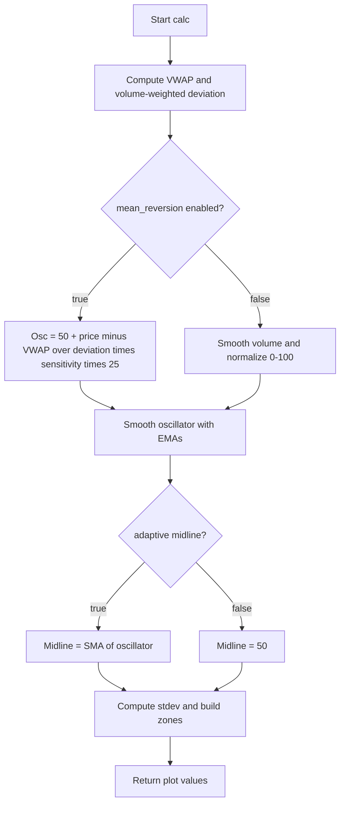

# Dynamic Volume Profile Oscillator v2 - Technical Guide

> Oscillator from volume-weighted average price and volume profile; plots smoothed oscillator, signals, adaptive midline and six zone levels.

| | |
| --- | --- |
| **Language** | Indie Script v5 |
| **Platform** | [TakeProfit](https://takeprofit.com) |
| **Category** | Oscillators |
| **Type** | Indicator |
| **Author** | @pablo on TakeProfit |
| **License** | MIT |
| **Live script** | [Open on TakeProfit](https://takeprofit.com/indicator/dynamic-volume-profile-oscillator-v2-14) |
| **Source file** | [Dynamic Volume Profile Oscillator v2.indie5](Dynamic%20Volume%20Profile%20Oscillator%20v2.indie5) |

## Overview

This indicator computes a volume-weighted average price (VWAP) over a lookback window and a volume-weighted absolute deviation from it. In mean reversion mode it turns the distance from price to VWAP into an oscillator centered at 50; in volume mode it normalizes smoothed volume's position in its lookback range to 0-100.

The oscillator is smoothed with an EMA, and fast/slow EMAs are plotted. An adaptive midline is the SMA of the smoothed oscillator (or fixed 50), and six upper/lower zone levels are drawn at fractions of the oscillator's standard deviation.

## How it works

1. Accumulate price*volume and volume over the lookback period to compute VWAP; fall back to current price if total volume is zero.
2. Compute volume-weighted mean absolute deviation from VWAP; if volume is zero, deviation is 0.
3. If mean_reversion is true, set raw oscillator to 50 + ((price - VWAP) / (deviation * sensitivity)) * 25; otherwise keep 50 if deviation is zero.
4. If mean_reversion is false, smooth volume with SMA, find lowest/highest smoothed volume over lookback, and set raw oscillator to clamped 0-100 volume position; if range is zero keep 50.
5. Wrap the raw oscillator in MutSeriesF and smooth it with EMA(smoothing), EMA(5), EMA(15).
6. If use_adaptive_midline, compute midline as SMA of the smoothed oscillator over midline_period; otherwise use 50.0.
7. Compute stdev = StdDev(oscillator, midline_period) * zone_width.
8. Build six upper/lower zones as midline +/- stdev * (1 - i*0.15) for i=0..5 and return all plot values.

## Mathematical model

$$
\text{VWAP} = \frac{\sum_{i=0}^{L-1} p_i v_i}{\sum_{i=0}^{L-1} v_i}
$$

$$
D = \sum_{i=0}^{L-1} \left| p_i - \text{VWAP} \right| \frac{v_i}{\sum_{j=0}^{L-1} v_j}
$$

$$
O = 50 + \frac{p_0 - \text{VWAP}}{D \cdot S} \cdot 25
$$

$$
V_s = \text{SMA}(v, n), \quad O = \min\left(100, \max\left(0, \frac{V_s[0] - \min(V_s, L)}{\max(V_s, L) - \min(V_s, L)} \cdot 100\right)\right)
$$

$$
O_s = \text{EMA}(O, s), \quad F = \text{EMA}(O, 5), \quad S = \text{EMA}(O, 15)
$$

$$
M = \begin{cases} \text{SMA}(O_s, P) & \text{if adaptive} \\ 50 & \text{otherwise} \end{cases}
$$

$$
\sigma = \text{StdDev}(O_s, P) \cdot Z
$$

$$
U_i = M + \sigma (1 - 0.15 i), \quad L_i = M - \sigma (1 - 0.15 i), \quad i=0,\dots,5
$$

## Logic flow



## Parameters

| Parameter | Type | Default | Range | Description |
| --- | --- | --- | --- | --- |
| `price_src` | source | source.CLOSE |  | Price Source |
| `lookback` | int | 50 | ≥ 10 | Lookback Period |
| `smoothing` | int | 5 | 1 - 50 | Smoothing Length |
| `sensitivity` | float | 1.0 | 0.1 - 5.0 | Sensitivity |
| `mean_reversion` | bool | true |  | Mean Reversion Mode |
| `use_adaptive_midline` | bool | true |  | Use Adaptive Midline |
| `midline_period` | int | 50 | 10 - 200 | Adaptive Midline Period |
| `zone_width` | float | 1.5 | 0.5 - 3.0 | Zone Width Multiplier |

## Code walkthrough

### Indicator declaration and inputs

Lines 7-15 of [Dynamic Volume Profile Oscillator v2.indie5](Dynamic%20Volume%20Profile%20Oscillator%20v2.indie5):

```python
@indicator("Dynamic Volume Profile Oscillator", overlay_main_pane=False)
@param.source("price_src", default=source.CLOSE, title="Price Source")
@param.int("lookback", default=50, min=10, title="Lookback Period")
@param.int("smoothing", default=5, min=1, max=50, title="Smoothing Length")
@param.float("sensitivity", default=1.0, min=0.1, max=5.0, step=0.1, title="Sensitivity")
@param.bool("mean_reversion", default=True, title="Mean Reversion Mode")
@param.bool("use_adaptive_midline", default=True, title="Use Adaptive Midline")
@param.int("midline_period", default=50, min=10, max=200, title="Adaptive Midline Period")
@param.float("zone_width", default=1.5, min=0.5, max=3.0, step=0.1, title="Zone Width Multiplier")
```

The @indicator decorator sets the name and places the indicator in a separate pane. The @param decorators generate the settings UI for price source, lookback, smoothing, sensitivity, mean reversion mode, adaptive midline, midline period, and zone width.

### VWAP and volume-weighted deviation

Lines 41-50 of [Dynamic Volume Profile Oscillator v2.indie5](Dynamic%20Volume%20Profile%20Oscillator%20v2.indie5):

```python
        vwap_sum = 0.0
        volume_sum = 0.0
        for i in range(lookback):
            vwap_sum += price_src[i] * self.volume[i]
            volume_sum += self.volume[i]
        vwap_level = vwap_sum / volume_sum if not isclose(volume_sum, 0) else price_src[0]

        price_dev = 0.0
        for i in range(lookback):
            price_dev += abs(price_src[i] - vwap_level) * (self.volume[i] / volume_sum) if not isclose(volume_sum, 0) else 0
```

The calc loop accumulates price*volume and volume over the lookback period. The volume-weighted absolute deviation is then computed using the same volume weights, with a zero-volume fallback to avoid division by zero.

### Oscillator mode branch

Lines 52-63 of [Dynamic Volume Profile Oscillator v2.indie5](Dynamic%20Volume%20Profile%20Oscillator%20v2.indie5):

```python
        osc_raw = 50.0
        if mean_reversion:
            if not isclose(price_dev * sensitivity, 0):
                osc_raw = 50 + ((price_src[0] - vwap_level) / (price_dev * sensitivity)) * 25
        else:
            sma_vol = Sma.new(self.volume, smoothing)
            min_vol = Lowest.new(sma_vol, lookback)[0]
            max_vol = Highest.new(sma_vol, lookback)[0]
            vol_range = max_vol - min_vol
            if not isclose(vol_range, 0):
                vol_position = (sma_vol[0] - min_vol) / vol_range
                osc_raw = min(100, max(0, vol_position * 100))
```

In mean reversion mode the raw oscillator is a linear function of the distance from price to VWAP, scaled by deviation and sensitivity. In volume mode the code smooths volume with an SMA, finds its lowest and highest values over the lookback, and normalizes the current position to 0-100.

### Smoothing and adaptive midline

Lines 65-72 of [Dynamic Volume Profile Oscillator v2.indie5](Dynamic%20Volume%20Profile%20Oscillator%20v2.indie5):

```python
        osc_series = MutSeriesF.new(osc_raw)
        osc = Ema.new(osc_series, smoothing)[0]
        fast_signal = Ema.new(osc_series, 5)[0]
        slow_signal = Ema.new(osc_series, 15)[0]

        midline_series = MutSeriesF.new(osc)
        midline = Sma.new(midline_series, midline_period)[0] if use_adaptive_midline else 50.0
        stdev = StdDev.new(midline_series, midline_period)[0] * zone_width
```

MutSeriesF.new wraps the raw oscillator so it can be passed to EMA. The smoothed oscillator is then used to compute an adaptive midline with SMA and a standard-deviation band; if adaptive midline is disabled, the midline is fixed at 50.

### Zone construction and return

Lines 75-91 of [Dynamic Volume Profile Oscillator v2.indie5](Dynamic%20Volume%20Profile%20Oscillator%20v2.indie5):

```python
        upper_zones: list[float] = [0.0] * 6
        lower_zones: list[float] = [0.0] * 6
        for i in range(6):
            scale = 1 - i * 0.15
            upper_zones[i] = midline + stdev * scale
            lower_zones[i] = midline - stdev * scale

        return (
            osc,
            fast_signal,
            slow_signal,
            midline,
            upper_zones[0], upper_zones[1], upper_zones[2],
            upper_zones[3], upper_zones[4], upper_zones[5],
            lower_zones[0], lower_zones[1], lower_zones[2],
            lower_zones[3], lower_zones[4], lower_zones[5],
        )
```

Six upper and lower zones are built by scaling the standard deviation with factors 1.0 down to 0.25. The return tuple matches the order of the @plot decorators, so all 16 plotted values are returned.

## Reading the chart

- The aqua oscillator line is the main output; fuchsia and silver lines are fast and slow EMAs of it.
- The white 40% line is the adaptive midline (SMA of the oscillator) when enabled, otherwise fixed at 50.
- Upper zones are fuchsia and lower zones are aqua; zone 1 is the outermost level (scale 1.0) and zone 6 is closest to the midline (scale 0.25).
- In mean reversion mode, values above 50 mean price is above VWAP and values below 50 mean price is below VWAP; the distance is scaled by deviation and sensitivity.
- In volume mode, values near 100 mean smoothed volume is near the top of its lookback range and values near 0 mean it is near the bottom.
- All zone lines are plotted in the same pane as the oscillator and have status lines enabled.

## Implementation notes

- If total volume is zero, VWAP falls back to current price and the deviation is zero, so the mean-reversion oscillator stays at 50.
- In volume mode, if the smoothed volume range is zero, the raw oscillator stays at 50.
- MutSeriesF.new is used to feed the per-bar oscillator value into EMA/SMA/StdDev; the returned values are floats, not series.
- The return tuple must match the order of the @plot decorators; all 16 values are returned.

## FAQ

**What does the Sensitivity parameter do?**

In mean reversion mode, the raw oscillator is divided by (deviation * sensitivity), so higher sensitivity amplifies the oscillator's distance from 50 for the same price move. It has no effect when mean_reversion is false.

**How do I switch to volume-position mode?**

Set mean_reversion to false. The indicator then smooths volume with an SMA, finds its lowest and highest values over the lookback, and outputs a 0-100 position instead of the price-distance formula.

**Can I change the zone colors or widths?**

Zone colors are set in the @plot.line decorators for upper_zone1..6 and lower_zone1..6. Widths are controlled by zone_width, which multiplies the standard deviation used to build the zones.

## Full source code

Indie Script v5, as published on TakeProfit. Copy it into the platform's script editor or [open the live script](https://takeprofit.com/indicator/dynamic-volume-profile-oscillator-v2-14).

```python
# indie:lang_version = 5
from math import nan, isclose
from indie import indicator, param, plot, color, MutSeriesF, source, MainContext
from indie.algorithms import Sma, Ema, StdDev, Lowest, Highest

# === Indicator Declaration & Inputs ===
@indicator("Dynamic Volume Profile Oscillator", overlay_main_pane=False)
@param.source("price_src", default=source.CLOSE, title="Price Source")
@param.int("lookback", default=50, min=10, title="Lookback Period")
@param.int("smoothing", default=5, min=1, max=50, title="Smoothing Length")
@param.float("sensitivity", default=1.0, min=0.1, max=5.0, step=0.1, title="Sensitivity")
@param.bool("mean_reversion", default=True, title="Mean Reversion Mode")
@param.bool("use_adaptive_midline", default=True, title="Use Adaptive Midline")
@param.int("midline_period", default=50, min=10, max=200, title="Adaptive Midline Period")
@param.float("zone_width", default=1.5, min=0.5, max=3.0, step=0.1, title="Zone Width Multiplier")

# Plot base + zones with 6-level gradient
@plot.line('osc', color=color.AQUA, title="Oscillator")
@plot.line('fast_signal', color=color.FUCHSIA, title="Fast Signal")
@plot.line('slow_signal', color=color.SILVER, title="Slow Signal")
@plot.line('midline', color=color.WHITE(0.4), title="Adaptive Midline")

@plot.line('upper_zone1', color=color.FUCHSIA(0.15), title="Upper Zone 1", display_options=plot.LineDisplayOptions(pane=True, status_line=True))
@plot.line('upper_zone2', color=color.FUCHSIA(0.25), title="Upper Zone 2", display_options=plot.LineDisplayOptions(pane=True, status_line=True))
@plot.line('upper_zone3', color=color.FUCHSIA(0.5), title="Upper Zone 3", display_options=plot.LineDisplayOptions(pane=True, status_line=True))
@plot.line('upper_zone4', color=color.FUCHSIA(0.65), title="Upper Zone 4", display_options=plot.LineDisplayOptions(pane=True, status_line=True))
@plot.line('upper_zone5', color=color.FUCHSIA(0.85), title="Upper Zone 5", display_options=plot.LineDisplayOptions(pane=True, status_line=True))
@plot.line('upper_zone6', color=color.FUCHSIA(1.0), title="Upper Zone 6", display_options=plot.LineDisplayOptions(pane=True, status_line=True))

@plot.line('lower_zone1', color=color.AQUA(0.15), title="Lower Zone 1", display_options=plot.LineDisplayOptions(pane=True, status_line=True))
@plot.line('lower_zone2', color=color.AQUA(0.25), title="Lower Zone 2", display_options=plot.LineDisplayOptions(pane=True, status_line=True))
@plot.line('lower_zone3', color=color.AQUA(0.5), title="Lower Zone 3", display_options=plot.LineDisplayOptions(pane=True, status_line=True))
@plot.line('lower_zone4', color=color.AQUA(0.65), title="Lower Zone 4", display_options=plot.LineDisplayOptions(pane=True, status_line=True))
@plot.line('lower_zone5', color=color.AQUA(0.85), title="Lower Zone 5", display_options=plot.LineDisplayOptions(pane=True, status_line=True))
@plot.line('lower_zone6', color=color.AQUA(1.0), title="Lower Zone 6", display_options=plot.LineDisplayOptions(pane=True, status_line=True))

class Main(MainContext):
    def calc(self, price_src, lookback, smoothing, sensitivity, mean_reversion,
             use_adaptive_midline, midline_period, zone_width):

        vwap_sum = 0.0
        volume_sum = 0.0
        for i in range(lookback):
            vwap_sum += price_src[i] * self.volume[i]
            volume_sum += self.volume[i]
        vwap_level = vwap_sum / volume_sum if not isclose(volume_sum, 0) else price_src[0]

        price_dev = 0.0
        for i in range(lookback):
            price_dev += abs(price_src[i] - vwap_level) * (self.volume[i] / volume_sum) if not isclose(volume_sum, 0) else 0

        osc_raw = 50.0
        if mean_reversion:
            if not isclose(price_dev * sensitivity, 0):
                osc_raw = 50 + ((price_src[0] - vwap_level) / (price_dev * sensitivity)) * 25
        else:
            sma_vol = Sma.new(self.volume, smoothing)
            min_vol = Lowest.new(sma_vol, lookback)[0]
            max_vol = Highest.new(sma_vol, lookback)[0]
            vol_range = max_vol - min_vol
            if not isclose(vol_range, 0):
                vol_position = (sma_vol[0] - min_vol) / vol_range
                osc_raw = min(100, max(0, vol_position * 100))

        osc_series = MutSeriesF.new(osc_raw)
        osc = Ema.new(osc_series, smoothing)[0]
        fast_signal = Ema.new(osc_series, 5)[0]
        slow_signal = Ema.new(osc_series, 15)[0]

        midline_series = MutSeriesF.new(osc)
        midline = Sma.new(midline_series, midline_period)[0] if use_adaptive_midline else 50.0
        stdev = StdDev.new(midline_series, midline_period)[0] * zone_width

        # Build zone levels
        upper_zones: list[float] = [0.0] * 6
        lower_zones: list[float] = [0.0] * 6
        for i in range(6):
            scale = 1 - i * 0.15
            upper_zones[i] = midline + stdev * scale
            lower_zones[i] = midline - stdev * scale

        return (
            osc,
            fast_signal,
            slow_signal,
            midline,
            upper_zones[0], upper_zones[1], upper_zones[2],
            upper_zones[3], upper_zones[4], upper_zones[5],
            lower_zones[0], lower_zones[1], lower_zones[2],
            lower_zones[3], lower_zones[4], lower_zones[5],
        )
```
