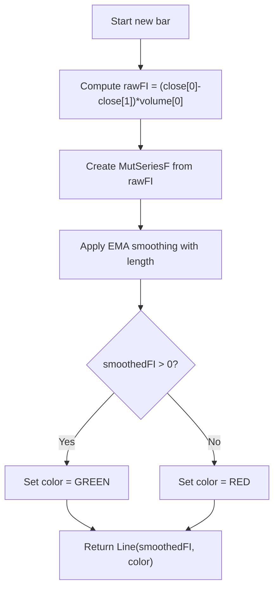

# Elder's Force Index (FI) - Technical Guide

> Exponentially smoothed product of price change and volume, plotted as a line colored green when positive, red when negative.

| | |
| --- | --- |
| **Language** | Indie Script v5 |
| **Platform** | [TakeProfit](https://takeprofit.com) |
| **Category** | Volume |
| **Type** | Indicator |
| **Author** | @insurgent on TakeProfit |
| **License** | MIT |
| **Live script** | [Open on TakeProfit](https://takeprofit.com/indicator/elder-s-force-index-fi-79) |
| **Source file** | [Elder's Force Index (FI).indie5](Elder's%20Force%20Index%20(FI).indie5) |

## Overview

The Force Index (FI) is computed as the product of the current bar's price change (close[0] - close[1]) and the current bar's volume (volume[0]). This raw value is then smoothed using an Exponential Moving Average (EMA) with a user-specified length parameter. The resulting smoothed FI is plotted as a line that is colored green when the value is positive and red when negative.

The indicator combines price movement and volume to assess the strength of buying or selling pressure. Positive values suggest upward momentum, negative values suggest downward pressure. The EMA smoothing reduces noise and allows for clearer trend confirmation. The indicator is not overlaid on the main price pane, so it appears in a separate subchart.

## How it works

1. Compute raw Force Index as (current close - previous close) multiplied by current volume.
2. Create a mutable time series from the raw FI value using MutSeriesF.new.
3. Apply Exponential Moving Average (EMA) smoothing with the user-specified length.
4. Determine the line color: green if the smoothed FI is greater than zero, red otherwise.
5. Return a Line plot with the smoothed FI values and the determined color.

## Mathematical model

$$
\text{rawFI}_t = (\text{close}_t - \text{close}_{t-1}) \times \text{volume}_t
$$

$$
\text{smoothedFI}_t = \alpha \times \text{rawFI}_t + (1 - \alpha) \times \text{smoothedFI}_{t-1}, \quad \alpha = \frac{2}{\text{length} + 1}
$$

## Logic flow



## Parameters

| Parameter | Type | Default | Range | Description |
| --- | --- | --- | --- | --- |
| `length` | int | 13 | ≥ 1 | EMA Length |

## Code walkthrough

### Decorators and function definition

Lines 5-8 of [Elder's Force Index (FI).indie5](Elder's%20Force%20Index%20(FI).indie5):

```python
@indicator("Elder's Force Index (FI)", overlay_main_pane=False)
@param.int('length', default=13, min=1, title='EMA Length')
@plot.line(id='#plot_0')
def Main(self, length):
```

The @indicator decorator sets the indicator name and specifies it is not overlaid on the main pane. @param.int defines a user-adjustable integer parameter 'length' with default 13 and minimum 1. @plot.line creates a line plot slot. The Main function receives self and length.

### Raw FI calculation

Lines 9-10 of [Elder's Force Index (FI).indie5](Elder's%20Force%20Index%20(FI).indie5):

```python
    # Create a mutable time series for the Force Index
    fi_series = MutSeriesF.new((self.close[0] - self.close[1]) * self.volume[0])
```

The raw Force Index is computed as the difference between current close and previous close multiplied by current volume. This value is used to create a mutable series via MutSeriesF.new, which allows the series to be updated bar by bar.

### EMA smoothing

Lines 12-13 of [Elder's Force Index (FI).indie5](Elder's%20Force%20Index%20(FI).indie5):

```python
    # Apply exponential smoothing
    smoothed_fi = Ema.new(fi_series, length)[0]
```

The Ema.new function applies exponential smoothing to the raw FI series with the specified length. The [0] index retrieves the current smoothed value as a scalar.

### Color determination and return

Lines 15-18 of [Elder's Force Index (FI).indie5](Elder's%20Force%20Index%20(FI).indie5):

```python
    # Determine the color of the indicator line
    fi_color = color.GREEN if smoothed_fi > 0 else color.RED

    return plot.Line(smoothed_fi, color=fi_color)
```

The smoothed FI value determines the line color: green if positive, red otherwise. The plot.Line object is returned with the smoothed FI value and the chosen color.

## Reading the chart

- The indicator plots a single line representing the smoothed Force Index.
- The line is colored green when the smoothed FI is positive, indicating upward pressure.
- The line is colored red when the smoothed FI is negative, indicating downward pressure.
- The zero line serves as a reference; crossings indicate changes in momentum direction.
- The line appears in a separate subchart below the main price pane (overlay_main_pane=False).

## Implementation notes

- The raw FI uses the current bar's volume and the price change from the previous bar's close to the current bar's close.
- The EMA smoothing length parameter controls responsiveness: shorter lengths react faster, longer lengths produce smoother output.
- The color is determined per bar based on the smoothed value; if the smoothed FI is exactly zero, the line is red (since condition is > 0).
- The indicator uses MutSeriesF to hold the raw FI series, which is then smoothed by Ema; both maintain state across bars.

## FAQ

**How can I adjust the sensitivity of the Force Index?**

Change the 'length' parameter. A smaller length makes the EMA more responsive to recent changes, while a larger length produces a smoother, less reactive line.

**What does the color of the line indicate?**

The line is green when the smoothed FI is positive, suggesting upward buying pressure, and red when negative, suggesting downward selling pressure.

**Can I use this indicator on intraday charts?**

Yes, the indicator works on any timeframe. The volume and price change are taken from the current and previous bars of the chart's resolution.

## Full source code

Indie Script v5, as published on TakeProfit. Copy it into the platform's script editor or [open the live script](https://takeprofit.com/indicator/elder-s-force-index-fi-79).

```python
# indie:lang_version = 5
from indie import indicator, plot, color, param, MutSeriesF
from indie.algorithms import Ema

@indicator("Elder's Force Index (FI)", overlay_main_pane=False)
@param.int('length', default=13, min=1, title='EMA Length')
@plot.line(id='#plot_0')
def Main(self, length):
    # Create a mutable time series for the Force Index
    fi_series = MutSeriesF.new((self.close[0] - self.close[1]) * self.volume[0])
    
    # Apply exponential smoothing
    smoothed_fi = Ema.new(fi_series, length)[0]

    # Determine the color of the indicator line
    fi_color = color.GREEN if smoothed_fi > 0 else color.RED

    return plot.Line(smoothed_fi, color=fi_color)
```
