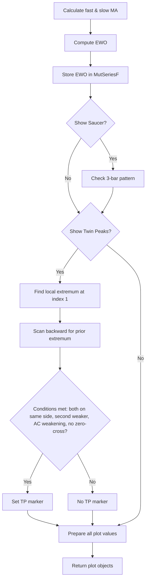

# Elliott Wave Oscillator (EWO) Pro - Validated Twin Peaks - Technical Guide

> Computes Elliott Wave Oscillator (fast-slow MA difference) with optional percent normalization and validated Twin Peaks & Saucer pattern detection.

| | |
| --- | --- |
| **Language** | Indie Script v5 |
| **Platform** | [TakeProfit](https://takeprofit.com) |
| **Category** | Oscillators |
| **Type** | Indicator |
| **Author** | @chartjunkie on TakeProfit |
| **License** | MIT |
| **Live script** | [Open on TakeProfit](https://takeprofit.com/indicator/elliott-wave-oscillator-ewo-pro-validated-twin-peaks-78) |
| **Source file** | [Elliott Wave Oscillator (EWO) Pro - Validated Twin Peaks.indie5](Elliott%20Wave%20Oscillator%20(EWO)%20Pro%20-%20Validated%20Twin%20Peaks.indie5) |

## Overview

This indicator enhances the classic Elliott Wave Oscillator with analytical layers for pattern validation. It computes the difference between fast and slow moving averages (EMA by default, optional SMA) and optionally normalizes it as a percentage of price. The core EWO logic remains unchanged. The tool is designed for traders analyzing wave structure and momentum, providing cleaner signals through validated Twin Peaks and Saucer patterns.

The chart displays a four-color histogram for EWO (green/lime when above zero and rising/falling, red/maroon when below zero), an optional signal line (aqua SMA of EWO), and an optional Accelerator Oscillator (AC) histogram (teal when rising, orange when falling). Pattern markers are shown at detected points: lime circles for bullish saucers, red circles for bearish saucers, lime 'TP+' labels for validated bullish Twin Peaks, and fuchsia 'TP-' labels for bearish Twin Peaks. A dashed gray zero line is always present.

## How it works

1. Calculate fast and slow moving averages (EMA or SMA based on parameter) of the source price series.
2. Compute EWO as the difference between fast and slow averages, optionally normalized as a percentage of price (diff / price * 100).
3. Store the current EWO value in a MutSeriesF for historical access and determine histogram color: lime (rising above zero), green (falling above zero), red (rising below zero), maroon (falling below zero).
4. Optionally compute a signal line as SMA of the EWO series and the Accelerator Oscillator (AC) as the difference between EWO and its SMA.
5. Detect Saucer patterns: a bullish saucer when EWO and prev1 are above zero and forms a dip (prev2 > prev1, then ewo > prev1); a bearish saucer when EWO and prev1 are below zero and forms a peak (prev2 < prev1, then ewo < prev1).
6. Detect Validated Twin Peaks by finding a local extremum on the previous bar (ewo_series[1]) and scanning backward for a prior extremum on the same side of zero, requiring the second extremum to be weaker (closer to zero), momentum deceleration (abs(AC) weaker), and no zero-line cross between peaks.
7. Output histogram, signal line, AC histogram, and markers for saucers and Twin Peaks with appropriate colors and labels.

## Mathematical model

$$
\text{EWO} = \text{MA}_{\text{fast}} - \text{MA}_{\text{slow}}
$$

$$
\text{EWO}_{\text{norm}} = \frac{\text{EWO}}{\text{price}} \times 100 \quad \text{(if use\_percent is True)}
$$

$$
\text{Signal} = \text{SMA}_{\text{signal\_length}}(\text{EWO})
$$

$$
\text{AC} = \text{EWO} - \text{SMA}_{\text{ac\_length}}(\text{EWO})
$$

## Logic flow



## Parameters

| Parameter | Type | Default | Range | Description |
| --- | --- | --- | --- | --- |
| `src` | source | source.CLOSE |  | Source |
| `fast_length` | int | 5 | ≥ 1 | Fast Length |
| `slow_length` | int | 35 | ≥ 1 | Slow Length |
| `use_sma` | bool | false |  | Use SMA instead of EMA |
| `use_percent` | bool | false |  | Show as Percent of Price |
| `show_signal` | bool | true |  | Show Signal Line |
| `signal_length` | int | 5 | ≥ 1 | Signal Length |
| `show_ac` | bool | false |  | Show Accelerator (AC) |
| `ac_length` | int | 5 | ≥ 1 | AC Smoothing Length |
| `show_saucer` | bool | true |  | Show Saucer Patterns |
| `show_twin_peaks` | bool | true |  | Show Validated Twin Peaks |
| `twin_lookback` | int | 100 | 10 - 500 | Twin Peaks Lookback |
| `twin_min_dist` | int | 5 | 3 - 50 | Twin Peaks Min Distance |

## Code walkthrough

### Parameter and Plot Decorators

Lines 6-25 of [Elliott Wave Oscillator (EWO) Pro - Validated Twin Peaks.indie5](Elliott%20Wave%20Oscillator%20(EWO)%20Pro%20-%20Validated%20Twin%20Peaks.indie5):

```python
@indicator('Elliott Wave Oscillator Pro')
@param.source('src', default=source.CLOSE, title='Source')
@param.int('fast_length', default=5, min=1, title='Fast Length')
@param.int('slow_length', default=35, min=1, title='Slow Length')
@param.bool('use_sma', default=False, title='Use SMA instead of EMA')
@param.bool('use_percent', default=False, title='Show as Percent of Price')
@param.bool('show_signal', default=True, title='Show Signal Line')
@param.int('signal_length', default=5, min=1, title='Signal Length')
@param.bool('show_ac', default=False, title='Show Accelerator (AC)')
@param.int('ac_length', default=5, min=1, title='AC Smoothing Length')
@param.bool('show_saucer', default=True, title='Show Saucer Patterns')
@param.bool('show_twin_peaks', default=True, title='Show Validated Twin Peaks')
@param.int('twin_lookback', default=100, min=10, max=500, title='Twin Peaks Lookback')
@param.int('twin_min_dist', default=5, min=3, max=50, title='Twin Peaks Min Distance')
@plot.histogram(id='ewo', title='EWO')
@plot.line(id='signal', title='Signal', color=AQUA, line_width=2)
@plot.histogram(id='ac', title='Accelerator')
@plot.marker(title='Saucer', style=plot.marker_style.CIRCLE, size=6)
@plot.marker(title='Twin Peaks', style=plot.marker_style.LABEL, size=7)
@level(value=0, title='Zero', line_color=GRAY, line_style=line_style.DASHED, line_width=1)
```

The indicator is defined with parameters for source, lengths, SMA/EMA choice, percent normalization, signal line, AC, saucer, twin peaks, lookback, and minimum distance. Plot decorators declare five outputs: a histogram for EWO, a line for signal, a histogram for AC, and two marker series for saucers and twin peaks. A zero level line is also added.

### EWO Calculation and Histogram Color

Lines 30-48 of [Elliott Wave Oscillator (EWO) Pro - Validated Twin Peaks.indie5](Elliott%20Wave%20Oscillator%20(EWO)%20Pro%20-%20Validated%20Twin%20Peaks.indie5):

```python
    # Calculate EWO
    fast_ema = Ema.new(src, fast_length)
    slow_ema = Ema.new(src, slow_length)
    fast_sma = Sma.new(src, fast_length)
    slow_sma = Sma.new(src, slow_length)
    
    fast_val = fast_sma[0] if use_sma else fast_ema[0]
    slow_val = slow_sma[0] if use_sma else slow_ema[0]
    
    diff = fast_val - slow_val
    ewo_value = (diff / src[0]) * 100 if use_percent else diff
    
    # Store EWO in series for further calculations
    ewo_series = MutSeriesF.new(ewo_value)
    
    # Determine histogram color (4-color scheme)
    ewo_prev = ewo_series[1] if len(ewo_series) > 1 else ewo_value
    is_rising = ewo_value > ewo_prev
    bar_color = LIME if ewo_value > 0 and is_rising else GREEN if ewo_value > 0 else MAROON if ewo_value < 0 and not is_rising else RED
```

Fast and slow moving averages are computed using either EMA or SMA. The difference is normalized by price if use_percent is true. The current EWO is stored in a MutSeriesF for later access. Histogram color uses a four-color scheme based on position relative to zero and direction (rising/falling).

### Signal Line and Accelerator Oscillator

Lines 50-63 of [Elliott Wave Oscillator (EWO) Pro - Validated Twin Peaks.indie5](Elliott%20Wave%20Oscillator%20(EWO)%20Pro%20-%20Validated%20Twin%20Peaks.indie5):

```python
    # Signal line (SMA of EWO)
    signal_line = Sma.new(ewo_series, signal_length)
    signal_val = signal_line[0] if show_signal else 0.0
    signal_color = AQUA if show_signal else TRANSPARENT
    
    # Accelerator Oscillator (EWO - SMA(EWO))
    ac_sma = Sma.new(ewo_series, ac_length)
    ac_value = ewo_value - ac_sma[0]
    ac_series = MutSeriesF.new(ac_value)
    ac_prev = ac_series[1] if len(ac_series) > 1 else ac_value
    ac_rising = ac_value > ac_prev
    ac_color = TEAL if ac_rising else ORANGE
    ac_display = ac_value if show_ac else 0.0
    ac_final_color = ac_color if show_ac else TRANSPARENT
```

A signal line is calculated as an SMA of the EWO series. The Accelerator Oscillator (AC) is the difference between EWO and its own SMA. AC is always computed for later Twin Peaks validation, but visual display is optional. AC color is teal when rising, orange when falling.

### Saucer Pattern Detection

Lines 65-84 of [Elliott Wave Oscillator (EWO) Pro - Validated Twin Peaks.indie5](Elliott%20Wave%20Oscillator%20(EWO)%20Pro%20-%20Validated%20Twin%20Peaks.indie5):

```python
    # Saucer pattern detection
    saucer_color = TRANSPARENT
    saucer_val = 0.0
    
    if show_saucer and len(ewo_series) > 2:
        prev1 = ewo_series[1]
        prev2 = ewo_series[2]
        
        # Bullish Saucer: above zero, was falling, now rising
        bullish_saucer = ewo_value > 0 and prev1 > 0 and prev2 > prev1 and ewo_value > prev1
        
        # Bearish Saucer: below zero, was rising, now falling
        bearish_saucer = ewo_value < 0 and prev1 < 0 and prev2 < prev1 and ewo_value < prev1
        
        if bullish_saucer:
            saucer_color = LIME
            saucer_val = ewo_value
        elif bearish_saucer:
            saucer_color = RED
            saucer_val = ewo_value
```

Saucer patterns require at least three bars of EWO history. A bullish saucer occurs when EWO and the previous bar are above zero, previously falling (prev2 > prev1), and now rising (ewo > prev1). A bearish saucer occurs when EWO and the previous bar are below zero, previously rising (prev2 < prev1), and now falling (ewo < prev1). When detected, a marker is placed at the current EWO value with lime or red color.

### Validated Twin Peaks Logic

Lines 86-130 of [Elliott Wave Oscillator (EWO) Pro - Validated Twin Peaks.indie5](Elliott%20Wave%20Oscillator%20(EWO)%20Pro%20-%20Validated%20Twin%20Peaks.indie5):

```python
    # Validated Twin Peaks with Momentum Confirmation
    twin_color = TRANSPARENT
    twin_val = 0.0
    twin_text = ''
    
    if show_twin_peaks and len(ewo_series) > twin_lookback and len(ac_series) > twin_lookback:
        # Check if current bar is a local extremum (need 2 bars on each side for confirmation)
        is_local_min = ewo_series[1] < ewo_series[2] and ewo_series[1] < ewo_series[0]
        is_local_max = ewo_series[1] > ewo_series[2] and ewo_series[1] > ewo_series[0]
        
        # Values at peak1 (current confirmed peak at index 1)
        peak2_ewo = ewo_series[1]
        peak2_ac = ac_series[1]
        
        # Bullish Twin Peaks: two lows below zero, second higher, momentum weakening
        if is_local_min and peak2_ewo < 0:
            # Search for previous local minimum
            for i in range(twin_min_dist, twin_lookback):
                # Check if bar i is a local minimum
                is_prev_min = ewo_series[i] < ewo_series[i-1] and ewo_series[i] < ewo_series[i+1]
                
                if is_prev_min and ewo_series[i] < 0:
                    peak1_ewo = ewo_series[i]
                    peak1_ac = ac_series[i]
                    
                    # Condition 1: Both peaks below zero (already checked)
                    # Condition 2: Second peak higher than first (closer to zero)
                    second_higher = peak2_ewo > peak1_ewo
                    
                    # Condition 3: Momentum deceleration (AC weakening)
                    momentum_weakening = abs(peak2_ac) < abs(peak1_ac)
                    
                    # Condition 4: No zero-line cross between peaks
                    zero_crossed = False
                    for j in range(1, i):
                        if ewo_series[j] >= 0:
                            zero_crossed = True
                            break
                    
                    if second_higher and momentum_weakening and not zero_crossed:
                        twin_color = LIME
                        twin_val = peak2_ewo
                        twin_text = 'TP+'
                    break
        
```

This complex section first checks if the previous bar (index 1) is a local extremum using its neighbors. For bullish Twin Peaks, it scans backward from twin_min_dist to twin_lookback for a previous local minimum below zero. Four conditions must hold: both peaks below zero, second peak higher (closer to zero), AC magnitude weaker (momentum deceleration), and no zero-line cross between them. Bearish Twin Peaks follows the same logic above zero. On success, a marker with 'TP+' (lime) or 'TP-' (fuchsia) is set.

## Reading the chart

- **EWO Histogram**: Green/lime bars indicate positive EWO (fast MA above slow MA); red/maroon bars indicate negative EWO. Color intensity shows direction: lime = rising above zero, green = falling above zero, red = rising below zero, maroon = falling below zero.
- **Signal Line (aqua)**: A smoothed version of EWO. When EWO crosses above/below the signal line, it suggests momentum change.
- **Accelerator Oscillator (AC) Histogram**: Teal bars when AC is rising, orange when falling. AC measures the change in EWO momentum.
- **Saucer Markers**: Lime circle = bullish saucer (potential reversal to upside); red circle = bearish saucer (potential reversal to downside).
- **Twin Peaks Markers**: Lime 'TP+' label = validated bullish Twin Peaks (two lows, second higher); fuchsia 'TP-' label = bearish Twin Peaks (two highs, second lower). These signal weakening momentum and possible trend reversal.
- **Zero Line (dashed gray)**: Reference level. EWO crossing above/below zero indicates fast MA crossing slow MA.

## Implementation notes

- Twin Peaks detection uses the previous bar (index 1) as the confirmed extremum; Saucer detection uses the current bar, which avoids repainting on real-time data where index 0 is incomplete. This introduces a one-bar delay for pattern signals.
- The Twin Peaks search uses nested loops scanning back up to 500 bars (twin_lookback) and checking zero crosses between peaks, which may be computationally expensive on large charts or lower timeframes.
- When use_percent is True, the EWO value is multiplied by 100 and divided by the source price. This normalizes the oscillator across instruments with different price levels.
- The Accelator Oscillator is always computed internally for Twin Peaks momentum confirmation, even when show_ac is False. The visual output is hidden by setting ac_display to 0.0 and ac_final_color to TRANSPARENT.

## FAQ

**How do I configure the Twin Peaks detection to be stricter or looser?**

Increase twin_min_dist to require greater separation between peaks (reduces false positives) or decrease it to find patterns more frequently. Adjust twin_lookback to expand or restrict the search range.

**Why does the Saucer marker sometimes appear on bars that don't look like a saucer?**

The saucer detection only uses three consecutive EWO values and does not consider curvature or longer patterns. It identifies a simple dip/rise pattern that may not visually match a classic saucer. Disable it with show_saucer=False if it produces too many false signals.

**Can I use this indicator with SMA instead of EMA?**

Yes, set use_sma=True. This changes the underlying moving averages from EMA to SMA, which may produce smoother EWO values that are less responsive to recent price action. All subsequent calculations (signal, AC, patterns) adapt automatically.

## Full source code

Indie Script v5, as published on TakeProfit. Copy it into the platform's script editor or [open the live script](https://takeprofit.com/indicator/elliott-wave-oscillator-ewo-pro-validated-twin-peaks-78).

```python
# indie:lang_version = 5
from indie import indicator, param, plot, source, level, line_style, SeriesF, MutSeriesF
from indie.color import RED, GREEN, GRAY, AQUA, LIME, MAROON, TEAL, ORANGE, FUCHSIA, TRANSPARENT
from indie.algorithms import Ema, Sma

@indicator('Elliott Wave Oscillator Pro')
@param.source('src', default=source.CLOSE, title='Source')
@param.int('fast_length', default=5, min=1, title='Fast Length')
@param.int('slow_length', default=35, min=1, title='Slow Length')
@param.bool('use_sma', default=False, title='Use SMA instead of EMA')
@param.bool('use_percent', default=False, title='Show as Percent of Price')
@param.bool('show_signal', default=True, title='Show Signal Line')
@param.int('signal_length', default=5, min=1, title='Signal Length')
@param.bool('show_ac', default=False, title='Show Accelerator (AC)')
@param.int('ac_length', default=5, min=1, title='AC Smoothing Length')
@param.bool('show_saucer', default=True, title='Show Saucer Patterns')
@param.bool('show_twin_peaks', default=True, title='Show Validated Twin Peaks')
@param.int('twin_lookback', default=100, min=10, max=500, title='Twin Peaks Lookback')
@param.int('twin_min_dist', default=5, min=3, max=50, title='Twin Peaks Min Distance')
@plot.histogram(id='ewo', title='EWO')
@plot.line(id='signal', title='Signal', color=AQUA, line_width=2)
@plot.histogram(id='ac', title='Accelerator')
@plot.marker(title='Saucer', style=plot.marker_style.CIRCLE, size=6)
@plot.marker(title='Twin Peaks', style=plot.marker_style.LABEL, size=7)
@level(value=0, title='Zero', line_color=GRAY, line_style=line_style.DASHED, line_width=1)
def Main(self, src: SeriesF, fast_length: int, slow_length: int, use_sma: bool, use_percent: bool,
         show_signal: bool, signal_length: int, show_ac: bool, ac_length: int,
         show_saucer: bool, show_twin_peaks: bool, twin_lookback: int, twin_min_dist: int):
    
    # Calculate EWO
    fast_ema = Ema.new(src, fast_length)
    slow_ema = Ema.new(src, slow_length)
    fast_sma = Sma.new(src, fast_length)
    slow_sma = Sma.new(src, slow_length)
    
    fast_val = fast_sma[0] if use_sma else fast_ema[0]
    slow_val = slow_sma[0] if use_sma else slow_ema[0]
    
    diff = fast_val - slow_val
    ewo_value = (diff / src[0]) * 100 if use_percent else diff
    
    # Store EWO in series for further calculations
    ewo_series = MutSeriesF.new(ewo_value)
    
    # Determine histogram color (4-color scheme)
    ewo_prev = ewo_series[1] if len(ewo_series) > 1 else ewo_value
    is_rising = ewo_value > ewo_prev
    bar_color = LIME if ewo_value > 0 and is_rising else GREEN if ewo_value > 0 else MAROON if ewo_value < 0 and not is_rising else RED
    
    # Signal line (SMA of EWO)
    signal_line = Sma.new(ewo_series, signal_length)
    signal_val = signal_line[0] if show_signal else 0.0
    signal_color = AQUA if show_signal else TRANSPARENT
    
    # Accelerator Oscillator (EWO - SMA(EWO))
    ac_sma = Sma.new(ewo_series, ac_length)
    ac_value = ewo_value - ac_sma[0]
    ac_series = MutSeriesF.new(ac_value)
    ac_prev = ac_series[1] if len(ac_series) > 1 else ac_value
    ac_rising = ac_value > ac_prev
    ac_color = TEAL if ac_rising else ORANGE
    ac_display = ac_value if show_ac else 0.0
    ac_final_color = ac_color if show_ac else TRANSPARENT
    
    # Saucer pattern detection
    saucer_color = TRANSPARENT
    saucer_val = 0.0
    
    if show_saucer and len(ewo_series) > 2:
        prev1 = ewo_series[1]
        prev2 = ewo_series[2]
        
        # Bullish Saucer: above zero, was falling, now rising
        bullish_saucer = ewo_value > 0 and prev1 > 0 and prev2 > prev1 and ewo_value > prev1
        
        # Bearish Saucer: below zero, was rising, now falling
        bearish_saucer = ewo_value < 0 and prev1 < 0 and prev2 < prev1 and ewo_value < prev1
        
        if bullish_saucer:
            saucer_color = LIME
            saucer_val = ewo_value
        elif bearish_saucer:
            saucer_color = RED
            saucer_val = ewo_value
    
    # Validated Twin Peaks with Momentum Confirmation
    twin_color = TRANSPARENT
    twin_val = 0.0
    twin_text = ''
    
    if show_twin_peaks and len(ewo_series) > twin_lookback and len(ac_series) > twin_lookback:
        # Check if current bar is a local extremum (need 2 bars on each side for confirmation)
        is_local_min = ewo_series[1] < ewo_series[2] and ewo_series[1] < ewo_series[0]
        is_local_max = ewo_series[1] > ewo_series[2] and ewo_series[1] > ewo_series[0]
        
        # Values at peak1 (current confirmed peak at index 1)
        peak2_ewo = ewo_series[1]
        peak2_ac = ac_series[1]
        
        # Bullish Twin Peaks: two lows below zero, second higher, momentum weakening
        if is_local_min and peak2_ewo < 0:
            # Search for previous local minimum
            for i in range(twin_min_dist, twin_lookback):
                # Check if bar i is a local minimum
                is_prev_min = ewo_series[i] < ewo_series[i-1] and ewo_series[i] < ewo_series[i+1]
                
                if is_prev_min and ewo_series[i] < 0:
                    peak1_ewo = ewo_series[i]
                    peak1_ac = ac_series[i]
                    
                    # Condition 1: Both peaks below zero (already checked)
                    # Condition 2: Second peak higher than first (closer to zero)
                    second_higher = peak2_ewo > peak1_ewo
                    
                    # Condition 3: Momentum deceleration (AC weakening)
                    momentum_weakening = abs(peak2_ac) < abs(peak1_ac)
                    
                    # Condition 4: No zero-line cross between peaks
                    zero_crossed = False
                    for j in range(1, i):
                        if ewo_series[j] >= 0:
                            zero_crossed = True
                            break
                    
                    if second_higher and momentum_weakening and not zero_crossed:
                        twin_color = LIME
                        twin_val = peak2_ewo
                        twin_text = 'TP+'
                    break
        
        # Bearish Twin Peaks: two highs above zero, second lower, momentum weakening
        if is_local_max and peak2_ewo > 0:
            # Search for previous local maximum
            for i in range(twin_min_dist, twin_lookback):
                # Check if bar i is a local maximum
                is_prev_max = ewo_series[i] > ewo_series[i-1] and ewo_series[i] > ewo_series[i+1]
                
                if is_prev_max and ewo_series[i] > 0:
                    peak1_ewo = ewo_series[i]
                    peak1_ac = ac_series[i]
                    
                    # Condition 1: Both peaks above zero (already checked)
                    # Condition 2: Second peak lower than first (closer to zero)
                    second_lower = peak2_ewo < peak1_ewo
                    
                    # Condition 3: Momentum deceleration (AC weakening)
                    momentum_weakening = abs(peak2_ac) < abs(peak1_ac)
                    
                    # Condition 4: No zero-line cross between peaks
                    zero_crossed = False
                    for j in range(1, i):
                        if ewo_series[j] <= 0:
                            zero_crossed = True
                            break
                    
                    if second_lower and momentum_weakening and not zero_crossed:
                        twin_color = FUCHSIA
                        twin_val = peak2_ewo
                        twin_text = 'TP-'
                    break
    
    return (
        plot.Histogram(value=ewo_value, color=bar_color),
        plot.Line(value=signal_val, color=signal_color),
        plot.Histogram(value=ac_display, color=ac_final_color),
        plot.Marker(value=saucer_val, color=saucer_color),
        plot.Marker(value=twin_val, color=twin_color, text=twin_text)
    )
```
