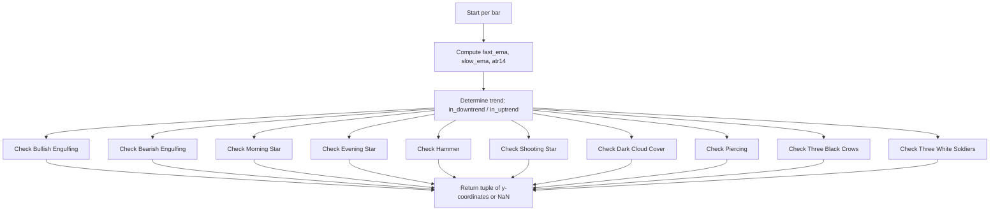

# Enhanced Candlestick Patterns (Beta) - Technical Guide

> Detects 10 candlestick patterns with EMA trend confirmation, ATR-based volatility filters, and volume confirmation for engulfing patterns.

| | |
| --- | --- |
| **Language** | Indie Script v5 |
| **Platform** | [TakeProfit](https://takeprofit.com) |
| **Category** | Candlestick patterns |
| **Type** | Indicator |
| **Author** | @pablo on TakeProfit |
| **License** | MIT |
| **Live script** | [Open on TakeProfit](https://takeprofit.com/indicator/enhanced-candlestick-patterns-beta-64) |
| **Source file** | [Enhanced Candlestick Patterns (Beta).indie5](Enhanced%20Candlestick%20Patterns%20(Beta).indie5) |

## Overview

This indicator scans each bar for ten classic candlestick patterns: Bullish Engulfing, Bearish Engulfing, Morning Star, Evening Star, Hammer, Shooting Star, Dark Cloud Cover, Piercing, Three Black Crows, and Three White Soldiers. It uses two EMAs (fast and slow) to determine the prevailing trend and triggers some patterns only when they align with the trend (e.g., Hammer requires a downtrend, Shooting Star requires an uptrend), while others (Bullish Engulfing, Bearish Engulfing, Morning Star, Evening Star) are detected regardless of trend. ATR(14) is used to normalize body size and gap requirements, making the detection adaptive to volatility. Volume confirmation is required for engulfing patterns.

The indicator places labeled markers below the bar for bullish patterns and above for bearish patterns, with varying shades of green/teal for bullish and red/purple for bearish. Each marker shows a short text code (e.g., BE, MORN, H, SE, EVE, SS) at a vertical offset proportional to the bar's range, ensuring labels do not overlap with the candle body.

## How it works

1. Compute fast EMA and slow EMA from close prices to determine trend direction (downtrend if fast < slow, uptrend if fast > slow).
2. Compute ATR(14) to scale body size, gap, and shadow thresholds to current volatility.
3. For each bar, check each pattern condition using current and past bars (indices 0, 1, 2).
4. For engulfing patterns, require a volume increase ratio (current volume > previous volume * volume_ratio).
5. For star patterns (morning/evening), require gaps between bodies measured in ATR units and that the third candle closes beyond the midpoint of the first.
6. For hammer/shooting star, require a long lower/upper shadow relative to body and trend alignment.
7. For three-candle patterns (three black crows, three white soldiers), require proper opens within previous body, small shadows, and each close lower/higher than the previous.
8. Return a tuple of 10 y-coordinates (or math.nan) for each pattern; markers are placed at those coordinates.
9. Bullish markers are placed below the bar (low - offset), bearish markers above (high + offset).

## Mathematical model

The indicator uses several threshold comparisons. Key formulas:

Body significance:
$$
\text{body} > \text{minimum\_body\_atr} \times \text{ATR}
$$

Doji condition:
$$
\text{body} \leq \text{doji\_ratio} \times (\text{high} - \text{low})
$$

Hammer lower shadow:
$$
\text{lower\_shadow} > \text{shadow\_body\_ratio} \times \text{body}
$$

Gap size for star patterns:
$$
\text{gap} > \text{gap\_atr\_ratio} \times \text{ATR}
$$

## Logic flow



## Parameters

| Parameter | Type | Default | Range | Description |
| --- | --- | --- | --- | --- |
| `doji_ratio` | float | 0.05 | 0.01 - 0.2 | Doji Body/Range Ratio |
| `shadow_body_ratio` | float | 2.0 | 1.0 - 5.0 | Shadow/Body Ratio |
| `minimum_body_atr` | float | 0.3 | 0.1 - 1.0 | Minimum Body/ATR Ratio |
| `gap_atr_ratio` | float | 0.1 | 0.0 - 0.5 | Gap/ATR Ratio |
| `volume_ratio` | float | 1.2 | 1.0 - 3.0 | Volume Increase Ratio |
| `fast_ema` | int | 20 | 5 - 50 | Fast EMA Length |
| `slow_ema` | int | 50 | 20 - 200 | Slow EMA Length |

## Code walkthrough

### Bullish Engulfing Detection

Lines 36-49 of [Enhanced Candlestick Patterns (Beta).indie5](Enhanced%20Candlestick%20Patterns%20(Beta).indie5):

```python
def is_bullish_engulfing(ctx: MainContext, atr_value: float, minimum_body_atr: float, volume_ratio: float) -> bool:
    body_prev = abs(ctx.close[1] - ctx.open[1])
    body_curr = abs(ctx.close[0] - ctx.open[0])
    
    # Check for significant body size
    is_significant = is_significant_body(body_curr, atr_value, minimum_body_atr)
    
    return (
        ctx.close[1] < ctx.open[1] and  # Previous candle is bearish
        ctx.close[0] > ctx.open[0] and  # Current candle is bullish
        ctx.open[0] <= ctx.close[1] and ctx.close[0] >= ctx.open[1] and  # Body engulfing
        is_significant and
        ctx.volume[0] > ctx.volume[1] * volume_ratio  # Volume confirmation
    )
```

This function checks for a bullish engulfing pattern: previous candle bearish, current bullish, current body engulfs previous body, body size significant relative to ATR, and volume increases by the volume_ratio factor. The volume confirmation is unique to engulfing patterns.

### Morning Star Detection

Lines 66-98 of [Enhanced Candlestick Patterns (Beta).indie5](Enhanced%20Candlestick%20Patterns%20(Beta).indie5):

```python
def is_morning_star(ctx: MainContext, atr_value: float, minimum_body_atr: float, gap_atr_ratio: float) -> bool:
    open1, close1 = ctx.open[2], ctx.close[2]
    open2, close2 = ctx.open[1], ctx.close[1]
    open3, close3 = ctx.open[0], ctx.close[0]

    body1 = abs(close1 - open1)
    body3 = abs(close3 - open3)
    
    # First candle should be bearish and significant
    is_bearish1 = close1 < open1 
    is_significant1 = is_significant_body(body1, atr_value, minimum_body_atr)
    
    # Second candle should have a small body
    is_small_body2 = is_small_body(ctx, 1)
    
    # Third candle should be bullish and significant
    is_bullish3 = close3 > open3
    is_significant3 = is_significant_body(body3, atr_value, minimum_body_atr)
    
    # Check for gaps or near-gaps using ATR
    gap_down = min(open1, close1) - max(open2, close2) > gap_atr_ratio * atr_value
    gap_up = min(open3, close3) - max(open2, close2) > gap_atr_ratio * atr_value
    
    # Check if third candle closes above midpoint of first
    closes_above_midpoint = close3 > (open1 + close1) / 2

    return (
        is_bearish1 and is_significant1 and
        is_small_body2 and
        is_bullish3 and is_significant3 and
        closes_above_midpoint and
        (gap_down or gap_up)  # At least one gap should be present
    )
```

The morning star is a three-candle reversal pattern. It requires a significant bearish first candle, a small-bodied second candle (doji-like), and a significant bullish third candle that closes above the midpoint of the first. Gaps between the candles are measured in ATR units; at least one gap must be present.

### Hammer Detection

Lines 134-151 of [Enhanced Candlestick Patterns (Beta).indie5](Enhanced%20Candlestick%20Patterns%20(Beta).indie5):

```python
def is_hammer(ctx: MainContext, in_downtrend: bool, atr_value: float, shadow_body_ratio: float) -> bool:
    open_, close = ctx.open[0], ctx.close[0]
    high, low = ctx.high[0], ctx.low[0]
    body = abs(close - open_)
    range_ = high - low
    upper_shadow = high - max(open_, close)
    lower_shadow = min(open_, close) - low
    
    is_significant = range_ > 0.5 * atr_value
    
    return (
        in_downtrend and
        is_significant and
        body > 0 and  # Ensure there is a body
        lower_shadow > shadow_body_ratio * body and  # Long lower shadow
        upper_shadow < 0.5 * body and  # Small upper shadow
        close >= open_  # Preferably bullish (close >= open)
    )
```

The hammer requires a downtrend, a significant range (>0.5*ATR), a long lower shadow ( > shadow_body_ratio * body), a small upper shadow (<0.5*body), and a close >= open (preferably bullish). The shadow_body_ratio parameter controls how long the lower shadow must be relative to the body.

### Main Function and Marker Placement

Lines 323-346 of [Enhanced Candlestick Patterns (Beta).indie5](Enhanced%20Candlestick%20Patterns%20(Beta).indie5):

```python
def Main(self, doji_ratio, shadow_body_ratio, minimum_body_atr, gap_atr_ratio, volume_ratio, fast_ema, slow_ema):
    # Main indicator logic
    h = self.high[0] - self.low[0]

    # Compute indicators
    fast_ema_series = Ema.new(self.close, fast_ema)
    slow_ema_series = Ema.new(self.close, slow_ema)
    atr14 = Atr.new(14)

    in_downtrend = is_downtrend(fast_ema_series[0], slow_ema_series[0])
    in_uptrend = is_uptrend(fast_ema_series[0], slow_ema_series[0])

    return (
        self.low[0] - h * 0.05 if is_bullish_engulfing(self, atr14[0], minimum_body_atr, volume_ratio) else math.nan,
        self.high[0] + h * 0.05 if is_bearish_engulfing(self, atr14[0], minimum_body_atr, volume_ratio) else math.nan,
        self.low[0] - h * 0.1 if is_morning_star(self, atr14[0], minimum_body_atr, gap_atr_ratio) else math.nan,
        self.high[0] + h * 0.1 if is_evening_star(self, atr14[0], minimum_body_atr, gap_atr_ratio) else math.nan,
        self.low[0] - h * 0.15 if is_hammer(self, in_downtrend, atr14[0], shadow_body_ratio) else math.nan,
        self.high[0] + h * 0.15 if is_shooting_star(self, in_uptrend, atr14[0], shadow_body_ratio) else math.nan,
        self.high[0] + h * 0.2 if is_dark_cloud_cover(self, in_uptrend, atr14[0], minimum_body_atr) else math.nan,
        self.low[0] - h * 0.2 if is_piercing(self, in_downtrend, atr14[0], minimum_body_atr) else math.nan,
        self.high[0] + h * 0.25 if is_three_black_crows(self, in_uptrend, atr14[0], minimum_body_atr) else math.nan,
        self.low[0] - h * 0.25 if is_three_white_soldiers(self, in_downtrend, atr14[0], minimum_body_atr) else math.nan
    )
```

The Main function computes EMAs and ATR, determines trend, then calls each pattern function. It returns a tuple of 10 values: each is either a y-coordinate (price level) for the marker or math.nan if the pattern is not detected. The y-coordinate is offset from the bar's high or low by a fraction of the bar's range (h), ensuring markers are placed at distinct vertical levels to avoid overlap.

## Reading the chart

- Bullish patterns (Bullish Engulfing, Morning Star, Hammer, Piercing, Three White Soldiers) are marked with labels below the bar (BELOW position). Colors: GREEN (BE), TEAL (MORN), LIME (H), rgba(0,180,80) (P), rgba(0,128,64) (TWS).
- Bearish patterns (Bearish Engulfing, Evening Star, Shooting Star, Dark Cloud Cover, Three Black Crows) are marked with labels above the bar (ABOVE position). Colors: RED (SE), PURPLE (EVE), FUCHSIA (SS), rgba(180,0,80) (DCC), MAROON (TBC).
- The vertical offset increases with pattern complexity: simple patterns (engulfing) have smaller offsets, three-candle patterns have larger offsets, preventing label overlap.
- A label appears only when the pattern condition is fully satisfied; otherwise no marker is drawn (math.nan).
- The trend condition (EMA cross) filters patterns: some patterns require trend alignment: Hammer, Piercing, and Three White Soldiers only appear during a downtrend; Shooting Star, Dark Cloud Cover, and Three Black Crows only appear during an uptrend. Bullish Engulfing, Bearish Engulfing, Morning Star, and Evening Star do not use trend filtering..

## Implementation notes

- The indicator uses math.nan to suppress markers when a pattern is not detected; this is the standard Indie way to avoid drawing on a bar.
- Pattern detection relies on bar indices [0] (current), [1] (previous), [2] (two bars back). At least 3 bars of history are required for three-candle patterns; earlier bars will return NaN.
- ATR(14) is computed on every bar using the built-in Atr.new(14) algorithm, which returns a series. The current ATR value is accessed with [0].
- Volume confirmation is only applied to engulfing patterns (Bullish Engulfing and Bearish Engulfing); other patterns do not check volume.

## FAQ

**How can I adjust the sensitivity of pattern detection?**

Modify the parameters: doji_ratio (smaller = stricter doji), minimum_body_atr (higher = larger body required), shadow_body_ratio (higher = longer shadow required), gap_atr_ratio (higher = larger gap required), and volume_ratio (higher = more volume increase needed).

**Can I add my own custom pattern to this indicator?**

Yes. Write a new helper function following the same signature (ctx, atr_value, ...) and add a corresponding plot.marker decorator. Then include its result in the Main return tuple with the appropriate y-coordinate or math.nan.

**Why do some patterns not appear even though I see them on the chart?**

The indicator requires trend alignment (bullish patterns only in downtrend, bearish only in uptrend) and ATR-based significance thresholds. If the trend is flat or the body/shadows are too small relative to ATR, the pattern is not triggered. Adjust the EMA lengths or the minimum_body_atr parameter to match your market's volatility.

## Full source code

Indie Script v5, as published on TakeProfit. Copy it into the platform's script editor or [open the live script](https://takeprofit.com/indicator/enhanced-candlestick-patterns-beta-64).

```python
# indie:lang_version = 5
from indie import indicator, param, plot, color, MainContext
from indie.algorithms import Ema, Atr
import math

# Define helper functions at global scope
def is_downtrend(fast_ema: float, slow_ema: float) -> bool:
    return fast_ema < slow_ema

def is_uptrend(fast_ema: float, slow_ema: float) -> bool:
    return fast_ema > slow_ema

def is_significant_body(body: float, atr_value: float, minimum_body_atr: float) -> bool:
    return body > minimum_body_atr * atr_value

def is_doji(ctx: MainContext, i: int, atr_value: float, doji_ratio: float) -> bool:
    high, low = ctx.high[i], ctx.low[i]
    open_, close = ctx.open[i], ctx.close[i]
    body = abs(close - open_)
    range_ = high - low
    
    # Check if range is significant compared to market volatility
    is_significant = range_ > 0.3 * atr_value
    
    # Traditional doji has very small body relative to range
    return is_significant and body <= doji_ratio * range_

def is_small_body(ctx: MainContext, i: int) -> bool:
    open_, close = ctx.open[i], ctx.close[i]
    high, low = ctx.high[i], ctx.low[i]
    body = abs(close - open_)
    range_ = high - low
    
    return body < 0.3 * range_

def is_bullish_engulfing(ctx: MainContext, atr_value: float, minimum_body_atr: float, volume_ratio: float) -> bool:
    body_prev = abs(ctx.close[1] - ctx.open[1])
    body_curr = abs(ctx.close[0] - ctx.open[0])
    
    # Check for significant body size
    is_significant = is_significant_body(body_curr, atr_value, minimum_body_atr)
    
    return (
        ctx.close[1] < ctx.open[1] and  # Previous candle is bearish
        ctx.close[0] > ctx.open[0] and  # Current candle is bullish
        ctx.open[0] <= ctx.close[1] and ctx.close[0] >= ctx.open[1] and  # Body engulfing
        is_significant and
        ctx.volume[0] > ctx.volume[1] * volume_ratio  # Volume confirmation
    )

def is_bearish_engulfing(ctx: MainContext, atr_value: float, minimum_body_atr: float, volume_ratio: float) -> bool:
    body_prev = abs(ctx.close[1] - ctx.open[1])
    body_curr = abs(ctx.close[0] - ctx.open[0])
    
    # Check for significant body size
    is_significant = is_significant_body(body_curr, atr_value, minimum_body_atr)
    
    return (
        ctx.close[1] > ctx.open[1] and  # Previous candle is bullish
        ctx.close[0] < ctx.open[0] and  # Current candle is bearish
        ctx.open[0] >= ctx.close[1] and ctx.close[0] <= ctx.open[1] and  # Body engulfing
        is_significant and
        ctx.volume[0] > ctx.volume[1] * volume_ratio  # Volume confirmation
    )

def is_morning_star(ctx: MainContext, atr_value: float, minimum_body_atr: float, gap_atr_ratio: float) -> bool:
    open1, close1 = ctx.open[2], ctx.close[2]
    open2, close2 = ctx.open[1], ctx.close[1]
    open3, close3 = ctx.open[0], ctx.close[0]

    body1 = abs(close1 - open1)
    body3 = abs(close3 - open3)
    
    # First candle should be bearish and significant
    is_bearish1 = close1 < open1 
    is_significant1 = is_significant_body(body1, atr_value, minimum_body_atr)
    
    # Second candle should have a small body
    is_small_body2 = is_small_body(ctx, 1)
    
    # Third candle should be bullish and significant
    is_bullish3 = close3 > open3
    is_significant3 = is_significant_body(body3, atr_value, minimum_body_atr)
    
    # Check for gaps or near-gaps using ATR
    gap_down = min(open1, close1) - max(open2, close2) > gap_atr_ratio * atr_value
    gap_up = min(open3, close3) - max(open2, close2) > gap_atr_ratio * atr_value
    
    # Check if third candle closes above midpoint of first
    closes_above_midpoint = close3 > (open1 + close1) / 2

    return (
        is_bearish1 and is_significant1 and
        is_small_body2 and
        is_bullish3 and is_significant3 and
        closes_above_midpoint and
        (gap_down or gap_up)  # At least one gap should be present
    )

def is_evening_star(ctx: MainContext, atr_value: float, minimum_body_atr: float, gap_atr_ratio: float) -> bool:
    open1, close1 = ctx.open[2], ctx.close[2]
    open2, close2 = ctx.open[1], ctx.close[1]
    open3, close3 = ctx.open[0], ctx.close[0]

    body1 = abs(close1 - open1)
    body3 = abs(close3 - open3)
    
    # First candle should be bullish and significant
    is_bullish1 = close1 > open1
    is_significant1 = is_significant_body(body1, atr_value, minimum_body_atr)
    
    # Second candle should have a small body
    is_small_body2 = is_small_body(ctx, 1)
    
    # Third candle should be bearish and significant
    is_bearish3 = close3 < open3
    is_significant3 = is_significant_body(body3, atr_value, minimum_body_atr)
    
    # Check for gaps or near-gaps using ATR
    gap_up = min(open2, close2) - max(open1, close1) > gap_atr_ratio * atr_value
    gap_down = min(open2, close2) - max(open3, close3) > gap_atr_ratio * atr_value
    
    # Check if third candle closes below midpoint of first
    closes_below_midpoint = close3 < (open1 + close1) / 2

    return (
        is_bullish1 and is_significant1 and
        is_small_body2 and
        is_bearish3 and is_significant3 and
        closes_below_midpoint and
        (gap_up or gap_down)  # At least one gap should be present
    )

def is_hammer(ctx: MainContext, in_downtrend: bool, atr_value: float, shadow_body_ratio: float) -> bool:
    open_, close = ctx.open[0], ctx.close[0]
    high, low = ctx.high[0], ctx.low[0]
    body = abs(close - open_)
    range_ = high - low
    upper_shadow = high - max(open_, close)
    lower_shadow = min(open_, close) - low
    
    is_significant = range_ > 0.5 * atr_value
    
    return (
        in_downtrend and
        is_significant and
        body > 0 and  # Ensure there is a body
        lower_shadow > shadow_body_ratio * body and  # Long lower shadow
        upper_shadow < 0.5 * body and  # Small upper shadow
        close >= open_  # Preferably bullish (close >= open)
    )

def is_shooting_star(ctx: MainContext, in_uptrend: bool, atr_value: float, shadow_body_ratio: float) -> bool:
    open_, close = ctx.open[0], ctx.close[0]
    high, low = ctx.high[0], ctx.low[0]
    body = abs(close - open_)
    range_ = high - low
    upper_shadow = high - max(open_, close)
    lower_shadow = min(open_, close) - low
    
    is_significant = range_ > 0.5 * atr_value
    
    return (
        in_uptrend and
        is_significant and
        body > 0 and  # Ensure there is a body
        upper_shadow > shadow_body_ratio * body and  # Long upper shadow
        lower_shadow < 0.5 * body and  # Small lower shadow
        close <= open_  # Preferably bearish (close <= open)
    )

def is_dark_cloud_cover(ctx: MainContext, in_uptrend: bool, atr_value: float, minimum_body_atr: float) -> bool:
    open1, close1 = ctx.open[1], ctx.close[1]
    open2, close2 = ctx.open[0], ctx.close[0]
    
    body1 = abs(close1 - open1)
    body2 = abs(close2 - open2)
    body_mid = (open1 + close1) / 2
    
    is_significant1 = is_significant_body(body1, atr_value, minimum_body_atr)
    is_significant2 = is_significant_body(body2, atr_value, minimum_body_atr)
    
    return (
        in_uptrend and
        close1 > open1 and  # First candle is bullish
        close2 < open2 and  # Second candle is bearish
        open2 > close1 and  # Second candle opens above first candle's close
        close2 < body_mid and  # Second candle closes below midpoint of first
        close2 > open1 and  # Second candle doesn't close below first candle's open
        is_significant1 and is_significant2
    )

def is_piercing(ctx: MainContext, in_downtrend: bool, atr_value: float, minimum_body_atr: float) -> bool:
    open1, close1 = ctx.open[1], ctx.close[1]
    open2, close2 = ctx.open[0], ctx.close[0]
    
    body1 = abs(close1 - open1)
    body2 = abs(close2 - open2)
    body_mid = (open1 + close1) / 2
    
    is_significant1 = is_significant_body(body1, atr_value, minimum_body_atr)
    is_significant2 = is_significant_body(body2, atr_value, minimum_body_atr)
    
    return (
        in_downtrend and
        close1 < open1 and  # First candle is bearish
        close2 > open2 and  # Second candle is bullish
        open2 < close1 and  # Second candle opens below first candle's close
        close2 > body_mid and  # Second candle closes above midpoint of first
        close2 < open1 and  # Second candle doesn't close above first candle's open
        is_significant1 and is_significant2
    )

def is_three_black_crows(ctx: MainContext, in_uptrend: bool, atr_value: float, minimum_body_atr: float) -> bool:
    # Calculate bearish body sizes
    b1 = ctx.open[2] - ctx.close[2]
    b2 = ctx.open[1] - ctx.close[1]
    b3 = ctx.open[0] - ctx.close[0]
    
    # Calculate shadows
    upper_shadow1 = ctx.high[2] - ctx.open[2]
    upper_shadow2 = ctx.high[1] - ctx.open[1]
    upper_shadow3 = ctx.high[0] - ctx.open[0]
    
    lower_shadow1 = ctx.close[2] - ctx.low[2]
    lower_shadow2 = ctx.close[1] - ctx.low[1]
    lower_shadow3 = ctx.close[0] - ctx.low[0]
    
    # Significant bodies and small shadows relative to bodies
    are_significant = (
        b1 > minimum_body_atr * atr_value and 
        b2 > minimum_body_atr * atr_value and 
        b3 > minimum_body_atr * atr_value
    )
    
    small_shadows = (
        upper_shadow1 < 0.3 * b1 and upper_shadow2 < 0.3 * b2 and upper_shadow3 < 0.3 * b3 and
        lower_shadow1 < 0.3 * b1 and lower_shadow2 < 0.3 * b2 and lower_shadow3 < 0.3 * b3
    )
    
    # Each opens within the previous candle's body (traditional definition)
    proper_opens = (
        ctx.open[1] <= ctx.open[2] and ctx.open[1] >= ctx.close[2] and
        ctx.open[0] <= ctx.open[1] and ctx.open[0] >= ctx.close[1]
    )
    
    return (
        in_uptrend and
        # All three candles are bearish
        ctx.close[2] < ctx.open[2] and ctx.close[1] < ctx.open[1] and ctx.close[0] < ctx.open[0] and
        # Each closes lower than the previous
        ctx.close[1] < ctx.close[2] and ctx.close[0] < ctx.close[1] and
        are_significant and
        small_shadows and
        proper_opens
    )

def is_three_white_soldiers(ctx: MainContext, in_downtrend: bool, atr_value: float, minimum_body_atr: float) -> bool:
    # Calculate bullish body sizes
    b1 = ctx.close[2] - ctx.open[2]
    b2 = ctx.close[1] - ctx.open[1]
    b3 = ctx.close[0] - ctx.open[0]
    
    # Calculate shadows
    upper_shadow1 = ctx.high[2] - ctx.close[2]
    upper_shadow2 = ctx.high[1] - ctx.close[1]
    upper_shadow3 = ctx.high[0] - ctx.close[0]
    
    lower_shadow1 = ctx.open[2] - ctx.low[2]
    lower_shadow2 = ctx.open[1] - ctx.low[1]
    lower_shadow3 = ctx.open[0] - ctx.low[0]
    
    # Significant bodies and small shadows relative to bodies
    are_significant = (
        b1 > minimum_body_atr * atr_value and 
        b2 > minimum_body_atr * atr_value and 
        b3 > minimum_body_atr * atr_value
    )
    
    small_shadows = (
        upper_shadow1 < 0.3 * b1 and upper_shadow2 < 0.3 * b2 and upper_shadow3 < 0.3 * b3 and
        lower_shadow1 < 0.3 * b1 and lower_shadow2 < 0.3 * b2 and lower_shadow3 < 0.3 * b3
    )
    
    # Each opens within the previous candle's body (traditional definition)
    proper_opens = (
        ctx.open[1] >= ctx.open[2] and ctx.open[1] <= ctx.close[2] and
        ctx.open[0] >= ctx.open[1] and ctx.open[0] <= ctx.close[1]
    )
    
    return (
        in_downtrend and
        # All three candles are bullish
        ctx.close[2] > ctx.open[2] and ctx.close[1] > ctx.open[1] and ctx.close[0] > ctx.open[0] and
        # Each closes higher than the previous
        ctx.close[1] > ctx.close[2] and ctx.close[0] > ctx.close[1] and
        are_significant and
        small_shadows and
        proper_opens
    )

@indicator('Enhanced Candlestick Patterns v3', overlay_main_pane=True)
@param.float('doji_ratio', default=0.05, min=0.01, max=0.2, title='Doji Body/Range Ratio')
@param.float('shadow_body_ratio', default=2.0, min=1.0, max=5.0, title='Shadow/Body Ratio')
@param.float('minimum_body_atr', default=0.3, min=0.1, max=1.0, title='Minimum Body/ATR Ratio')
@param.float('gap_atr_ratio', default=0.1, min=0.0, max=0.5, title='Gap/ATR Ratio')
@param.float('volume_ratio', default=1.2, min=1.0, max=3.0, title='Volume Increase Ratio')
@param.int('fast_ema', default=20, min=5, max=50, title='Fast EMA Length')
@param.int('slow_ema', default=50, min=20, max=200, title='Slow EMA Length')
# Bullish Patterns (varying shades of green/teal)
@plot.marker(color=color.GREEN, text='BE', style=plot.marker_style.LABEL, position=plot.marker_position.BELOW)  # Bullish Engulfing
@plot.marker(color=color.TEAL, text='MORN', style=plot.marker_style.LABEL, position=plot.marker_position.BELOW)  # Morning Star
@plot.marker(color=color.LIME, text='H', style=plot.marker_style.LABEL, position=plot.marker_position.BELOW)  # Hammer
@plot.marker(color=color.rgba(0, 180, 80, 1), text='P', style=plot.marker_style.LABEL, position=plot.marker_position.BELOW)  # Piercing
@plot.marker(color=color.rgba(0, 128, 64, 1), text='TWS', style=plot.marker_style.LABEL, position=plot.marker_position.BELOW)  # Three White Soldiers

# Bearish Patterns (varying shades of red/purple)
@plot.marker(color=color.RED, text='SE', style=plot.marker_style.LABEL, position=plot.marker_position.ABOVE)  # Bearish Engulfing
@plot.marker(color=color.PURPLE, text='EVE', style=plot.marker_style.LABEL, position=plot.marker_position.ABOVE)  # Evening Star
@plot.marker(color=color.FUCHSIA, text='SS', style=plot.marker_style.LABEL, position=plot.marker_position.ABOVE)  # Shooting Star
@plot.marker(color=color.rgba(180, 0, 80, 1), text='DCC', style=plot.marker_style.LABEL, position=plot.marker_position.ABOVE)  # Dark Cloud Cover
@plot.marker(color=color.MAROON, text='TBC', style=plot.marker_style.LABEL, position=plot.marker_position.ABOVE)  # Three Black Crows
def Main(self, doji_ratio, shadow_body_ratio, minimum_body_atr, gap_atr_ratio, volume_ratio, fast_ema, slow_ema):
    # Main indicator logic
    h = self.high[0] - self.low[0]

    # Compute indicators
    fast_ema_series = Ema.new(self.close, fast_ema)
    slow_ema_series = Ema.new(self.close, slow_ema)
    atr14 = Atr.new(14)

    in_downtrend = is_downtrend(fast_ema_series[0], slow_ema_series[0])
    in_uptrend = is_uptrend(fast_ema_series[0], slow_ema_series[0])

    return (
        self.low[0] - h * 0.05 if is_bullish_engulfing(self, atr14[0], minimum_body_atr, volume_ratio) else math.nan,
        self.high[0] + h * 0.05 if is_bearish_engulfing(self, atr14[0], minimum_body_atr, volume_ratio) else math.nan,
        self.low[0] - h * 0.1 if is_morning_star(self, atr14[0], minimum_body_atr, gap_atr_ratio) else math.nan,
        self.high[0] + h * 0.1 if is_evening_star(self, atr14[0], minimum_body_atr, gap_atr_ratio) else math.nan,
        self.low[0] - h * 0.15 if is_hammer(self, in_downtrend, atr14[0], shadow_body_ratio) else math.nan,
        self.high[0] + h * 0.15 if is_shooting_star(self, in_uptrend, atr14[0], shadow_body_ratio) else math.nan,
        self.high[0] + h * 0.2 if is_dark_cloud_cover(self, in_uptrend, atr14[0], minimum_body_atr) else math.nan,
        self.low[0] - h * 0.2 if is_piercing(self, in_downtrend, atr14[0], minimum_body_atr) else math.nan,
        self.high[0] + h * 0.25 if is_three_black_crows(self, in_uptrend, atr14[0], minimum_body_atr) else math.nan,
        self.low[0] - h * 0.25 if is_three_white_soldiers(self, in_downtrend, atr14[0], minimum_body_atr) else math.nan
    )
```
