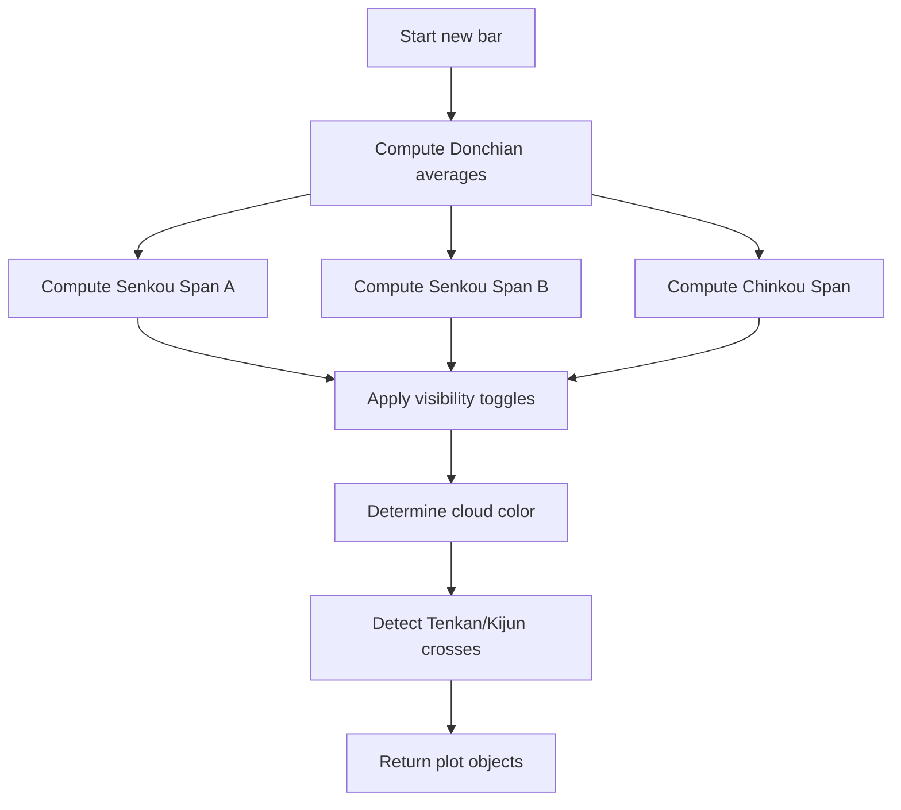

# Enhanced Ichimoku Cloud 5 - Technical Guide

> Computes Ichimoku Cloud components (Tenkan-Sen, Kijun-Sen, Senkou Spans, Chinkou Span) with cloud color based on trend direction.

| | |
| --- | --- |
| **Language** | Indie Script v5 |
| **Platform** | [TakeProfit](https://takeprofit.com) |
| **Category** | Trend |
| **Type** | Indicator |
| **Author** | @pavel_medvedev on TakeProfit |
| **Original** | Originally created by ChrisMoody for Pine Script (10/20/2014). |
| **Original (TradingView)** | [CM Enhanced Ichimoku Cloud V5](https://www.tradingview.com/scripts/chrismoody/) by ChrisMoody (author's script list; the original page was not located) |
| **License** | [MPL-2.0](https://mozilla.org/MPL/2.0/) (derivative work) |
| **Live script** | [Open on TakeProfit](https://takeprofit.com/indicator/enhanced-ichimoku-cloud-5-87) |
| **Source file** | [Enhanced Ichimoku Cloud 5.indie5](Enhanced%20Ichimoku%20Cloud%205.indie5) |

## Overview

Enhanced Ichimoku Cloud 5 is a port of ChrisMoody's original Pine Script indicator for TradingView. It implements the Ichimoku Cloud (also known as Ichimoku Kinko Hyo) technical analysis system, which combines multiple moving averages of Donchian (midpoint) type to identify support/resistance levels, trend direction, and potential reversal zones.

The indicator plots five lines on the chart: Tenkan-Sen (short-term average), Kijun-Sen (medium-term average), Senkou Span A (leading average), Senkou Span B (long-term leading average), and Chinkou Span (lagging line). The area between Senkou Span A and B forms the Kumo (cloud), which is colored green when Span A ≥ Span B (bullish) and red otherwise (bearish). Optional arrows mark crosses between Tenkan and Kijun lines.

## How it works

1. Compute Tenkan-Sen as Donchian average over `turning_periods` (default 9).
2. Compute Kijun-Sen as Donchian average over `standard_periods` (default 26).
3. Compute Senkou Span A as the average of Tenkan-Sen and Kijun-Sen.
4. Compute Senkou Span B as Donchian average over `span_b_periods` (default 52).
5. Compute Chinkou Span as the current close price (lagging line).
6. Apply visibility toggles: replace values with NaN to hide lines.
7. Determine cloud fill color: green if Span A >= Span B, else red.
8. Detect crosses between Tenkan and Kijun lines and place markers if enabled.

## Mathematical model

$$
\text{Tenkan-Sen} = \text{Donchian}(\text{turning\_periods}) = \frac{\max(\text{high}, \text{turning\_periods}) + \min(\text{low}, \text{turning\_periods})}{2}
$$

$$
\text{Kijun-Sen} = \text{Donchian}(\text{standard\_periods})
$$

$$
\text{Senkou Span A} = \frac{\text{Tenkan-Sen} + \text{Kijun-Sen}}{2}
$$

$$
\text{Senkou Span B} = \text{Donchian}(\text{span\_b\_periods})
$$

$$
\text{Chinkou Span} = \text{close price} \quad (\text{plotted with offset} = -\text{displacement})
$$

## Logic flow



## Parameters

| Parameter | Type | Default | Range | Description |
| --- | --- | --- | --- | --- |
| `turning_periods` | int | 9 | ≥ 1 | Tenkan-Sen |
| `standard_periods` | int | 26 | ≥ 1 | Kijun-Sen |
| `span_b_periods` | int | 52 | ≥ 1 | Senkou Span B |
| `displacement` | int | 26 | ≥ 1 | -ChinkouSpan / +SenkouSpan A |
| `sts` | bool | true |  | Show Tenkan-Sen (9 Period)? |
| `sks` | bool | true |  | Show Kijun-Sen (26 Period)? |
| `sll` | bool | true |  | Show Chinkou Span (Lagging Line)? |
| `sc` | bool | true |  | Show Cloud? |
| `cr1` | bool | false |  | Show Tenkan/Kijun cross arrows? |

## Code walkthrough

### Core series computation

Lines 40-43 of [Enhanced Ichimoku Cloud 5.indie5](Enhanced%20Ichimoku%20Cloud%205.indie5):

```python
    turning  = Donchian.new(turning_periods)                       # Tenkan-Sen (9)
    standard = Donchian.new(standard_periods)                      # Kijun-Sen  (26)
    span_a   = MutSeriesF.new((turning[0] + standard[0]) / 2)      # Senkou Span A
    span_b   = Donchian.new(span_b_periods)                        # Senkou Span B (52)
```

Donchian.new creates a series that returns the midpoint of the highest high and lowest low over the given period. `turning` and `standard` are such series for Tenkan and Kijun. `span_a` is a MutSeriesF that holds the average of the two, updating each bar. `span_b` is another Donchian series for the longer period.

### Visibility toggles

Lines 46-50 of [Enhanced Ichimoku Cloud 5.indie5](Enhanced%20Ichimoku%20Cloud%205.indie5):

```python
    tenkan_val  = turning[0]    if sts else nan
    kijun_val   = standard[0]   if sks else nan
    chinkou_val = self.close[0] if sll else nan
    span_a_val  = span_a[0]     if sc  else nan
    span_b_val  = span_b[0]     if sc  else nan
```

Each line's value is replaced with `nan` if its corresponding boolean parameter is false. The plotter skips drawing any element with a NaN value, effectively hiding the line or cloud.

### Cloud color logic

Lines 53-53 of [Enhanced Ichimoku Cloud 5.indie5](Enhanced%20Ichimoku%20Cloud%205.indie5):

```python
    cloud_color = color.LIME(0.3) if span_a[0] >= span_b[0] else color.RED(0.3)
```

The cloud fill color is chosen each bar: lime (green) with 30% opacity when Senkou Span A is greater than or equal to Span B, red with 30% opacity otherwise. This gives a quick visual cue of the trend direction.

### Cross detection

Lines 56-59 of [Enhanced Ichimoku Cloud 5.indie5](Enhanced%20Ichimoku%20Cloud%205.indie5):

```python
    cu = cross_over(turning, standard)
    cd = cross_under(turning, standard)
    cross_up_val = self.low[0]  if (cr1 and cu) else nan
    cross_dn_val = self.high[0] if (cr1 and cd) else nan
```

`cross_over` and `cross_under` from indie.math return true when the first series crosses above or below the second. If the `cr1` parameter is true and a cross is detected, a marker is placed at the bar's low (for up cross) or high (for down cross).

### Return tuple

Lines 61-70 of [Enhanced Ichimoku Cloud 5.indie5](Enhanced%20Ichimoku%20Cloud%205.indie5):

```python
    return (
        plot.Line(tenkan_val),
        plot.Line(kijun_val),
        plot.Line(chinkou_val, offset=-displacement),
        plot.Line(span_a_val,  offset=displacement),
        plot.Line(span_b_val,  offset=displacement),
        plot.Fill(color=cloud_color, offset=displacement),
        plot.Marker(cross_up_val, text='▲'),
        plot.Marker(cross_dn_val, text='▼'),
    )
```

The function returns a tuple of plot objects. Lines for Tenkan, Kijun, Chinkou, Span A, Span B are drawn with optional offsets: Chinkou is shifted left by `displacement`, while the Senkou spans and cloud are shifted right by `displacement`. Markers for crosses are placed below or above the bar.

## Reading the chart

- **Tenkan-Sen** (lime, thicker line): short-term Donchian average; reacts quickly to price changes.
- **Kijun-Sen** (fuchsia, thicker line): medium-term Donchian average; smoother and slower.
- **Chinkou Span** (aqua, thicker line): current close price plotted with a negative offset (lagging).
- **Senkou Span A** (lime, thin line) and **Senkou Span B** (red, thin line): leading averages plotted with a positive offset (shifted forward).
- **Kumo (Cloud)**: filled area between Span A and Span B. Green when Span A ≥ Span B (bullish), red when Span A < Span B (bearish).
- **Cross arrows** (yellow, optional): ▲ below the bar when Tenkan crosses above Kijun, ▼ above the bar when Tenkan crosses below Kijun.

## Implementation notes

- Donchian.new returns a series; accessing [0] gives the current value, [1] the previous bar's value.
- MutSeriesF.new creates a mutable series that updates each bar; used here for Senkou Span A.
- NaN values cause the plotter to skip drawing that element, effectively hiding lines or markers.
- The cloud fill uses the same offset as the Senkou spans (displacement), so it aligns with the leading lines.
- Cross detection uses indie.math.cross_over and cross_under, which return true on the bar where the cross occurs.

## FAQ

**How do I change the periods?**

Adjust the parameters in the indicator settings: turning_periods (Tenkan-Sen), standard_periods (Kijun-Sen), span_b_periods (Senkou Span B), and displacement (Chinkou/Senkou offset).

**Can I hide individual lines?**

Yes, use the boolean parameters sts (Tenkan), sks (Kijun), sll (Chinkou), and sc (Cloud) to toggle visibility. When disabled, the corresponding line is replaced with NaN and not drawn.

**How is the cloud color determined?**

The cloud is green (lime) with 30% opacity when Senkou Span A >= Senkou Span B, indicating a bullish trend. It turns red with 30% opacity when Span A < Span B, indicating a bearish trend.

## License and attribution

This Indie script is a derivative work of **CM Enhanced Ichimoku Cloud V5 by ChrisMoody** on TradingView. This is a port of an open-source TradingView script whose header we could not retrieve; TradingView applies MPL-2.0 by default to open-source scripts, so that license is assumed. A modified version of MPL-2.0 code must stay under [MPL-2.0](https://mozilla.org/MPL/2.0/), so this file is distributed under that license (the notice is appended to the end of the source file). The original author keeps the credit for the algorithm; this page is not affiliated with or endorsed by them.

## Full source code

Indie Script v5, as published on TakeProfit. Copy it into the platform's script editor or [open the live script](https://takeprofit.com/indicator/enhanced-ichimoku-cloud-5-87).

```python
# indie:lang_version = 5
# Originally created by ChrisMoody for Pine Script (10/20/2014).
# Converted to Indie for the TakeProfit platform.
# Features:
#   - Tenkan-Sen (9), Kijun-Sen (26), Chinkou Span, Senkou Span A/B (cloud)
#   - Cloud color flips with the trend (green when Span A >= Span B, red otherwise)
#   - Per-line visibility toggles
#   - Optional Tenkan/Kijun cross arrows

from math import nan
from indie import indicator, param, plot, color, MutSeriesF
from indie.algorithms import Donchian
from indie.math import cross_over, cross_under


@indicator('Enhanced Ichimoku Cloud 5', overlay_main_pane=True)
@param.int('turning_periods',  default=9,  min=1, title='Tenkan-Sen')
@param.int('standard_periods', default=26, min=1, title='Kijun-Sen')
@param.int('span_b_periods',   default=52, min=1, title='Senkou Span B')
@param.int('displacement',     default=26, min=1, title='-ChinkouSpan / +SenkouSpan A')
@param.bool('sts', default=True,  title='Show Tenkan-Sen (9 Period)?')
@param.bool('sks', default=True,  title='Show Kijun-Sen (26 Period)?')
@param.bool('sll', default=True,  title='Show Chinkou Span (Lagging Line)?')
@param.bool('sc',  default=True,  title='Show Cloud?')
@param.bool('cr1', default=False, title='Show Tenkan/Kijun cross arrows?')
@plot.line('tenkan',  color=color.LIME,    line_width=2, title='Tenkan-Sen (9 Period)')
@plot.line('kijun',   color=color.FUCHSIA, line_width=2, title='Kijun-Sen (26 Period)')
@plot.line('chinkou', color=color.AQUA,    line_width=2, title='Chinkou Span (Lagging Line)')
@plot.line('span_a',  color=color.LIME,    line_width=1, title='Senkou Span A (26 Period)')
@plot.line('span_b',  color=color.RED,     line_width=1, title='Senkou Span B (52 Period)')
@plot.fill('span_a', 'span_b', title='Kumo (Cloud)')
@plot.marker(style=plot.marker_style.LABEL, position=plot.marker_position.BELOW,
             color=color.YELLOW, size=3, title='Tenkan/Kijun Cross Up')
@plot.marker(style=plot.marker_style.LABEL, position=plot.marker_position.ABOVE,
             color=color.YELLOW, size=3, title='Tenkan/Kijun Cross Down')
def Main(self, turning_periods, standard_periods, span_b_periods, displacement,
         sts, sks, sll, sc, cr1):
    # --- Ichimoku core series ---
    # Pine's `donchian(len) => avg(lowest(len), highest(len))` is exactly indie.algorithms.Donchian.
    turning  = Donchian.new(turning_periods)                       # Tenkan-Sen (9)
    standard = Donchian.new(standard_periods)                      # Kijun-Sen  (26)
    span_a   = MutSeriesF.new((turning[0] + standard[0]) / 2)      # Senkou Span A
    span_b   = Donchian.new(span_b_periods)                        # Senkou Span B (52)

    # --- Visibility toggles (use nan to hide a plot) ---
    tenkan_val  = turning[0]    if sts else nan
    kijun_val   = standard[0]   if sks else nan
    chinkou_val = self.close[0] if sll else nan
    span_a_val  = span_a[0]     if sc  else nan
    span_b_val  = span_b[0]     if sc  else nan

    # --- Cloud color: green when bullish (Span A >= Span B), red when bearish ---
    cloud_color = color.LIME(0.3) if span_a[0] >= span_b[0] else color.RED(0.3)

    # --- Tenkan/Kijun cross detection ---
    cu = cross_over(turning, standard)
    cd = cross_under(turning, standard)
    cross_up_val = self.low[0]  if (cr1 and cu) else nan
    cross_dn_val = self.high[0] if (cr1 and cd) else nan

    return (
        plot.Line(tenkan_val),
        plot.Line(kijun_val),
        plot.Line(chinkou_val, offset=-displacement),
        plot.Line(span_a_val,  offset=displacement),
        plot.Line(span_b_val,  offset=displacement),
        plot.Fill(color=cloud_color, offset=displacement),
        plot.Marker(cross_up_val, text='▲'),
        plot.Marker(cross_dn_val, text='▼'),
    )

# ---------------------------------------------------------------------------
# This Source Code Form is subject to the terms of the Mozilla Public
# License, v. 2.0. If a copy of the MPL was not distributed with this
# file, You can obtain one at https://mozilla.org/MPL/2.0/
# Derived from "CM Enhanced Ichimoku Cloud V5 by ChrisMoody" (TradingView).
# ---------------------------------------------------------------------------
```
