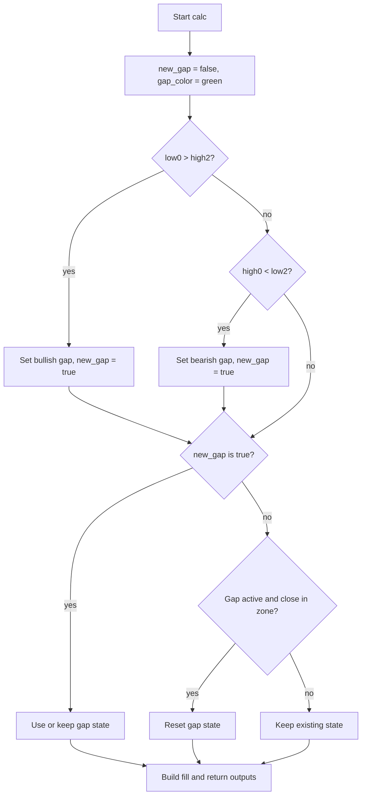

# Fair Value Gap (FVG) - Technical Guide

> Detects bullish and bearish Fair Value Gaps from bar comparisons and plots persistent colored fill zones until price re-enters.

| | |
| --- | --- |
| **Language** | Indie Script v5 |
| **Platform** | [TakeProfit](https://takeprofit.com) |
| **Category** | Candlestick patterns |
| **Type** | Indicator |
| **Author** | @daniel_shackleton on TakeProfit |
| **License** | MIT |
| **Live script** | [Open on TakeProfit](https://takeprofit.com/indicator/fair-value-gap-fvg-36) |
| **Source file** | [Fair Value Gap (FVG).indie5](Fair%20Value%20Gap%20(FVG).indie5) |

## Overview

This indicator computes the classic Fair Value Gap using the previous two bars: a bullish gap is stored when `self.low[0] > self.high[2]`, and a bearish gap when `self.high[0] < self.low[2]`. The zone boundaries are kept in `self.fvg_top` and `self.fvg_bottom` and are returned on every following bar until they are reset, so a detected gap is persistent rather than recalculated from a fixed window.

It is meant for marking price imbalances left after a directional move. On the chart, two boundary lines are drawn from the `p1`/`p2` plot decorators and a semi-transparent fill is rendered between them while a gap is active. The fill offset can be adjusted with the `fill_offset` parameter, and the code uses `math.nan` to represent no active gap, and a fallback fill color (`color.AQUA`) is used when no gap is active.

## How it works

1. Initializes persistent state: `self.fvg_top` and `self.fvg_bottom` are `nan`, `self.fvg_type` is an empty string, and `fill_offset` is read from the parameter.
2. At each `calc()` call, `new_gap` is set to `false` and `gap_color` starts at `color.GREEN(0.5)`.
3. If `self.low[0] > self.high[2]`, a bullish gap is registered: `fvg_top = high[2]`, `fvg_bottom = low[0]`, type is `'bullish'`, fill color stays green.
4. Otherwise, if `self.high[0] < self.low[2]`, a bearish gap is registered: `fvg_top = high[0]`, `fvg_bottom = low[2]`, type is `'bearish'`, fill color is set to red.
5. If there was no new gap and a gap is active, it checks for close re-entry: bullish cancellation is `fvg_top < close[0] < fvg_bottom`; the bearish branch uses `fvg_bottom < close[0] < fvg_top`, which is unreachable with the stored values.
6. It builds one `plot.Fill` object: the color is `gap_color` when `fvg_top` is not `nan`, otherwise `color.AQUA`; the given offset is `fill_offset`.
7. The calc returns `(fvg_top, fvg_bottom, gap_fill)`, which maps to the `p1`, `p2`, and fill plot decorators.

## Mathematical model

$$
\text{Bullish FVG: } low[0] > high[2]
$$

$$
\text{Stored: } p_1 = fvg\_top = high[2], \quad p_2 = fvg\_bottom = low[0]
$$

$$
\text{Bearish FVG: } high[0] < low[2]
$$

$$
\text{Stored: } p_1 = fvg\_top = high[0], \quad p_2 = fvg\_bottom = low[2]
$$

$$
\text{Cancel bullish: } fvg\_top < close[0] < fvg\_bottom
$$

$$
\text{Cancel bearish as written: } fvg\_bottom < close[0] < fvg\_top
$$

## Logic flow



## Parameters

| Parameter | Type | Default | Range | Description |
| --- | --- | --- | --- | --- |
| `fill_offset` | int | 2 |  | Fill Offset |

## Code walkthrough

### Persistent gap state

Lines 13-17 of [Fair Value Gap (FVG).indie5](Fair%20Value%20Gap%20(FVG).indie5):

```python
        # Persistent gap boundaries – initialized as NaN.
        self.fvg_top: float = nan
        self.fvg_bottom: float = nan
        # We'll track the type: "bullish" or "bearish"; empty string if none.
        self.fvg_type: str = ""
```

The indicator stores the current gap boundaries and type as fields on the Main instance. Initializing them as `nan` and an empty string lets the first `calc()` call know that no gap is active yet. These fields are mutated across bars, which is how the gap persists until cancellation.

### Gap detection

Lines 29-42 of [Fair Value Gap (FVG).indie5](Fair%20Value%20Gap%20(FVG).indie5):

```python
        # Bullish FVG condition: current bar's low is above the high of the bar two bars ago.
        if self.low[0] > self.high[2]:
            new_gap = True
            self.fvg_top = self.high[2]
            self.fvg_bottom = self.low[0]
            self.fvg_type = "bullish"
            gap_color = color.GREEN(0.5)
        # Bearish FVG condition: current bar's high is below the low of the bar two bars ago.
        elif self.high[0] < self.low[2]:
            new_gap = True
            self.fvg_top = self.high[0]
            self.fvg_bottom = self.low[2]
            self.fvg_type = "bearish"
            gap_color = color.RED(0.5)
```

The two conditions follow the classic FVG definitions. Note the boundary assignment: for bullish gaps, `fvg_top = high[2]` is the lower price and `fvg_bottom = low[0]` is the higher price; for bearish gaps, `fvg_top = high[0]` is lower and `fvg_bottom = low[2]` is higher. Thus `fvg_top` is actually the lower bound and `fvg_bottom` the upper bound in both cases.

### Gap cancellation

Lines 46-58 of [Fair Value Gap (FVG).indie5](Fair%20Value%20Gap%20(FVG).indie5):

```python
        if not new_gap and not isnan(self.fvg_top):
            if self.fvg_type == "bullish":
                # For bullish gap, if current close is between fvg_top and fvg_bottom, cancel the gap.
                if self.fvg_top < self.close[0] and self.close[0] < self.fvg_bottom:
                    self.fvg_top = nan
                    self.fvg_bottom = nan
                    self.fvg_type = ""
            elif self.fvg_type == "bearish":
                # For bearish gap, if current close is between fvg_bottom and fvg_top, cancel the gap.
                if self.fvg_bottom < self.close[0] and self.close[0] < self.fvg_top:
                    self.fvg_top = nan
                    self.fvg_bottom = nan
                    self.fvg_type = ""
```

Cancellation runs only when no new gap was detected on the current bar and a gap is still active. The bullish branch checks whether the close is strictly inside the stored boundaries. The bearish branch checks `fvg_bottom < close[0] < fvg_top`; because `fvg_bottom` is greater than `fvg_top` for a bearish gap, this condition cannot become true as written.

### Fill object and return values

Lines 60-67 of [Fair Value Gap (FVG).indie5](Fair%20Value%20Gap%20(FVG).indie5):

```python
        # Create a fill object using keyword arguments.
        # If a gap is active, use the computed gap_color; otherwise, use a default transparent color.
        current_fill_color = gap_color if not isnan(self.fvg_top) else color.AQUA
        gap_fill = plot.Fill(color=current_fill_color, offset=self.fill_offset)
        
        # Return three outputs (matching the three plot decorators):
        # p1: gap upper boundary, p2: gap lower boundary, p3: fill between them.
        return self.fvg_top, self.fvg_bottom, gap_fill
```

A single `plot.Fill` object is created with either the active gap color or `color.AQUA`. The two floats and the fill are returned in the order expected by the three plot decorators. Since `gap_color` is reset at the top of `calc()`, a persistent bearish gap that is not refreshed on the current bar will be drawn green.

## Reading the chart

- Green translucent fill (`color.GREEN(0.5)`) is used when a bullish gap is detected on this bar or when any previously active gap is simply carried forward.
- Red translucent fill (`color.RED(0.5)`) is used only on the exact bar where a new bearish gap is detected; on later bars the fill uses green as described above.
- `color.AQUA` is the fallback fill when `self.fvg_top` is `nan`, so bars without an active gap show a fill in that color.
- The two lines correspond to `p1` (`self.fvg_top`) and `p2` (`self.fvg_bottom`); because of the assignment rules, `p1` is the lower price boundary and `p2` the upper price boundary in both bullish and bearish cases.
- The fill's horizontal offset is controlled by `fill_offset`, which defaults to 2.
- A bullish gap disappears only when a later close lies strictly between the boundaries; there is no working cancellation path for bearish gaps in the source as written.

## Implementation notes

- State is stored on the Main instance, so a gap zone persists across bars until reset, not recomputed from a rolling window.
- `fvg_top` and `fvg_bottom` are used as lower and upper price bounds even though the names imply top and bottom.
- The bearish cancellation branch is unreachable with the assigned boundary values; modifying the comparison is required to make bearish re-entry cancel the gap.
- Because `[0]` values refer to the current bar, the displayed zone can update while the current bar is still forming if the platform calls `calc()` intra-bar.

## FAQ

**How do I remove the green recoloring that happens to bearish gaps after the detection bar?**

Initialize `gap_color` based on `self.fvg_type` instead of the hard-coded default near the top of `calc()`. For example, set `gap_color = color.RED(0.5)` when `self.fvg_type == 'bearish'` and `color.GREEN(0.5)` otherwise.

**Can I make the indicator cancel a bearish gap too?**

Yes. Change the bearish cancellation check on lines 53-58 to use the same ordering as the bullish branch: `if self.fvg_top < self.close[0] and self.close[0] < self.fvg_bottom:`. This matches the stored boundaries where `fvg_top` is the lower value.

**What happens if a bar is both bullish and bearish for FVG?**

The code checks the bullish condition first with `if`, then uses `elif`, so only the bullish branch can execute on a given bar. In practice a bar cannot satisfy both conditions because they require `low[0] > high[2]` and `high[0] < low[2]` simultaneously.

## Full source code

Indie Script v5, as published on TakeProfit. Copy it into the platform's script editor or [open the live script](https://takeprofit.com/indicator/fair-value-gap-fvg-36).

```python
# indie:lang_version = 5
from math import isnan, nan
from indie import indicator, param, MainContext, color, plot

@indicator('FVG', overlay_main_pane=True)
@plot.line("p1")
@plot.line("p2")
@plot.fill("p1", "p2")
@param.int("fill_offset", default=2, title="Fill Offset")
class Main(MainContext):
    def __init__(self, fill_offset: int):
        self.fill_offset = fill_offset
        # Persistent gap boundaries – initialized as NaN.
        self.fvg_top: float = nan
        self.fvg_bottom: float = nan
        # We'll track the type: "bullish" or "bearish"; empty string if none.
        self.fvg_type: str = ""
        
    def calc(self):
        # --- Check for a new gap at the close of the current bar ---
        # Note: In Indie, self.low[0] is the current bar's low,
        # self.high[0] is the current bar's high,
        # self.high[2] is the high of the bar two bars ago,
        # and self.low[2] is the low of the bar two bars ago.
        
        new_gap = False
        gap_color = color.GREEN(0.5)  # default for bullish gap
        
        # Bullish FVG condition: current bar's low is above the high of the bar two bars ago.
        if self.low[0] > self.high[2]:
            new_gap = True
            self.fvg_top = self.high[2]
            self.fvg_bottom = self.low[0]
            self.fvg_type = "bullish"
            gap_color = color.GREEN(0.5)
        # Bearish FVG condition: current bar's high is below the low of the bar two bars ago.
        elif self.high[0] < self.low[2]:
            new_gap = True
            self.fvg_top = self.high[0]
            self.fvg_bottom = self.low[2]
            self.fvg_type = "bearish"
            gap_color = color.RED(0.5)
        
        # If no new gap is detected but one is already active, check for gap cancellation.
        # We cancel a gap if price re-enters the gap zone.
        if not new_gap and not isnan(self.fvg_top):
            if self.fvg_type == "bullish":
                # For bullish gap, if current close is between fvg_top and fvg_bottom, cancel the gap.
                if self.fvg_top < self.close[0] and self.close[0] < self.fvg_bottom:
                    self.fvg_top = nan
                    self.fvg_bottom = nan
                    self.fvg_type = ""
            elif self.fvg_type == "bearish":
                # For bearish gap, if current close is between fvg_bottom and fvg_top, cancel the gap.
                if self.fvg_bottom < self.close[0] and self.close[0] < self.fvg_top:
                    self.fvg_top = nan
                    self.fvg_bottom = nan
                    self.fvg_type = ""
        
        # Create a fill object using keyword arguments.
        # If a gap is active, use the computed gap_color; otherwise, use a default transparent color.
        current_fill_color = gap_color if not isnan(self.fvg_top) else color.AQUA
        gap_fill = plot.Fill(color=current_fill_color, offset=self.fill_offset)
        
        # Return three outputs (matching the three plot decorators):
        # p1: gap upper boundary, p2: gap lower boundary, p3: fill between them.
        return self.fvg_top, self.fvg_bottom, gap_fill
```
