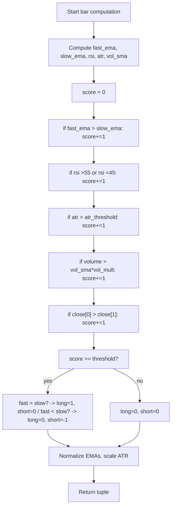

# Futures Indicator.... - Technical Guide

> Computes a multi-condition trading score (0-5) from EMA, RSI, ATR, volume, and price momentum, with long/short signals when score >= threshold.

| | |
| --- | --- |
| **Language** | Indie Script v5 |
| **Platform** | [TakeProfit](https://takeprofit.com) |
| **Category** | Trend |
| **Type** | Indicator |
| **Author** | @eric_duplaix on TakeProfit |
| **License** | MIT |
| **Live script** | [Open on TakeProfit](https://takeprofit.com/indicator/futures-indicator-66) |
| **Source file** | [Futures Indicator.indie5](Futures%20Indicator.indie5) |

## Overview

The **Futures Trading Signal Dashboard** aggregates five distinct market conditions into a single integer score (0-5). It is designed for futures traders who want a consolidated view of trend direction (fast vs. slow EMA), momentum (RSI zone), volatility (ATR above threshold), participation (volume spike), and short-term price momentum (close higher than previous close). When the score reaches a user-defined threshold and the fast EMA is above the slow EMA, a long signal is shown; a short signal appears under the opposite conditions.

On the chart, the dashboard plots eight lines in a separate pane (overlay main pane = false): the raw score, the threshold line, long/short signals (1, -1, or 0), normalized EMAs, raw RSI, and a scaled ATR. This provides a single-pane overview of the composite market state without cluttering the price chart.

## How it works

1. Calculate fast and slow exponential moving averages (EMA) of the close price.
2. Compute the Relative Strength Index (RSI) and the Average True Range (ATR) over specified periods.
3. Average volume over a lookback period to establish a baseline.
4. Increment a score counter for each satisfied condition: fast EMA above slow EMA, RSI above 55 or below 45, ATR above threshold, volume above average times multiplier, and current close above previous close.
5. If the final score meets or exceeds the threshold and the fast EMA is above the slow EMA, emit a long signal (1); if below, emit a short signal (-1).
6. Normalize the EMAs to a 0-100 scale relative to the current close and scale the ATR by 10 for consistent visualization in the dashboard pane.
7. Return all computed values as a tuple for plotting.

## Mathematical model

Fast EMA and Slow EMA are normalized to a 0-100 scale:

$$
\text{fast\_ema\_norm} = \left( \frac{\text{fast\_ema}[0]}{\text{close}[0]} - 1 \right) \times 100 + 50
$$

$$
\text{slow\_ema\_norm} = \left( \frac{\text{slow\_ema}[0]}{\text{close}[0]} - 1 \right) \times 100 + 50
$$

The ATR is scaled for display:

$$
\text{atr\_scaled} = \text{atr}[0] \times 10
$$

## Logic flow



## Parameters

| Parameter | Type | Default | Range | Description |
| --- | --- | --- | --- | --- |
| `ema_fast` | int | 9 | 1 - 50 |  |
| `ema_slow` | int | 21 | 1 - 100 |  |
| `rsi_period` | int | 14 | 1 - 50 |  |
| `atr_period` | int | 14 | 1 - 50 |  |
| `vol_period` | int | 20 | 1 - 100 |  |
| `vol_mult` | float | 1.5 | 0.1 - 5.0 |  |
| `atr_threshold` | float | 1.5 | 0.1 - 10.0 |  |
| `score_threshold` | int | 3 | 1 - 5 |  |

## Code walkthrough

### Indicator configuration and imports

Lines 1-3 of [Futures Indicator.indie5](Futures%20Indicator.indie5):

```python
# indie:lang_version = 5
from indie import indicator, color, plot, param
from indie.algorithms import Ema, Sma, Rsi, Atr
```

The script uses lang_version 5 and imports standard indicator, color, plot, and param decorators, plus EMA, SMA, RSI, and ATR algorithm constructors. These provide the building blocks for the dashboard.

### Parameter definitions

Lines 5-13 of [Futures Indicator.indie5](Futures%20Indicator.indie5):

```python
@indicator('Futures Trading Signal Dashboard', overlay_main_pane=False)
@param.int('ema_fast', default=9, min=1, max=50)
@param.int('ema_slow', default=21, min=1, max=100)
@param.int('rsi_period', default=14, min=1, max=50)
@param.int('atr_period', default=14, min=1, max=50)
@param.int('vol_period', default=20, min=1, max=100)
@param.float('vol_mult', default=1.5, min=0.1, max=5.0)
@param.float('atr_threshold', default=1.5, min=0.1, max=10.0)
@param.int('score_threshold', default=3, min=1, max=5)
```

Eight `@param` decorators expose user-adjustable settings: EMA periods, RSI period, ATR period, volume SMA period, volume multiplier, ATR threshold, and score threshold. All have safe min/max constraints to prevent extreme values.

### Score calculation conditions

Lines 36-53 of [Futures Indicator.indie5](Futures%20Indicator.indie5):

```python
    if fast_ema[0] > slow_ema[0]:
        score += 1
    
    # Condition 2: RSI in momentum zones (above 55 or below 45)
    if rsi[0] > 55 or rsi[0] < 45:
        score += 1
    
    # Condition 3: ATR above threshold (sufficient volatility)
    if atr[0] > atr_threshold:
        score += 1
    
    # Condition 4: Volume above average (high activity)
    if self.volume[0] > vol_sma[0] * vol_mult:
        score += 1
    
    # Condition 5: Price above previous close (simple momentum proxy)
    if self.close[0] > self.close[1]:
        score += 1
```

Five independent conditions each contribute 1 point to the score. They use the latest indicator values accessed via `[0]` and the previous close via `[1]`. The conditions cover trend, momentum, volatility, volume activity, and raw price direction.

### Signal generation with trend filter

Lines 56-57 of [Futures Indicator.indie5](Futures%20Indicator.indie5):

```python
    long_signal = 1 if score >= score_threshold and fast_ema[0] > slow_ema[0] else 0
    short_signal = -1 if score >= score_threshold and fast_ema[0] < slow_ema[0] else 0
```

Long and short signals are 1 (long), -1 (short), or 0 (no signal) and only active when the score meets the threshold AND the fast EMA is above (for long) or below (for short) the slow EMA. This ensures signals align with the dominant trend direction.

### EMA normalization and ATR scaling

Lines 59-64 of [Futures Indicator.indie5](Futures%20Indicator.indie5):

```python
    # Normalize EMAs to 0-100 scale for display (using percentage of current price)
    fast_ema_norm = (fast_ema[0] / self.close[0] - 1) * 100 + 50
    slow_ema_norm = (slow_ema[0] / self.close[0] - 1) * 100 + 50
    
    # Scale ATR for better visualization (multiply by 10)
    atr_scaled = atr[0] * 10
```

EMAs are re-mapped to a 0-100 scale for consistent plotting alongside RSI. The formula centers around 50 when the EMA equals the current close. ATR is multiplied by 10 so it becomes visible on the same numerical range as RSI and normalized EMAs.

### Return tuple for plotting

Lines 66-73 of [Futures Indicator.indie5](Futures%20Indicator.indie5):

```python
    return (score,                    # Trading Score (0-5)
            score_threshold,          # Score Threshold
            long_signal,              # Long Signal (1 or 0)
            short_signal,             # Short Signal (-1 or 0)
            fast_ema_norm,            # Fast EMA Normalized
            slow_ema_norm,            # Slow EMA Normalized
            rsi[0],                   # RSI (0-100)
            atr_scaled)               # ATR Scaled for visibility
```

Eight values are returned as a tuple, matching the eight `@plot.line` decorators. Each value is plotted in its own line with a distinct color and title, forming the dashboard pane.

## Reading the chart

- **Trading Score (yellow line)**: Integer from 0 to 5; higher values indicate more conditions are satisfied.
- **Score Threshold (gray line)**: Horizontal reference line at the user-set threshold (default 3). Scores above this line may trigger signals.
- **Long Signal (green line)**: Plots at 1 when score >= threshold and fast EMA > slow EMA; otherwise 0.
- **Short Signal (red line)**: Plots at -1 when score >= threshold and fast EMA < slow EMA; otherwise 0.
- **Fast EMA Normalized (blue line)**: Can range below 0 and above 100; centered at 50 when price equals EMA.
- **Slow EMA Normalized (maroon line)**: Same scale as fast normalized EMA, allowing visual comparison of trend alignment.
- **RSI (purple line)**: Standard RSI values (0-100), with default overbought/oversold zones near 70/30 (not plotted).
- **ATR Scaled (teal line)**: Raw ATR multiplied by 10; higher readings indicate greater volatility.

## Implementation notes

- All indicator algorithms (`Ema.new`, `Rsi.new`, etc.) return series; the latest value is accessed with `[0]` and the previous bar with `[1]`. This is the Indie Script convention.
- The score is a simple integer counter with no weighting of conditions. All five conditions have equal importance by design.
- The normalization formula for EMAs assumes close price is never zero; if close is zero or negative, the division produces undefined results (though such prices are unlikely in futures).
- The indicator does not repaint because it only uses confirmed data from the current and past bars (no future lookahead).

## FAQ

**How should I choose the score threshold?**

Start with the default of 3 (out of 5). A lower threshold (2) produces more frequent signals but may include weaker setups; a higher threshold (4) reduces signals to only the strongest conditions. Adjust based on your backtesting.

**Why are the EMAs normalized to a scale centered at 50?**

Normalization maps EMAs to a scale centered at 50 (though values can exceed 0-100), making it easier to interpret all dashboard lines in one pane. A value of 50 means the EMA equals the current price; values above 50 show the EMA below price (price above EMA), and vice versa.

**Can I use this indicator on instruments other than futures?**

Yes. Nothing in the code is futures-specific; the dashboard works on any instrument with OHLCV data (e.g., stocks, crypto, forex). The logic uses close, volume, high, low, and previous close, which are standard fields.

## Full source code

Indie Script v5, as published on TakeProfit. Copy it into the platform's script editor or [open the live script](https://takeprofit.com/indicator/futures-indicator-66).

```python
# indie:lang_version = 5
from indie import indicator, color, plot, param
from indie.algorithms import Ema, Sma, Rsi, Atr

@indicator('Futures Trading Signal Dashboard', overlay_main_pane=False)
@param.int('ema_fast', default=9, min=1, max=50)
@param.int('ema_slow', default=21, min=1, max=100)
@param.int('rsi_period', default=14, min=1, max=50)
@param.int('atr_period', default=14, min=1, max=50)
@param.int('vol_period', default=20, min=1, max=100)
@param.float('vol_mult', default=1.5, min=0.1, max=5.0)
@param.float('atr_threshold', default=1.5, min=0.1, max=10.0)
@param.int('score_threshold', default=3, min=1, max=5)
@plot.line(color=color.YELLOW, title="Trading Score")
@plot.line(color=color.GRAY, title="Score Threshold")
@plot.line(color=color.GREEN, title="Long Signal")
@plot.line(color=color.RED, title="Short Signal")
@plot.line(color=color.BLUE, title="Fast EMA Normalized")
@plot.line(color=color.MAROON, title="Slow EMA Normalized")
@plot.line(color=color.PURPLE, title="RSI")
@plot.line(color=color.TEAL, title="ATR Scaled")
def Main(self, ema_fast, ema_slow, rsi_period, atr_period, vol_period, 
         vol_mult, atr_threshold, score_threshold):
    
    # Calculate technical indicators
    fast_ema = Ema.new(self.close, ema_fast)
    slow_ema = Ema.new(self.close, ema_slow)
    rsi = Rsi.new(self.close, rsi_period)
    atr = Atr.new(atr_period)
    vol_sma = Sma.new(self.volume, vol_period)
    
    # Calculate trading score
    score = 0
    
    # Condition 1: Fast EMA above Slow EMA (bullish trend)
    if fast_ema[0] > slow_ema[0]:
        score += 1
    
    # Condition 2: RSI in momentum zones (above 55 or below 45)
    if rsi[0] > 55 or rsi[0] < 45:
        score += 1
    
    # Condition 3: ATR above threshold (sufficient volatility)
    if atr[0] > atr_threshold:
        score += 1
    
    # Condition 4: Volume above average (high activity)
    if self.volume[0] > vol_sma[0] * vol_mult:
        score += 1
    
    # Condition 5: Price above previous close (simple momentum proxy)
    if self.close[0] > self.close[1]:
        score += 1
    
    # Generate signals
    long_signal = 1 if score >= score_threshold and fast_ema[0] > slow_ema[0] else 0
    short_signal = -1 if score >= score_threshold and fast_ema[0] < slow_ema[0] else 0
    
    # Normalize EMAs to 0-100 scale for display (using percentage of current price)
    fast_ema_norm = (fast_ema[0] / self.close[0] - 1) * 100 + 50
    slow_ema_norm = (slow_ema[0] / self.close[0] - 1) * 100 + 50
    
    # Scale ATR for better visualization (multiply by 10)
    atr_scaled = atr[0] * 10
    
    return (score,                    # Trading Score (0-5)
            score_threshold,          # Score Threshold
            long_signal,              # Long Signal (1 or 0)
            short_signal,             # Short Signal (-1 or 0)
            fast_ema_norm,            # Fast EMA Normalized
            slow_ema_norm,            # Slow EMA Normalized
            rsi[0],                   # RSI (0-100)
            atr_scaled)               # ATR Scaled for visibility
```
