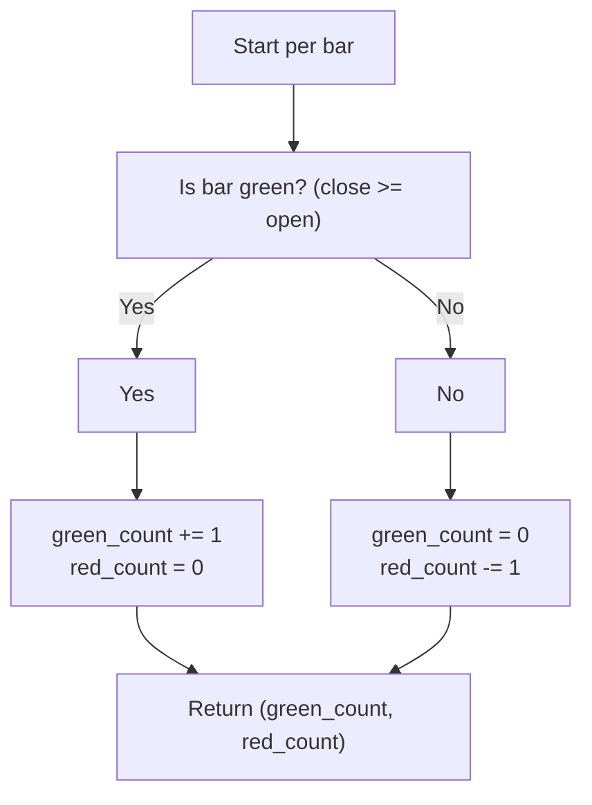

# Green/Red Bar Count - usage example of indie.Var[T] - Technical Guide

> Counts consecutive green (up) and red (down) bars using indie.Var for state tracking.

| | |
| --- | --- |
| **Language** | Indie Script v5 |
| **Platform** | [TakeProfit](https://takeprofit.com) |
| **Category** | Demos & templates |
| **Type** | Indicator |
| **Author** | @TakeProfit on TakeProfit |
| **License** | licensed under the MIT License (see the header of the source file) |
| **Live script** | [Open on TakeProfit](https://takeprofit.com/indicator/green-red-bar-count-usage-example-of-indie-var-t-93) |
| **Source file** | [Green-Red Bar Count - usage example of indie.VarT.indie5](Green-Red%20Bar%20Count%20-%20usage%20example%20of%20indie.VarT.indie5) |

## Overview

This indicator tracks the number of consecutive bars of the same direction (up or down) by counting green (close >= open) and red (close < open) bars. It uses `indie.Var[int]` to persist the counts across bars without retaining history, making it a lightweight example of state management in Indie.

On the chart, a green step line shows the positive count of consecutive green bars, and a red step line shows the negative count of consecutive red bars. When a bar of opposite direction occurs, the corresponding count resets to zero, creating a clear visual of streak lengths.

## How it works

1. Define a helper function `is_green_bar` that returns `True` if the current bar's close is greater than or equal to its open.
2. Initialize two `Var[int]` variables, `green_count` and `red_count`, to 0.
3. For each bar, evaluate `is_green_bar`.
4. If the bar is green: increment `green_count` by 1 and reset `red_count` to 0.
5. If the bar is red: reset `green_count` to 0 and decrement `red_count` by 1 (making it more negative).
6. Return the current values of `green_count` and `red_count` as a tuple.

## Logic flow



## Code walkthrough

### Helper function for bar direction

Lines 9-10 of [Green-Red Bar Count - usage example of indie.VarT.indie5](Green-Red%20Bar%20Count%20-%20usage%20example%20of%20indie.VarT.indie5):

```python
def is_green_bar(ctx: Context) -> bool:
    return ctx.close[0] >= ctx.open[0]
```

This function returns `True` if the current bar is green (close >= open). It uses the `Context` object's `close` and `open` series, accessed with `[0]` for the current bar's value. This keeps the main logic clean and reusable.

### Initializing state variables with Var

Lines 18-19 of [Green-Red Bar Count - usage example of indie.VarT.indie5](Green-Red%20Bar%20Count%20-%20usage%20example%20of%20indie.VarT.indie5):

```python
    green_count = Var[int].new(0)
    red_count = Var[int].new(0)
```

Two `Var[int]` instances are created with initial value 0. Unlike a plain integer, `Var` persists its value across bar calculations in both historical and real-time modes, ensuring the counts accumulate correctly.

### Conditional update of counts

Lines 20-25 of [Green-Red Bar Count - usage example of indie.VarT.indie5](Green-Red%20Bar%20Count%20-%20usage%20example%20of%20indie.VarT.indie5):

```python
    if is_green_bar(self):
        green_count.set(green_count.get() + 1)
        red_count.set(0)
    else:
        green_count.set(0)
        red_count.set(red_count.get() - 1)
```

If the bar is green, `green_count` is incremented and `red_count` is reset to 0. Otherwise, `green_count` is reset and `red_count` is decremented (stored as a negative number). This logic ensures that only consecutive bars of the same direction contribute to the count.

### Returning the counts for plotting

Lines 27-27 of [Green-Red Bar Count - usage example of indie.VarT.indie5](Green-Red%20Bar%20Count%20-%20usage%20example%20of%20indie.VarT.indie5):

```python
    return green_count.get(), red_count.get()
```

The current values of `green_count` and `red_count` are returned as a tuple. The `@plot.steps` decorators (lines 13-14) plot the first value as a green step line and the second as a red step line, directly reflecting the streak lengths.

## Reading the chart

- The green step line shows the number of consecutive green (up) bars. It increases by 1 each bar during an up streak and drops to 0 on the first red bar.
- The red step line shows the number of consecutive red (down) bars as a negative value. It decreases by 1 each bar during a down streak and resets to 0 on the first green bar.
- When both lines are at 0, it indicates the first bar (no previous direction).
- The lines are drawn using `@plot.steps`, so they appear as step functions that change only at bar boundaries.

## Implementation notes

- `indie.Var` holds only the latest value, making it memory-efficient for streak counting compared to `indie.MutSeries`.
- The red count is stored as a negative integer for convenience; the `@plot.steps` decorator with `color.RED` renders it as a red step line.
- The indicator resets the opposite count to zero on every bar, ensuring only consecutive same-direction bars are counted.
- The helper function `is_green_bar` uses `ctx.close[0] >= ctx.open[0]`; this definition of a green bar is standard but can be customized.

## FAQ

**How does the indicator reset the count when the bar direction changes?**

In the conditional block, when a green bar appears, `red_count` is set to 0, and when a red bar appears, `green_count` is set to 0. This ensures that only consecutive bars of the same direction contribute to the count.

**Can I use this indicator on a different timeframe?**

The code uses the current bar's close and open from the `Context` object. You can apply it to any timeframe by using the appropriate context, but the indicator as written uses the default chart timeframe.

**Why use `indie.Var` instead of a simple integer?**

`indie.Var` persists its value across bar calculations in both historical and real-time modes, while a plain variable would reset each bar. This makes `Var` suitable for cumulative calculations like streak counting.

## Full source code

Indie Script v5, as published on TakeProfit. Copy it into the platform's script editor or [open the live script](https://takeprofit.com/indicator/green-red-bar-count-usage-example-of-indie-var-t-93).

```python
# Copyright (c) 2024 @TakeProfit. All rights reserved.

# This work is licensed under the MIT License.
# For a copy, see <https://opensource.org/licenses/MIT>.

# indie:lang_version = 5
from indie import indicator, Var, Context, plot, color

def is_green_bar(ctx: Context) -> bool:
    return ctx.close[0] >= ctx.open[0]

@indicator('Green/Red Bar Counts')
@plot.steps(color=color.GREEN, id='#plot_0')
@plot.steps(color=color.RED, id='#plot_1')
def Main(self):
    # `indie.Var[T]` is a generic class, 
    # `T` can be `float`, `int`, `bool`, `str`, etc.
    green_count = Var[int].new(0)
    red_count = Var[int].new(0)
    if is_green_bar(self):
        green_count.set(green_count.get() + 1)
        red_count.set(0)
    else:
        green_count.set(0)
        red_count.set(red_count.get() - 1)

    return green_count.get(), red_count.get()
```
