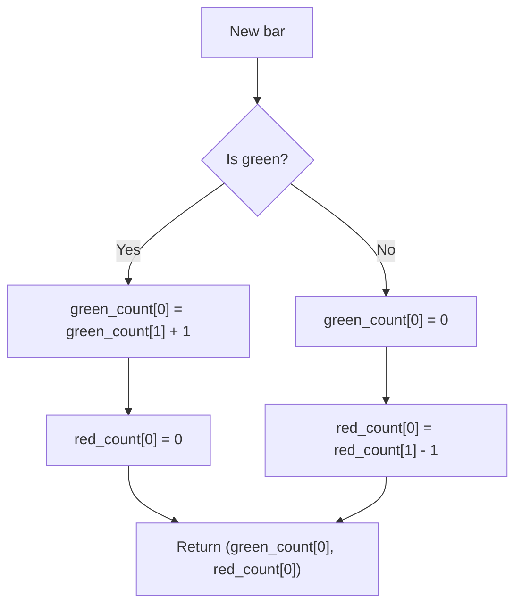

# Green/Red Bar Counts - usage example of indie.MutSeries[T] generic class - Technical Guide

> Counts consecutive green and red bars using MutSeries[int] generic type.

| | |
| --- | --- |
| **Language** | Indie Script v5 |
| **Platform** | [TakeProfit](https://takeprofit.com) |
| **Category** | Demos & templates |
| **Type** | Indicator |
| **Author** | @TakeProfit on TakeProfit |
| **License** | MIT |
| **Live script** | [Open on TakeProfit](https://takeprofit.com/indicator/green-red-bar-counts-usage-example-of-indie-mutseries-t-generic-class-94) |
| **Source file** | [Green-Red Bar Counts - usage example of indie.MutSeriesT generic class.indie5](Green-Red%20Bar%20Counts%20-%20usage%20example%20of%20indie.MutSeriesT%20generic%20class.indie5) |

## Overview

This indicator demonstrates the use of the `indie.MutSeries[T]` generic class with `int` as the type parameter. It counts the number of consecutive green (close ≥ open) and red (close < open) bars. On each green bar, the green count increases by 1 and the red count resets to 0; on each red bar, the red count decreases by 1 (becoming more negative) and the green count resets to 0.

The indicator draws two step plots on the chart: a green line showing the consecutive green bar count (positive values), and a red line showing the consecutive red bar count (negative values). It is a simple utility for visualizing short-term momentum and can be used to identify streaks of upward or downward price action.

## How it works

1. Define a helper function `is_green_bar` that returns True if the current bar closes at or above its open.
2. Initialize two `MutSeries[int]` instances with initial value 0 using `.new(0)`.
3. On each bar, check if the bar is green: if true, set the current green count to the previous green count plus 1, and reset the current red count to 0.
4. If the bar is red, set the current red count to the previous red count minus 1, and reset the current green count to 0.
5. Return the current green count and red count as outputs for plotting.
6. The `@plot.steps` decorators configure two step-line plots with green and red colors respectively.

## Logic flow



## Code walkthrough

### Helper Function for Bar Color

Lines 5-6 of [Green-Red Bar Counts - usage example of indie.MutSeriesT generic class.indie5](Green-Red%20Bar%20Counts%20-%20usage%20example%20of%20indie.MutSeriesT%20generic%20class.indie5):

```python
def is_green_bar(ctx: Context) -> bool:
    return ctx.close[0] >= ctx.open[0]
```

This simple function determines if a bar is green by comparing the current close and open prices. It takes a `Context` object and returns a boolean. The condition `close >= open` matches the usual definition of a green (bullish) bar.

### Initializing MutSeries[int]

Lines 11-15 of [Green-Red Bar Counts - usage example of indie.MutSeriesT generic class.indie5](Green-Red%20Bar%20Counts%20-%20usage%20example%20of%20indie.MutSeriesT%20generic%20class.indie5):

```python
def Main(self):
    # `indie.MutSeries[T]` is a generic class, 
    # `T` can be `float`, `int`, `bool`, `str`, etc.
    green_count = MutSeries[int].new(0)
    red_count = MutSeries[int].new(0)
```

Inside the `Main` function, two `MutSeries[int]` objects are created with initial value 0. The generic type parameter `[int]` is explicitly provided, demonstrating the new generic syntax. These series will hold the consecutive counts across bars.

### Updating Counts Based on Bar Color

Lines 16-21 of [Green-Red Bar Counts - usage example of indie.MutSeriesT generic class.indie5](Green-Red%20Bar%20Counts%20-%20usage%20example%20of%20indie.MutSeriesT%20generic%20class.indie5):

```python
    if is_green_bar(self):
        green_count[0] = green_count[1] + 1
        red_count[0] = 0
    else:
        green_count[0] = 0
        red_count[0] = red_count[1] - 1
```

Using the `is_green_bar` helper, the code branches on bar color. For a green bar, the current green count is set to the previous bar's green count plus 1, and the red count resets to 0. For a red bar, the current red count becomes the previous red count minus 1 (going negative), and the green count resets to 0. This logic creates a running streak count that changes sign and magnitude based on consecutive bars of the same color.

### Returning Values for Plotting

Lines 23-23 of [Green-Red Bar Counts - usage example of indie.MutSeriesT generic class.indie5](Green-Red%20Bar%20Counts%20-%20usage%20example%20of%20indie.MutSeriesT%20generic%20class.indie5):

```python
    return green_count[0], red_count[0]
```

The function returns a tuple of the current green and red counts. The `@plot.steps` decorators connect these return values to step-line plots: the first return element is drawn with green color, the second with red color. Because the counts can be zero, the plot will show flat sections when a streak ends.

## Reading the chart

- **Green step line**: Shows the count of consecutive green bars as positive values. The line increases by 1 each time a new green bar appears, and resets to 0 when a red bar occurs.
- **Red step line**: Shows the count of consecutive red bars as negative values. The line decreases by 1 each time a new red bar appears (becomes more negative), and resets to 0 when a green bar occurs.
- When both lines are at 0, the bar is the first of a new streak (either green or red) following a change in bar color.
- Longer streaks produce larger absolute values, indicating sustained directional price movement.

## Implementation notes

- The indicator resets to 0 at every bar of the opposite color; there is no smoothing or memory beyond the previous bar's count.
- The `MutSeries[int]` is stateful across bars: accessing `[1]` retrieves the value from the previous bar, and `[0]` stores the current bar's value.
- The indicator uses `@plot.steps` which draws step-like lines; the returned values must be integers or floats; here both are integers.
- No NaN handling is needed because the initial values are set to 0 and the count logic never produces NaN.

## FAQ

**Can I change the initial count to something other than 0?**

Yes, replace the argument to `.new(0)` with any integer value. For example, `MutSeries[int].new(1)` would start the count from 1 on the first bar.

**How do I plot the counts as a single line instead of separate green/red lines?**

Modify the return statement to return a single value, e.g., `return green_count[0] + red_count[0]`. The red_count is already negative, so the sum gives a positive value for a green streak and negative for a red streak. Then use one `@plot.steps` decorator.

**Does this indicator repaint or change values after the bar closes?**

No. The indicator uses `close[0]` and `open[0]` for the current bar only; once the bar is formed, the value is fixed and does not change. There is no look-ahead or recalculation on historical bars.

## Full source code

Indie Script v5, as published on TakeProfit. Copy it into the platform's script editor or [open the live script](https://takeprofit.com/indicator/green-red-bar-counts-usage-example-of-indie-mutseries-t-generic-class-94).

```python
# indie:lang_version = 5
import math
from indie import indicator, MutSeries, Context, plot, color

def is_green_bar(ctx: Context) -> bool:
    return ctx.close[0] >= ctx.open[0]

@indicator('Green/Red Bar Counts')
@plot.steps(color=color.GREEN, id='#plot_0')
@plot.steps(color=color.RED, id='#plot_1')
def Main(self):
    # `indie.MutSeries[T]` is a generic class, 
    # `T` can be `float`, `int`, `bool`, `str`, etc.
    green_count = MutSeries[int].new(0)
    red_count = MutSeries[int].new(0)
    if is_green_bar(self):
        green_count[0] = green_count[1] + 1
        red_count[0] = 0
    else:
        green_count[0] = 0
        red_count[0] = red_count[1] - 1

    return green_count[0], red_count[0]
    
```
