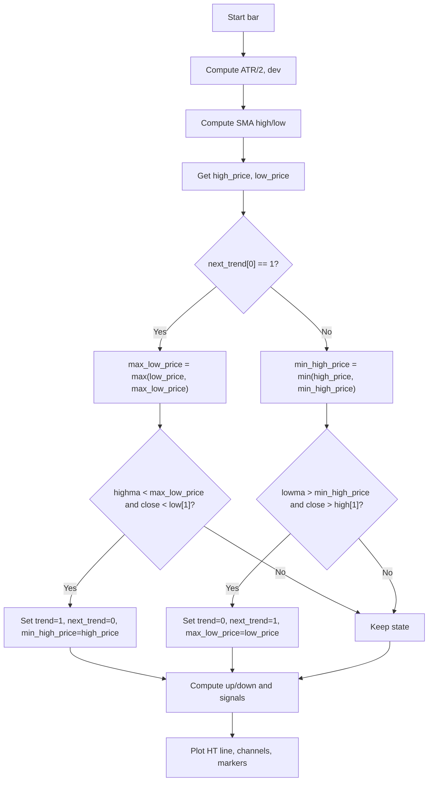

# HalfTrend Indicator - Technical Guide

> Trend-following indicator that plots a dynamic half trend line with ATR-based channels and buy/sell signals.

| | |
| --- | --- |
| **Language** | Indie Script v5 |
| **Platform** | [TakeProfit](https://takeprofit.com) |
| **Category** | Trend |
| **Type** | Indicator |
| **Author** | @insurgent on TakeProfit |
| **License** | MIT |
| **Live script** | [Open on TakeProfit](https://takeprofit.com/indicator/halftrend-indicator-43) |
| **Source file** | [HalfTrend Indicator.indie5](HalfTrend%20Indicator.indie5) |

## Overview

The HalfTrend indicator is a trend-following tool that identifies the current trend direction and potential reversals. It combines price action, ATR, and swing high/low detection to produce a smooth trend line that changes color (cyan for uptrend, magenta for downtrend by default; blue/red with classic colors) and marks entry points with label markers. The indicator also plots upper and lower ATR-based channels around the trend line, providing a visual envelope for volatility.

This indicator is designed for traders who prefer clear, unambiguous trend signals. It works on any timeframe and is commonly used in forex and crypto markets to filter entries and exits. The classic logic from TradingView is preserved, with configurable amplitude, channel deviation, and visual options (arrows, channels, labels, classic colors).

## How it works

1. Compute ATR(100) divided by 2 as the base deviation unit.
2. Calculate SMA of high and low over the amplitude period.
3. Find the highest high and lowest low over the amplitude period using SinceHighest/SinceLowest.
4. Track trend direction with state variables: trend (0=up, 1=down) and next_trend.
5. Update max_low_price and min_high_price based on trend state and price extremes.
6. Detect trend reversal when SMA crosses the extreme price and close confirms.
7. Compute up/down values: when trend is up, up tracks max_low_price; when down, down tracks min_high_price.
8. Generate buy signal when trend changes from down to up, sell signal when from up to down.
9. Plot the half trend line, ATR high/low channels, and markers (label markers).

## Mathematical model

$$
\text{ATR} = \text{ATR}(100) \quad \text{dev} = \text{channel\_deviation} \times \frac{\text{ATR}}{2}
$$
$$
\text{highma} = \text{SMA}(\text{high}, \text{amplitude}) \quad \text{lowma} = \text{SMA}(\text{low}, \text{amplitude})
$$
$$
\text{HT} = \begin{cases} \text{up}[0] & \text{if trend}[0] = 0 \\ \text{down}[0] & \text{if trend}[0] = 1 \end{cases}
$$

## Logic flow



## Parameters

| Parameter | Type | Default | Range | Description |
| --- | --- | --- | --- | --- |
| `amplitude` | int | 2 | ≥ 1 | Amplitude |
| `channel_deviation` | int | 2 | ≥ 1 | Channel Deviation |
| `show_arrows` | bool | true |  | Show Arrows |
| `show_channels` | bool | true |  | Show Channels |
| `show_labels` | bool | true |  | Show Buy/Sell Labels |
| `use_classic_colors` | bool | false |  | Classic Colors |

## Code walkthrough

### State Variables Initialization

Lines 59-64 of [HalfTrend Indicator.indie5](HalfTrend%20Indicator.indie5):

```python
    trend = MutSeriesF.new(init=0)
    next_trend = MutSeriesF.new(init=0)
    max_low_price = MutSeriesF.new(init=nz(self.low[1], self.low[0]))
    min_high_price = MutSeriesF.new(init=nz(self.high[1], self.high[0]))
    up = MutSeriesF.new(init=0.0)
    down = MutSeriesF.new(init=0.0)
```

Six MutSeriesF variables hold persistent state across bars: trend (0=up, 1=down), next_trend (pending reversal), max_low_price (highest low during uptrend), min_high_price (lowest high during downtrend), and up/down (the half trend line values). They are initialized with nz() to handle the first bar gracefully.

### ATR and Deviation

Lines 76-79 of [HalfTrend Indicator.indie5](HalfTrend%20Indicator.indie5):

```python
    atr2 = Atr.new(100)[0] / 2
    
    # Pine: dev = channelDeviation * atr2
    dev = channel_deviation * atr2
```

ATR(100) is computed and halved to get the base unit. The channel deviation parameter multiplies this to create the channel width. This follows the original Pine Script logic exactly.

### Swing High/Low Detection

Lines 82-90 of [HalfTrend Indicator.indie5](HalfTrend%20Indicator.indie5):

```python
    high_offset = int(SinceHighest.new(self.high, amplitude)[0])
    low_offset = int(SinceLowest.new(self.low, amplitude)[0])
    
    # Request size to safely access historical values
    self.high.request_size(amplitude + 1)
    self.low.request_size(amplitude + 1)
    
    high_price = self.high[high_offset]
    low_price = self.low[low_offset]
```

SinceHighest and SinceLowest algorithms return the number of bars since the highest high / lowest low over the amplitude period. These offsets are used to fetch the actual high_price and low_price. The request_size calls ensure enough historical data is available.

### Trend Reversal Logic

Lines 102-115 of [HalfTrend Indicator.indie5](HalfTrend%20Indicator.indie5):

```python
    if next_trend[0] == 1:
        max_low_price[0] = max(low_price, max_low_price[0])
        
        if highma < max_low_price[0] and self.close[0] < nz(self.low[1], self.low[0]):
            trend[0] = 1
            next_trend[0] = 0
            min_high_price[0] = high_price
    else:
        min_high_price[0] = min(high_price, min_high_price[0])
        
        if lowma > min_high_price[0] and self.close[0] > nz(self.high[1], self.high[0]):
            trend[0] = 0
            next_trend[0] = 1
            max_low_price[0] = low_price
```

This is the core trend detection. If next_trend is 1 (current trend is up), it updates max_low_price and checks if the SMA of high crosses below that level with a close below the previous low – if so, trend flips to 1 (downtrend). The else branch handles the opposite case (current trend is down, looking for reversal to uptrend). The logic uses nz() to safely access previous bar values.

### Up/Down Calculation

Lines 121-138 of [HalfTrend Indicator.indie5](HalfTrend%20Indicator.indie5):

```python
    if trend[0] == 0:
        if not isnan(trend[1]) and trend[1] != 0:
            up[0] = down[0] if isnan(down[1]) else down[1]
            arrow_up = up[0] - atr2
        else:
            up[0] = max_low_price[0] if isnan(up[1]) else max(max_low_price[0], up[1])
        
        atr_high_val = up[0] + dev
        atr_low_val = up[0] - dev
    else:
        if not isnan(trend[1]) and trend[1] != 1:
            down[0] = up[0] if isnan(up[1]) else up[1]
            arrow_down = down[0] + atr2
        else:
            down[0] = min_high_price[0] if isnan(down[1]) else min(min_high_price[0], down[1])
        
        atr_high_val = down[0] + dev
        atr_low_val = down[0] - dev
```

When trend is 0 (up), up[0] is set either from the previous down value (on reversal) or by tracking max_low_price. The ATR high/low channels are then computed as up[0] ± dev. When trend is 1 (down), the same logic applies symmetrically using down[0] and min_high_price.

### Signal Generation

Lines 146-147 of [HalfTrend Indicator.indie5](HalfTrend%20Indicator.indie5):

```python
    buy_signal = not isnan(arrow_up) and trend[0] == 0 and trend[1] == 1
    sell_signal = not isnan(arrow_down) and trend[0] == 1 and trend[1] == 0
```

A buy signal occurs when arrow_up is not NaN and trend changes from 1 to 0 (downtrend to uptrend). A sell signal occurs when arrow_down is not NaN and trend changes from 0 to 1. These signals are used to plot markers only when show_arrows is enabled.

## Reading the chart

- **HalfTrend Line**: The main line (ht) changes color: blue (or cyan) for uptrend, red (or magenta) for downtrend. It represents the current trend direction.
- **ATR Channels**: Upper channel (atr_high) in sell color, lower channel (atr_low) in buy color. They show volatility bands around the trend line.
- **Buy/Sell Markers**: When a trend reversal is detected, a marker appears below (buy) or above (sell) the channel. The marker can display text 'Buy' or 'Sell' if labels are enabled.
- **Fill**: Semi-transparent fills between the trend line and the channels, colored according to the trend direction.
- **Classic Colors**: Option to use blue/red instead of the default cyan/magenta palette.

## Implementation notes

- The indicator uses MutSeriesF for state persistence; values from the previous bar are accessed with [1] and current bar with [0].
- NaN is used to suppress plotting when conditions are not met (e.g., no signal, channels hidden). The nz() helper replaces NaN with a default value.
- The amplitude parameter controls the lookback period for swing highs/lows and SMA; larger values produce smoother but slower signals.
- The indicator repaints? No, it uses only current and past bar data; signals are confirmed on the bar they appear.

## FAQ

**What do the amplitude and channel deviation parameters do?**

Amplitude sets the lookback period for the SMA and swing high/low detection. Channel deviation multiplies half of ATR(100) to determine the width of the upper and lower bands around the trend line.

**How can I hide the arrows or labels?**

Set 'Show Arrows' to false to hide all markers, or set 'Show Labels' to false to hide the text while keeping the markers visible. Both are boolean parameters in the indicator settings.

**Does this indicator repaint?**

No, the HalfTrend indicator does not repaint. All calculations use only current and past bar data, and signals are generated on the bar where the trend reversal is confirmed.

## Full source code

Indie Script v5, as published on TakeProfit. Copy it into the platform's script editor or [open the live script](https://takeprofit.com/indicator/halftrend-indicator-43).

```python
# indie:lang_version = 5
# HalfTrend Port
# Original: HalfTrend by everget (Pine Script v6)
# GPL-3.0 license

from math import nan, isnan
from indie import indicator, param, plot, color, MutSeriesF, algorithm, SeriesF
from indie.algorithms import Atr, Sma, SinceHighest, SinceLowest
from indie.color import rgba


# =============================================================================
# Pine nz() equivalent
# =============================================================================

def nz(value: float, replacement: float = 0.0) -> float:
    """Returns replacement if value is NaN, otherwise returns value"""
    return replacement if isnan(value) else value


# =============================================================================
# MAIN INDICATOR
# =============================================================================

@indicator('HalfTrend', overlay_main_pane=True)
# === Calculation Parameters (ORIGINAL) ===
@param.int('amplitude', default=2, min=1, title='Amplitude')
@param.int('channel_deviation', default=2, min=1, title='Channel Deviation')
# === Visual Parameters ===
@param.bool('show_arrows', default=True, title='Show Arrows')
@param.bool('show_channels', default=True, title='Show Channels')
@param.bool('show_labels', default=True, title='Show Buy/Sell Labels')
@param.bool('use_classic_colors', default=False, title='Classic Colors')
# === Plot declarations ===
@plot.line(id='ht_line', line_width=2, title='HalfTrend')
@plot.line(id='atr_high', title='ATR High')
@plot.line(id='atr_low', title='ATR Low')
@plot.fill('ht_line', 'atr_high', title='ATR High Ribbon')
@plot.fill('ht_line', 'atr_low', title='ATR Low Ribbon')
@plot.marker(style=plot.marker_style.LABEL, position=plot.marker_position.BELOW, size=7, title='Buy Signal')
@plot.marker(style=plot.marker_style.LABEL, position=plot.marker_position.ABOVE, size=7, title='Sell Signal')
def Main(self, amplitude, channel_deviation, show_arrows, show_channels, show_labels, use_classic_colors):
    # =========================================================================
    # COLORS 
    # =========================================================================
    classic_buy = color.BLUE
    classic_sell = color.RED
    tp_buy = rgba(0, 220, 255)
    tp_sell = rgba(255, 0, 180)
    
    buy_color = classic_buy if use_classic_colors else tp_buy
    sell_color = classic_sell if use_classic_colors else tp_sell
    buy_fill_color = color.BLUE(0.12) if use_classic_colors else rgba(0, 220, 255, 0.12)
    sell_fill_color = color.RED(0.12) if use_classic_colors else rgba(255, 0, 180, 0.12)
    
    # =========================================================================
    # STATE VARIABLES
    # =========================================================================
    trend = MutSeriesF.new(init=0)
    next_trend = MutSeriesF.new(init=0)
    max_low_price = MutSeriesF.new(init=nz(self.low[1], self.low[0]))
    min_high_price = MutSeriesF.new(init=nz(self.high[1], self.high[0]))
    up = MutSeriesF.new(init=0.0)
    down = MutSeriesF.new(init=0.0)
    
    atr_high_val: float = 0.0
    atr_low_val: float = 0.0
    arrow_up: float = nan
    arrow_down: float = nan
    
    # =========================================================================
    # CALCULATIONS
    # =========================================================================
    
    # Pine: atr2 = ta.atr(100) / 2
    atr2 = Atr.new(100)[0] / 2
    
    # Pine: dev = channelDeviation * atr2
    dev = channel_deviation * atr2
    

    high_offset = int(SinceHighest.new(self.high, amplitude)[0])
    low_offset = int(SinceLowest.new(self.low, amplitude)[0])
    
    # Request size to safely access historical values
    self.high.request_size(amplitude + 1)
    self.low.request_size(amplitude + 1)
    
    high_price = self.high[high_offset]
    low_price = self.low[low_offset]
    
    # Pine: highma = ta.sma(high, amplitude)
    highma = Sma.new(self.high, amplitude)[0]
    
    # Pine: lowma = ta.sma(low, amplitude)
    lowma = Sma.new(self.low, amplitude)[0]
    
    # =========================================================================
    # TREND LOGIC (ORIGINAL - UNCHANGED)
    # =========================================================================
    
    if next_trend[0] == 1:
        max_low_price[0] = max(low_price, max_low_price[0])
        
        if highma < max_low_price[0] and self.close[0] < nz(self.low[1], self.low[0]):
            trend[0] = 1
            next_trend[0] = 0
            min_high_price[0] = high_price
    else:
        min_high_price[0] = min(high_price, min_high_price[0])
        
        if lowma > min_high_price[0] and self.close[0] > nz(self.high[1], self.high[0]):
            trend[0] = 0
            next_trend[0] = 1
            max_low_price[0] = low_price
    
    # =========================================================================
    # UP/DOWN CALCULATION (ORIGINAL - UNCHANGED)
    # =========================================================================
    
    if trend[0] == 0:
        if not isnan(trend[1]) and trend[1] != 0:
            up[0] = down[0] if isnan(down[1]) else down[1]
            arrow_up = up[0] - atr2
        else:
            up[0] = max_low_price[0] if isnan(up[1]) else max(max_low_price[0], up[1])
        
        atr_high_val = up[0] + dev
        atr_low_val = up[0] - dev
    else:
        if not isnan(trend[1]) and trend[1] != 1:
            down[0] = up[0] if isnan(up[1]) else up[1]
            arrow_down = down[0] + atr2
        else:
            down[0] = min_high_price[0] if isnan(down[1]) else min(min_high_price[0], down[1])
        
        atr_high_val = down[0] + dev
        atr_low_val = down[0] - dev
    
    ht = up[0] if trend[0] == 0 else down[0]
    
    # =========================================================================
    # SIGNALS (ORIGINAL - UNCHANGED)
    # =========================================================================
    
    buy_signal = not isnan(arrow_up) and trend[0] == 0 and trend[1] == 1
    sell_signal = not isnan(arrow_down) and trend[0] == 1 and trend[1] == 0
    
    # =========================================================================
    # PLOTTING
    # =========================================================================
    
    ht_color = buy_color if trend[0] == 0 else sell_color
    
    ht_plot = plot.Line(ht, color=ht_color)
    atr_high_plot = plot.Line(atr_high_val if show_channels else nan, color=sell_color)
    atr_low_plot = plot.Line(atr_low_val if show_channels else nan, color=buy_color)
    fill_high = plot.Fill(color=sell_fill_color)
    fill_low = plot.Fill(color=buy_fill_color)
    
    buy_marker = plot.Marker(
        atr_low_val if (show_arrows and buy_signal) else nan,
        color=buy_color,
        text='Buy' if show_labels else ''
    )
    
    sell_marker = plot.Marker(
        atr_high_val if (show_arrows and sell_signal) else nan,
        color=sell_color,
        text='Sell' if show_labels else ''
    )
    
    return (
        ht_plot,
        atr_high_plot,
        atr_low_plot,
        fill_high,
        fill_low,
        buy_marker,
        sell_marker
    )
```
