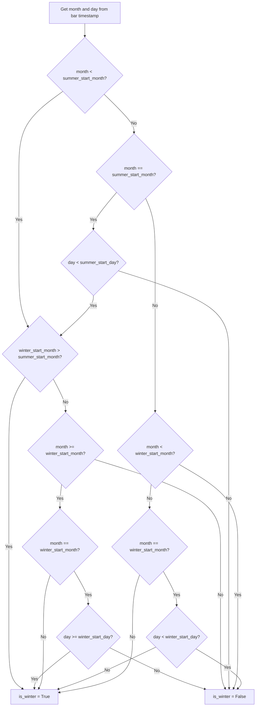

# Halloween Strategy - Technical Guide

> Visualizes the Halloween effect by shading winter/summer periods, placing Buy/Sell labels at transitions, and displaying a performance stats panel.

| | |
| --- | --- |
| **Language** | Indie Script v5 |
| **Platform** | [TakeProfit](https://takeprofit.com) |
| **Category** | Candlestick patterns |
| **Type** | Indicator |
| **Author** | @TakeProfit on TakeProfit |
| **License** | MIT |
| **Live script** | [Open on TakeProfit](https://takeprofit.com/indicator/halloween-strategy-74) |
| **Source file** | [Halloween Strategy.indie5](Halloween%20Strategy.indie5) |

## Overview

This indicator implements the classic Halloween strategy (also known as 'Sell in May and go away') with fully customizable start and end dates. It shades the chart background in two colors to visually separate the winter holding period (default Oct 31 → May 1) from the summer out-of-market period. At the start of each winter period a Buy label is placed at the low of the bar, and at the end a Sell label at the high of the bar.

A compact statistics panel is drawn in the bottom-right corner showing total P&L, win rate, number of trades, profit factor, Sharpe ratio, maximum drawdown, and the current open P&L. All calculations are based on a compounded equity curve starting from a user-defined initial equity. The indicator is designed for backtesting and visual validation of seasonal patterns, not for live trading signals.

## How it works

1. Determines whether the current bar falls in the winter (holding) period using user-defined start and end months/days, handling year-wrap scenarios.
2. On the first bar of a winter period (is_winter_start), if no position is open, records the close price as entry; a 'Buy' label is drawn at the bar's low if show_labels is enabled.
3. On the first bar of a summer period (is_winter_end), if a position is open, calculates the trade P&L as a percentage and updates the equity curve; a 'Sell' label is drawn at the bar's high if show_labels is enabled.
4. Accumulates trade results: win/loss count, total profit/loss, and a list of per-trade P&L percentages for Sharpe ratio calculation.
5. Tracks peak equity and computes maximum drawdown as the largest peak-to-trough decline in equity.
6. At every bar, updates the statistics label with total P&L, win rate, trade count, profit factor, Sharpe ratio, max drawdown, and open P&L.
7. Returns two background colors: the first for winter (orange tint) and the second for summer (navy tint), with the opposite period transparent.
8. Uses MutSeries[bool] to remember the previous bar's winter state, enabling detection of period transitions.

## Mathematical model

$$
\text{Trade P\&L} = \left(\frac{\text{close}}{\text{open\_price}} - 1\right) \times 100\%
$$

$$
\text{Current Equity} = \text{Previous Equity} \times \left(1 + \frac{\text{Trade P\&L}}{100}\right)
$$

$$
\text{Max Drawdown} = \max\left(\frac{\text{Peak Equity} - \text{Current Equity}}{\text{Peak Equity}} \times 100\%\right)
$$

$$
\text{Win Rate} = \frac{\text{Win Trades}}{\text{Total Trades}} \times 100\%
$$

$$
\text{Profit Factor} = \frac{\text{Total Profit}}{\text{Total Loss}}
$$

$$
\text{Sharpe Ratio} = \frac{\text{Mean}(\text{trade P\&L})}{\text{StdDev}(\text{trade P\&L})}
$$

## Logic flow



## Parameters

| Parameter | Type | Default | Range | Description |
| --- | --- | --- | --- | --- |
| `winter_start_month` | int | 10 | 1 - 12 | Winter Period - Start Month |
| `winter_start_day` | int | 31 | 1 - 31 | Winter Period - Start Day |
| `summer_start_month` | int | 5 | 1 - 12 | Summer Period - Start Month |
| `summer_start_day` | int | 1 | 1 - 31 | Summer Period - Start Day |
| `initial_equity` | float | 100.0 | 1.0 - 1000000.0 | Initial Equity (%) |
| `buy_label_size` | int | 11 | 8 - 16 | Buy Label Font Size |
| `sell_label_size` | int | 11 | 8 - 16 | Sell Label Font Size |
| `stats_label_size` | int | 10 | 8 - 16 | Stats Panel Font Size |
| `show_labels` | bool | true |  | Show Buy/Sell Labels |
| `show_stats` | bool | true |  | Show Statistics Panel |

## Code walkthrough

### Winter period detection with year-wrap handling

Lines 78-119 of [Halloween Strategy.indie5](Halloween%20Strategy.indie5):

```python
        if month < summer_start_month:
            # Before summer start - depends on winter start month
            if winter_start_month > summer_start_month:
                # Winter wraps around year end (e.g., Oct-May)
                is_winter[0] = True
            else:
                # Winter doesn't wrap (e.g., Jan-May)
                if month >= winter_start_month:
                    if month == winter_start_month:
                        is_winter[0] = day >= winter_start_day
                    else:
                        is_winter[0] = True
                else:
                    is_winter[0] = False
        elif month == summer_start_month:
            # At summer start month
            if day < summer_start_day:
                if winter_start_month > summer_start_month:
                    # Winter wraps around year
                    is_winter[0] = True
                else:
                    if month >= winter_start_month:
                        if month == winter_start_month:
                            is_winter[0] = day >= winter_start_day
                        else:
                            is_winter[0] = True
                    else:
                        is_winter[0] = False
            else:
                is_winter[0] = False
        elif month < winter_start_month:
            # Between summer start and winter start (same year)
            is_winter[0] = False
        elif month == winter_start_month:
            # At winter start month
            if day < winter_start_day:
                is_winter[0] = False
            else:
                is_winter[0] = True
        else:
            # After winter start month
            is_winter[0] = True
```

This block determines whether the current bar belongs to the winter (holding) period. It handles the common case where winter starts in October and ends in May (wrapping around the year end) as well as non-wrapping configurations. The logic uses month and day comparisons with special care for the transition months. The result is stored in a MutSeries[bool] so that the previous bar's state is available for detecting transitions.

### Buy label placement at winter start

Lines 125-141 of [Halloween Strategy.indie5](Halloween%20Strategy.indie5):

```python
        is_winter_start = is_winter[0] and not is_winter[1]
        # Winter period starts - BUY according to Halloween strategy
        if is_winter_start:
            if self._open_price is None:
                self._open_price = self.close[0]
                self._position += 1
            if show_labels:
                self.chart.draw(
                    LabelAbs(
                        'Buy',
                        AbsolutePosition(self.time[0], self.low[0]),
                        bg_color=color.NAVY,
                        text_color=color.WHITE,
                        font_size=buy_label_size,
                        callout_position=callout_position.BOTTOM_LEFT,
                    )
                )
```

When the current bar is winter and the previous bar was not (is_winter_start), the indicator records the close price as the entry price and increments the position counter. If show_labels is enabled, a 'Buy' label is drawn at the bar's low with a navy background and white text, positioned at bottom-left.

### Sell label and trade accounting at winter end

Lines 143-184 of [Halloween Strategy.indie5](Halloween%20Strategy.indie5):

```python
        is_winter_end = not is_winter[0] and is_winter[1]
        # Summer period starts - SELL according to Halloween strategy
        if is_winter_end:
            if self._open_price is not None:
                trade_pnl_percent = (divide(self.close[0], self._open_price.value()) - 1.0) * 100.0

                # Save P&L for Sharpe Ratio calculation
                self._trades_pnl_list.append(trade_pnl_percent)

                # Update equity with closed trade
                self._current_equity = self._current_equity * (1.0 + trade_pnl_percent / 100.0)

                if self._current_equity > self._peak_equity:
                    self._peak_equity = self._current_equity

                current_dd = divide(self._peak_equity - self._current_equity, self._peak_equity) * 100.0

                if current_dd > self._max_drawdown:
                    self._max_drawdown = current_dd

                # Separate profitable and losing trades for Profit Factor
                if trade_pnl_percent > 0.0:
                    self._win_trades += 1
                    self._total_profit += trade_pnl_percent
                elif trade_pnl_percent < 0.0:
                    self._total_loss += abs(trade_pnl_percent)

                self._total_trades += 1
                self._open_price = None
                self._position -= 1

            if show_labels:
                self.chart.draw(
                    LabelAbs(
                        'Sell',
                        AbsolutePosition(self.time[0], self.high[0]),
                        bg_color=color.ORANGE,
                        text_color=color.WHITE,
                        font_size=sell_label_size,
                        callout_position=callout_position.TOP_RIGHT,
                    )
                )
```

When the current bar is summer and the previous bar was winter (is_winter_end), the trade is closed. The P&L percentage is computed, the equity curve is updated, and max drawdown is tracked. Winning and losing trades are separated for profit factor calculation. A 'Sell' label is drawn at the bar's high with an orange background.

### Statistics panel construction

Lines 207-221 of [Halloween Strategy.indie5](Halloween%20Strategy.indie5):

```python
        stats_text = (
            'Total P&L: ' + str(round(total_pnl_real, 2)) + '%\n' +
            'Win Rate:  ' + str(round(win_rate, 2)) + '%\n' +
            'Trades:    ' + str(self._total_trades) + '\n' +
            'Profit F:  ' + str(round(profit_factor, 2)) + '\n' +
            'Sharpe:    ' + str(round(sharpe_ratio, 2)) + '\n' +
            'Max DD:    ' + str(round(self._max_drawdown, 2)) + '%\n' +
            '---\n' +
            'CURRENT PERIOD\n' +
            'Open P&L:  ' + str(round(open_pnl, 2)) + '%'
        )

        self._stats_label.text = stats_text
        if show_stats:
            self.chart.draw(self._stats_label)
```

A multi-line text string is built containing total P&L, win rate, trade count, profit factor, Sharpe ratio, max drawdown, and open P&L. This text is assigned to a LabelRel object anchored at the bottom-right corner of the chart. The label is drawn only if show_stats is True.

### Background color return for period visualization

Lines 227-229 of [Halloween Strategy.indie5](Halloween%20Strategy.indie5):

```python
        if is_winter[0]:
            return plot.Background(), plot.Background(color=color.TRANSPARENT)
        return plot.Background(color=color.TRANSPARENT), plot.Background()
```

The Main function returns two plot.Background objects. When is_winter is True, the first background is orange-tinted (the winter period) and the second is transparent. When is_winter is False, the first is transparent and the second is navy-tinted (the summer period). This creates alternating shaded regions on the chart.

## Reading the chart

- The chart background is shaded with a light orange tint during the winter (holding) period and a light navy tint during the summer (out-of-market) period.
- A 'Buy' label (navy background, white text) appears at the low of the first bar of each winter period.
- A 'Sell' label (orange background, white text) appears at the high of the first bar of each summer period.
- A statistics panel is displayed in the bottom-right corner (if enabled) showing: Total P&L (compounded), Win Rate, number of Trades, Profit Factor, Sharpe Ratio, Max Drawdown, and current Open P&L.
- The labels and panel can be toggled off via parameters.

## Implementation notes

- The indicator is stateful: it maintains position, equity, and trade history across bars using instance variables initialized in __init__.
- The MutSeries[bool] for is_winter allows detection of period transitions by comparing current and previous bar values.
- Division by zero is handled by the divide() function from indie.math, which returns 0 when the denominator is 0.
- The statistics panel uses a LabelRel object that is updated every bar; its position is fixed at 98% from bottom and right edges.

## FAQ

**Can I change the start and end dates of the winter period?**

Yes, the parameters winter_start_month/day and summer_start_month/day allow you to set any dates. The logic handles both same-year and year-wrap configurations (e.g., Oct 31 to May 1).

**Does this indicator repaint or give future signals?**

No, it only uses the current bar's close price for entry and exit, and labels are placed on the bar where the transition occurs. It does not look ahead.

**How is the equity curve calculated?**

Starting from initial_equity (default 100%), each closed trade multiplies the equity by (1 + trade P&L%). The total P&L shown is the difference between current equity and initial equity.

## Full source code

Indie Script v5, as published on TakeProfit. Copy it into the platform's script editor or [open the live script](https://takeprofit.com/indicator/halloween-strategy-74).

```python
# indie:lang_version = 5
from datetime import datetime
from statistics import mean, stdev
from indie import indicator, color, plot, MainContext, Optional, MutSeries, param
from indie.math import divide
from indie.drawings import LabelAbs, AbsolutePosition, callout_position, LabelRel, RelativePosition, vertical_anchor, horizontal_anchor


@indicator('🎃 Halloween Strategy', overlay_main_pane=True)
# Strategy Dates
@param.int('winter_start_month', default=10, min=1, max=12, title='Winter Period - Start Month')
@param.int('winter_start_day', default=31, min=1, max=31, title='Winter Period - Start Day')
@param.int('summer_start_month', default=5, min=1, max=12, title='Summer Period - Start Month')
@param.int('summer_start_day', default=1, min=1, max=31, title='Summer Period - Start Day')
# Initial Settings
@param.float('initial_equity', default=100.0, min=1.0, max=1000000.0, title='Initial Equity (%)')
# Visual Settings
@param.int('buy_label_size', default=11, min=8, max=16, title='Buy Label Font Size')
@param.int('sell_label_size', default=11, min=8, max=16, title='Sell Label Font Size')
@param.int('stats_label_size', default=10, min=8, max=16, title='Stats Panel Font Size')
# Toggle Settings
@param.bool('show_labels', default=True, title='Show Buy/Sell Labels')
@param.bool('show_stats', default=True, title='Show Statistics Panel')
# Background Settings
@plot.background(color=color.ORANGE(0.12), title='Winter Period Background')
@plot.background(color=color.NAVY(0.12), title='Summer Period Background')
class Main(MainContext):
    def __init__(self, initial_equity, stats_label_size):
        self._position = 0
        self._open_price: Optional[float] = None
        self._total_trades = 0
        self._win_trades = 0

        self._initial_equity = initial_equity

        # Trade history storage
        self._total_profit = 0.0
        self._total_loss = 0.0
        self._trades_pnl_list: list[float] = []

        # Max Drawdown calculation
        self._current_equity = initial_equity
        self._peak_equity = initial_equity
        self._max_drawdown = 0.0

        self._stats_label = LabelRel(
            'Stats text',
            position=RelativePosition(
                vertical_anchor=vertical_anchor.BOTTOM,
                horizontal_anchor=horizontal_anchor.RIGHT,
                top_bottom_ratio=0.98,
                left_right_ratio=0.98,
            ),
            bg_color=color.BLACK,
            text_color=color.WHITE,
            font_size=stats_label_size
        )

    def calc(self,
             winter_start_month, winter_start_day, summer_start_month, summer_start_day,
             buy_label_size, sell_label_size,
             show_labels, show_stats):
        timestamp = self.time[0]
        dt = datetime.utcfromtimestamp(timestamp)

        month = dt.month
        day = dt.day

        is_winter = MutSeries[bool].new(False)

        # Halloween strategy logic with customizable dates
        # Check if current date is in winter period (holding position)

        # Determine if we're in winter period based on custom dates
        # Winter starts at winter_start_month/winter_start_day
        # Winter ends at summer_start_month/summer_start_day

        if month < summer_start_month:
            # Before summer start - depends on winter start month
            if winter_start_month > summer_start_month:
                # Winter wraps around year end (e.g., Oct-May)
                is_winter[0] = True
            else:
                # Winter doesn't wrap (e.g., Jan-May)
                if month >= winter_start_month:
                    if month == winter_start_month:
                        is_winter[0] = day >= winter_start_day
                    else:
                        is_winter[0] = True
                else:
                    is_winter[0] = False
        elif month == summer_start_month:
            # At summer start month
            if day < summer_start_day:
                if winter_start_month > summer_start_month:
                    # Winter wraps around year
                    is_winter[0] = True
                else:
                    if month >= winter_start_month:
                        if month == winter_start_month:
                            is_winter[0] = day >= winter_start_day
                        else:
                            is_winter[0] = True
                    else:
                        is_winter[0] = False
            else:
                is_winter[0] = False
        elif month < winter_start_month:
            # Between summer start and winter start (same year)
            is_winter[0] = False
        elif month == winter_start_month:
            # At winter start month
            if day < winter_start_day:
                is_winter[0] = False
            else:
                is_winter[0] = True
        else:
            # After winter start month
            is_winter[0] = True

        # ============================================
        # CHART LABELS LOGIC
        # ============================================

        is_winter_start = is_winter[0] and not is_winter[1]
        # Winter period starts - BUY according to Halloween strategy
        if is_winter_start:
            if self._open_price is None:
                self._open_price = self.close[0]
                self._position += 1
            if show_labels:
                self.chart.draw(
                    LabelAbs(
                        'Buy',
                        AbsolutePosition(self.time[0], self.low[0]),
                        bg_color=color.NAVY,
                        text_color=color.WHITE,
                        font_size=buy_label_size,
                        callout_position=callout_position.BOTTOM_LEFT,
                    )
                )

        is_winter_end = not is_winter[0] and is_winter[1]
        # Summer period starts - SELL according to Halloween strategy
        if is_winter_end:
            if self._open_price is not None:
                trade_pnl_percent = (divide(self.close[0], self._open_price.value()) - 1.0) * 100.0

                # Save P&L for Sharpe Ratio calculation
                self._trades_pnl_list.append(trade_pnl_percent)

                # Update equity with closed trade
                self._current_equity = self._current_equity * (1.0 + trade_pnl_percent / 100.0)

                if self._current_equity > self._peak_equity:
                    self._peak_equity = self._current_equity

                current_dd = divide(self._peak_equity - self._current_equity, self._peak_equity) * 100.0

                if current_dd > self._max_drawdown:
                    self._max_drawdown = current_dd

                # Separate profitable and losing trades for Profit Factor
                if trade_pnl_percent > 0.0:
                    self._win_trades += 1
                    self._total_profit += trade_pnl_percent
                elif trade_pnl_percent < 0.0:
                    self._total_loss += abs(trade_pnl_percent)

                self._total_trades += 1
                self._open_price = None
                self._position -= 1

            if show_labels:
                self.chart.draw(
                    LabelAbs(
                        'Sell',
                        AbsolutePosition(self.time[0], self.high[0]),
                        bg_color=color.ORANGE,
                        text_color=color.WHITE,
                        font_size=sell_label_size,
                        callout_position=callout_position.TOP_RIGHT,
                    )
                )

        # ============================================
        # STATISTICS CALCULATION AND DISPLAY
        # ============================================

        open_pnl = 0.0
        if self._position > 0:
            open_pnl = (divide(self.close[0], self._open_price.value()) - 1.0) * 100.0

        win_rate = divide(self._win_trades, self._total_trades, 0) * 100.0

        # Real compounded Total P&L through equity
        total_pnl_real = self._current_equity - self._initial_equity

        profit_factor = divide(self._total_profit, self._total_loss, 0)

        sharpe_ratio = 0.0
        if len(self._trades_pnl_list) > 1:
            avg_return = mean(self._trades_pnl_list)
            std_return = stdev(self._trades_pnl_list)
            sharpe_ratio = divide(avg_return, std_return, 0)

        stats_text = (
            'Total P&L: ' + str(round(total_pnl_real, 2)) + '%\n' +
            'Win Rate:  ' + str(round(win_rate, 2)) + '%\n' +
            'Trades:    ' + str(self._total_trades) + '\n' +
            'Profit F:  ' + str(round(profit_factor, 2)) + '\n' +
            'Sharpe:    ' + str(round(sharpe_ratio, 2)) + '\n' +
            'Max DD:    ' + str(round(self._max_drawdown, 2)) + '%\n' +
            '---\n' +
            'CURRENT PERIOD\n' +
            'Open P&L:  ' + str(round(open_pnl, 2)) + '%'
        )

        self._stats_label.text = stats_text
        if show_stats:
            self.chart.draw(self._stats_label)

        # ============================================
        # PERIOD VISUALIZATION LOGIC
        # ============================================

        if is_winter[0]:
            return plot.Background(), plot.Background(color=color.TRANSPARENT)
        return plot.Background(color=color.TRANSPARENT), plot.Background()
```
