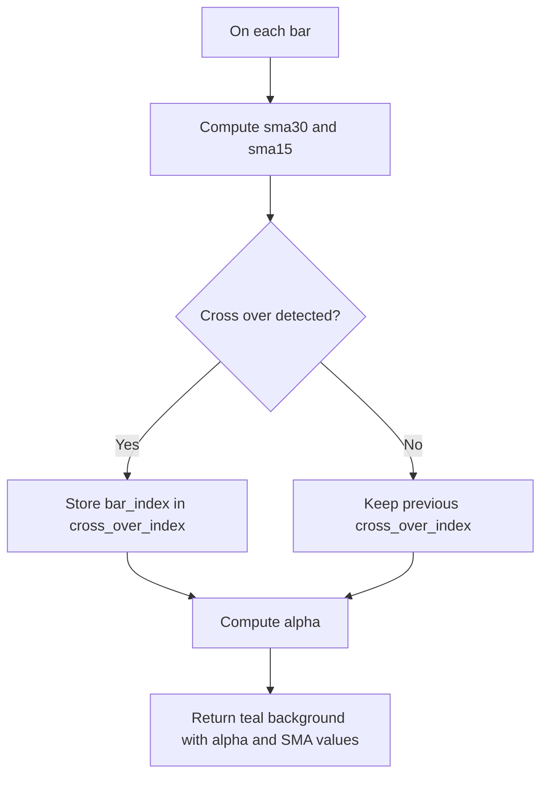

# Highlight Crossover - Background Color Example - Technical Guide

> Educational indicator that fades the chart background teal when a 15-period SMA crosses above a 30-period SMA.

| | |
| --- | --- |
| **Language** | Indie Script v5 |
| **Platform** | [TakeProfit](https://takeprofit.com) |
| **Category** | Demos & templates |
| **Type** | Example |
| **Author** | @TakeProfit on TakeProfit |
| **License** | MIT |
| **Live script** | [Open on TakeProfit](https://takeprofit.com/indicator/highlight-crossover-background-color-example-76) |
| **Source file** | [Highlight Crossover - Background Color Example.indie5](Highlight%20Crossover%20-%20Background%20Color%20Example.indie5) |

## Overview

This example tracks two simple moving averages of `self.close`: a 15-period SMA and a 30-period SMA. It demonstrates Indie's background drawing, stateful `Var` variables, and dynamic color alpha, and is meant to make crossover areas visually obvious on the main chart pane rather than to act as a trading signal.

On the chart, the background is painted with `color.TEAL(alpha)` after the fast SMA crosses above the slow SMA. The tint is strongest at the crossover bar and fades on subsequent bars. The two SMAs are plotted as lines: the 15-period SMA is MAROON and the 30-period SMA is LIME, matching the two `@plot.line` decorators.

## How it works

1. Initializes an integer `Var` named `cross_over_index` to 0 to remember the bar index of the last crossover.
2. Computes 30-period and 15-period SMAs of `self.close` using `Sma.new`.
3. If `cross_over(sma15, sma30)` is true, stores the current `self.bar_index` in `cross_over_index`.
4. Computes alpha as `0.5 / (self.bar_index - cross_over_index.get() + 1) ** 0.6`.
5. Returns a teal `plot.Background` with that alpha, followed by the current SMA values so the decorators can draw them as lines.
6. On each later bar, alpha decreases as the distance from the stored crossover grows, making the tint fade over time.

## Mathematical model

$$
\alpha_t = \frac{0.5}{(t - t_{\text{cross}} + 1)^{0.6}}
$$

where \(t = \text{self.bar_index}\) and \(t_{\text{cross}}\) is the stored `cross_over_index` value.

## Logic flow



## Code walkthrough

### State and plot setup

Lines 6-12 of [Highlight Crossover - Background Color Example.indie5](Highlight%20Crossover%20-%20Background%20Color%20Example.indie5):

```python
@indicator('Highlight Crossover', overlay_main_pane=True)
@plot.background()
@plot.line(color=color.LIME)
@plot.line(color=color.MAROON)
def Main(self):
    cross_over_index = Var[int].new(0)
    
```

The `@indicator` decorator names the script and places it on the main chart pane. `@plot.background` declares that the first returned value is a background drawing, while the two `@plot.line` decorators describe the colors of the two following series. `Var[int].new(0)` creates an integer state variable that persists across bars and stores the bar index of the most recent crossover.

### Crossover detection

Lines 13-17 of [Highlight Crossover - Background Color Example.indie5](Highlight%20Crossover%20-%20Background%20Color%20Example.indie5):

```python
    sma30 = Sma.new(self.close, 30)
    sma15 = Sma.new(self.close, 15)

    if cross_over(sma15, sma30):
        cross_over_index.set(self.bar_index)
```

`Sma.new` creates moving-average series from `self.close`. `cross_over(sma15, sma30)` triggers on a bar where the 15-period SMA crosses above the 30-period SMA. When that happens, `cross_over_index` is overwritten with the current `self.bar_index`, which is later used as the origin of the fade.

### Alpha decay and return

Lines 19-20 of [Highlight Crossover - Background Color Example.indie5](Highlight%20Crossover%20-%20Background%20Color%20Example.indie5):

```python
    alpha = 0.5 / (self.bar_index - cross_over_index.get() + 1) ** 0.6
    return plot.Background(color=color.TEAL(alpha)), sma15[0], sma30[0]
```

Alpha is calculated from the distance between the current bar and the stored crossover bar. Because `**` binds tighter than `/`, this divides 0.5 by `(bar_index - index + 1) ** 0.6`, so larger distances produce smaller alpha. The function returns the teal background with that alpha and the two current SMA values; the earlier decorators map them to LIME and MAROON lines.

## Reading the chart

- A teal background appears after a `cross_over(sma15, sma30)` event and fades bar by bar; alpha starts at 0.5 on the crossover bar.
- The LIME line is the 30-period SMA and the MAROON line is the 15-period SMA, matching the return order after `plot.Background`.
- The background color is driven only by the last stored crossover; if no crossover has occurred yet, the stored index remains 0, so an early teal tint may be visible before the first real crossover.
- Only a bullish crossover is highlighted; the script contains no `cross_under` handling for the reverse event.

## Implementation notes

- `cross_over_index` is initialized to 0, so before the first detected crossover the alpha formula treats bar 0 as the crossover origin.
- Because the denominator is `(bar_index - index + 1) ** 0.6`, alpha never reaches exactly zero; it asymptotically fades instead of ending at a fixed bar.
- `Sma.new` returns series objects; `sma15[0]` and `sma30[0]` read the current bar values for plotting.
- The maximum alpha is 0.5, which occurs on the bar where the crossover is stored.

## FAQ

**Can I change the SMA lengths?**

Yes, edit the 15 and 30 in `Sma.new(self.close, 15)` and `Sma.new(self.close, 30)`. The background still reacts to a crossover of those two SMAs.

**How do I make the fade last longer?**

Lower the exponent 0.6 on line 19; a smaller exponent makes alpha decay more slowly with bar distance. Changing the numerator 0.5 scales the overall alpha level.

**Does it also highlight crosses below?**

No, the code only calls `cross_over`, so it triggers when the fast SMA crosses above the slow SMA. To highlight crosses below, you would need a separate `cross_under` check and another state variable or color.

## Full source code

Indie Script v5, as published on TakeProfit. Copy it into the platform's script editor or [open the live script](https://takeprofit.com/indicator/highlight-crossover-background-color-example-76).

```python
# indie:lang_version = 5
from indie import indicator, Var, plot, color
from indie.algorithms import Sma
from indie.math import cross_over

@indicator('Highlight Crossover', overlay_main_pane=True)
@plot.background()
@plot.line(color=color.LIME)
@plot.line(color=color.MAROON)
def Main(self):
    cross_over_index = Var[int].new(0)
    
    sma30 = Sma.new(self.close, 30)
    sma15 = Sma.new(self.close, 15)

    if cross_over(sma15, sma30):
        cross_over_index.set(self.bar_index)

    alpha = 0.5 / (self.bar_index - cross_over_index.get() + 1) ** 0.6
    return plot.Background(color=color.TEAL(alpha)), sma15[0], sma30[0]
```
