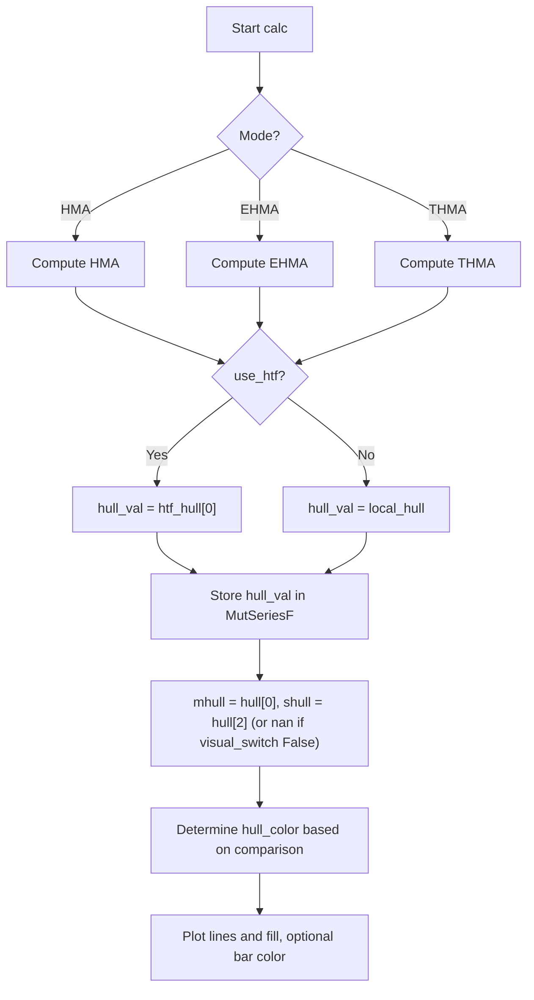

# Hull Suite by InSilico - Indie Edition - Technical Guide

> Hull Suite indicator with three Hull variants (HMA, EHMA, THMA), optional HTF, and band visualization.

| | |
| --- | --- |
| **Language** | Indie Script v5 |
| **Platform** | [TakeProfit](https://takeprofit.com) |
| **Category** | Moving averages |
| **Type** | Indicator |
| **Author** | @chartjunkie on TakeProfit |
| **Original (TradingView)** | [Hull Suite](https://www.tradingview.com/script/hg92pFwS-Hull-Suite/) by InSilico |
| **Original license** | See the header of the Pine file |
| **Original source** | [Hull Suite by InSilico - Indie Edition.pinescript4](Hull%20Suite%20by%20InSilico%20-%20Indie%20Edition.pinescript4) |
| **License** | [MPL-2.0](https://mozilla.org/MPL/2.0/) (derivative work) |
| **Live script** | [Open on TakeProfit](https://takeprofit.com/indicator/hull-suite-by-insilico-indie-edition-97) |
| **Source file** | [Hull Suite by InSilico - Indie Edition.indie5](Hull%20Suite%20by%20InSilico%20-%20Indie%20Edition.indie5) |

## Overview

**Hull Suite by InSilico – Indie Edition** is a port of the TradingView indicator by InSilico. It combines three Hull-based smoothing models—HMA (Hull Moving Average), EHMA (Exponential Hull Moving Average), and THMA (Triangular Hull Moving Average)—into one unified tool. The indicator displays a main Hull line (MHULL) and a shifted Hull line (SHULL) to form a band, with optional color based on trend direction and optional candle coloring. It can compute on a higher timeframe using Indie's secondary context engine.

The Hull moving average is designed to reduce lag while maintaining smoothness, making it suitable for trend identification, dynamic support/resistance zones, pullback entry filtering, and scalping with higher timeframe alignment.

## How it works

1. User selects a Hull variation (HMA, EHMA, THMA) and a base length.
2. Effective length is computed as `length * length_mult`, minimum 2. For HMA and EHMA, its square root is taken for the final smoothing step; for THMA, half the effective length is used.
3. Depending on the mode, intermediate weighted or exponential moving averages are computed and combined according to the Hull formula.
4. If higher timeframe mode is enabled, the Hull value is obtained from the `SecHull` context running on the selected HTF.
5. The current Hull value is stored in a `MutSeriesF` series; the main line (MHULL) is the current value, and the shifted line (SHULL) is the value from 2 bars ago.
6. Colors are set: green if MHULL > SHULL (uptrend), red if MHULL < SHULL (downtrend), default orange if trend coloring is off.
7. A fill band is drawn between MHULL and SHULL with user-controlled transparency, and optionally candles are colored with the trend color.

## Mathematical model

HMA (Hull Moving Average):

$$
\text{HMA} = \text{WMA}\left( 2 \cdot \text{WMA}(\text{src}, \frac{L}{2}) - \text{WMA}(\text{src}, L), \sqrt{L} \right)
$$

EHMA (Exponential Hull Moving Average):

$$
\text{EHMA} = \text{EMA}\left( 2 \cdot \text{EMA}(\text{src}, \frac{L}{2}) - \text{EMA}(\text{src}, L), \sqrt{L} \right)
$$

THMA (Triangular Hull Moving Average):

$$
\text{THMA} = \text{WMA}\left( 3 \cdot \text{WMA}(\text{src}, \frac{L}{6}) - \text{WMA}(\text{src}, \frac{L}{4}) - \text{WMA}(\text{src}, \frac{L}{2}), \frac{L}{2} \right)
$$

Where $L = \text{length} \times \text{lengthMult}$ and $\texttt{rint}$ rounds to the nearest integer with a minimum of 1.

## Logic flow



## Parameters

| Parameter | Type | Default | Range | Description |
| --- | --- | --- | --- | --- |
| `src` | source | source.CLOSE |  | Source |
| `mode_switch` | str | Hma |  | Hull Variation |
| `length` | int | 55 | ≥ 1 | Length(180-200 for floating S/R, 55 for swing entry) |
| `length_mult` | float | 1.0 | 0.1 - 10.0 | Length multiplier |
| `use_htf` | bool | false |  | Show Hull MA from higher timeframe? |
| `htf` | time_frame | 1W |  | Higher timeframe |
| `switch_color` | bool | true |  | Color Hull according to trend? |
| `candle_col` | bool | false |  | Color candles based on Hull Trend? |
| `visual_switch` | bool | true |  | Show as a Band? |
| `transp_switch` | int | 40 | 0 - 100 | Band Transparency |

## Code walkthrough

### Pine-compatible rounding function

Lines 12-13 of [Hull Suite by InSilico - Indie Edition.indie5](Hull%20Suite%20by%20InSilico%20-%20Indie%20Edition.indie5):

```python
def rint(x: float) -> int:
    return max(1, int(round(x)))
```

The `rint` function rounds a float to the nearest integer and ensures a minimum of 1. This matches Pine Script's `round()` behavior and prevents zero-length moving averages. It is used wherever Pine would call `round()` or implicitly convert a float to an integer.

### SecHull – higher timeframe context

Lines 21-41 of [Hull Suite by InSilico - Indie Edition.indie5](Hull%20Suite%20by%20InSilico%20-%20Indie%20Edition.indie5):

```python
def SecHull(self, src, mode_switch, length, length_mult):
    _len = max(2, int(length * length_mult))
    sqrt_len = rint(sqrt(float(_len)))
    result = 0.0

    if mode_switch == 'Hma':
        wma_half = Wma.new(src, rint(_len / 2))[0]
        wma_full = Wma.new(src, _len)[0]
        result = Wma.new(MutSeriesF.new(2.0 * wma_half - wma_full), sqrt_len)[0]
    elif mode_switch == 'Ehma':
        ema_half = Ema.new(src, rint(_len / 2))[0]
        ema_full = Ema.new(src, _len)[0]
        result = Ema.new(MutSeriesF.new(2.0 * ema_half - ema_full), sqrt_len)[0]
    else:
        th_len = rint(_len / 2)
        wma_t3 = Wma.new(src, rint(th_len / 3))[0]
        wma_t2 = Wma.new(src, rint(th_len / 2))[0]
        wma_t1 = Wma.new(src, th_len)[0]
        result = Wma.new(MutSeriesF.new(wma_t3 * 3.0 - wma_t2 - wma_t1), th_len)[0]

    return result
```

This function is decorated with `@sec_context` and runs on a separate timeframe. It replicates the Hull mode logic exactly as in the main calc, but uses separate state. The result is accessed via `self._htf_hull[0]` in the main class. This is the Indie equivalent of Pine's `security()` call.

### Main calc – mode switching and Hull computation

Lines 73-91 of [Hull Suite by InSilico - Indie Edition.indie5](Hull%20Suite%20by%20InSilico%20-%20Indie%20Edition.indie5):

```python
    def calc(self):
        _len = max(2, int(self._length * self._length_mult))
        sqrt_len = rint(sqrt(float(_len)))

        local_hull = 0.0
        if self._mode_switch == 'Hma':
            wma_half = Wma.new(self._src, rint(_len / 2))[0]
            wma_full = Wma.new(self._src, _len)[0]
            local_hull = Wma.new(MutSeriesF.new(2.0 * wma_half - wma_full), sqrt_len)[0]
        elif self._mode_switch == 'Ehma':
            ema_half = Ema.new(self._src, rint(_len / 2))[0]
            ema_full = Ema.new(self._src, _len)[0]
            local_hull = Ema.new(MutSeriesF.new(2.0 * ema_half - ema_full), sqrt_len)[0]
        else:
            th_len = rint(_len / 2)
            wma_t3 = Wma.new(self._src, rint(th_len / 3))[0]
            wma_t2 = Wma.new(self._src, rint(th_len / 2))[0]
            wma_t1 = Wma.new(self._src, th_len)[0]
            local_hull = Wma.new(MutSeriesF.new(wma_t3 * 3.0 - wma_t2 - wma_t1), th_len)[0]
```

The `calc` method computes the local Hull value based on the selected mode. It uses `rint` to round intermediate lengths. Note the use of `MutSeriesF.new(...)` to wrap intermediate series when calling Wma/Ema again, making the intermediate values available as a series. This is necessary because Indie's `Wma.new` expects a series, not a float.

### Band visualization and coloring

Lines 95-113 of [Hull Suite by InSilico - Indie Edition.indie5](Hull%20Suite%20by%20InSilico%20-%20Indie%20Edition.indie5):

```python
        hull = MutSeriesF.new(hull_val)
        mhull_val = hull[0]
        shull_val = hull[2] if self._visual_switch else nan

        hull_color = color.ORANGE
        if self._switch_color:
            hull_color = color.rgba(0, 255, 0) if hull[0] > hull[2] else color.rgba(255, 0, 0)

        fill_alpha = (100.0 - float(self._transp_switch)) / 100.0
        fill_color = hull_color(fill_alpha)

        bar_col = hull_color if (self._candle_col and self._switch_color) else None

        return (
            plot.Line(mhull_val, color=hull_color),
            plot.Line(shull_val, color=hull_color),
            plot.Fill(color=fill_color),
            plot.BarColor(bar_col)
        )
```

The Hull value is stored in a `MutSeriesF` to allow referencing past values. `mhull_val` is the current value, `shull_val` is the value 2 bars ago (or NaN if the band is hidden). The fill color's alpha is computed from transparency (inverted to match Pine's `transp`). Bar coloring is applied only if both `candle_col` and `switch_color` are true.

## Pine Script vs Indie

The Indie port replicates the original Pine Script v4 logic with equivalent function calls and structure. Key differences include using `MutSeriesF` for series storage instead of Pine's built-in history referencing, and the `sec_context` decorator for HTF calculations instead of `security`.

| Pine Script | Indie | Note |
| --- | --- | --- |
| `wma(_src, _length / 2)` | `Wma.new(src, rint(_len / 2))[0]` | Indie requires explicit integer length via rint and accessing the series element. |
| `round(sqrt(_length))` | `rint(sqrt(float(_len)))` | Same rounding logic, converted to int with minimum 1. |
| `security(syminfo.ticker, htf, _hull)` | `self._htf_hull = self.calc_on(SecHull, time_frame=htf)` | Indie uses a separate context function instead of security(). |
| `HULL[2]` | `hull[2]` | Same 2-bar shift; Indie uses MutSeriesF. |

### Function definitions (HMA, EHMA, THMA)

Pine Script, lines 43-51 of [Hull Suite by InSilico - Indie Edition.pinescript4](Hull%20Suite%20by%20InSilico%20-%20Indie%20Edition.pinescript4):

```pine
HMA(_src, _length) =>  wma(2 * wma(_src, _length / 2) - wma(_src, _length), round(sqrt(_length)))

//EHMA    

EHMA(_src, _length) =>  ema(2 * ema(_src, _length / 2) - ema(_src, _length), round(sqrt(_length)))

//THMA    

THMA(_src, _length) =>  wma(wma(_src,_length / 3) * 3 - wma(_src, _length / 2) - wma(_src, _length), _length)
```

Indie, lines 26-39 of [Hull Suite by InSilico - Indie Edition.indie5](Hull%20Suite%20by%20InSilico%20-%20Indie%20Edition.indie5):

```python
    if mode_switch == 'Hma':
        wma_half = Wma.new(src, rint(_len / 2))[0]
        wma_full = Wma.new(src, _len)[0]
        result = Wma.new(MutSeriesF.new(2.0 * wma_half - wma_full), sqrt_len)[0]
    elif mode_switch == 'Ehma':
        ema_half = Ema.new(src, rint(_len / 2))[0]
        ema_full = Ema.new(src, _len)[0]
        result = Ema.new(MutSeriesF.new(2.0 * ema_half - ema_full), sqrt_len)[0]
    else:
        th_len = rint(_len / 2)
        wma_t3 = Wma.new(src, rint(th_len / 3))[0]
        wma_t2 = Wma.new(src, rint(th_len / 2))[0]
        wma_t1 = Wma.new(src, th_len)[0]
        result = Wma.new(MutSeriesF.new(wma_t3 * 3.0 - wma_t2 - wma_t1), th_len)[0]
```

Pine defines three separate functions using `=>`. Indie inlines the logic inside mode conditions in both `SecHull` and the main `calc` method, using `MutSeriesF.new(...)` to wrap intermediate series for the final smoothing step.

### Higher timeframe handling

Pine Script, lines 69-71 of [Hull Suite by InSilico - Indie Edition.pinescript4](Hull%20Suite%20by%20InSilico%20-%20Indie%20Edition.pinescript4):

```pine
_hull = Mode(modeSwitch, src, int(length * lengthMult))

HULL = useHtf ? security(syminfo.ticker, htf, _hull) : _hull
```

Indie, lines 71-93 of [Hull Suite by InSilico - Indie Edition.indie5](Hull%20Suite%20by%20InSilico%20-%20Indie%20Edition.indie5):

```python
        self._htf_hull = self.calc_on(SecHull, time_frame=htf)

    def calc(self):
        _len = max(2, int(self._length * self._length_mult))
        sqrt_len = rint(sqrt(float(_len)))

        local_hull = 0.0
        if self._mode_switch == 'Hma':
            wma_half = Wma.new(self._src, rint(_len / 2))[0]
            wma_full = Wma.new(self._src, _len)[0]
            local_hull = Wma.new(MutSeriesF.new(2.0 * wma_half - wma_full), sqrt_len)[0]
        elif self._mode_switch == 'Ehma':
            ema_half = Ema.new(self._src, rint(_len / 2))[0]
            ema_full = Ema.new(self._src, _len)[0]
            local_hull = Ema.new(MutSeriesF.new(2.0 * ema_half - ema_full), sqrt_len)[0]
        else:
            th_len = rint(_len / 2)
            wma_t3 = Wma.new(self._src, rint(th_len / 3))[0]
            wma_t2 = Wma.new(self._src, rint(th_len / 2))[0]
            wma_t1 = Wma.new(self._src, th_len)[0]
            local_hull = Wma.new(MutSeriesF.new(wma_t3 * 3.0 - wma_t2 - wma_t1), th_len)[0]

        hull_val = self._htf_hull[0] if self._use_htf else local_hull
```

Pine uses `security()` with a ticker and timeframe string. Indie declares a separate context function `SecHull` decorated with `@sec_context`, then calls `self.calc_on(SecHull, time_frame=htf)` in `__init__`. The result is accessed as `self._htf_hull[0]` in `calc`.

### Bar coloring

Pine Script, lines 101-103 of [Hull Suite by InSilico - Indie Edition.pinescript4](Hull%20Suite%20by%20InSilico%20-%20Indie%20Edition.pinescript4):

```pine
///BARCOLOR

barcolor(color = candleCol ? (switchColor ? hullColor : na) : na)
```

Indie, lines 106-112 of [Hull Suite by InSilico - Indie Edition.indie5](Hull%20Suite%20by%20InSilico%20-%20Indie%20Edition.indie5):

```python
        bar_col = hull_color if (self._candle_col and self._switch_color) else None

        return (
            plot.Line(mhull_val, color=hull_color),
            plot.Line(shull_val, color=hull_color),
            plot.Fill(color=fill_color),
            plot.BarColor(bar_col)
```

Pine uses `barcolor` with a conditional ternary. Indie uses `plot.BarColor(bar_col)` where `bar_col` is `hull_color` if both `candle_col` and `switch_color` are true, else `None`. The bar color is returned as a plot tuple.

## Reading the chart

- **MHULL (main line)**: The current Hull value for the selected variation.
- **SHULL (shifted line)**: The Hull value 2 bars ago, forming a band with MHULL when enabled.
- **Band color**: Green when MHULL > SHULL (uptrend), red when MHULL < SHULL (downtrend), orange if trend coloring is disabled.
- **Band fill**: The area between MHULL and SHULL, with transparency set by the user. A wider band indicates stronger trend momentum.
- **Candle colors**: If enabled, candles are colored with the same trend color (green/red) based on the MHULL vs SHULL relationship.
- **Higher timeframe mode**: When enabled, both lines represent Hull values computed on the selected higher timeframe, providing a bigger-picture trend bias.

## Implementation notes

- The `rint` function ensures that intermediate lengths are positive integers, matching Pine's `round()` behavior and preventing zero-length moving averages.
- The shifted SHULL uses `hull[2]` (value 2 bars ago), not `hull[1]`. This matches the original Pine script which uses `HULL[2]`.
- Band transparency is inverted: Indie uses `(100 - transp)/100` for alpha, similar to Pine's `transp` parameter.
- The `SecHull` function is executed on a separate timeframe using `sec_context`. The selected HTF must be higher than the chart timeframe for accurate results.

## FAQ

**How do I change the Hull variation?**

Use the 'Hull Variation' parameter in the indicator settings. Choose 'Hma' for standard Hull, 'Ehma' for a more reactive exponential version, or 'Thma' for a smoother triangular version.

**What does the 'Show as a Band?' option do?**

When enabled, a second line (SHULL) is drawn offset by 2 bars, creating a band with the main line. The fill between them helps visualize trend momentum. When disabled, only the main line is plotted.

**How is the higher timeframe mode used?**

Enable 'Show Hull MA from higher timeframe?' and select a higher timeframe (e.g., '1D', '1W'). The Hull values will be computed on that timeframe, providing a macro trend bias on your current chart. The chosen HTF must be higher than the chart timeframe.

## License and attribution

This Indie script is a derivative work of **Hull Suite by InSilico** on TradingView. The Pine Script original states no license in its header; TradingView applies MPL-2.0 by default to open-source scripts. A modified version of MPL-2.0 code must stay under [MPL-2.0](https://mozilla.org/MPL/2.0/), so this file is distributed under that license (the notice is appended to the end of the source file). The original author keeps the credit for the algorithm; this page is not affiliated with or endorsed by them.

## Full source code

Indie Script v5, as published on TakeProfit. Copy it into the platform's script editor or [open the live script](https://takeprofit.com/indicator/hull-suite-by-insilico-indie-edition-97).

```python
# indie:lang_version = 5
# Free indie port inspired by InSilico
from math import sqrt, nan
from indie import (
    indicator, MainContext, sec_context, param, param_ref,
    source, plot, color, MutSeriesF
)
from indie.algorithms import Wma, Ema


# Pine-compatible rounding: round() instead of floor(), min period = 1
def rint(x: float) -> int:
    return max(1, int(round(x)))


@sec_context
@param_ref('src')
@param_ref('mode_switch')
@param_ref('length')
@param_ref('length_mult')
def SecHull(self, src, mode_switch, length, length_mult):
    _len = max(2, int(length * length_mult))
    sqrt_len = rint(sqrt(float(_len)))
    result = 0.0

    if mode_switch == 'Hma':
        wma_half = Wma.new(src, rint(_len / 2))[0]
        wma_full = Wma.new(src, _len)[0]
        result = Wma.new(MutSeriesF.new(2.0 * wma_half - wma_full), sqrt_len)[0]
    elif mode_switch == 'Ehma':
        ema_half = Ema.new(src, rint(_len / 2))[0]
        ema_full = Ema.new(src, _len)[0]
        result = Ema.new(MutSeriesF.new(2.0 * ema_half - ema_full), sqrt_len)[0]
    else:
        th_len = rint(_len / 2)
        wma_t3 = Wma.new(src, rint(th_len / 3))[0]
        wma_t2 = Wma.new(src, rint(th_len / 2))[0]
        wma_t1 = Wma.new(src, th_len)[0]
        result = Wma.new(MutSeriesF.new(wma_t3 * 3.0 - wma_t2 - wma_t1), th_len)[0]

    return result


@indicator('Hull Suite', overlay_main_pane=True)
@param.source('src', default=source.CLOSE, title='Source')
@param.str('mode_switch', default='Hma', options=['Hma', 'Thma', 'Ehma'], title='Hull Variation')
@param.int('length', default=55, min=1, title='Length(180-200 for floating S/R, 55 for swing entry)')
@param.float('length_mult', default=1.0, min=0.1, max=10.0, title='Length multiplier')
@param.bool('use_htf', default=False, title='Show Hull MA from higher timeframe?')
@param.time_frame('htf', default='1W', title='Higher timeframe')
@param.bool('switch_color', default=True, title='Color Hull according to trend?')
@param.bool('candle_col', default=False, title='Color candles based on Hull Trend?')
@param.bool('visual_switch', default=True, title='Show as a Band?')
@param.int('transp_switch', default=40, min=0, max=100, step=5, title='Band Transparency')
@plot.line('mhull', color=color.ORANGE, title='MHULL')
@plot.line('shull', color=color.ORANGE, title='SHULL')
@plot.fill('mhull', 'shull', title='Band Filler')
@plot.bar_color(title='Bar Color')
class Main(MainContext):
    def __init__(self, src, mode_switch, length, length_mult, use_htf, htf,
                 switch_color, candle_col, visual_switch, transp_switch):
        self._src = src
        self._mode_switch = mode_switch
        self._length = length
        self._length_mult = length_mult
        self._use_htf = use_htf
        self._switch_color = switch_color
        self._candle_col = candle_col
        self._visual_switch = visual_switch
        self._transp_switch = transp_switch
        self._htf_hull = self.calc_on(SecHull, time_frame=htf)

    def calc(self):
        _len = max(2, int(self._length * self._length_mult))
        sqrt_len = rint(sqrt(float(_len)))

        local_hull = 0.0
        if self._mode_switch == 'Hma':
            wma_half = Wma.new(self._src, rint(_len / 2))[0]
            wma_full = Wma.new(self._src, _len)[0]
            local_hull = Wma.new(MutSeriesF.new(2.0 * wma_half - wma_full), sqrt_len)[0]
        elif self._mode_switch == 'Ehma':
            ema_half = Ema.new(self._src, rint(_len / 2))[0]
            ema_full = Ema.new(self._src, _len)[0]
            local_hull = Ema.new(MutSeriesF.new(2.0 * ema_half - ema_full), sqrt_len)[0]
        else:
            th_len = rint(_len / 2)
            wma_t3 = Wma.new(self._src, rint(th_len / 3))[0]
            wma_t2 = Wma.new(self._src, rint(th_len / 2))[0]
            wma_t1 = Wma.new(self._src, th_len)[0]
            local_hull = Wma.new(MutSeriesF.new(wma_t3 * 3.0 - wma_t2 - wma_t1), th_len)[0]

        hull_val = self._htf_hull[0] if self._use_htf else local_hull

        hull = MutSeriesF.new(hull_val)
        mhull_val = hull[0]
        shull_val = hull[2] if self._visual_switch else nan

        hull_color = color.ORANGE
        if self._switch_color:
            hull_color = color.rgba(0, 255, 0) if hull[0] > hull[2] else color.rgba(255, 0, 0)

        fill_alpha = (100.0 - float(self._transp_switch)) / 100.0
        fill_color = hull_color(fill_alpha)

        bar_col = hull_color if (self._candle_col and self._switch_color) else None

        return (
            plot.Line(mhull_val, color=hull_color),
            plot.Line(shull_val, color=hull_color),
            plot.Fill(color=fill_color),
            plot.BarColor(bar_col)
        )

# ---------------------------------------------------------------------------
# This Source Code Form is subject to the terms of the Mozilla Public
# License, v. 2.0. If a copy of the MPL was not distributed with this
# file, You can obtain one at https://mozilla.org/MPL/2.0/
# Derived from "Hull Suite by InSilico" (TradingView).
# ---------------------------------------------------------------------------
```
