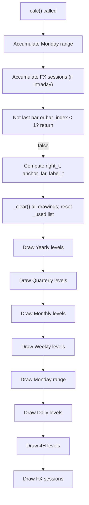

# IDWM Key Levels - ported from SpacemanBTC - Technical Guide

> Plots key reference prices (opens, previous highs/lows, midpoints) across multiple timeframes directly on the chart.

| | |
| --- | --- |
| **Language** | Indie Script v5 |
| **Platform** | [TakeProfit](https://takeprofit.com) |
| **Category** | Support & resistance |
| **Type** | Indicator |
| **Author** | @vit_rada on TakeProfit |
| **Original (TradingView)** | [Key Levels SpacemanBTC IDWM](https://www.tradingview.com/script/PV6TowBV-Key-Levels-SpacemanBTC-IDWM/) by spacemanbtc |
| **Original license** | See the header of the Pine file |
| **Original source** | [IDWM Key Levels - ported from SpacemanBTC.pinescript5](IDWM%20Key%20Levels%20-%20ported%20from%20SpacemanBTC.pinescript5) |
| **License** | [MPL-2.0](https://mozilla.org/MPL/2.0/) (derivative work) |
| **Live script** | [Open on TakeProfit](https://takeprofit.com/indicator/idwm-key-levels-ported-from-spacemanbtc-44) |
| **Source file** | [IDWM Key Levels - ported from SpacemanBTC.indie5](IDWM%20Key%20Levels%20-%20ported%20from%20SpacemanBTC.indie5) |

## Overview

This indicator draws horizontal lines and labels at significant price levels derived from multiple timeframes: 4H, Daily, Weekly, Monthly, Quarterly, Yearly, the Monday range of the current week, and configurable FX sessions (London, New York, Asia). Each group can be individually toggled and colored. The levels are extended to the right of the chart, with an optional 'Right Anchored' mode that fixes the line start to a distant bar. Overlapping levels (same price) can be merged so that only the highest-timeframe level is shown, keeping the chart clean.

It is designed for intraday charts; levels from timeframes lower than the chart's own timeframe are automatically hidden. The indicator helps traders quickly identify areas where price has reacted in the past — opens, previous period highs/lows, and their midpoints — across multiple horizons, from 4-hour to yearly.

## How it works

1. A secondary context `SecLevels` is defined to fetch open, previous high/low, current high/low, and start times for any requested timeframe with lookahead.
2. In `calc()`, the Monday range is accumulated on every bar: the high and low of the first daily bar of the week (Monday) are tracked, updating until the week changes.
3. FX session high/low/open are accumulated bar-by-bar using `Schedule` objects built from user-provided time ranges (e.g. 0800-1600).
4. On the last bar only, all previous line/label drawings are erased and the merge price list is reset.
5. Levels are drawn in descending timeframe order (Yearly, Quarterly, Monthly, Weekly, Monday, Daily, 4H, then FX sessions) using the `_lvl` helper, which creates a `LineSegment` and `LabelAbs` at the appropriate horizontal positions.
6. If merge is enabled, a level is skipped when its rounded price already exists in the `_used` list (populated in drawing order, so higher timeframes win).
7. Labels use either shorthand or full text based on per-group and global settings, all configured in `__init__`.

## Mathematical model

$$
\text{Mid} = \frac{\text{High} + \text{Low}}{2}
$$

## Logic flow



## Parameters

| Parameter | Type | Default | Range | Description |
| --- | --- | --- | --- | --- |
| `display_style` | str | Standard |  | Display style |
| `distance_right` | int | 30 | 5 - 500 | Distance (bars right) |
| `anchor_distance` | int | 250 | 5 - 500 | Anchor distance (Right Anchored) |
| `text_size` | str | Medium |  | Text size |
| `line_width_s` | str | Small |  | Line width |
| `line_style_s` | str | Solid |  | Line style |
| `merge_levels` | bool | true |  | Merge overlapping levels (higher TF wins) |
| `global_text` | bool | false |  | Global shorthand text |
| `global_coloring` | bool | false |  | Global coloring |
| `global_color` | color | color.WHITE |  | Global color |
| `s_intra_open` | bool | false |  | 4H: Open |
| `s_intra_hl` | bool | false |  | 4H: Prev H/L |
| `s_intra_mid` | bool | false |  | 4H: Prev Mid |
| `intra_sh` | bool | false |  | 4H: shorthand |
| `intra_color` | color | color.ORANGE |  | 4H color |
| `s_daily_open` | bool | true |  | Daily: Open |
| `s_daily_hl` | bool | false |  | Daily: Prev H/L |
| `s_daily_mid` | bool | false |  | Daily: Prev Mid |
| `daily_sh` | bool | false |  | Daily: shorthand |
| `daily_color` | color | rgba(8 |  | Daily color |
| `s_mon_range` | bool | true |  | Monday: Range |
| `s_mon_mid` | bool | true |  | Monday: Mid |
| `mon_sh` | bool | false |  | Monday: shorthand |
| `mon_color` | color | color.WHITE |  | Monday color |
| `s_wk_open` | bool | true |  | Weekly: Open |
| `s_wk_hl` | bool | true |  | Weekly: Prev H/L |
| `s_wk_mid` | bool | true |  | Weekly: Prev Mid |
| `wk_sh` | bool | false |  | Weekly: shorthand |
| `wk_color` | color | rgba(255 |  | Weekly color |
| `s_mo_open` | bool | true |  | Monthly: Open |
| `s_mo_hl` | bool | true |  | Monthly: Prev H/L |
| `s_mo_mid` | bool | true |  | Monthly: Prev Mid |
| `mo_sh` | bool | false |  | Monthly: shorthand |
| `mo_color` | color | rgba(8 |  | Monthly color |
| `s_q_open` | bool | true |  | Quarterly: Open |
| `s_q_hl` | bool | false |  | Quarterly: Prev H/L |
| `s_q_mid` | bool | true |  | Quarterly: Prev Mid |
| `q_sh` | bool | false |  | Quarterly: shorthand |
| `q_color` | color | color.RED |  | Quarterly color |
| `s_y_open` | bool | true |  | Yearly: Open |
| `s_y_hl` | bool | false |  | Yearly: Current H/L |
| `s_y_mid` | bool | true |  | Yearly: Mid |
| `y_sh` | bool | false |  | Yearly: shorthand |
| `y_color` | color | color.RED |  | Yearly color |
| `s_london` | bool | false |  | Session: London |
| `s_ny` | bool | false |  | Session: New York |
| `s_asia` | bool | false |  | Session: Asia |
| `sess_sh` | bool | false |  | Sessions: shorthand |
| `london_sess` | str | 0800-1600 |  | London session (HHMM-HHMM) |
| `ny_sess` | str | 1400-2100 |  | New York session (HHMM-HHMM) |
| `asia_sess` | str | 0000-0900 |  | Asia session (HHMM-HHMM) |
| `london_color` | color | color.WHITE |  | London color |
| `ny_color` | color | color.WHITE |  | New York color |
| `asia_color` | color | color.WHITE |  | Asia color |

## Code walkthrough

### Secondary context for timeframe data

Lines 20-27 of [IDWM Key Levels - ported from SpacemanBTC.indie5](IDWM%20Key%20Levels%20-%20ported%20from%20SpacemanBTC.indie5):

```python
@sec_context
def SecLevels(self):
    return (
        self.open[0],
        self.high[1], self.low[1],
        self.high[0], self.low[0],
        self.time[0], self.time[1],
    )
```

The `SecLevels` function is decorated with `@sec_context`, meaning it runs on a different timeframe and returns values aligned to the main chart bars. It returns the current open, previous high/low, current high/low, and the start times of the current and previous periods. This single function is reused for all six timeframes (4H, Daily, Weekly, Monthly, Quarterly, Yearly) by passing it to `self.calc_on()` with the appropriate `TimeFrame` and `lookahead=True`.

### Monday range accumulation

Lines 363-375 of [IDWM Key Levels - ported from SpacemanBTC.indie5](IDWM%20Key%20Levels%20-%20ported%20from%20SpacemanBTC.indie5):

```python
        # --- Monday range accumulation (every bar) ---
        if self._okd and self._okw:
            wk = self._tcw[0]
            dc = self._tcd[0]
            if not isnan(wk) and not isnan(dc):
                if wk != self._cur_week.get():
                    self._cur_week.set(wk)
                    self._mon_day.set(dc)
                    self._mon_h.set(self._hcd[0])
                    self._mon_l.set(self._lcd[0])
                elif dc == self._mon_day.get():
                    self._mon_h.set(max(self._mon_h.get(), self._hcd[0]))
                    self._mon_l.set(min(self._mon_l.get(), self._lcd[0]))
```

On every bar, the code checks if the current week (from weekly timeframe) has changed. If it's a new week, it resets the Monday high/low using the current daily high/low and stores the daily start time. If still the same Monday (daily start equals stored `_mon_day`), it updates the high and low. This tracks the range of the first daily bar of the week, which is the Monday bar.

### FX session accumulation via _acc

Lines 311-323 of [IDWM Key Levels - ported from SpacemanBTC.indie5](IDWM%20Key%20Levels%20-%20ported%20from%20SpacemanBTC.indie5):

```python
    def _acc(self, sched: Schedule, vin: Var[bool], vt: Var[float], vo: Var[float], vh: Var[float], vl: Var[float]) -> None:
        if self.time[0] in sched:
            if not vin.get():
                vt.set(self.time[0])
                vo.set(self.open[0])
                vh.set(self.high[0])
                vl.set(self.low[0])
            else:
                vh.set(max(vh.get(), self.high[0]))
                vl.set(min(vl.get(), self.low[0]))
            vin.set(True)
        else:
            vin.set(False)
```

The `_acc` method is called every bar for each enabled session. It uses a `Schedule` to check if the current bar's time falls within the session. On the first bar of a session (`vin` is False), it sets the start time, open, high, low. On subsequent bars, it updates the high and low. When outside the session, the `vin` flag is set to False. This is a compact replacement for the lengthy Pine script session tracking.

### Drawing a level with merge logic

Lines 325-349 of [IDWM Key Levels - ported from SpacemanBTC.indie5](IDWM%20Key%20Levels%20-%20ported%20from%20SpacemanBTC.indie5):

```python
    def _lvl(self, i: int, anchor_t: float, price: float, text: str, col: Color) -> None:
        if isnan(price) or isnan(anchor_t):
            return
        # merge: skip a level whose price coincides with one already drawn
        # (levels are drawn highest-TF-first, so the higher TF wins the point)
        if self._merge:
            rp = round(price, self.info.price_precision)
            if rp in self._used:
                return
            self._used.append(rp)
        a = self._anchor_far if self._right_anchored else anchor_t
        seg = LineSegment(
            AbsolutePosition(a, price),
            AbsolutePosition(self._right_t, price),
            color=col, line_width=self._lw, line_style=self._lstyle,
        )
        self._lines[i].set(seg)
        self.chart.draw(seg)

        lab = LabelAbs(
            text, AbsolutePosition(self._label_t, price),
            bg_color=color.TRANSPARENT, text_color=col, font_size=self._fs,
        )
        self._labels[i].set(lab)
        self.chart.draw(lab)
```

`_lvl` is called for every level to draw. It first checks for NaN values. If merge is enabled, it rounds the price to the instrument's price precision and skips drawing if that price already exists in `_used` (because a higher timeframe already drew it). Then it creates a `LineSegment` from an anchor time (or far anchor if right-anchored) to the right edge time, and a `LabelAbs` at the last bar's time. Both are drawn via `self.chart.draw()`.

## Pine Script vs Indie

The Indie script is a direct port of the Pine Script indicator "Key Levels SpacemanBTC IDWM" by SpacemanBTC. The core logic is preserved, but the implementation is adapted to Indie's syntax and API, resulting in a more compact and modular codebase.

| Pine Script | Indie | Note |
| --- | --- | --- |
| `var monday_high = high` | `self.new_var(nan)` | State variables declared with new_var. |

### FX session handling

Pine Script, lines 493-517 of [IDWM Key Levels - ported from SpacemanBTC.pinescript5](IDWM%20Key%20Levels%20-%20ported%20from%20SpacemanBTC.pinescript5):

```pine
if London

    if high > clondonhigh

        clondonhigh := high

        clondonhigh

    if low < clondonlow

        clondonlow := low

        clondonlow

    if onelondonfalse

        londontime := time

        flondonopen := open

        flondonopen

    flondonhigh := clondonhigh

    flondonlow := clondonlow
```

Indie, lines 311-323 of [IDWM Key Levels - ported from SpacemanBTC.indie5](IDWM%20Key%20Levels%20-%20ported%20from%20SpacemanBTC.indie5):

```python
    def _acc(self, sched: Schedule, vin: Var[bool], vt: Var[float], vo: Var[float], vh: Var[float], vl: Var[float]) -> None:
        if self.time[0] in sched:
            if not vin.get():
                vt.set(self.time[0])
                vo.set(self.open[0])
                vh.set(self.high[0])
                vl.set(self.low[0])
            else:
                vh.set(max(vh.get(), self.high[0]))
                vl.set(min(vl.get(), self.low[0]))
            vin.set(True)
        else:
            vin.set(False)
```

The Pine script uses individual variables and conditional blocks for each session (London, US, Asia) with separate accumulation and reset logic. Indie encapsulates this in a single `_acc` method that uses a `Schedule` object and a few state variables, making the code much shorter and reusable.

### Drawing levels with merge

Pine Script, lines 691-714 of [IDWM Key Levels - ported from SpacemanBTC.pinescript5](IDWM%20Key%20Levels%20-%20ported%20from%20SpacemanBTC.pinescript5):

```pine
f_LevelMerge(pricearray, labelarray, currentprice, currentlabel, currentcolor) =>

    if array.includes(pricearray, currentprice)

        whichindex = array.indexof(pricearray, currentprice)

        labelhold = array.get(labelarray, whichindex)

        whichtext = label.get_text(labelhold)


        label.set_text(labelhold, label.get_text(currentlabel) + ' / ' + whichtext)

        label.set_text(currentlabel, '')

        label.set_textcolor(labelhold, currentcolor)

    else

        array.push(pricearray, currentprice)

        array.push(labelarray, currentlabel)

```

Indie, lines 325-349 of [IDWM Key Levels - ported from SpacemanBTC.indie5](IDWM%20Key%20Levels%20-%20ported%20from%20SpacemanBTC.indie5):

```python
    def _lvl(self, i: int, anchor_t: float, price: float, text: str, col: Color) -> None:
        if isnan(price) or isnan(anchor_t):
            return
        # merge: skip a level whose price coincides with one already drawn
        # (levels are drawn highest-TF-first, so the higher TF wins the point)
        if self._merge:
            rp = round(price, self.info.price_precision)
            if rp in self._used:
                return
            self._used.append(rp)
        a = self._anchor_far if self._right_anchored else anchor_t
        seg = LineSegment(
            AbsolutePosition(a, price),
            AbsolutePosition(self._right_t, price),
            color=col, line_width=self._lw, line_style=self._lstyle,
        )
        self._lines[i].set(seg)
        self.chart.draw(seg)

        lab = LabelAbs(
            text, AbsolutePosition(self._label_t, price),
            bg_color=color.TRANSPARENT, text_color=col, font_size=self._fs,
        )
        self._labels[i].set(lab)
        self.chart.draw(lab)
```

Pine's merge function `f_LevelMerge` updates labels and uses arrays to track prices. Indie's approach is simpler: on the last bar, it clears all previous drawings, then draws levels in descending timeframe order, skipping any price that has already been drawn (tracked in a flat list). This avoids the need for label merging logic.

## Reading the chart

- Each timeframe group (4H, Daily, Monday, Weekly, Monthly, Quarterly, Yearly, Sessions) is drawn in its own color, configurable per group or overridden globally.
- Lines are horizontal, extending from a start time (either the period's start or a fixed anchor point) to the right edge of the chart, with a label at the right end.
- Labels display either a full description (e.g. 'Prev Day High') or a shorthand (e.g. 'PDH') depending on per-group or global settings.
- When merging is enabled, levels at exactly the same price (rounded to instrument precision) are hidden if a higher timeframe already drew that price; the higher timeframe's label takes precedence.
- Levels from timeframes lower than the chart's own timeframe (e.g. 4H levels on a daily chart) are automatically not drawn because the indicator skips drawing when the chart's timeframe is higher than the level's timeframe.
- FX sessions (London, New York, Asia) are only drawn on intraday charts and show the session's open, high, and low for the current day.

## Implementation notes

- All drawing occurs only on the last bar (`is_last_bar`), so the indicator does not repaint; levels are computed with lookahead and displayed once the period is complete.
- The merge feature rounds prices using `self.info.price_precision`, which may cause near-identical but not exactly equal prices to be drawn separately.
- FX session accumulation uses `Schedule` objects built from user-provided time strings (e.g. '0800-1600'), parsed in `pre_calc()`.
- The Monday range requires both daily and weekly timeframes to be available; if the chart's timeframe is larger than daily, Monday levels are suppressed.

## FAQ

**How do I change the color of all levels at once?**

Enable 'Global coloring' in the indicator settings, then set the 'Global color' to your desired color. All level groups will use that single color regardless of their individual settings.

**Why are some levels not showing on my chart?**

Levels from a timeframe lower than the chart's own timeframe are automatically hidden. For example, 4H levels won't appear on a daily chart. Also, make sure the corresponding toggles (e.g. 'Daily: Open') are enabled.

**What does the 'Merge overlapping levels' option do?**

When enabled, if two levels from different timeframes have the same price (rounded to the instrument's decimal places), only the one from the higher timeframe is drawn. This reduces visual clutter and shows the most significant level for that price.

## License and attribution

This Indie script is a derivative work of **Key Levels SpacemanBTC IDWM by spacemanbtc** on TradingView. The Pine Script original states no license in its header; TradingView applies MPL-2.0 by default to open-source scripts. A modified version of MPL-2.0 code must stay under [MPL-2.0](https://mozilla.org/MPL/2.0/), so this file is distributed under that license (the notice is appended to the end of the source file). The original author keeps the credit for the algorithm; this page is not affiliated with or endorsed by them.

## Full source code

Indie Script v5, as published on TakeProfit. Copy it into the platform's script editor or [open the live script](https://takeprofit.com/indicator/idwm-key-levels-ported-from-spacemanbtc-44).

```python
# indie:lang_version = 5
# Key Levels (SpacemanBTC IDWM) - ported to Indie for TakeProfit
# Draws Open / Previous High / Previous Low / Mid levels for multiple
# time frames (4H, Daily, Weekly, Monthly, Quarterly, Yearly), the
# current-week Monday range, and FX session (London / New York / Asia)
# ranges. Levels are labeled and extended to the right.

from indie import indicator, MainContext, sec_context, param, color, line_style, Optional, Var, TimeFrame, Color
from indie.drawings import LineSegment, LabelAbs, AbsolutePosition
from indie.schedule import ScheduleRule, Schedule, ALL_DAYS
from indie.color import rgba
from datetime import time
from math import isnan, nan


# One secondary context reused for every requested time frame.
# Returns, aligned to the main chart bars:
#   open of the current period, previous period high/low,
#   current period high/low, current period start time, previous period start time.
@sec_context
def SecLevels(self):
    return (
        self.open[0],
        self.high[1], self.low[1],
        self.high[0], self.low[0],
        self.time[0], self.time[1],
    )


@indicator('Key Levels (SpacemanBTC IDWM)', overlay_main_pane=True)
# ---- Display / global ----
@param.str('display_style', default='Standard', options=['Standard', 'Right Anchored'], title='Display style')
@param.int('distance_right', default=30, min=5, max=500, title='Distance (bars right)')
@param.int('anchor_distance', default=250, min=5, max=500, title='Anchor distance (Right Anchored)')
@param.str('text_size', default='Medium', options=['Small', 'Medium', 'Large'], title='Text size')
@param.str('line_width_s', default='Small', options=['Small', 'Medium', 'Large'], title='Line width')
@param.str('line_style_s', default='Solid', options=['Solid', 'Dashed', 'Dotted'], title='Line style')
@param.bool('merge_levels', default=True, title='Merge overlapping levels (higher TF wins)')
@param.bool('global_text', default=False, title='Global shorthand text')
@param.bool('global_coloring', default=False, title='Global coloring')
@param.color('global_color', default=color.WHITE, title='Global color')
# ---- 4H ----
@param.bool('s_intra_open', default=False, title='4H: Open')
@param.bool('s_intra_hl', default=False, title='4H: Prev H/L')
@param.bool('s_intra_mid', default=False, title='4H: Prev Mid')
@param.bool('intra_sh', default=False, title='4H: shorthand')
@param.color('intra_color', default=color.ORANGE, title='4H color')
# ---- Daily ----
@param.bool('s_daily_open', default=True, title='Daily: Open')
@param.bool('s_daily_hl', default=False, title='Daily: Prev H/L')
@param.bool('s_daily_mid', default=False, title='Daily: Prev Mid')
@param.bool('daily_sh', default=False, title='Daily: shorthand')
@param.color('daily_color', default=rgba(8, 188, 212, 1.0), title='Daily color')
# ---- Monday range ----
@param.bool('s_mon_range', default=True, title='Monday: Range')
@param.bool('s_mon_mid', default=True, title='Monday: Mid')
@param.bool('mon_sh', default=False, title='Monday: shorthand')
@param.color('mon_color', default=color.WHITE, title='Monday color')
# ---- Weekly ----
@param.bool('s_wk_open', default=True, title='Weekly: Open')
@param.bool('s_wk_hl', default=True, title='Weekly: Prev H/L')
@param.bool('s_wk_mid', default=True, title='Weekly: Prev Mid')
@param.bool('wk_sh', default=False, title='Weekly: shorthand')
@param.color('wk_color', default=rgba(255, 252, 188, 1.0), title='Weekly color')
# ---- Monthly ----
@param.bool('s_mo_open', default=True, title='Monthly: Open')
@param.bool('s_mo_hl', default=True, title='Monthly: Prev H/L')
@param.bool('s_mo_mid', default=True, title='Monthly: Prev Mid')
@param.bool('mo_sh', default=False, title='Monthly: shorthand')
@param.color('mo_color', default=rgba(8, 212, 140, 1.0), title='Monthly color')
# ---- Quarterly ----
@param.bool('s_q_open', default=True, title='Quarterly: Open')
@param.bool('s_q_hl', default=False, title='Quarterly: Prev H/L')
@param.bool('s_q_mid', default=True, title='Quarterly: Prev Mid')
@param.bool('q_sh', default=False, title='Quarterly: shorthand')
@param.color('q_color', default=color.RED, title='Quarterly color')
# ---- Yearly ----
@param.bool('s_y_open', default=True, title='Yearly: Open')
@param.bool('s_y_hl', default=False, title='Yearly: Current H/L')
@param.bool('s_y_mid', default=True, title='Yearly: Mid')
@param.bool('y_sh', default=False, title='Yearly: shorthand')
@param.color('y_color', default=color.RED, title='Yearly color')
# ---- FX Sessions ----
@param.bool('s_london', default=False, title='Session: London')
@param.bool('s_ny', default=False, title='Session: New York')
@param.bool('s_asia', default=False, title='Session: Asia')
@param.bool('sess_sh', default=False, title='Sessions: shorthand')
@param.str('london_sess', default='0800-1600', title='London session (HHMM-HHMM)')
@param.str('ny_sess', default='1400-2100', title='New York session (HHMM-HHMM)')
@param.str('asia_sess', default='0000-0900', title='Asia session (HHMM-HHMM)')
@param.color('london_color', default=color.WHITE, title='London color')
@param.color('ny_color', default=color.WHITE, title='New York color')
@param.color('asia_color', default=color.WHITE, title='Asia color')
class Main(MainContext):
    def __init__(
        self,
        display_style, distance_right, anchor_distance, text_size, line_width_s, line_style_s,
        merge_levels, global_text, global_coloring, global_color,
        s_intra_open, s_intra_hl, s_intra_mid, intra_sh, intra_color,
        s_daily_open, s_daily_hl, s_daily_mid, daily_sh, daily_color,
        s_mon_range, s_mon_mid, mon_sh, mon_color,
        s_wk_open, s_wk_hl, s_wk_mid, wk_sh, wk_color,
        s_mo_open, s_mo_hl, s_mo_mid, mo_sh, mo_color,
        s_q_open, s_q_hl, s_q_mid, q_sh, q_color,
        s_y_open, s_y_hl, s_y_mid, y_sh, y_color,
        s_london, s_ny, s_asia, sess_sh, london_sess, ny_sess, asia_sess,
        london_color, ny_color, asia_color,
    ):
        # --- store simple settings ---
        self._right_anchored = display_style == 'Right Anchored'
        self._distance_right = distance_right
        self._anchor_distance = anchor_distance
        self._merge = merge_levels

        self._fs = 13
        if text_size == 'Small':
            self._fs = 10
        elif text_size == 'Large':
            self._fs = 18

        self._lw = 1
        if line_width_s == 'Medium':
            self._lw = 2
        elif line_width_s == 'Large':
            self._lw = 3

        self._lstyle = line_style.SOLID
        if line_style_s == 'Dashed':
            self._lstyle = line_style.DASHED
        elif line_style_s == 'Dotted':
            self._lstyle = line_style.DOTTED

        # --- toggles ---
        self._s_intra_open = s_intra_open
        self._s_intra_hl = s_intra_hl
        self._s_intra_mid = s_intra_mid
        self._s_daily_open = s_daily_open
        self._s_daily_hl = s_daily_hl
        self._s_daily_mid = s_daily_mid
        self._s_mon_range = s_mon_range
        self._s_mon_mid = s_mon_mid
        self._s_wk_open = s_wk_open
        self._s_wk_hl = s_wk_hl
        self._s_wk_mid = s_wk_mid
        self._s_mo_open = s_mo_open
        self._s_mo_hl = s_mo_hl
        self._s_mo_mid = s_mo_mid
        self._s_q_open = s_q_open
        self._s_q_hl = s_q_hl
        self._s_q_mid = s_q_mid
        self._s_y_open = s_y_open
        self._s_y_hl = s_y_hl
        self._s_y_mid = s_y_mid
        self._s_london = s_london
        self._s_ny = s_ny
        self._s_asia = s_asia

        # --- colors (with optional global override) ---
        self._c_intra = global_color if global_coloring else intra_color
        self._c_daily = global_color if global_coloring else daily_color
        self._c_mon = global_color if global_coloring else mon_color
        self._c_wk = global_color if global_coloring else wk_color
        self._c_mo = global_color if global_coloring else mo_color
        self._c_q = global_color if global_coloring else q_color
        self._c_y = global_color if global_coloring else y_color
        self._c_lon = global_color if global_coloring else london_color
        self._c_ny = global_color if global_coloring else ny_color
        self._c_as = global_color if global_coloring else asia_color

        # --- label texts (shorthand vs full) ---
        gi = global_text or intra_sh
        self._t_io = '4H-O' if gi else '4H Open'
        self._t_ih = 'P-4H-H' if gi else 'Prev 4H High'
        self._t_il = 'P-4H-L' if gi else 'Prev 4H Low'
        self._t_im = 'P-4H-M' if gi else 'Prev 4H Mid'

        gd = global_text or daily_sh
        self._t_do = 'DO' if gd else 'Daily Open'
        self._t_dh = 'PDH' if gd else 'Prev Day High'
        self._t_dl = 'PDL' if gd else 'Prev Day Low'
        self._t_dm = 'PDM' if gd else 'Prev Day Mid'

        gm = global_text or mon_sh
        self._t_mh = 'MDAY-H' if gm else 'Monday High'
        self._t_ml = 'MDAY-L' if gm else 'Monday Low'
        self._t_mm = 'MDAY-M' if gm else 'Monday Mid'

        gw = global_text or wk_sh
        self._t_wo = 'WO' if gw else 'Weekly Open'
        self._t_wh = 'PWH' if gw else 'Prev Week High'
        self._t_wl = 'PWL' if gw else 'Prev Week Low'
        self._t_wm = 'PWM' if gw else 'Prev Week Mid'

        gmo = global_text or mo_sh
        self._t_moo = 'MO' if gmo else 'Monthly Open'
        self._t_moh = 'PMH' if gmo else 'Prev Month High'
        self._t_mol = 'PML' if gmo else 'Prev Month Low'
        self._t_mom = 'PMM' if gmo else 'Prev Month Mid'

        gq = global_text or q_sh
        self._t_qo = 'QO' if gq else 'Quarterly Open'
        self._t_qh = 'PQH' if gq else 'Prev Quarter High'
        self._t_ql = 'PQL' if gq else 'Prev Quarter Low'
        self._t_qm = 'PQM' if gq else 'Prev Quarter Mid'

        gy = global_text or y_sh
        self._t_yo = 'YO' if gy else 'Yearly Open'
        self._t_yh = 'CYH' if gy else 'Current Year High'
        self._t_yl = 'CYL' if gy else 'Current Year Low'
        self._t_ym = 'CYM' if gy else 'Current Year Mid'

        gs = global_text or sess_sh
        self._t_lonh = 'Lon-H' if gs else 'London High'
        self._t_lonl = 'Lon-L' if gs else 'London Low'
        self._t_lono = 'Lon-O' if gs else 'London Open'
        self._t_nyh = 'NY-H' if gs else 'New York High'
        self._t_nyl = 'NY-L' if gs else 'New York Low'
        self._t_nyo = 'NY-O' if gs else 'New York Open'
        self._t_ash = 'AS-H' if gs else 'Asia High'
        self._t_asl = 'AS-L' if gs else 'Asia Low'
        self._t_aso = 'AS-O' if gs else 'Asia Open'

        # raw session strings, parsed later in pre_calc (needs timezone)
        self._london_sess = london_sess
        self._ny_sess = ny_sess
        self._asia_sess = asia_sess
        none_sched: Optional[Schedule] = None
        self._sched_lon = none_sched
        self._sched_ny = none_sched
        self._sched_as = none_sched

        # --- request higher time frames (clamp to main tf to avoid errors) ---
        tf4 = TimeFrame.from_str('4h')
        self._ok4 = self.time_frame <= tf4
        self._o4, self._hp4, self._lp4, self._hc4, self._lc4, self._tc4, self._tp4 = self.calc_on(SecLevels, time_frame=(tf4 if self._ok4 else self.time_frame), lookahead=True)

        tfd = TimeFrame.from_str('1D')
        self._okd = self.time_frame <= tfd
        self._od, self._hpd, self._lpd, self._hcd, self._lcd, self._tcd, self._tpd = self.calc_on(SecLevels, time_frame=(tfd if self._okd else self.time_frame), lookahead=True)

        tfw = TimeFrame.from_str('1W')
        self._okw = self.time_frame <= tfw
        self._ow, self._hpw, self._lpw, self._hcw, self._lcw, self._tcw, self._tpw = self.calc_on(SecLevels, time_frame=(tfw if self._okw else self.time_frame), lookahead=True)

        tfm = TimeFrame.from_str('1M')
        self._okm = self.time_frame <= tfm
        self._om, self._hpm, self._lpm, self._hcm, self._lcm, self._tcm, self._tpm = self.calc_on(SecLevels, time_frame=(tfm if self._okm else self.time_frame), lookahead=True)

        tfq = TimeFrame.from_str('3M')
        self._okq = self.time_frame <= tfq
        self._oq, self._hpq, self._lpq, self._hcq, self._lcq, self._tcq, self._tpq = self.calc_on(SecLevels, time_frame=(tfq if self._okq else self.time_frame), lookahead=True)

        tfy = TimeFrame.from_str('12M')
        self._oky = self.time_frame <= tfy
        self._oy, self._hpy, self._lpy, self._hcy, self._lcy, self._tcy, self._tpy = self.calc_on(SecLevels, time_frame=(tfy if self._oky else self.time_frame), lookahead=True)

        self._intraday = self.time_frame < tfd

        # --- Monday range state ---
        self._cur_week = self.new_var(-1.0)
        self._mon_day = self.new_var(-1.0)
        self._mon_h = self.new_var(nan)
        self._mon_l = self.new_var(nan)

        # --- session state (start time, open, high, low, in-session flag) ---
        self._lon_t = self.new_var(nan)
        self._lon_o = self.new_var(nan)
        self._lon_h = self.new_var(nan)
        self._lon_l = self.new_var(nan)
        self._lon_in = self.new_var(False)
        self._ny_t = self.new_var(nan)
        self._ny_o = self.new_var(nan)
        self._ny_h = self.new_var(nan)
        self._ny_l = self.new_var(nan)
        self._ny_in = self.new_var(False)
        self._as_t = self.new_var(nan)
        self._as_o = self.new_var(nan)
        self._as_h = self.new_var(nan)
        self._as_l = self.new_var(nan)
        self._as_in = self.new_var(False)

        # --- drawing pools (one dedicated slot per logical level) ---
        none_line: Optional[LineSegment] = None
        none_label: Optional[LabelAbs] = None
        self._lines: list[Var[Optional[LineSegment]]] = []
        self._labels: list[Var[Optional[LabelAbs]]] = []
        for _ in range(36):
            self._lines.append(self.new_var(none_line))
            self._labels.append(self.new_var(none_label))

        # computed each last bar
        self._right_t = 0.0
        self._anchor_far = 0.0
        self._label_t = 0.0
        # rounded prices already drawn on the current last-bar pass (for merge)
        self._used: list[float] = []

    def pre_calc(self):
        self._sched_lon = self._build_schedule(self._london_sess)
        self._sched_ny = self._build_schedule(self._ny_sess)
        self._sched_as = self._build_schedule(self._asia_sess)

    def _build_schedule(self, s: str) -> Schedule:
        sh = int(s[0:2])
        sm = int(s[2:4])
        eh = int(s[5:7])
        em = int(s[7:9])
        rule = ScheduleRule(start=time(hour=sh, minute=sm), end=time(hour=eh, minute=em), days=ALL_DAYS)
        return Schedule(rules=[rule], timezone=self.info.timezone)

    def _acc(self, sched: Schedule, vin: Var[bool], vt: Var[float], vo: Var[float], vh: Var[float], vl: Var[float]) -> None:
        if self.time[0] in sched:
            if not vin.get():
                vt.set(self.time[0])
                vo.set(self.open[0])
                vh.set(self.high[0])
                vl.set(self.low[0])
            else:
                vh.set(max(vh.get(), self.high[0]))
                vl.set(min(vl.get(), self.low[0]))
            vin.set(True)
        else:
            vin.set(False)

    def _lvl(self, i: int, anchor_t: float, price: float, text: str, col: Color) -> None:
        if isnan(price) or isnan(anchor_t):
            return
        # merge: skip a level whose price coincides with one already drawn
        # (levels are drawn highest-TF-first, so the higher TF wins the point)
        if self._merge:
            rp = round(price, self.info.price_precision)
            if rp in self._used:
                return
            self._used.append(rp)
        a = self._anchor_far if self._right_anchored else anchor_t
        seg = LineSegment(
            AbsolutePosition(a, price),
            AbsolutePosition(self._right_t, price),
            color=col, line_width=self._lw, line_style=self._lstyle,
        )
        self._lines[i].set(seg)
        self.chart.draw(seg)

        lab = LabelAbs(
            text, AbsolutePosition(self._label_t, price),
            bg_color=color.TRANSPARENT, text_color=col, font_size=self._fs,
        )
        self._labels[i].set(lab)
        self.chart.draw(lab)

    def _clear(self) -> None:
        for k in range(36):
            lseg = self._lines[k].get()
            if lseg is not None:
                self.chart.erase(lseg.value())
                self._lines[k].set(None)
            llab = self._labels[k].get()
            if llab is not None:
                self.chart.erase(llab.value())
                self._labels[k].set(None)

    def calc(self):
        # --- Monday range accumulation (every bar) ---
        if self._okd and self._okw:
            wk = self._tcw[0]
            dc = self._tcd[0]
            if not isnan(wk) and not isnan(dc):
                if wk != self._cur_week.get():
                    self._cur_week.set(wk)
                    self._mon_day.set(dc)
                    self._mon_h.set(self._hcd[0])
                    self._mon_l.set(self._lcd[0])
                elif dc == self._mon_day.get():
                    self._mon_h.set(max(self._mon_h.get(), self._hcd[0]))
                    self._mon_l.set(min(self._mon_l.get(), self._lcd[0]))

        # --- session accumulation (every bar, intraday only) ---
        if self._intraday:
            if self._s_london and self._sched_lon is not None:
                self._acc(self._sched_lon.value(), self._lon_in, self._lon_t, self._lon_o, self._lon_h, self._lon_l)
            if self._s_ny and self._sched_ny is not None:
                self._acc(self._sched_ny.value(), self._ny_in, self._ny_t, self._ny_o, self._ny_h, self._ny_l)
            if self._s_asia and self._sched_as is not None:
                self._acc(self._sched_as.value(), self._as_in, self._as_t, self._as_o, self._as_h, self._as_l)

        if not self.is_last_bar or self.bar_index < 1:
            return

        bar_sec = self.time[0] - self.time[1]
        if bar_sec <= 0.0:
            return
        self._right_t = self.time[0] + bar_sec * float(self._distance_right)
        self._anchor_far = self.time[0] + bar_sec * float(self._anchor_distance)
        # labels only render at existing bars, so always anchor them to the last bar
        self._label_t = self.time[0]
        # erase the previous pass and reset the merge tracker;
        # levels are drawn highest-TF-first below so the higher TF wins a shared point
        self._clear()
        self._used = []

        # ---- Yearly (current year H/L) ----
        if self._oky:
            if self._s_y_open:
                self._lvl(20, self._tcy[0], self._oy[0], self._t_yo, self._c_y)
            if self._s_y_hl:
                self._lvl(21, self._tcy[0], self._hcy[0], self._t_yh, self._c_y)
                self._lvl(22, self._tcy[0], self._lcy[0], self._t_yl, self._c_y)
            if self._s_y_mid:
                self._lvl(23, self._tcy[0], (self._hcy[0] + self._lcy[0]) / 2.0, self._t_ym, self._c_y)

        # ---- Quarterly ----
        if self._okq:
            if self._s_q_open:
                self._lvl(16, self._tcq[0], self._oq[0], self._t_qo, self._c_q)
            if self._s_q_hl:
                self._lvl(17, self._tpq[0], self._hpq[0], self._t_qh, self._c_q)
                self._lvl(18, self._tpq[0], self._lpq[0], self._t_ql, self._c_q)
            if self._s_q_mid:
                self._lvl(19, self._tpq[0], (self._hpq[0] + self._lpq[0]) / 2.0, self._t_qm, self._c_q)

        # ---- Monthly ----
        if self._okm:
            if self._s_mo_open:
                self._lvl(12, self._tcm[0], self._om[0], self._t_moo, self._c_mo)
            if self._s_mo_hl:
                self._lvl(13, self._tpm[0], self._hpm[0], self._t_moh, self._c_mo)
                self._lvl(14, self._tpm[0], self._lpm[0], self._t_mol, self._c_mo)
            if self._s_mo_mid:
                self._lvl(15, self._tpm[0], (self._hpm[0] + self._lpm[0]) / 2.0, self._t_mom, self._c_mo)

        # ---- Weekly ----
        if self._okw:
            if self._s_wk_open:
                self._lvl(8, self._tcw[0], self._ow[0], self._t_wo, self._c_wk)
            if self._s_wk_hl:
                self._lvl(9, self._tpw[0], self._hpw[0], self._t_wh, self._c_wk)
                self._lvl(10, self._tpw[0], self._lpw[0], self._t_wl, self._c_wk)
            if self._s_wk_mid:
                self._lvl(11, self._tpw[0], (self._hpw[0] + self._lpw[0]) / 2.0, self._t_wm, self._c_wk)

        # ---- Monday range ----
        mh = self._mon_h.get()
        ml = self._mon_l.get()
        mday = self._mon_day.get()
        if self._s_mon_range:
            self._lvl(24, mday, mh, self._t_mh, self._c_mon)
            self._lvl(25, mday, ml, self._t_ml, self._c_mon)
        if self._s_mon_mid:
            self._lvl(26, mday, (mh + ml) / 2.0, self._t_mm, self._c_mon)

        # ---- Daily ----
        if self._okd:
            if self._s_daily_open:
                self._lvl(4, self._tcd[0], self._od[0], self._t_do, self._c_daily)
            if self._s_daily_hl:
                self._lvl(5, self._tpd[0], self._hpd[0], self._t_dh, self._c_daily)
                self._lvl(6, self._tpd[0], self._lpd[0], self._t_dl, self._c_daily)
            if self._s_daily_mid:
                self._lvl(7, self._tpd[0], (self._hpd[0] + self._lpd[0]) / 2.0, self._t_dm, self._c_daily)

        # ---- 4H ----
        if self._ok4:
            if self._s_intra_open:
                self._lvl(0, self._tc4[0], self._o4[0], self._t_io, self._c_intra)
            if self._s_intra_hl:
                self._lvl(1, self._tp4[0], self._hp4[0], self._t_ih, self._c_intra)
                self._lvl(2, self._tp4[0], self._lp4[0], self._t_il, self._c_intra)
            if self._s_intra_mid:
                self._lvl(3, self._tp4[0], (self._hp4[0] + self._lp4[0]) / 2.0, self._t_im, self._c_intra)

        # ---- FX Sessions ----
        if self._intraday:
            if self._s_london:
                self._lvl(27, self._lon_t.get(), self._lon_h.get(), self._t_lonh, self._c_lon)
                self._lvl(28, self._lon_t.get(), self._lon_l.get(), self._t_lonl, self._c_lon)
                self._lvl(29, self._lon_t.get(), self._lon_o.get(), self._t_lono, self._c_lon)
            if self._s_ny:
                self._lvl(30, self._ny_t.get(), self._ny_h.get(), self._t_nyh, self._c_ny)
                self._lvl(31, self._ny_t.get(), self._ny_l.get(), self._t_nyl, self._c_ny)
                self._lvl(32, self._ny_t.get(), self._ny_o.get(), self._t_nyo, self._c_ny)
            if self._s_asia:
                self._lvl(33, self._as_t.get(), self._as_h.get(), self._t_ash, self._c_as)
                self._lvl(34, self._as_t.get(), self._as_l.get(), self._t_asl, self._c_as)
                self._lvl(35, self._as_t.get(), self._as_o.get(), self._t_aso, self._c_as)
        return

# ---------------------------------------------------------------------------
# This Source Code Form is subject to the terms of the Mozilla Public
# License, v. 2.0. If a copy of the MPL was not distributed with this
# file, You can obtain one at https://mozilla.org/MPL/2.0/
# Derived from "Key Levels SpacemanBTC IDWM by spacemanbtc" (TradingView).
# ---------------------------------------------------------------------------
```
