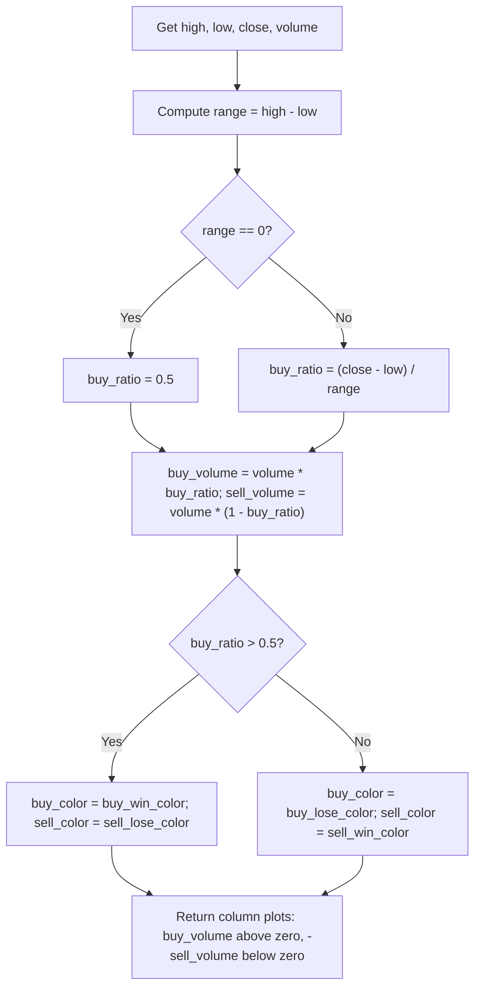

# In-Depth Volume (@encryption) - Technical Guide

> Estimates buy and sell volume per candle using close position in the range, plotted as colored columns above/below zero.

| | |
| --- | --- |
| **Language** | Indie Script v5 |
| **Platform** | [TakeProfit](https://takeprofit.com) |
| **Category** | Volume |
| **Type** | Indicator |
| **Author** | @encryption on TakeProfit |
| **License** | licensed under the MIT License (see the header of the source file) |
| **Live script** | [Open on TakeProfit](https://takeprofit.com/indicator/in-depth-volume-encryption-14) |
| **Source file** | [In-Depth Volume (@encryption).indie5](In-Depth%20Volume%20(@encryption).indie5) |

## Overview

In-Depth Volume splits total volume into estimated buyer and seller pressure based on where the candle closes within its high–low range. The closer the close is to the high, the more volume is attributed to buyers; the closer to the low, the more to sellers. This lets you see at a glance which side dominated the bar and by how much, rather than looking at total volume alone.

The indicator is intended for traders who want to gauge intra-bar momentum and conviction. It works on any timeframe but is most meaningful on candles with a decent price range. Two column series are drawn: buy volume above the zero line and sell volume below it. The dominant side is shown in a strong color (green for buyers, red for sellers), while the losing side appears in a configurable weaker color (default white).

## How it works

1. Retrieve the current bar's high, low, close, and volume.
2. Compute the bar's range: high minus low.
3. Calculate a buy ratio: (close - low) / range, or 0.5 if range is zero (no range).
4. Multiply the bar's total volume by the buy ratio to get buy volume; the remainder is sell volume.
5. Determine whether buyers won: buy ratio > 0.5.
6. Assign colors: if buyers won, buy volume gets the 'buy_win_color' (default green) and sell volume gets the 'sell_lose_color' (default white); if sellers won, buy volume gets the 'buy_lose_color' (default white) and sell volume gets the 'sell_win_color' (default red).
7. Return two column plots: buy volume as positive values, sell volume as negative values (to appear below zero).

## Mathematical model

$$
\text{buy\_ratio} = \begin{cases} \dfrac{\text{close} - \text{low}}{\text{high} - \text{low}} & \text{if } \text{high} \neq \text{low} \\ 0.5 & \text{otherwise} \end{cases}
$$

$$
\text{buy\_volume} = \text{volume} \times \text{buy\_ratio}
$$

$$
\text{sell\_volume} = \text{volume} \times (1 - \text{buy\_ratio})
$$

## Logic flow



## Parameters

| Parameter | Type | Default | Range | Description |
| --- | --- | --- | --- | --- |
| `buy_win_color` | color | color.GREEN |  | Buy Volume (buyers win) |
| `buy_lose_color` | color | color.WHITE |  | Buy Volume (sellers win) |
| `sell_win_color` | color | color.RED |  | Sell Volume (sellers win) |
| `sell_lose_color` | color | color.WHITE |  | Sell Volume (buyers win) |

## Code walkthrough

### Variables and range

Lines 20-26 of [In-Depth Volume (@encryption).indie5](In-Depth%20Volume%20(@encryption).indie5):

```python
    # Variables
    h = self.high[0]
    l = self.low[0]
    c = self.close[0]
    v = self.volume[0]
    rng = h - l

```

The function retrieves the current bar's OHLCV data using self.high[0], self.low[0], self.close[0], self.volume[0]. The range (rng) is computed as high minus low. These values are used only for the current bar, so no repainting occurs.

### Core calculation with zero-range handling

Lines 28-30 of [In-Depth Volume (@encryption).indie5](In-Depth%20Volume%20(@encryption).indie5):

```python
    buy_ratio = (c - l) / rng if rng != 0 else 0.5
    buy_volume = v * buy_ratio
    sell_volume = v * (1 - buy_ratio)
```

The buy_ratio is the fraction of the bar's range at which the close sits. If the bar has no range (high equals low), the ratio is set to 0.5 to split volume evenly. Buy and sell volumes are then derived by multiplying total volume by this ratio and its complement.

### Color selection

Lines 32-35 of [In-Depth Volume (@encryption).indie5](In-Depth%20Volume%20(@encryption).indie5):

```python
    buyer_won = buy_ratio > 0.5

    buy_color = buy_win_color if buyer_won else buy_lose_color
    sell_color = sell_lose_color if buyer_won else sell_win_color
```

The boolean buyer_won indicates whether buy_ratio exceeds 0.5 (i.e., the bar closed in the upper half). The buy column's color is then chosen from the two user‑defined buy colors, and the sell column's color from the two sell colors. The dominant side gets the 'win' color; the losing side gets the 'lose' color.

### Returning column plots

Lines 37-40 of [In-Depth Volume (@encryption).indie5](In-Depth%20Volume%20(@encryption).indie5):

```python
    return (
        plot.Columns(value=buy_volume, color=buy_color),
        plot.Columns(value=-sell_volume, color=sell_color),
    )
```

Two plot.Columns objects are returned: buy_volume as a positive value (displayed above zero) and sell_volume as a negative value (displayed below zero). Each is assigned its respective color. The indicator uses the format.VOLUME format, which is appropriate for a volume histogram.

## Reading the chart

- The **upper columns** represent buy volume (positive values) and the **lower columns** represent sell volume (negative values).
- **Green columns** above zero indicate strong buying pressure (close in upper half of range).
- **Red columns** below zero indicate strong selling pressure (close in lower half of range).
- **White columns** (or the user's chosen 'lose' color) appear for the losing side on each bar.
- Compare column heights: a tall green column above with a short white column below suggests one-sided buying; roughly equal lengths indicate a contested bar.

## Implementation notes

- The split is purely based on price position within the bar; it does not use real order flow or tick data.
- If a bar has zero range (e.g., a doji or flat bar), volume is split 50/50 regardless of close value.
- The indicator does not repaint because it only uses the current bar's data (no lookahead or future bars).
- Sell volume is negated so that it plots as a histogram below the zero line; the @format.VOLUME format ensures correct scaling.

## FAQ

**How is the buy ratio calculated exactly?**

The buy ratio is (close - low) / (high - low). If the high equals the low (no range), the ratio defaults to 0.5, splitting volume evenly.

**Why are sell volumes plotted as negative values?**

Sell volumes are multiplied by -1 in the plot.Columns call. This makes them appear below the zero line, creating a clear visual separation between buy and sell activity.

**Can I change the colors for the 'winning' and 'losing' sides?**

Yes. The indicator exposes four color parameters in its settings: two for buy volume (win/lose) and two for sell volume (win/lose). You can adjust them to match your chart background.

## Full source code

Indie Script v5, as published on TakeProfit. Copy it into the platform's script editor or [open the live script](https://takeprofit.com/indicator/in-depth-volume-encryption-14).

```python
# Copyright (c) 2026 @encryption. All rights reserved.

# This work is licensed under the MIT License.
# For a copy, see <https://opensource.org/licenses/MIT>.

# indie:lang_version = 5
from indie import indicator, format, param, plot, color

#  Meta
@indicator("In-Depth Volume", format=format.VOLUME)
@param.color("buy_win_color", default=color.GREEN, title="Buy Volume (buyers win)")
@param.color("buy_lose_color", default=color.WHITE, title="Buy Volume (sellers win)")
@param.color("sell_win_color", default=color.RED, title="Sell Volume (sellers win)")
@param.color("sell_lose_color", default=color.WHITE, title="Sell Volume (buyers win)")
@plot.columns(title="Buy Volume")
@plot.columns(title="Sell Volume")

# Main
def Main(self, buy_win_color, buy_lose_color, sell_win_color, sell_lose_color):
    # Variables
    h = self.high[0]
    l = self.low[0]
    c = self.close[0]
    v = self.volume[0]
    rng = h - l

    # Main
    buy_ratio = (c - l) / rng if rng != 0 else 0.5
    buy_volume = v * buy_ratio
    sell_volume = v * (1 - buy_ratio)

    buyer_won = buy_ratio > 0.5

    buy_color = buy_win_color if buyer_won else buy_lose_color
    sell_color = sell_lose_color if buyer_won else sell_win_color

    return (
        plot.Columns(value=buy_volume, color=buy_color),
        plot.Columns(value=-sell_volume, color=sell_color),
    )
```
