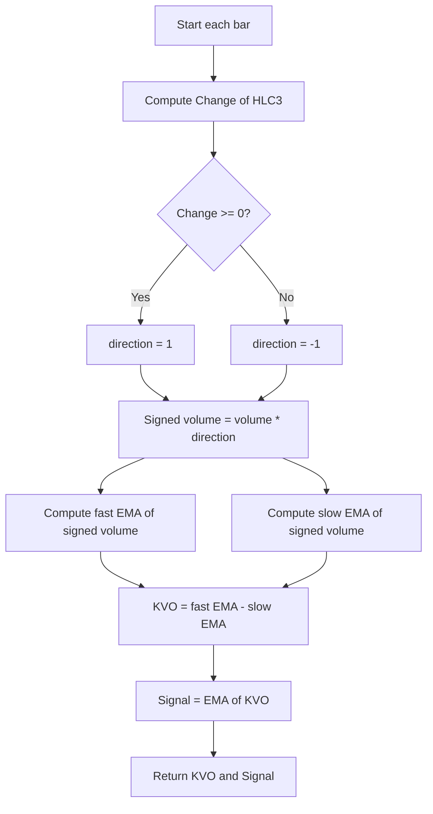

# Klinger Oscillator For Crypto Enhanced by Ze4ever - Technical Guide

> Computes the Klinger Oscillator as the difference between fast and slow EMAs of volume adjusted by price direction, plus a signal line.

| | |
| --- | --- |
| **Language** | Indie Script v5 |
| **Platform** | [TakeProfit](https://takeprofit.com) |
| **Category** | Oscillators |
| **Type** | Indicator |
| **Author** | @jose_rodrigues on TakeProfit |
| **License** | MIT |
| **Live script** | [Open on TakeProfit](https://takeprofit.com/indicator/klinger-oscillator-for-crypto-enhanced-by-ze4ever-98) |
| **Source file** | [Klinger Oscillator For Crypto Enhanced by Ze4ever.indie5](Klinger%20Oscillator%20For%20Crypto%20Enhanced%20by%20Ze4ever.indie5) |

## Overview

The Klinger Oscillator is a volume-based indicator that measures the flow of money into or out of an asset. This enhanced version adjusts volume by the price direction (up or down) based on the change in the average price (HLC3). It then applies fast and slow Exponential Moving Averages (EMAs) to the signed volume and plots the difference as the Klinger Oscillator line, along with a signal line (EMA of the oscillator). This indicator is designed to help identify short-term trend reversals and momentum shifts, particularly in volatile crypto markets.

On the chart, two lines are drawn: the Klinger Oscillator in blue and the Signal Line in green. Traders often look for crossovers between these lines as potential entry or exit signals, though the script itself does not generate alerts or visual markers.

## How it works

1. Compute the direction (1 or -1) based on whether the change in HLC3 (high, low, close average) is non-negative or negative.
2. Multiply the current bar's volume by the direction to create a signed volume series.
3. Calculate a fast EMA of the signed volume using the user-defined fast period (default 34).
4. Calculate a slow EMA of the signed volume using the user-defined slow period (default 55).
5. Compute the Klinger Oscillator value as the difference between the fast EMA and the slow EMA.
6. Calculate the Signal Line as an EMA of the Klinger Oscillator using the user-defined signal period (default 13).
7. Output the current Klinger Oscillator value and the Signal Line value for each bar.

## Mathematical model

The direction signal is calculated as:

$$
direction = \begin{cases} 1 & \text{if } \Delta(\text{hlc3}) \geq 0 \\ -1 & \text{otherwise} \end{cases}
$$

The signed volume is:

$$
V_{signed} = \text{volume} \times direction
$$

The Klinger Oscillator (KVO) is:

$$
\text{KVO} = \text{EMA}_{fast}(V_{signed}) - \text{EMA}_{slow}(V_{signed})
$$

The Signal Line is:

$$
\text{Signal} = \text{EMA}_{signal}(\text{KVO})
$$

## Logic flow



## Parameters

| Parameter | Type | Default | Range | Description |
| --- | --- | --- | --- | --- |
| `fast_ema_period` | int | 34 |  | Fast EMA Period |
| `slow_ema_period` | int | 55 |  | Slow EMA Period |
| `signal_ema_period` | int | 13 |  | Signal EMA Period |

## Code walkthrough

### Direction Signal from HLC3 Change

Lines 15-16 of [Klinger Oscillator For Crypto Enhanced by Ze4ever.indie5](Klinger%20Oscillator%20For%20Crypto%20Enhanced%20by%20Ze4ever.indie5):

```python
    # Direction signal based on change in hlc3 (average of high, low, close)
    direction = 1 if Change.new(self.hlc3)[0] >= 0 else -1
```

This fragment computes a directional bias (+1 for up, -1 for down) based on the change in the typical price (HLC3). The `Change.new` algorithm returns the difference between current and previous value. Using this direction to adjust volume is the core idea behind the Klinger Oscillator, distinguishing buying pressure from selling pressure.

### Signed Volume and EMA Calculation

Lines 19-26 of [Klinger Oscillator For Crypto Enhanced by Ze4ever.indie5](Klinger%20Oscillator%20For%20Crypto%20Enhanced%20by%20Ze4ever.indie5):

```python
    sv = MutSeriesF.new(self.volume[0] * direction)
    
    # Fast and slow EMA for the adjusted volume
    ema_fast = Ema.new(sv, fast_ema_period)
    ema_slow = Ema.new(sv, slow_ema_period)
    
    # Klinger Oscillator is the difference between the EMAs
    kvo = MutSeriesF.new(ema_fast[0] - ema_slow[0])
```

A `MutSeriesF` (mutable series for float) stores the signed volume for each bar so that EMA algorithms can process it. Two EMAs are computed on this series: a fast one (default 34) and a slow one (default 55). The Klinger Oscillator value is the difference between these EMAs, representing the net volume flow relative to recent history.

### Signal Line and Output

Lines 29-31 of [Klinger Oscillator For Crypto Enhanced by Ze4ever.indie5](Klinger%20Oscillator%20For%20Crypto%20Enhanced%20by%20Ze4ever.indie5):

```python
    signal = Ema.new(kvo, signal_ema_period)
    
    return kvo[0], signal[0]
```

A third EMA (default 13) is applied to the KVO series to create a smoothed signal line. The function returns a tuple of the current KVO and signal values, which the `@plot.line` decorators render as blue and green lines respectively. The use of separate EMA periods allows traders to fine-tune responsiveness versus smoothness.

## Reading the chart

* The **blue line** represents the Klinger Oscillator value (fast EMA minus slow EMA of signed volume). Positive values indicate net buying pressure; negative values indicate net selling pressure.
* The **green line** is the Signal Line (EMA of the Klinger Oscillator). A bullish signal occurs when the blue line crosses above the green line; a bearish signal when it crosses below.
* The magnitude of the blue line reflects the strength of volume flow – larger values suggest stronger momentum.
* No additional levels or markers are drawn by this script; traders often add a zero line or histogram manually if desired.

## Implementation notes

- The `Change.new(self.hlc3)[0]` returns `NaN` on the first bar, causing `direction` to default to -1 (since `>= 0` is false for NaN). This means the first bar's volume is always treated as negative, which may affect initial oscillator values.
- All EMA calculations require sufficient bars before producing stable values. The indicator will show `NaN` for the first `max(fast_ema_period, slow_ema_period, signal_ema_period) - 1` bars.
- The script uses `MutSeriesF` to hold the signed volume and KVO values because EMAs need to access previous values from the series.
- This version does not include a zero line, histogram, or divergence detection; it provides only the two lines.

## FAQ

**What do the default periods (34, 55, 13) mean?**

34 and 55 are the fast and slow EMA periods for the signed volume, and 13 is the EMA period for the signal line. These are standard values for the Klinger Oscillator, often adjusted by traders to suit the timeframe or asset volatility.

**How can I add a zero line to the chart?**

This script does not draw a zero line. You can add one manually in TakeProfit by overlaying a horizontal line at value 0, or modify the code to return a third plot with constant 0 for a horizontal line.

**Does this indicator repaint?**

No, the Klinger Oscillator is a classic non-repainting indicator. The `Change` and `Ema` algorithms use only past and current bar data, so values for a given bar are fixed once the bar closes.

## Full source code

Indie Script v5, as published on TakeProfit. Copy it into the platform's script editor or [open the live script](https://takeprofit.com/indicator/klinger-oscillator-for-crypto-enhanced-by-ze4ever-98).

```python
# indie:lang_version = 5
# Script created by Ze4ever

from indie import indicator, format, plot, color, MutSeriesF
from indie.algorithms import Change, Ema
from indie import param

@indicator('Improved Klinger Oscillator', format=format.VOLUME)
@param.int("fast_ema_period", default=34, title="Fast EMA Period")
@param.int("slow_ema_period", default=55, title="Slow EMA Period")
@param.int("signal_ema_period", default=13, title="Signal EMA Period")
@plot.line(color=color.BLUE, title='Klinger Oscillator')
@plot.line(color=color.GREEN, title='Signal Line')
def Main(self, fast_ema_period: int, slow_ema_period: int, signal_ema_period: int):
    # Direction signal based on change in hlc3 (average of high, low, close)
    direction = 1 if Change.new(self.hlc3)[0] >= 0 else -1
    
    # Volume adjusted by direction signal
    sv = MutSeriesF.new(self.volume[0] * direction)
    
    # Fast and slow EMA for the adjusted volume
    ema_fast = Ema.new(sv, fast_ema_period)
    ema_slow = Ema.new(sv, slow_ema_period)
    
    # Klinger Oscillator is the difference between the EMAs
    kvo = MutSeriesF.new(ema_fast[0] - ema_slow[0])
    
    # Signal line is an EMA of the KVO
    signal = Ema.new(kvo, signal_ema_period)
    
    return kvo[0], signal[0]
```
