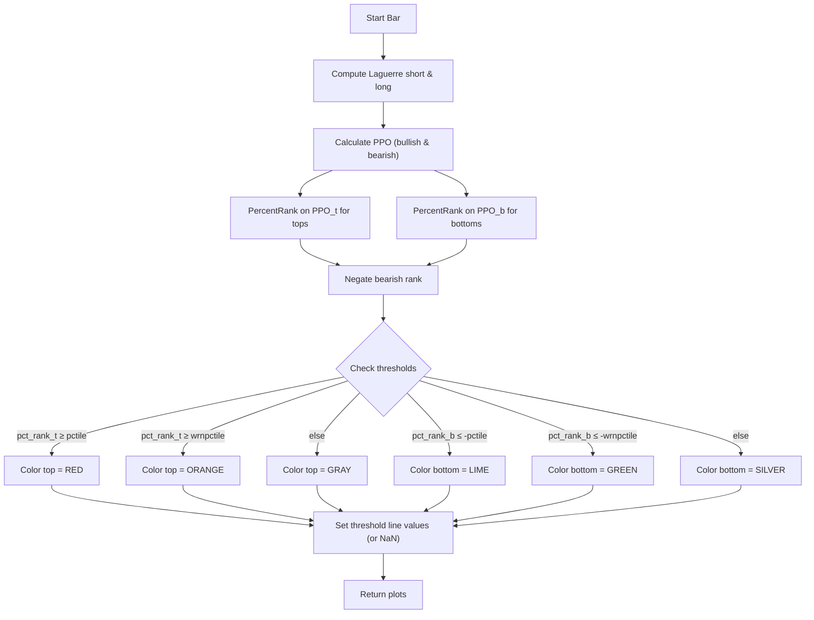

# Laguerre PPO PercentRank - Market Extremes - Technical Guide

> Applies a Laguerre-smoothed PPO normalized with PercentRank to detect statistically extreme momentum conditions.

| | |
| --- | --- |
| **Language** | Indie Script v5 |
| **Platform** | [TakeProfit](https://takeprofit.com) |
| **Category** | Oscillators |
| **Type** | Indicator |
| **Author** | @insurgent on TakeProfit |
| **License** | MIT |
| **Live script** | [Open on TakeProfit](https://takeprofit.com/indicator/laguerre-ppo-percentrank-market-extremes-73) |
| **Source file** | [Laguerre PPO PercentRank - Market Extremes.indie5](Laguerre%20PPO%20PercentRank%20-%20Market%20Extremes.indie5) |

## Overview

This indicator transforms price action into a smoothed momentum oscillator by combining a dual Laguerre filter with a Percentage Price Oscillator (PPO). Instead of relying on fixed overbought/oversold levels, it ranks the current PPO value against its own historical distribution over separate lookback periods for tops and bottoms. The resulting percentile scores highlight when momentum is statistically extreme—potentially signaling trend exhaustion or reversal zones.

The chart displays two histogram columns: one for top (bullish) percentile rank and one for bottom (bearish) percentile rank. Columns are color-coded: red (extreme bullish), orange (warning bullish), gray (neutral); and similarly lime (extreme bearish), green (warning bearish), silver (neutral). Optional horizontal threshold lines mark the extreme and warning percentiles, and a zero line is drawn for reference.

## How it works

1. Computes two Laguerre filters on the hl2 price series with different gamma parameters (short and long).
2. Calculates a Percentage Price Oscillator (PPO) from the difference between the short and long Laguerre outputs.
3. Calculates two PPO series: one for tops (short minus long) and one for bottoms (long minus short).
4. Applies PercentRank to the bullish PPO series over the user-defined lookback for tops, and separately to the bearish PPO series over the lookback for bottoms.
5. Negates the bearish percentile rank so that extreme values map to −100.
6. Colors each histogram column based on whether its percentile exceeds the extreme or warning threshold.
7. Draws threshold lines at the specified percentile levels (toggled on/off by settings).
8. Returns 6 values: two column plots and four threshold line values (NaN hides the line).

## Mathematical model

$$
\text{Laguerre Filter:}\quad L0_t = (1-\gamma) \cdot \text{src}_t + \gamma \cdot L0_{t-1}
$$

$$
L1_t = -\gamma \cdot L0_t + L0_{t-1} + \gamma \cdot L1_{t-1}
$$

$$
L2_t = -\gamma \cdot L1_t + L1_{t-1} + \gamma \cdot L2_{t-1}
$$

$$
L3_t = -\gamma \cdot L2_t + L2_{t-1} + \gamma \cdot L3_{t-1}
$$

$$
\text{Filter Output} = \frac{L0_t + 2L1_t + 2L2_t + L3_t}{6}
$$

$$
\text{PPO}_t = \frac{\text{short} - \text{long}}{\text{long}} \times 100
$$

$$
\text{PercentRank}(x_t,\;L) = \frac{\text{count of past } L \text{ values } < x_t}{L} \times 100
$$

## Logic flow



## Parameters

| Parameter | Type | Default | Range | Description |
| --- | --- | --- | --- | --- |
| `pctile` | int | 90 | 1 - 100 | Percentile Threshold Extreme Value |
| `wrnpctile` | int | 70 | 1 - 100 | Percentile Threshold Warning Value |
| `short_gamma` | float | 0.4 |  | PPO Short Setting |
| `long_gamma` | float | 0.8 |  | PPO Long Setting |
| `lkb_t` | int | 200 | ≥ 1 | Look Back Period For Tops |
| `lkb_b` | int | 200 | ≥ 1 | Look Back Period For Bottoms |
| `sl` | bool | true |  | Show Threshold Line? |
| `swl` | bool | true |  | Show Warning Threshold Line? |

## Code walkthrough

### Laguerre Filter Definition

Lines 13-25 of [Laguerre PPO PercentRank - Market Extremes.indie5](Laguerre%20PPO%20PercentRank%20-%20Market%20Extremes.indie5):

```python
def LaguerreFilter(self, gamma: float, src: SeriesF) -> SeriesF:
    L0 = MutSeriesF.new()
    L1 = MutSeriesF.new()
    L2 = MutSeriesF.new()
    L3 = MutSeriesF.new()

    L0[0] = (1 - gamma) * src[0] + gamma * nz(L0[1])
    L1[0] = -gamma * L0[0] + nz(L0[1]) + gamma * nz(L1[1])
    L2[0] = -gamma * L1[0] + nz(L1[1]) + gamma * nz(L2[1])
    L3[0] = -gamma * L2[0] + nz(L2[1]) + gamma * nz(L3[1])

    f = (L0[0] + 2 * L1[0] + 2 * L2[0] + L3[0]) / 6
    return MutSeriesF.new(f)
```

This algorithm implements a fourth-order Laguerre filter with a gamma smoothing parameter. The filter uses four state variables (L0–L3) updated recursively. The output is a weighted average of these states, providing low-lag smoothing that preserves responsiveness while reducing noise.

### PPO Calculation with Division Safety

Lines 52-53 of [Laguerre PPO PercentRank - Market Extremes.indie5](Laguerre%20PPO%20PercentRank%20-%20Market%20Extremes.indie5):

```python
    ppo_t_val = divide(lmas[0] - lmal[0], lmal[0]) * 100
    ppo_b_val = divide(lmal[0] - lmas[0], lmal[0]) * 100
```

The PPO is computed as the percentage difference between the short and long Laguerre filters. Two series are maintained: one for the bullish side (short minus long) and one for the bearish side (long minus short). The `divide` function from `indie.math` returns 0 on division by zero instead of raising an error.

### PercentRank Normalization

Lines 59-60 of [Laguerre PPO PercentRank - Market Extremes.indie5](Laguerre%20PPO%20PercentRank%20-%20Market%20Extremes.indie5):

```python
    pct_rank_t = PercentRank.new(ppo_t, length=lkb_t)[0]
    pct_rank_b = -PercentRank.new(ppo_b, length=lkb_b)[0]
```

Each PPO series is fed into the built-in `PercentRank` algorithm with user-specified lookback periods. The bearish rank is negated so that extreme bearishness maps to negative values. This converts raw PPO values into a percentile scale roughly bounded between –100 and +100.

### Color Coding Based on Thresholds

Lines 63-66 of [Laguerre PPO PercentRank - Market Extremes.indie5](Laguerre%20PPO%20PercentRank%20-%20Market%20Extremes.indie5):

```python
    col_t = color.RED if pct_rank_t >= pctile else color.rgba(255, 120, 0, 1.0) if pct_rank_t >= wrnpctile else color.GRAY

    # Colors for bottom columns
    col_b = color.LIME if pct_rank_b <= pctile_b else color.GREEN if pct_rank_b <= wrnpctile_b else color.SILVER
```

The histogram column colors are determined by comparing the percentile rank to the extreme and warning thresholds. For the top, if rank ≥ extreme threshold → red, else if ≥ warning → orange, else gray. For the bottom, if rank ≤ –extreme → lime, else if ≤ –warning → green, else silver.

### Threshold Line Visibility Control

Lines 69-72 of [Laguerre PPO PercentRank - Market Extremes.indie5](Laguerre%20PPO%20PercentRank%20-%20Market%20Extremes.indie5):

```python
    extreme_top = float(pctile) if sl else nan
    warn_top = float(wrnpctile) if swl else nan
    extreme_bot = float(pctile_b) if sl else nan
    warn_bot = float(wrnpctile_b) if swl else nan
```

When the user toggles off the threshold lines (`sl` or `swl` parameters), the corresponding line value is set to `nan`, which causes the plot engine to skip drawing that line. When enabled, the value is the threshold percent, drawing a horizontal line at that level.

## Reading the chart

- **Top histogram (above zero):** bullish momentum percentile. Red = extreme (≥ extreme threshold), orange = warning (≥ warning threshold), gray = neutral.
- **Bottom histogram (below zero):** bearish momentum percentile (negated). Lime = extreme (≤ –extreme threshold), green = warning (≤ –warning threshold), silver = neutral.
- **Horizontal lines:** red line at extreme top level, orange line at warning top level, lime line at extreme bottom level (negative), green line at warning bottom level (negative). Lines can be toggled off via settings.
- **Zero line:** drawn as a gray horizontal line for reference.
- **Column height:** indicates how statistically extreme the current PPO value is relative to its own history – taller columns mean more extreme readings.

## Implementation notes

- The `nz` helper replaces `NaN` with 0 for the Laguerre filter recursion, ensuring stability on the first bar.
- The `divide` function avoids division-by-zero errors in the PPO calculation; if `lmal[0]` is 0, the result is 0.
- Threshold lines are hidden by returning `nan` when the toggle parameter is `False`. This is a pattern for conditional plot visibility in Indie Script.
- PercentRank uses separate lookback lengths for tops and bottoms (`lkb_t` and `lkb_b`), allowing asymmetric regime modeling.

## FAQ

**How do I adjust the sensitivity of the Laguerre filter?**

Change the `short_gamma` and `long_gamma` parameters. Gamma values between 0.2 and 0.8 are typical; lower gamma makes the filter react faster but may introduce noise, while higher gamma smooths more aggressively.

**What do the lookback periods for tops and bottoms control?**

`lkb_t` defines how many historical bars are used to compute the percentile rank for bullish PPO values; `lkb_b` does the same for bearish values. Longer lookbacks make the indicator consider a larger history, making extreme readings rarer.

**Can I use this indicator on intraday charts?**

Yes, the indicator works on any timeframe. Because it uses percentile ranks, it adapts to the volatility of the current chart. You may want to adjust the lookback periods and gamma values to match the bar duration.

## Attribution

Inspired by the idea of Chris Moody's Laguerre PPO PercentRank. Not affiliated with or endorsed by the original author.

## Full source code

Indie Script v5, as published on TakeProfit. Copy it into the platform's script editor or [open the live script](https://takeprofit.com/indicator/laguerre-ppo-percentrank-market-extremes-73).

```python
# indie:lang_version = 5
from math import nan, isnan
from indie import indicator, algorithm, SeriesF, MutSeriesF, param, plot, color, level
from indie.algorithms import PercentRank
from indie.math import divide


def nz(val: float) -> float:
    return 0.0 if isnan(val) else val


@algorithm
def LaguerreFilter(self, gamma: float, src: SeriesF) -> SeriesF:
    L0 = MutSeriesF.new()
    L1 = MutSeriesF.new()
    L2 = MutSeriesF.new()
    L3 = MutSeriesF.new()

    L0[0] = (1 - gamma) * src[0] + gamma * nz(L0[1])
    L1[0] = -gamma * L0[0] + nz(L0[1]) + gamma * nz(L1[1])
    L2[0] = -gamma * L1[0] + nz(L1[1]) + gamma * nz(L2[1])
    L3[0] = -gamma * L2[0] + nz(L2[1]) + gamma * nz(L3[1])

    f = (L0[0] + 2 * L1[0] + 2 * L2[0] + L3[0]) / 6
    return MutSeriesF.new(f)


@indicator('Laguerre PPO PercentRank – Market Extremes', overlay_main_pane=False)
@param.int('pctile', default=90, min=1, max=100, title='Percentile Threshold Extreme Value')
@param.int('wrnpctile', default=70, min=1, max=100, title='Percentile Threshold Warning Value')
@param.float('short_gamma', default=0.4, title='PPO Short Setting')
@param.float('long_gamma', default=0.8, title='PPO Long Setting')
@param.int('lkb_t', default=200, min=1, title='Look Back Period For Tops')
@param.int('lkb_b', default=200, min=1, title='Look Back Period For Bottoms')
@param.bool('sl', default=True, title='Show Threshold Line?')
@param.bool('swl', default=True, title='Show Warning Threshold Line?')
@level(value=0, title='Zero', line_color=color.GRAY, line_width=2)
@plot.columns(title='Top Percentile Rank')
@plot.columns(title='Bottom Percentile Rank')
@plot.line(title='Extreme Top Threshold', color=color.RED, line_width=4)
@plot.line(title='Warning Top Threshold', color=color.rgba(255, 120, 0, 1.0), line_width=4)
@plot.line(title='Extreme Bottom Threshold', color=color.LIME, line_width=4)
@plot.line(title='Warning Bottom Threshold', color=color.GREEN, line_width=4)
def Main(self, pctile, wrnpctile, short_gamma, long_gamma, lkb_t, lkb_b, sl, swl):
    lmas = LaguerreFilter.new(short_gamma, self.hl2)
    lmal = LaguerreFilter.new(long_gamma, self.hl2)

    pctile_b = -pctile
    wrnpctile_b = -wrnpctile

    # PPO calculations (divide returns 0 on div-by-zero instead of error)
    ppo_t_val = divide(lmas[0] - lmal[0], lmal[0]) * 100
    ppo_b_val = divide(lmal[0] - lmas[0], lmal[0]) * 100

    ppo_t = MutSeriesF.new(ppo_t_val)
    ppo_b = MutSeriesF.new(ppo_b_val)

    # PercentRank
    pct_rank_t = PercentRank.new(ppo_t, length=lkb_t)[0]
    pct_rank_b = -PercentRank.new(ppo_b, length=lkb_b)[0]

    # Colors for top columns
    col_t = color.RED if pct_rank_t >= pctile else color.rgba(255, 120, 0, 1.0) if pct_rank_t >= wrnpctile else color.GRAY

    # Colors for bottom columns
    col_b = color.LIME if pct_rank_b <= pctile_b else color.GREEN if pct_rank_b <= wrnpctile_b else color.SILVER

    # Threshold lines (nan hides the line when toggled off)
    extreme_top = float(pctile) if sl else nan
    warn_top = float(wrnpctile) if swl else nan
    extreme_bot = float(pctile_b) if sl else nan
    warn_bot = float(wrnpctile_b) if swl else nan

    return (
        plot.Columns(value=pct_rank_t, color=col_t),
        plot.Columns(value=pct_rank_b, color=col_b),
        extreme_top,
        warn_top,
        extreme_bot,
        warn_bot,
    )
```
