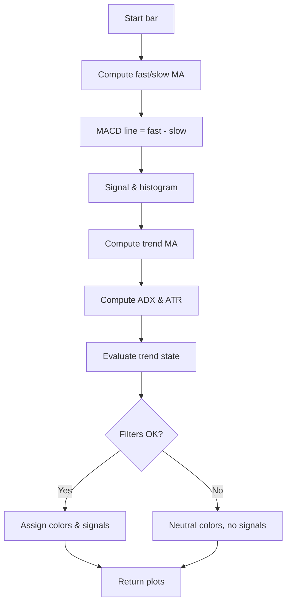

# MACD + SMA 200 Enhanced (ChartArt Inspired) - Technical Guide

> Combines MACD, trend MA (SMA/EMA/WMA/HMA), and optional ADX/ATR/MTF filters to generate trend signals and bar colors.

| | |
| --- | --- |
| **Language** | Indie Script v5 |
| **Platform** | [TakeProfit](https://takeprofit.com) |
| **Category** | Trend |
| **Type** | Indicator |
| **Author** | @chartjunkie on TakeProfit |
| **License** | MIT |
| **Live script** | [Open on TakeProfit](https://takeprofit.com/indicator/macd-sma-200-enhanced-chartart-inspired-62) |
| **Source file** | [MACD + SMA 200 Enhanced (ChartArt Inspired).indie5](MACD%20+%20SMA%20200%20Enhanced%20(ChartArt%20Inspired).indie5) |

## Overview

This indicator merges a classic MACD with a configurable trend moving average (SMA, EMA, WMA, or Hull MA) and optional filters (ADX, ATR, multi-timeframe) to assess trend strength and direction. It is designed for traders who want a single-pane overlay that shows both momentum (MACD) and trend structure (MA) with visual cues.

The chart displays two MACD-derived moving averages (fast and slow), a thick trend MA, a colored ribbon between fast and trend MA, a background tint indicating the trend regime, bar colors, and circular markers below/above bars for bullish/bearish signals. All visual elements are driven by the combination of MACD position, trend slope, price relative to MA, and the optional filters.

## How it works

1. Compute fast and slow moving averages from the source using the chosen MACD MA type (SMA or EMA).
2. Derive the MACD line as fast MA minus slow MA, then compute a signal line and histogram from that difference.
3. Compute the trend MA (SMA, EMA, WMA, or Hull MA) on the source with a user-defined length.
4. Optionally compute ADX (with plus/minus DI) and ATR (with its own SMA) for filter conditions.
5. Evaluate trend state: whether the trend MA is rising/falling, price is above/below it, and MACD is positive/negative.
6. Apply filter gates: ADX above threshold, ATR above its SMA, and MTF price relative to HTF SMA 200 (if enabled).
7. Assign colors to the fast/slow lines, trend MA, bar color, background, and ribbon based on the combined conditions.
8. Generate bullish and bearish markers when the histogram crosses zero and all relevant conditions (including filters) are met.

## Logic flow



## Parameters

| Parameter | Type | Default | Range | Description |
| --- | --- | --- | --- | --- |
| `src` | source | source.CLOSE |  | Source |
| `fast_length` | int | 12 | ≥ 1 | MACD Fast Length |
| `slow_length` | int | 26 | ≥ 1 | MACD Slow Length |
| `signal_length` | int | 9 | ≥ 1 | MACD Signal Length |
| `macd_ma_type` | str | SMA |  | MACD MA Type |
| `trend_length` | int | 200 | ≥ 2 | Trend MA Length |
| `trend_type` | str | SMA |  | Trend MA Type |
| `show_bar_color` | bool | true |  | Enable Bar Color? |
| `show_mas` | bool | true |  | Enable Moving Averages? |
| `show_background` | bool | true |  | Enable Trend Background? |
| `use_adx` | bool | false |  | Enable ADX Filter? |
| `adx_length` | int | 14 | ≥ 1 | ADX Length |
| `adx_threshold` | float | 25.0 | ≥ 1.0 | ADX Threshold |
| `use_atr` | bool | false |  | Enable ATR Volatility Filter? |
| `atr_length` | int | 14 | ≥ 1 | ATR Length |
| `use_mtf` | bool | false |  | Enable MTF Filter? |
| `htf_tf` | time_frame | 1D |  | HTF Timeframe |

## Code walkthrough

### Hull Moving Average Algorithm

Lines 13-19 of [MACD + SMA 200 Enhanced (ChartArt Inspired).indie5](MACD%20+%20SMA%20200%20Enhanced%20(ChartArt%20Inspired).indie5):

```python
def HullMa(self, src: SeriesF, length: int) -> SeriesF:
    half_len = length // 2
    sq_len = floor(sqrt(length))
    wma_half = Wma.new(src, half_len)
    wma_full = Wma.new(src, length)
    delta = MutSeriesF.new(2.0 * wma_half[0] - wma_full[0])
    return Wma.new(delta, sq_len)
```

This custom algorithm computes a Hull Moving Average by first taking a WMA of half the length and a WMA of the full length, then forming a delta series (2×WMA_half − WMA_full), and finally applying a WMA of that delta with length equal to the square root of the original length. It is used when the user selects 'HMA' as the trend MA type.

### HTF Secondary Context for MTF Filter

Lines 34-37 of [MACD + SMA 200 Enhanced (ChartArt Inspired).indie5](MACD%20+%20SMA%20200%20Enhanced%20(ChartArt%20Inspired).indie5):

```python
@sec_context
def HtfCtx(self):
    htf_sma = Sma.new(self.close, 200)
    return self.close[0], htf_sma[0]
```

The `HtfCtx` function runs on a higher timeframe (e.g., daily) and computes a simple SMA 200 of that timeframe's close. It returns both the close and the SMA so the main calculation can compare them. This is used only when the MTF filter is enabled.

### Manual MACD Calculation

Lines 91-94 of [MACD + SMA 200 Enhanced (ChartArt Inspired).indie5](MACD%20+%20SMA%20200%20Enhanced%20(ChartArt%20Inspired).indie5):

```python
        # ── MACD (manual — reuses fast/slow MA, нет двойного подсчёта) ───────
        macd_series = MutSeriesF.new(fast_ma[0] - slow_ma[0])
        signal_series = Ma.new(macd_series, signal_length, macd_ma_type)
        hist_series = MutSeriesF.new(macd_series[0] - signal_series[0])
```

Instead of using a built-in MACD function, the code reuses the already computed fast and slow MAs to form the MACD line (`fast_ma - slow_ma`). Then it applies the same MA type to that line to get the signal, and subtracts to get the histogram. This avoids redundant computation.

### Trend State and Filter Gates

Lines 112-124 of [MACD + SMA 200 Enhanced (ChartArt Inspired).indie5](MACD%20+%20SMA%20200%20Enhanced%20(ChartArt%20Inspired).indie5):

```python
        # ── Trend state ──────────────────────────────────────────────────────
        trend_rising = trend_ma[0] > trend_ma[1]
        trend_falling = trend_ma[0] < trend_ma[1]
        price_above = self.close[0] > trend_ma[0]
        price_below = self.close[0] < trend_ma[0]
        macd_pos = macd_series[0] > 0.0
        macd_neg = macd_series[0] < 0.0

        # ── Filter gates ─────────────────────────────────────────────────────
        adx_ok = (not use_adx) or (adx_series[0] > adx_threshold)
        atr_ok = (not use_atr) or (atr_series[0] > atr_ma_series[0])
        mtf_bull_ok = (not use_mtf) or (self._htf_close[0] > self._htf_sma[0])
        mtf_bear_ok = (not use_mtf) or (self._htf_close[0] < self._htf_sma[0])
```

Boolean flags are set for trend direction, price position relative to trend MA, and MACD polarity. Then three optional filters are evaluated: ADX strength, ATR volatility (ATR above its own SMA), and MTF condition (close above/below HTF SMA 200). Each filter is only applied if its corresponding parameter is enabled.

### 5-Level Trend Regime Background

Lines 150-168 of [MACD + SMA 200 Enhanced (ChartArt Inspired).indie5](MACD%20+%20SMA%20200%20Enhanced%20(ChartArt%20Inspired).indie5):

```python
        # ── 5-level trend regime (background + ribbon color) ──────────────────
        if price_above and trend_rising and macd_pos and adx_ok:
            bg_color = color.GREEN(0.15)      # Strong Uptrend
            ribbon_color = color.GREEN(0.25)
        elif price_above and trend_rising:
            bg_color = color.GREEN(0.07)      # Weak Uptrend
            ribbon_color = color.GREEN(0.15)
        elif price_below and trend_falling and macd_neg and adx_ok:
            bg_color = color.RED(0.15)        # Strong Downtrend
            ribbon_color = color.RED(0.25)
        elif price_below and trend_falling:
            bg_color = color.RED(0.07)        # Weak Downtrend
            ribbon_color = color.RED(0.15)
        else:
            bg_color = color.TRANSPARENT      # Neutral
            ribbon_color = color.GRAY(0.2)

        if not show_background:
            bg_color = color.TRANSPARENT
```

The background and ribbon colors are chosen from five regimes: strong uptrend (price above, trend rising, MACD positive, ADX OK), weak uptrend, strong downtrend, weak downtrend, and neutral. The `show_background` parameter can disable the background entirely.

### Entry Signal Conditions

Lines 170-193 of [MACD + SMA 200 Enhanced (ChartArt Inspired).indie5](MACD%20+%20SMA%20200%20Enhanced%20(ChartArt%20Inspired).indie5):

```python
        # ── Entry signals ────────────────────────────────────────────────────
        bull_signal = (
            cross_over(hist_series, 0.0)
            and macd_pos
            and fast_ma[0] > slow_ma[0]
            and price_above
            and adx_ok
            and atr_ok
            and mtf_bull_ok
        )
        bear_signal = (
            cross_under(hist_series, 0.0)
            and macd_neg
            and fast_ma[0] < slow_ma[0]
            and price_below
            and adx_ok
            and atr_ok
            and mtf_bear_ok
        )

        if bull_signal:
            bull_marker_color = color.GREEN
        if bear_signal:
            bear_marker_color = color.RED
```

Bullish signals require the histogram to cross above zero, MACD positive, fast MA above slow MA, price above trend MA, and all enabled filters to pass. Bearish signals are the mirror. When a signal fires, a green or red circle marker is placed below or above the bar.

## Reading the chart

- **Fast and Slow MA lines**: Colored green when in a strong uptrend (fast > slow, trend rising, price above slow), red in a strong downtrend, blue otherwise.
- **Trend MA line**: Thick line colored green when rising, red when falling.
- **Ribbon (fill between fast and trend MA)**: Tinted green/red according to trend regime strength, or gray in neutral.
- **Background**: Semi-transparent green/red overlay indicating the trend regime (strong/weak uptrend/downtrend), disabled if `show_background` is off.
- **Bar colors**: Green when price is above all three MAs and slow MA is rising; red when below all three and slow MA falling; blue otherwise.
- **Markers**: Green circle below the bar for a bullish signal; red circle above for a bearish signal. Signals only appear when all enabled filters are satisfied.

## Implementation notes

- The MACD is computed manually from the fast and slow MAs, so changing the MACD MA type affects both the lines and the signal/histogram.
- When `show_mas` is false, the MA plot values are set to `nan`, effectively hiding them from the chart.
- The MTF filter uses a separate secondary context (`HtfCtx`) that runs on the chosen higher timeframe; its values are accessed via `self._htf_close[0]` and `self._htf_sma[0]`.
- The ADX filter only checks the main ADX line against the threshold; the plus/minus DI are computed but not used elsewhere.

## FAQ

**How do I change the MACD MA type from SMA to EMA?**

Set the parameter 'MACD MA Type' to 'EMA' in the indicator settings. This will affect both the fast/slow MAs and the signal line.

**What does the MTF filter do?**

When enabled, it compares the current bar's close on a higher timeframe (default daily) to a 200-period SMA on that timeframe. Bullish signals require the HTF close to be above the HTF SMA; bearish signals require it below.

**Can I use this indicator for intraday trading?**

Yes, all parameters are adjustable. The trend MA length and MACD lengths can be shortened for lower timeframes. The MTF filter can be set to a higher intraday timeframe (e.g., 1H) if desired.

## Attribution

Inspired by the idea of ChartArt's MACD approach. Not affiliated with or endorsed by the original author.

## Full source code

Indie Script v5, as published on TakeProfit. Copy it into the platform's script editor or [open the live script](https://takeprofit.com/indicator/macd-sma-200-enhanced-chartart-inspired-62).

```python
# indie:lang_version = 5
from math import nan, floor, sqrt
from indie import (
    indicator, param, plot, color, source,
    MutSeriesF, SeriesF, Color, Optional, MainContext, sec_context, algorithm
)
from indie.algorithms import Ma, Sma, Adx, Atr, Wma
from indie.math import cross_over, cross_under


# ─── Hull Moving Average ──────────────────────────────────────────────────────
@algorithm
def HullMa(self, src: SeriesF, length: int) -> SeriesF:
    half_len = length // 2
    sq_len = floor(sqrt(length))
    wma_half = Wma.new(src, half_len)
    wma_full = Wma.new(src, length)
    delta = MutSeriesF.new(2.0 * wma_half[0] - wma_full[0])
    return Wma.new(delta, sq_len)


# ─── Generic Trend MA (SMA / EMA / WMA / HMA) ────────────────────────────────
@algorithm
def TrendMa(self, src: SeriesF, length: int, ma_type: str) -> SeriesF:
    result: Optional[SeriesF]
    if ma_type == 'HMA':
        result = HullMa.new(src, length)
    else:
        result = Ma.new(src, length, ma_type)
    return result.value()


# ─── HTF Secondary Context (SMA 200 на старшем ТФ) ───────────────────────────
@sec_context
def HtfCtx(self):
    htf_sma = Sma.new(self.close, 200)
    return self.close[0], htf_sma[0]


# ─── Main ─────────────────────────────────────────────────────────────────────
@indicator('MACD + SMA 200 Enhanced', overlay_main_pane=True)
@param.source('src', default=source.CLOSE, title='Source')
# MACD
@param.int('fast_length', default=12, min=1, title='MACD Fast Length')
@param.int('slow_length', default=26, min=1, title='MACD Slow Length')
@param.int('signal_length', default=9, min=1, title='MACD Signal Length')
@param.str('macd_ma_type', default='SMA', title='MACD MA Type', options=['SMA', 'EMA'])
# Trend MA
@param.int('trend_length', default=200, min=2, title='Trend MA Length')
@param.str('trend_type', default='SMA', title='Trend MA Type', options=['SMA', 'EMA', 'WMA', 'HMA'])
# Visualization
@param.bool('show_bar_color', default=True, title='Enable Bar Color?')
@param.bool('show_mas', default=True, title='Enable Moving Averages?')
@param.bool('show_background', default=True, title='Enable Trend Background?')
# ADX Filter
@param.bool('use_adx', default=False, title='Enable ADX Filter?')
@param.int('adx_length', default=14, min=1, title='ADX Length')
@param.float('adx_threshold', default=25.0, min=1.0, title='ADX Threshold')
# ATR Filter
@param.bool('use_atr', default=False, title='Enable ATR Volatility Filter?')
@param.int('atr_length', default=14, min=1, title='ATR Length')
# MTF Filter
@param.bool('use_mtf', default=False, title='Enable MTF Filter?')
@param.time_frame('htf_tf', default='1D', title='HTF Timeframe')
# Plots
@plot.line('fast_ma', title='Fast MA')
@plot.line('slow_ma', title='Slow MA', line_width=2)
@plot.line('trend_ma', title='Trend MA', line_width=4)
@plot.fill('fast_ma', 'trend_ma', title='Trend Ribbon')
@plot.background(title='Trend Regime')
@plot.bar_color(title='Bar Color')
@plot.marker(style=plot.marker_style.CIRCLE, position=plot.marker_position.BELOW, size=7, title='Bull Signal',
    display_options=plot.MarkerDisplayOptions(pane=True, status_line=False, price_label=False))
@plot.marker(style=plot.marker_style.CIRCLE, position=plot.marker_position.ABOVE, size=7, title='Bear Signal',
    display_options=plot.MarkerDisplayOptions(pane=True, status_line=False, price_label=False))
class Main(MainContext):
    def __init__(self, htf_tf):
        self._htf_close, self._htf_sma = self.calc_on(HtfCtx, time_frame=htf_tf)

    def calc(self, src, fast_length, slow_length, signal_length, macd_ma_type,
             trend_length, trend_type,
             show_bar_color, show_mas, show_background,
             use_adx, adx_length, adx_threshold,
             use_atr, atr_length, use_mtf):

        # ── Moving averages ──────────────────────────────────────────────────
        fast_ma = Ma.new(src, fast_length, macd_ma_type)
        slow_ma = Ma.new(src, slow_length, macd_ma_type)
        trend_ma = TrendMa.new(src, trend_length, trend_type)

        # ── MACD (manual — reuses fast/slow MA, нет двойного подсчёта) ───────
        macd_series = MutSeriesF.new(fast_ma[0] - slow_ma[0])
        signal_series = Ma.new(macd_series, signal_length, macd_ma_type)
        hist_series = MutSeriesF.new(macd_series[0] - signal_series[0])

        # ── ADX ─────────────────────────────────────────────────────────────
        adx_minus_di, adx_series, adx_plus_di = Adx.new(adx_length, adx_length)

        # ── ATR ─────────────────────────────────────────────────────────────
        atr_series = Atr.new(atr_length)
        atr_ma_series = Sma.new(atr_series, atr_length)

        # ── Pre-declare Color vars (Indie block-scoping rule) ─────────────────
        line_color: Color = color.BLUE
        trend_ma_color: Color = color.GRAY
        bar_trend_color: Color = color.BLUE
        bg_color: Color = color.TRANSPARENT
        ribbon_color: Color = color.GRAY(0.2)
        bull_marker_color: Color = color.TRANSPARENT
        bear_marker_color: Color = color.TRANSPARENT

        # ── Trend state ──────────────────────────────────────────────────────
        trend_rising = trend_ma[0] > trend_ma[1]
        trend_falling = trend_ma[0] < trend_ma[1]
        price_above = self.close[0] > trend_ma[0]
        price_below = self.close[0] < trend_ma[0]
        macd_pos = macd_series[0] > 0.0
        macd_neg = macd_series[0] < 0.0

        # ── Filter gates ─────────────────────────────────────────────────────
        adx_ok = (not use_adx) or (adx_series[0] > adx_threshold)
        atr_ok = (not use_atr) or (atr_series[0] > atr_ma_series[0])
        mtf_bull_ok = (not use_mtf) or (self._htf_close[0] > self._htf_sma[0])
        mtf_bear_ok = (not use_mtf) or (self._htf_close[0] < self._htf_sma[0])

        # ── Trend MA color ───────────────────────────────────────────────────
        if trend_rising:
            trend_ma_color = color.GREEN
        else:
            trend_ma_color = color.RED

        # ── Fast/slow line color ─────────────────────────────────────────────
        if fast_ma[0] > slow_ma[0] and trend_rising and self.close[0] > slow_ma[0]:
            line_color = color.GREEN
        elif fast_ma[0] < slow_ma[0] and trend_falling and self.close[0] < slow_ma[0]:
            line_color = color.RED
        else:
            line_color = color.BLUE

        # ── Bar color ────────────────────────────────────────────────────────
        if (self.close[0] > fast_ma[0] and self.close[0] > slow_ma[0]
                and self.close[0] > trend_ma[0] and slow_ma[0] > slow_ma[1]):
            bar_trend_color = color.GREEN
        elif (self.close[0] < fast_ma[0] and self.close[0] < slow_ma[0]
                and self.close[0] < trend_ma[0] and slow_ma[0] < slow_ma[1]):
            bar_trend_color = color.RED
        else:
            bar_trend_color = color.BLUE

        # ── 5-level trend regime (background + ribbon color) ──────────────────
        if price_above and trend_rising and macd_pos and adx_ok:
            bg_color = color.GREEN(0.15)      # Strong Uptrend
            ribbon_color = color.GREEN(0.25)
        elif price_above and trend_rising:
            bg_color = color.GREEN(0.07)      # Weak Uptrend
            ribbon_color = color.GREEN(0.15)
        elif price_below and trend_falling and macd_neg and adx_ok:
            bg_color = color.RED(0.15)        # Strong Downtrend
            ribbon_color = color.RED(0.25)
        elif price_below and trend_falling:
            bg_color = color.RED(0.07)        # Weak Downtrend
            ribbon_color = color.RED(0.15)
        else:
            bg_color = color.TRANSPARENT      # Neutral
            ribbon_color = color.GRAY(0.2)

        if not show_background:
            bg_color = color.TRANSPARENT

        # ── Entry signals ────────────────────────────────────────────────────
        bull_signal = (
            cross_over(hist_series, 0.0)
            and macd_pos
            and fast_ma[0] > slow_ma[0]
            and price_above
            and adx_ok
            and atr_ok
            and mtf_bull_ok
        )
        bear_signal = (
            cross_under(hist_series, 0.0)
            and macd_neg
            and fast_ma[0] < slow_ma[0]
            and price_below
            and adx_ok
            and atr_ok
            and mtf_bear_ok
        )

        if bull_signal:
            bull_marker_color = color.GREEN
        if bear_signal:
            bear_marker_color = color.RED

        # ── MA visibility toggle ─────────────────────────────────────────────
        fast_ma_val = fast_ma[0] if show_mas else nan
        slow_ma_val = slow_ma[0] if show_mas else nan
        trend_ma_val = trend_ma[0] if show_mas else nan

        return (
            plot.Line(fast_ma_val, color=line_color),
            plot.Line(slow_ma_val, color=line_color),
            plot.Line(trend_ma_val, color=trend_ma_color),
            plot.Fill(color=ribbon_color),
            plot.Background(color=bg_color),
            plot.BarColor(bar_trend_color if show_bar_color else None),
            plot.Marker(value=self.low[0], color=bull_marker_color),
            plot.Marker(value=self.high[0], color=bear_marker_color),
        )
```
