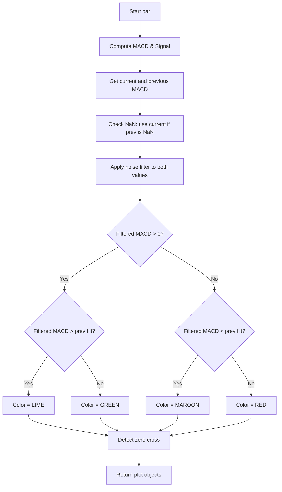

# MACD 4C Pro - Technical Guide

> Computes MACD histogram with 4-color logic based on filtered MACD and optional signal line and zero cross markers.

| | |
| --- | --- |
| **Language** | Indie Script v5 |
| **Platform** | [TakeProfit](https://takeprofit.com) |
| **Category** | Oscillators |
| **Type** | Indicator |
| **Author** | @pavel_medvedev on TakeProfit |
| **License** | MIT |
| **Live script** | [Open on TakeProfit](https://takeprofit.com/indicator/macd-4c-pro-55) |
| **Source file** | [MACD 4C Pro.indie5](MACD%204C%20Pro.indie5) |

## Overview

The MACD 4C Pro indicator is a customized version of the classic MACD (Moving Average Convergence Divergence) that adds a noise filter and a four-color histogram to visualize the filtered MACD line's slope and sign. It is designed for traders who want to reduce noise and identify changes in momentum with clearer color coding. The indicator plots a histogram (columns) with colors that change based on whether the filtered MACD is positive and rising (lime), positive and not rising (green), non-positive and falling (maroon), or non-positive and not falling (red). Optionally, it can display the signal line and zero-cross markers (labels 'U' for up-cross and 'D' for down-cross).

## How it works

1. Calculate the MACD line and signal line using the classic MACD algorithm with user-specified fast, slow, and signal lengths.
2. Retrieve the current and previous MACD values from the series, handling the first bar by using the current value if the previous is NaN.
3. Apply a symmetric noise filter: if the absolute MACD value is below the threshold, set the filtered value to zero; otherwise keep it unchanged.
4. Determine the histogram color based on the filtered MACD: if positive and rising → lime, positive and not rising → green, non-positive and falling → maroon, non-positive and not falling → red.
5. Detect zero-crossings on the unfiltered MACD using cross_over and cross_under functions.
6. Return the histogram columns with the chosen color, optionally the signal line (or NaN if hidden), and up/down cross markers (or NaN if disabled).

## Mathematical model

$$
\text{MACD} = \text{EMA}_{fast}(close) - \text{EMA}_{slow}(close)
$$

$$
\text{Signal} = \text{EMA}_{signal}(\text{MACD})
$$

$$
\text{Filtered MACD} = \begin{cases} 0 & |\text{MACD}| < \text{threshold} \\ \text{MACD} & \text{otherwise} \end{cases}
$$

## Logic flow



## Parameters

| Parameter | Type | Default | Range | Description |
| --- | --- | --- | --- | --- |
| `fast_ma` | int | 12 | ≥ 1 | Fast EMA |
| `slow_ma` | int | 26 | ≥ 1 | Slow EMA |
| `signal_len` | int | 9 | ≥ 1 | Signal Length |
| `threshold` | float | 0.0 |  | Noise Filter (abs MACD) |
| `show_signal` | bool | false |  | Show Signal Line |
| `show_zero_x` | bool | true |  | Show Zero Cross Markers |

## Code walkthrough

### Parameter Decorators

Lines 8-15 of [MACD 4C Pro.indie5](MACD%204C%20Pro.indie5):

```python
@indicator('MACD 4C Pro')
@param.int('fast_ma', default=12, min=1, title='Fast EMA')
@param.int('slow_ma', default=26, min=1, title='Slow EMA')
@param.int('signal_len', default=9, min=1, title='Signal Length')
@param.float('threshold', default=0.0, title='Noise Filter (abs MACD)')
@param.bool('show_signal', default=False, title='Show Signal Line')
@param.bool('show_zero_x', default=True, title='Show Zero Cross Markers')
@level(0, line_color=color.GRAY, title='Zero Line')
```

The indicator is decorated with @indicator and parameter decorators that define the UI settings: fast_ma, slow_ma, signal_len, threshold, show_signal, show_zero_x. A @level decorator adds a zero line at value 0, and @plot decorators define the histogram columns, signal line, and markers for up/down zero crosses.

### MACD Calculation and Previous Value Handling

Lines 21-28 of [MACD 4C Pro.indie5](MACD%204C%20Pro.indie5):

```python
    macd_series, signal_series, _ = Macd.new(self.close, fast_ma, slow_ma, signal_len)

    macd_val = macd_series[0]
    signal_val = signal_series[0]

    # NaN-safe previous value (first bar fallback)
    raw_prev = macd_series[1]
    prev_macd = macd_val if isnan(raw_prev) else raw_prev
```

Macd.new returns series objects for MACD and signal (third value is histogram, ignored). The current bar's MACD is accessed with [0] and previous bar with [1]. On the very first bar, [1] may be NaN, so line 27-28 uses a fallback: if the previous value is NaN, the current value is used as the previous for comparison.

### Noise Filter and 4-Color Logic

Lines 30-45 of [MACD 4C Pro.indie5](MACD%204C%20Pro.indie5):

```python
    # Symmetric noise filter
    macd_filtered = 0.0 if abs(macd_val) < threshold else macd_val
    prev_filtered = 0.0 if abs(prev_macd) < threshold else prev_macd

    # 4-color logic (filtered vs filtered)
    plot_color = color.RED
    if macd_filtered > 0:
        if macd_filtered > prev_filtered:
            plot_color = color.LIME
        else:
            plot_color = color.GREEN
    else:
        if macd_filtered < prev_filtered:
            plot_color = color.MAROON
        else:
            plot_color = color.RED
```

A symmetric noise filter sets the filtered MACD to 0 if its absolute value is below the threshold. Then the histogram color is chosen based on both the sign and the slope of the filtered MACD. Positive and rising → lime, positive and not rising → green, non-positive and falling → maroon, non-positive and not falling → red.

### Zero Cross Detection and Return Tuple

Lines 47-56 of [MACD 4C Pro.indie5](MACD%204C%20Pro.indie5):

```python
    # Zero cross detection (unfiltered MACD)
    is_cross_up = cross_over(macd_series, 0.0)
    is_cross_down = cross_under(macd_series, 0.0)

    return (
        plot.Columns(macd_filtered, color=plot_color),
        signal_val if show_signal else nan,
        plot.Marker(value=macd_val if (show_zero_x and is_cross_up) else nan, text='U'),
        plot.Marker(value=macd_val if (show_zero_x and is_cross_down) else nan, text='D'),
    )
```

Zero crossings are detected on the unfiltered MACD using cross_over and cross_under functions against 0. The return tuple includes: a Columns object for the histogram with the computed color, the signal line value (or NaN if disabled), and two Marker objects for up-cross ('U') and down-cross ('D') – only if show_zero_x is true and the respective cross occurred; otherwise NaN markers are passed.

## Reading the chart

- **Histogram columns** change color based on the filtered MACD's sign and slope:
  - Lime: filtered MACD positive and rising.
  - Green: filtered MACD positive and not rising.
  - Maroon: filtered MACD non-positive and falling.
  - Red: filtered MACD non-positive and not falling.
- **Signal line** (white, optional) is the traditional MACD signal line.
- **Zero cross markers** appear as labels below or above the chart:
  - 'U' (lime) when the unfiltered MACD crosses above zero.
  - 'D' (red) when the unfiltered MACD crosses below zero.
- The **zero line** is drawn at 0 in gray.
- The noise filter makes small MACD values appear as zero, reducing false signals and flattening the histogram when MACD is near zero.

## Implementation notes

- The previous MACD value is handled specially: on the first bar where the previous is NaN, the current value is used as the previous, avoiding an undefined color.
- The noise filter is applied symmetrically: any MACD with absolute value below the threshold is set to zero, so the histogram will show a zero-height column in those bars.
- Zero-cross detection uses the unfiltered MACD, so even if the histogram is filtered to zero, cross markers can still appear based on the raw MACD.
- The signal line can be hidden by setting 'Show Signal Line' to false, which then passes NaN to the plot.

## FAQ

**How do I hide the signal line?**

Set the 'Show Signal Line' parameter to false in the indicator settings. The signal line will then not be plotted.

**What does the noise filter threshold do?**

The threshold sets a minimum absolute MACD value below which the histogram is forced to zero. This helps ignore small fluctuations and reduces noise in the visual output.

**Can I use the zero cross markers without the histogram?**

The zero cross markers are independent of the histogram; they draw 'U' and 'D' labels when the unfiltered MACD crosses zero. However, the histogram columns are always drawn. You can hide the markers by disabling 'Show Zero Cross Markers'.

## Full source code

Indie Script v5, as published on TakeProfit. Copy it into the platform's script editor or [open the live script](https://takeprofit.com/indicator/macd-4c-pro-55).

```python
# indie:lang_version = 5
from math import nan, isnan
from indie import indicator, param, plot, color, level, MutSeriesF
from indie.algorithms import Macd
from indie.math import cross_over, cross_under


@indicator('MACD 4C Pro')
@param.int('fast_ma', default=12, min=1, title='Fast EMA')
@param.int('slow_ma', default=26, min=1, title='Slow EMA')
@param.int('signal_len', default=9, min=1, title='Signal Length')
@param.float('threshold', default=0.0, title='Noise Filter (abs MACD)')
@param.bool('show_signal', default=False, title='Show Signal Line')
@param.bool('show_zero_x', default=True, title='Show Zero Cross Markers')
@level(0, line_color=color.GRAY, title='Zero Line')
@plot.columns(title='MACD Histogram')
@plot.line(color=color.WHITE, title='Signal')
@plot.marker(style=plot.marker_style.LABEL, position=plot.marker_position.BELOW, color=color.LIME, size=4, title='Zero Cross Up')
@plot.marker(style=plot.marker_style.LABEL, position=plot.marker_position.ABOVE, color=color.RED, size=4, title='Zero Cross Down')
def Main(self, fast_ma, slow_ma, signal_len, threshold, show_signal, show_zero_x):
    macd_series, signal_series, _ = Macd.new(self.close, fast_ma, slow_ma, signal_len)

    macd_val = macd_series[0]
    signal_val = signal_series[0]

    # NaN-safe previous value (first bar fallback)
    raw_prev = macd_series[1]
    prev_macd = macd_val if isnan(raw_prev) else raw_prev

    # Symmetric noise filter
    macd_filtered = 0.0 if abs(macd_val) < threshold else macd_val
    prev_filtered = 0.0 if abs(prev_macd) < threshold else prev_macd

    # 4-color logic (filtered vs filtered)
    plot_color = color.RED
    if macd_filtered > 0:
        if macd_filtered > prev_filtered:
            plot_color = color.LIME
        else:
            plot_color = color.GREEN
    else:
        if macd_filtered < prev_filtered:
            plot_color = color.MAROON
        else:
            plot_color = color.RED

    # Zero cross detection (unfiltered MACD)
    is_cross_up = cross_over(macd_series, 0.0)
    is_cross_down = cross_under(macd_series, 0.0)

    return (
        plot.Columns(macd_filtered, color=plot_color),
        signal_val if show_signal else nan,
        plot.Marker(value=macd_val if (show_zero_x and is_cross_up) else nan, text='U'),
        plot.Marker(value=macd_val if (show_zero_x and is_cross_down) else nan, text='D'),
    )
```
