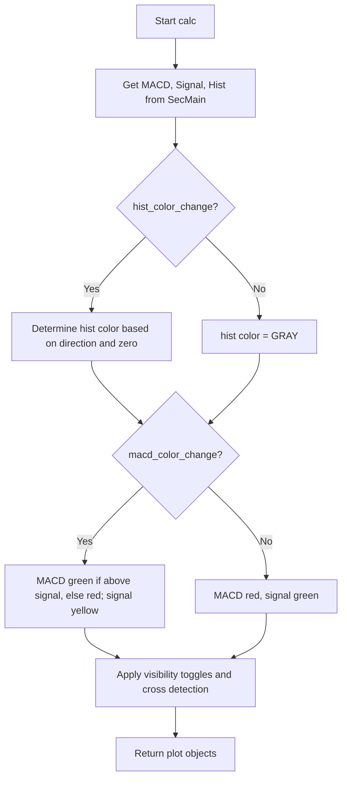

# MACD Ultimate Multiple Timeframes - Technical Guide

> Enhanced MACD with multi-color histogram, crossover dots, and configurable timeframes.

| | |
| --- | --- |
| **Language** | Indie Script v5 |
| **Platform** | [TakeProfit](https://takeprofit.com) |
| **Category** | Oscillators |
| **Type** | Indicator |
| **Author** | @dr_jones on TakeProfit |
| **Original** | Ported to Indie from https://www.tradingview.com/script/OQx7vju0-MacD-Custom-Indicator-Multiple-Time-Frame-All-Available-Options/ created by @ChrisMoody |
| **License** | MPL-2.0 (see the header of the source file) |
| **Live script** | [Open on TakeProfit](https://takeprofit.com/indicator/macd-ultimate-multiple-timeframes-29) |
| **Source file** | [MACD Ultimate Multiple Timeframes.indie5](MACD%20Ultimate%20Multiple%20Timeframes.indie5) |

## Overview

This indicator is a port of a popular TradingView MACD script, adapted for the Indie platform. It computes the classic MACD line (difference between fast and slow EMAs), a signal line (SMA of the MACD), and a histogram (MACD minus signal). The enhancement lies in the flexible coloring: the histogram can display up to four colors based on direction and position relative to zero, and the MACD line changes color based on whether it is above or below the signal line. Additionally, the indicator can plot dots at crossover points and supports selecting a different timeframe for the calculation, independent of the chart's timeframe.

The indicator is designed for traders who want a visually rich MACD with clear signals. The multi-color histogram helps quickly identify bullish/bearish momentum changes (e.g., aqua for rising above zero, red for falling below zero). The crossover dots and line color changes make signal line crossovers more apparent. The ability to use a higher or lower timeframe for the MACD calculation allows for multi-timeframe analysis without changing the chart.

## How it works

1. Compute fast EMA and slow EMA of the close price on the selected timeframe.
2. Calculate MACD line as fast EMA minus slow EMA.
3. Calculate signal line as SMA of the MACD line over the signal length.
4. Calculate histogram as MACD line minus signal line.
5. Determine histogram color based on direction and zero-line position: aqua (rising above zero), blue (falling above zero), red (falling below zero), maroon (rising below zero), yellow (fallback).
6. Determine MACD line color: green when above signal line, red when below (if color change enabled). Signal line becomes yellow when color change enabled.
7. Optionally plot dots at MACD/signal crossovers using the cross() function.
8. Return plot objects for MACD line, signal line, histogram, and markers, with NaN values (or 0.0 for histogram) hiding elements when toggled off.

## Mathematical model

$$
\text{MACD} = \text{EMA}_{\text{fast}}(\text{close}) - \text{EMA}_{\text{slow}}(\text{close})
$$

$$
\text{Signal} = \text{SMA}_{\text{signal}}(\text{MACD})
$$

$$
\text{Histogram} = \text{MACD} - \text{Signal}
$$

## Logic flow



## Parameters

| Parameter | Type | Default | Range | Description |
| --- | --- | --- | --- | --- |
| `use_current_res` | bool | true |  | Use Current Chart Time Frame? |
| `res_custom` | time_frame | 1D |  | Use Different Timeframe? Uncheck Box Above |
| `smd` | bool | true |  | Show MacD & Signal Line? Also Turn Off Dots Below |
| `sd` | bool | true |  | Show Dots When MacD Crosses Signal Line? |
| `sh` | bool | true |  | Show Histogram? |
| `macd_color_change` | bool | true |  | Change MacD Line Color-Signal Line Cross? |
| `hist_color_change` | bool | true |  | MacD Histogram 4 Colors? |
| `fast_length` | int | 12 | ≥ 1 | Fast Length |
| `slow_length` | int | 26 | ≥ 1 | Slow Length |
| `signal_length` | int | 9 | ≥ 1 | Signal Length |

## Code walkthrough

### Secondary context for multi-timeframe calculation

Lines 14-25 of [MACD Ultimate Multiple Timeframes.indie5](MACD%20Ultimate%20Multiple%20Timeframes.indie5):

```python
@sec_context
@param_ref('fast_length')
@param_ref('slow_length')
@param_ref('signal_length')
def SecMain(self, fast_length, slow_length, signal_length):
    fast_ma = Ema.new(self.close, fast_length)[0]
    slow_ma = Ema.new(self.close, slow_length)[0]

    macd = MutSeriesF.new(fast_ma - slow_ma)
    signal = Sma.new(macd, signal_length)[0]
    hist = macd[0] - signal
    return macd[0], signal, hist
```

The `SecMain` function is decorated with `@sec_context` and `@param_ref` to run on a potentially different timeframe. It computes the fast and slow EMAs, then the MACD, signal, and histogram. The results are returned as a tuple containing the current MACD value (scalar), the signal series, and the histogram series so that the main context can access current and previous values.

### Main class initialization and timeframe selection

Lines 44-47 of [MACD Ultimate Multiple Timeframes.indie5](MACD%20Ultimate%20Multiple%20Timeframes.indie5):

```python
class Main(MainContext):
    def __init__(self, use_current_res, res_custom):
        tf_chosen = self.time_frame if use_current_res else res_custom
        self._out_macd, self._out_signal, self._out_hist = self.calc_on(SecMain, time_frame=tf_chosen)
```

The `Main` class receives the `use_current_res` boolean and a custom timeframe. If `use_current_res` is true, it uses the chart's own timeframe; otherwise it uses the user-selected `res_custom`. The `calc_on` method runs `SecMain` on that timeframe and stores the three output values (MACD scalar, signal series, histogram series).

### Histogram color logic

Lines 50-68 of [MACD Ultimate Multiple Timeframes.indie5](MACD%20Ultimate%20Multiple%20Timeframes.indie5):

```python
        hist_a_is_up = self._out_hist[0] > self._out_hist[1] and self._out_hist[0] > 0
        hist_a_is_down = self._out_hist[0] < self._out_hist[1] and self._out_hist[0] > 0
        hist_b_is_down = self._out_hist[0] < self._out_hist[1] and self._out_hist[0] <= 0
        hist_b_is_up = self._out_hist[0] > self._out_hist[1] and self._out_hist[0] <= 0

        macd_is_above = self._out_macd[0] >= self._out_signal[0]

        plot_color = color.GRAY
        if hist_color_change:
            if hist_a_is_up:
                plot_color = color.AQUA
            elif hist_a_is_down:
                plot_color = color.BLUE
            elif hist_b_is_down:
                plot_color = color.RED
            elif hist_b_is_up:
                plot_color = color.MAROON
            else:
                plot_color = color.YELLOW
```

Four boolean flags are computed from the histogram's current and previous values and its sign. These determine the histogram color: aqua (rising above zero), blue (falling above zero), red (falling below zero), maroon (rising below zero). If none match, yellow is used as a fallback. When `hist_color_change` is false, the color defaults to gray.

### MACD and signal line color logic

Lines 70-77 of [MACD Ultimate Multiple Timeframes.indie5](MACD%20Ultimate%20Multiple%20Timeframes.indie5):

```python
        macd_color = color.RED
        signal_color = color.GREEN
        if macd_color_change:
            if macd_is_above:
                macd_color = color.GREEN
            else:
                macd_color = color.RED
            signal_color = color.YELLOW
```

When `macd_color_change` is enabled, the MACD line turns green when above the signal line and red when below; the signal line becomes yellow. Otherwise, MACD is red and signal is green. This makes crossovers visually distinct.

### Visibility toggles and crossover dots

Lines 80-89 of [MACD Ultimate Multiple Timeframes.indie5](MACD%20Ultimate%20Multiple%20Timeframes.indie5):

```python
        macd_value = self._out_macd[0] if smd and self._out_macd[0] else nan
        signal_value = self._out_signal[0] if smd and self._out_signal[0] else nan
        hist_value = self._out_hist[0] if sh and self._out_hist[0] else 0.0
        cross_value = self._out_signal[0] if sd and cross(self._out_macd, self._out_signal) else nan

        return (
            plot.Line(macd_value, color=macd_color),
            plot.Line(signal_value, color=signal_color),
            plot.Histogram(hist_value, color=plot_color),
            plot.Marker(cross_value, color=macd_color),
```

The final values are set to `nan` (or 0.0 for histogram) when the corresponding toggle is off. The `cross()` function detects when the MACD line crosses the signal line; if dots are enabled, a marker is plotted at the signal value. The return tuple contains four plot objects with appropriate colors.

## Reading the chart

- **MACD Line** (thick line): Default red; turns green when above the signal line (if color change enabled). Shows the difference between fast and slow EMAs.
- **Signal Line** (thin line): Default green; turns yellow when color change enabled. A SMA of the MACD line (default 9-period).
- **Histogram** (bars): Four colors indicate momentum: aqua (rising above zero), blue (falling above zero), red (falling below zero), maroon (rising below zero). Gray when single-color mode is on.
- **Crossover Dots**: Small markers plotted at the signal line value when the MACD line crosses the signal line. Color matches the MACD line color.
- **Zero Line**: White horizontal line at 0 for reference.
- **Visibility**: Each component (MACD line, signal line, histogram, dots) can be toggled on/off via the indicator settings.

## Implementation notes

- The indicator uses `MutSeriesF` to store the MACD series, allowing access to previous bar values for histogram direction detection.
- When `use_current_res` is true, the custom timeframe parameter is ignored; the indicator runs on the chart's timeframe.
- The `cross()` function from `indie.math` is used to detect MACD/signal crossovers; it returns true only on the bar where the crossover occurs.
- Histogram values are set to 0.0 when hidden, while MACD and signal lines are set to `nan` to prevent drawing.

## FAQ

**How do I change the histogram to a single color?**

Uncheck the 'MacD Histogram 4 Colors?' option in the indicator settings. The histogram will then appear in gray.

**Can I use a different timeframe for the MACD calculation without changing the chart?**

Yes. Uncheck 'Use Current Chart Time Frame?' and select a different timeframe from the 'Use Different Timeframe?' dropdown. The MACD will be calculated on that timeframe but displayed on the current chart.

**Why are the crossover dots not appearing?**

Ensure both 'Show MacD & Signal Line?' and 'Show Dots When MacD Crosses Signal Line?' are checked. The dots are plotted only when a crossover occurs and the MACD line is visible.

## Full source code

Indie Script v5, as published on TakeProfit. Copy it into the platform's script editor or [open the live script](https://takeprofit.com/indicator/macd-ultimate-multiple-timeframes-29).

```python
# Ported to Indie from https://www.tradingview.com/script/OQx7vju0-MacD-Custom-Indicator-Multiple-Time-Frame-All-Available-Options/ created by @ChrisMoody

# This Source Code Form is subject to the terms of the Mozilla Public License, v. 2.0.  
# If a copy of the MPL was not distributed with this file, you can obtain one at  
# <https://mozilla.org/MPL/2.0/>.

# indie:lang_version = 5
from math import nan
from indie import indicator, sec_context, param_ref, param, plot, color, level, MutSeriesF, MainContext
from indie.algorithms import Ema, Sma
from indie.math import cross


@sec_context
@param_ref('fast_length')
@param_ref('slow_length')
@param_ref('signal_length')
def SecMain(self, fast_length, slow_length, signal_length):
    fast_ma = Ema.new(self.close, fast_length)[0]
    slow_ma = Ema.new(self.close, slow_length)[0]

    macd = MutSeriesF.new(fast_ma - slow_ma)
    signal = Sma.new(macd, signal_length)[0]
    hist = macd[0] - signal
    return macd[0], signal, hist


@indicator('MACD_Ult_MTF')
@param.bool('use_current_res', default=True, title='Use Current Chart Time Frame?')
@param.time_frame('res_custom', default='1D', title='Use Different Timeframe? Uncheck Box Above')
@param.bool('smd', default=True, title='Show MacD & Signal Line? Also Turn Off Dots Below')
@param.bool('sd', default=True, title='Show Dots When MacD Crosses Signal Line?')
@param.bool('sh', default=True, title='Show Histogram?')
@param.bool('macd_color_change', default=True, title='Change MacD Line Color-Signal Line Cross?')
@param.bool('hist_color_change', default=True, title='MacD Histogram 4 Colors?')
@param.int('fast_length', default=12, min=1, title='Fast Length')
@param.int('slow_length', default=26, min=1, title='Slow Length')
@param.int('signal_length', default=9, min=1, title='Signal Length')
@plot.line(line_width=4, title='MACD')
@plot.line(line_width=2, title='Signal Line')
@plot.histogram(line_width=4, title='Histogram')
@plot.marker(size=7, position=plot.marker_position.CENTER, title='Cross')
@level(0, line_width=2, line_color=color.WHITE, title='0 Line')
class Main(MainContext):
    def __init__(self, use_current_res, res_custom):
        tf_chosen = self.time_frame if use_current_res else res_custom
        self._out_macd, self._out_signal, self._out_hist = self.calc_on(SecMain, time_frame=tf_chosen)

    def calc(self, smd, sd, sh, macd_color_change, hist_color_change):
        hist_a_is_up = self._out_hist[0] > self._out_hist[1] and self._out_hist[0] > 0
        hist_a_is_down = self._out_hist[0] < self._out_hist[1] and self._out_hist[0] > 0
        hist_b_is_down = self._out_hist[0] < self._out_hist[1] and self._out_hist[0] <= 0
        hist_b_is_up = self._out_hist[0] > self._out_hist[1] and self._out_hist[0] <= 0

        macd_is_above = self._out_macd[0] >= self._out_signal[0]

        plot_color = color.GRAY
        if hist_color_change:
            if hist_a_is_up:
                plot_color = color.AQUA
            elif hist_a_is_down:
                plot_color = color.BLUE
            elif hist_b_is_down:
                plot_color = color.RED
            elif hist_b_is_up:
                plot_color = color.MAROON
            else:
                plot_color = color.YELLOW

        macd_color = color.RED
        signal_color = color.GREEN
        if macd_color_change:
            if macd_is_above:
                macd_color = color.GREEN
            else:
                macd_color = color.RED
            signal_color = color.YELLOW


        macd_value = self._out_macd[0] if smd and self._out_macd[0] else nan
        signal_value = self._out_signal[0] if smd and self._out_signal[0] else nan
        hist_value = self._out_hist[0] if sh and self._out_hist[0] else 0.0
        cross_value = self._out_signal[0] if sd and cross(self._out_macd, self._out_signal) else nan

        return (
            plot.Line(macd_value, color=macd_color),
            plot.Line(signal_value, color=signal_color),
            plot.Histogram(hist_value, color=plot_color),
            plot.Marker(cross_value, color=macd_color),
        )
```
