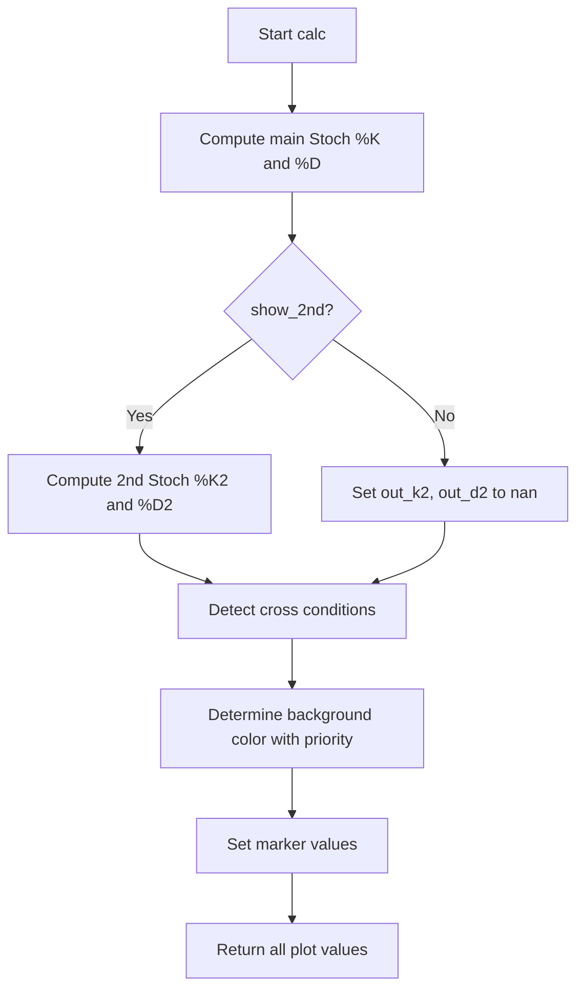

# MTF Stochastic Signals (CM Style) - Technical Guide

> Multi-timeframe Stochastic Oscillator with configurable cross signals, B/S labels, and an optional second higher-timeframe Stochastic.

| | |
| --- | --- |
| **Language** | Indie Script v5 |
| **Platform** | [TakeProfit](https://takeprofit.com) |
| **Category** | Oscillators |
| **Type** | Indicator |
| **Author** | @insurgent on TakeProfit |
| **Original (TradingView)** | [CM Stochastic Multi-TimeFrame](https://www.tradingview.com/script/Wylw98ue-CM-Stochastic-Multi-TimeFrame/) by ChrisMoody |
| **License** | [MPL-2.0](https://mozilla.org/MPL/2.0/) (derivative work) |
| **Live script** | [Open on TakeProfit](https://takeprofit.com/indicator/mtf-stochastic-signals-cm-style-76) |
| **Source file** | [MTF Stochastic Signals (CM Style).indie5](MTF%20Stochastic%20Signals%20(CM%20Style).indie5) |

## Overview

This indicator plots a smoothed %K and %D Stochastic pair computed on a user-selected timeframe, independent of the chart's resolution. It is designed for multi-timeframe analysis, allowing traders to view the primary Stochastic on one timeframe while optionally overlaying a second Stochastic on a separate higher timeframe for confluence. The indicator draws the %K and %D lines, upper/lower bands (default 80/20) with a fill, an optional mid line at 50, and a single priority-based background highlight.

Signal modes include a strict cross (triggers only when %K crosses %D while already inside the overbought or oversold zone) and an any cross (triggers on every %K/%D crossover regardless of position). Each mode can independently show background highlights and/or B/S text labels directly on the chart. The indicator is inspired by the CM_Stochastic_MTF by Chris Moody.

## How it works

1. Computes the main Stochastic %K using Stoch.new on the selected timeframe's close, low, high, then smooths it with Sma.new.
2. Computes the %D line by smoothing %K again with Sma.new.
3. Optionally computes a second Stochastic on a separate higher timeframe using the same method.
4. Detects strict cross signals: %K crosses %D while the previous %K was inside the oversold or overbought zone.
5. Detects any cross signals: every %K/%D crossover regardless of zone.
6. Applies a single background color with priority: strict cross > above/below band > any cross.
7. Places B (buy) and S (sell) text markers on bars where strict or any cross conditions are met.
8. Returns all plot values including bands, mid line, and markers to the chart.

## Mathematical model

$$
\%K = \text{SMA}\big(\text{Stoch}(\text{close}, \text{low}, \text{high}, \text{len}), \text{smooth\_k}\big)
$$

$$
\%D = \text{SMA}(\%K, \text{smooth\_d})
$$

$$
\text{Stoch} = \frac{\text{close} - \text{lowest}(\text{low}, \text{len})}{\text{highest}(\text{high}, \text{len}) - \text{lowest}(\text{low}, \text{len})} \times 100
$$

## Logic flow



## Parameters

| Parameter | Type | Default | Range | Description |
| --- | --- | --- | --- | --- |
| `len` | int | 14 | ≥ 1 | Length for Main Stochastic |
| `smooth_k` | int | 3 | ≥ 1 | SmoothK for Main Stochastic |
| `smooth_d` | int | 3 | ≥ 1 | SmoothD for Main Stochastic |
| `up_line` | int | 80 | 50 - 90 | Upper Line Value |
| `low_line` | int | 20 | 10 - 50 | Lower Line Value |
| `show_mid_line` | bool | true |  | Show Mid Line? |
| `show_bg_above_below` | bool | false |  | BG When Stoch Is Above/Below Band? |
| `show_bg_strict` | bool | true |  | BG on Strict Cross (K in OB/OS zone)? |
| `show_labels_strict` | bool | true |  | Show B/S Labels on Strict Cross? |
| `show_bg_any` | bool | false |  | BG on Any K/D Cross? |
| `show_labels_any` | bool | false |  | Show B/S Labels on Any K/D Cross? |
| `main_tf` | time_frame | 1h |  | Main Stoch Timeframe |
| `show_2nd` | bool | false |  | Show 2nd Stochastic? |
| `stoch2_tf` | time_frame | 1D |  | 2nd Stoch Timeframe |
| `len2` | int | 14 | ≥ 1 | 2nd Stoch Length |
| `smooth_k2` | int | 3 | ≥ 1 | SmoothK for 2nd Stoch |
| `smooth_d2` | int | 3 | ≥ 1 | SmoothD for 2nd Stoch |

## Code walkthrough

### Multi-timeframe data context

Lines 10-13 of [MTF Stochastic Signals (CM Style).indie5](MTF%20Stochastic%20Signals%20(CM%20Style).indie5):

```python
@sec_context
def StochDataCtx(self):
    """Returns close, low, high from this context's timeframe for MTF stoch."""
    return self.close[0], self.low[0], self.high[0]
```

Defines a separate context `StochDataCtx` that returns close, low, high from the specified timeframe. This allows the indicator to compute the Stochastic on a different timeframe than the chart's resolution.

### Main Stochastic computation

Lines 73-76 of [MTF Stochastic Signals (CM Style).indie5](MTF%20Stochastic%20Signals%20(CM%20Style).indie5):

```python
        k = Sma.new(Stoch.new(self._c1, self._l1, self._h1, len), smooth_k)
        d = Sma.new(k, smooth_d)
        out_k = k[0]
        out_d = d[0]
```

Computes the raw Stochastic using `Stoch.new` on the main timeframe data, then smooths it with `Sma.new` to produce %K and %D. The current bar values are accessed with `[0]`.

### Second Stochastic (optional)

Lines 79-82 of [MTF Stochastic Signals (CM Style).indie5](MTF%20Stochastic%20Signals%20(CM%20Style).indie5):

```python
        k2 = Sma.new(Stoch.new(self._c2, self._l2, self._h2, len2), smooth_k2)
        d2 = Sma.new(k2, smooth_d2)
        out_k2 = k2[0] if show_2nd else nan
        out_d2 = d2[0] if show_2nd else nan
```

If `show_2nd` is enabled, computes a second Stochastic on a separate timeframe. Otherwise, sets the output to `nan` so nothing is plotted.

### Cross signal detection

Lines 88-92 of [MTF Stochastic Signals (CM Style).indie5](MTF%20Stochastic%20Signals%20(CM%20Style).indie5):

```python
        cross_up = (k[1] < d[1] and k[1] < low_line) and out_k > out_d
        cross_dn = (k[1] > d[1] and k[1] > up_line) and out_k < out_d

        cross_up_all = k[1] < d[1] and out_k > out_d
        cross_dn_all = k[1] > d[1] and out_k < out_d
```

Defines strict cross conditions (previous %K inside OB/OS zone) and any cross conditions (every crossover). Uses `k[1]` and `d[1]` to access previous bar values for crossover detection.

### Priority-based background

Lines 95-107 of [MTF Stochastic Signals (CM Style).indie5](MTF%20Stochastic%20Signals%20(CM%20Style).indie5):

```python
        bg: Optional[Color] = None
        if show_bg_strict and cross_up:
            bg = color.GREEN(0.20)
        elif show_bg_strict and cross_dn:
            bg = color.RED(0.20)
        elif show_bg_above_below and above_line:
            bg = color.RED(0.10)
        elif show_bg_above_below and below_line:
            bg = color.GREEN(0.10)
        elif show_bg_any and cross_up_all:
            bg = color.GREEN(0.20)
        elif show_bg_any and cross_dn_all:
            bg = color.RED(0.20)
```

Assigns a single background color based on priority: strict cross first, then above/below band, then any cross. Uses `elif` to ensure only one condition applies per bar.

### Return tuple with all plots

Lines 117-131 of [MTF Stochastic Signals (CM Style).indie5](MTF%20Stochastic%20Signals%20(CM%20Style).indie5):

```python
        return (
            out_k,                                   # K line
            out_d,                                   # D line
            out_k2,                                  # 2nd K line
            out_d2,                                  # 2nd D line
            float(up_line),                          # Upper band line
            float(low_line),                         # Lower band line
            plot.Fill(),                             # Band fill
            mid,                                     # Mid line at 50
            plot.Background(bg),                     # Combined signal BG
            plot.Marker(value=b_strict, text='B'),   # Buy label strict
            plot.Marker(value=s_strict, text='S'),   # Sell label strict
            plot.Marker(value=b_any, text='B'),      # Buy label any
            plot.Marker(value=s_any, text='S'),      # Sell label any
        )
```

Returns a tuple matching the `@plot.*` decorators order. Includes lines, fill, background, and marker objects. Markers use `plot.Marker` with text 'B' or 'S' and are positioned below for buy, above for sell.

## Reading the chart

- **%K line (lime)**: Smoothed Stochastic %K value.
- **%D line (red)**: Smoothed Stochastic %D value.
- **Upper band (red, default 80)**: Overbought threshold.
- **Lower band (lime, default 20)**: Oversold threshold.
- **Band fill (gray 25% opacity)**: Area between upper and lower bands.
- **Mid line (gray, optional)**: Reference line at 50.
- **Background**: Green tint for buy signals, red tint for sell signals. Priority: strict cross > above/below band > any cross.
- **Buy labels ('B')**: Placed below bars on buy cross signals.
- **Sell labels ('S')**: Placed above bars on sell cross signals.
- **Second Stochastic (orange/yellow)**: Overlaid when enabled, for higher timeframe confluence.

## Implementation notes

- The indicator uses `sec_context` and `calc_on` to compute the Stochastic on a different timeframe than the chart, which may cause repainting on historical bars if the higher timeframe bar is not yet closed.
- Strict cross signals require the previous %K to be inside the overbought/oversold zone, reducing signal frequency but potentially increasing conviction.
- Background colors are semi-transparent (0.10 or 0.20 alpha) and layered with priority; only one background color is shown per bar.
- The second Stochastic is completely independent and can be on any timeframe, useful for confluence analysis.

## FAQ

**How do I enable the second Stochastic?**

Set the 'Show 2nd Stochastic?' parameter to true, then configure its timeframe, length, and smoothing periods in the indicator settings.

**What is the difference between 'Strict cross' and 'Any cross'?**

Strict cross triggers only when %K crosses %D while the previous %K was already inside the overbought or oversold zone. Any cross triggers on every %K/%D crossover regardless of zone position.

**Why does the background sometimes not show even when a cross occurs?**

The background uses a priority system: strict cross > above/below band > any cross. If a strict cross occurs, it overrides any cross background. Also, each background type must be enabled in the settings.

## License and attribution

This Indie script is a derivative work of **CM Stochastic Multi-TimeFrame by ChrisMoody** on TradingView. This is a port of an open-source TradingView script whose header we could not retrieve; TradingView applies MPL-2.0 by default to open-source scripts, so that license is assumed. A modified version of MPL-2.0 code must stay under [MPL-2.0](https://mozilla.org/MPL/2.0/), so this file is distributed under that license (the notice is appended to the end of the source file). The original author keeps the credit for the algorithm; this page is not affiliated with or endorsed by them.

## Full source code

Indie Script v5, as published on TakeProfit. Copy it into the platform's script editor or [open the live script](https://takeprofit.com/indicator/mtf-stochastic-signals-cm-style-76).

```python
# indie:lang_version = 5
from math import nan
from indie import (
    indicator, MainContext, sec_context,
    param, plot, color, Color, Optional, format
)
from indie.algorithms import Sma, Stoch


@sec_context
def StochDataCtx(self):
    """Returns close, low, high from this context's timeframe for MTF stoch."""
    return self.close[0], self.low[0], self.high[0]


@indicator('MTF Stochastic Signals', format=format.PRICE)
# ─ Main stoch ──────────────────────────────────────────────────────────────────
@param.int('len', default=14, min=1, title='Length for Main Stochastic')
@param.int('smooth_k', default=3, min=1, title='SmoothK for Main Stochastic')
@param.int('smooth_d', default=3, min=1, title='SmoothD for Main Stochastic')
@param.int('up_line', default=80, min=50, max=90, title='Upper Line Value')
@param.int('low_line', default=20, min=10, max=50, title='Lower Line Value')
# ─ Visibility toggles ──────────────────────────────────────────────────────────
@param.bool('show_mid_line', default=True, title='Show Mid Line?')
@param.bool('show_bg_above_below', default=False, title='BG When Stoch Is Above/Below Band?')
@param.bool('show_bg_strict', default=True, title='BG on Strict Cross (K in OB/OS zone)?')
@param.bool('show_labels_strict', default=True, title='Show B/S Labels on Strict Cross?')
@param.bool('show_bg_any', default=False, title='BG on Any K/D Cross?')
@param.bool('show_labels_any', default=False, title='Show B/S Labels on Any K/D Cross?')
# ─ Main stoch timeframe ────────────────────────────────────────────────────────
@param.time_frame('main_tf', default='1h', title='Main Stoch Timeframe')
# ─ 2nd stoch ───────────────────────────────────────────────────────────────────
@param.bool('show_2nd', default=False, title='Show 2nd Stochastic?')
@param.time_frame('stoch2_tf', default='1D', title='2nd Stoch Timeframe')
@param.int('len2', default=14, min=1, title='2nd Stoch Length')
@param.int('smooth_k2', default=3, min=1, title='SmoothK for 2nd Stoch')
@param.int('smooth_d2', default=3, min=1, title='SmoothD for 2nd Stoch')
# ─ Main K / D lines ────────────────────────────────────────────────────────────
@plot.line('k', color=color.LIME, line_width=3, title='Stoch K')
@plot.line('d', color=color.RED, line_width=3, title='Stoch D')
# ─ 2nd stoch K / D lines ───────────────────────────────────────────────────────
@plot.line(color=color.ORANGE, line_width=3, title='2nd Stoch K')
@plot.line(color=color.YELLOW, line_width=3, title='2nd Stoch D')
# ─ Band lines + fill ───────────────────────────────────────────────────────────
@plot.line('upper', color=color.RED, line_width=3, title='Upper Line')
@plot.line('lower', color=color.LIME, line_width=3, title='Lower Line')
@plot.fill('upper', 'lower', color=color.GRAY(0.25), title='Band Fill')
# ─ Mid line ────────────────────────────────────────────────────────────────────
@plot.line(color=color.GRAY, title='Mid Line')
# ─ Single combined background ──────────────────────────────────────────────────
# Strict cross → highest priority; above/below → lowest priority; any cross → middle
@plot.background(title='Signal BG')
# ─ Buy / Sell label markers ────────────────────────────────────────────────────
@plot.marker(color=color.LIME, style=plot.marker_style.LABEL,
             position=plot.marker_position.BELOW, size=3, title='Buy Label (Strict)')
@plot.marker(color=color.RED, style=plot.marker_style.LABEL,
             position=plot.marker_position.ABOVE, size=3, title='Sell Label (Strict)')
@plot.marker(color=color.LIME, style=plot.marker_style.LABEL,
             position=plot.marker_position.BELOW, size=3, title='Buy Label (Any Cross)')
@plot.marker(color=color.RED, style=plot.marker_style.LABEL,
             position=plot.marker_position.ABOVE, size=3, title='Sell Label (Any Cross)')
class Main(MainContext):
    def __init__(self, main_tf, stoch2_tf):
        self._c1, self._l1, self._h1 = self.calc_on(StochDataCtx, time_frame=main_tf)
        self._c2, self._l2, self._h2 = self.calc_on(StochDataCtx, time_frame=stoch2_tf)

    def calc(self, len, smooth_k, smooth_d, up_line, low_line,
             show_mid_line, show_bg_above_below, show_bg_strict,
             show_labels_strict, show_bg_any, show_labels_any,
             show_2nd, len2, smooth_k2, smooth_d2):

        # ── Main stochastic ────────────────────────────────────────────────
        k = Sma.new(Stoch.new(self._c1, self._l1, self._h1, len), smooth_k)
        d = Sma.new(k, smooth_d)
        out_k = k[0]
        out_d = d[0]

        # ── 2nd stochastic ─────────────────────────────────────────────────
        k2 = Sma.new(Stoch.new(self._c2, self._l2, self._h2, len2), smooth_k2)
        d2 = Sma.new(k2, smooth_d2)
        out_k2 = k2[0] if show_2nd else nan
        out_d2 = d2[0] if show_2nd else nan

        # ── Signal conditions ──────────────────────────────────────────────
        above_line = out_k > up_line
        below_line = out_k < low_line

        cross_up = (k[1] < d[1] and k[1] < low_line) and out_k > out_d
        cross_dn = (k[1] > d[1] and k[1] > up_line) and out_k < out_d

        cross_up_all = k[1] < d[1] and out_k > out_d
        cross_dn_all = k[1] > d[1] and out_k < out_d

        # ── Combined background (one plot, priority-ordered) ───────────────
        bg: Optional[Color] = None
        if show_bg_strict and cross_up:
            bg = color.GREEN(0.20)
        elif show_bg_strict and cross_dn:
            bg = color.RED(0.20)
        elif show_bg_above_below and above_line:
            bg = color.RED(0.10)
        elif show_bg_above_below and below_line:
            bg = color.GREEN(0.10)
        elif show_bg_any and cross_up_all:
            bg = color.GREEN(0.20)
        elif show_bg_any and cross_dn_all:
            bg = color.RED(0.20)

        # ── Markers ────────────────────────────────────────────────────────
        b_strict = out_k if (show_labels_strict and cross_up) else nan
        s_strict = out_k if (show_labels_strict and cross_dn) else nan
        b_any    = out_k if (show_labels_any and cross_up_all) else nan
        s_any    = out_k if (show_labels_any and cross_dn_all) else nan

        mid = 50.0 if show_mid_line else nan

        return (
            out_k,                                   # K line
            out_d,                                   # D line
            out_k2,                                  # 2nd K line
            out_d2,                                  # 2nd D line
            float(up_line),                          # Upper band line
            float(low_line),                         # Lower band line
            plot.Fill(),                             # Band fill
            mid,                                     # Mid line at 50
            plot.Background(bg),                     # Combined signal BG
            plot.Marker(value=b_strict, text='B'),   # Buy label strict
            plot.Marker(value=s_strict, text='S'),   # Sell label strict
            plot.Marker(value=b_any, text='B'),      # Buy label any
            plot.Marker(value=s_any, text='S'),      # Sell label any
        )

# ---------------------------------------------------------------------------
# This Source Code Form is subject to the terms of the Mozilla Public
# License, v. 2.0. If a copy of the MPL was not distributed with this
# file, You can obtain one at https://mozilla.org/MPL/2.0/
# Derived from "CM Stochastic Multi-TimeFrame by ChrisMoody" (TradingView).
# ---------------------------------------------------------------------------
```
