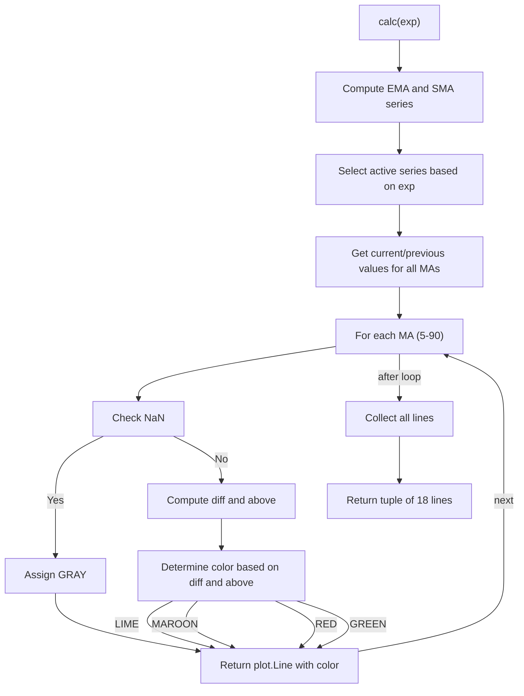

# Madrid Moving Average Ribbon - Indie Port Guide

> Plots 18 exponential or simple moving averages (periods 5–90) with dynamic coloring based on direction and position relative to a 100-period MA.

| | |
| --- | --- |
| **Language** | Indie Script v5 |
| **Platform** | [TakeProfit](https://takeprofit.com) |
| **Category** | Moving averages |
| **Type** | Indicator, port from Pine Script |
| **Original** | Madrid Moving Average Ribbon by Madrid (Pine Script v4) |
| **License** | MPL-2.0 (see the header of the source files) |
| **Original source** | [Madrid Moving Average Ribbon.pinescript4](Madrid%20Moving%20Average%20Ribbon.pinescript4) |
| **Source file** | [Madrid Moving Average Ribbon.indie5](Madrid%20Moving%20Average%20Ribbon.indie5) |

## Overview

The Madrid Moving Average Ribbon indicator displays a family of moving averages (periods 5 to 90 in steps of 5) on the price chart. It is designed to reveal the trend structure and momentum by showing how shorter-term averages behave relative to a longer-term 100-period average. Traders can use it to identify shifts in trend direction and strength.

On the chart, 18 lines are drawn, each representing a moving average of a specific period. The lines are colored dynamically: lime when the average is rising and above the 100-period MA, maroon when falling but still above, red when falling below, and green when rising below. The 100-period MA itself is not plotted but serves as the reference level. The MA5 and MA90 lines are drawn with thicker line width for emphasis.

## How it works

1. Choose between exponential (EMA) or simple (SMA) moving averages based on the boolean parameter `exp`.
2. Compute 18 moving averages with periods 5, 10, 15, …, 90, plus a 100-period reference MA.
3. For each bar, retrieve the current and previous values of each moving average series.
4. For each MA, determine its color using the helper `_ma_color`: compare the current value to the previous value (direction) and to the 100-period MA (position).
5. Return a tuple of `plot.Line` objects, each with the current value and the dynamically computed color.

## Logic flow



## Parameters

| Parameter | Type | Default | Range | Description |
| --- | --- | --- | --- | --- |
| `exp` | bool | true |  | Exponential MA (EMA) / Simple MA (SMA) |

## Code walkthrough

### Color helper function

Lines 19-32 of [Madrid Moving Average Ribbon.indie5](Madrid%20Moving%20Average%20Ribbon.indie5):

```python
def _ma_color(val: float, prev: float, ref: float) -> Color:
    if isnan(val) or isnan(prev) or isnan(ref):
        return _GRAY
    diff = val - prev
    above = val > ref
    if diff >= 0 and above:
        return _LIME
    if diff < 0 and above:
        return _MAROON
    if diff <= 0 and not above:
        return _RED
    if diff >= 0 and not above:
        return _GREEN
    return _GRAY
```

The `_ma_color` function determines the color for each moving average line. It returns gray if any input is NaN. Otherwise, it computes the direction (current minus previous) and checks whether the current value is above the 100-period reference. The four color outcomes (lime, maroon, red, green) encode both trend direction and position relative to the reference.

### Decorators and class definition

Lines 34-54 of [Madrid Moving Average Ribbon.indie5](Madrid%20Moving%20Average%20Ribbon.indie5):

```python
@indicator('Madrid Moving Average Ribbon', overlay_main_pane=True, format=format.PRICE)
@param.bool('exp', default=True, title='Exponential MA (EMA) / Simple MA (SMA)')
@plot.line('ma05', color=color.LIME,  line_width=3, title='MA 5')
@plot.line('ma10', color=color.GREEN, line_width=1, title='MA 10')
@plot.line('ma15', color=color.GREEN, line_width=1, title='MA 15')
@plot.line('ma20', color=color.GREEN, line_width=1, title='MA 20')
@plot.line('ma25', color=color.GREEN, line_width=1, title='MA 25')
@plot.line('ma30', color=color.GREEN, line_width=1, title='MA 30')
@plot.line('ma35', color=color.GREEN, line_width=1, title='MA 35')
@plot.line('ma40', color=color.GREEN, line_width=1, title='MA 40')
@plot.line('ma45', color=color.GREEN, line_width=1, title='MA 45')
@plot.line('ma50', color=color.GREEN, line_width=1, title='MA 50')
@plot.line('ma55', color=color.GREEN, line_width=1, title='MA 55')
@plot.line('ma60', color=color.GREEN, line_width=1, title='MA 60')
@plot.line('ma65', color=color.GREEN, line_width=1, title='MA 65')
@plot.line('ma70', color=color.GREEN, line_width=1, title='MA 70')
@plot.line('ma75', color=color.GREEN, line_width=1, title='MA 75')
@plot.line('ma80', color=color.GREEN, line_width=1, title='MA 80')
@plot.line('ma85', color=color.GREEN, line_width=1, title='MA 85')
@plot.line('ma90', color=color.LIME,  line_width=3, title='MA 90')
class Main(MainContext):
```

The `@indicator` decorator registers the indicator with the platform and sets it to overlay the main price pane. `@param.bool` adds a toggle to switch between EMA and SMA. The 18 `@plot.line` decorators define the plot lines with default colors and widths; MA5 and MA90 use `line_width=3` for emphasis. The `Main` class extends `MainContext` and implements the `calc` method.

### Creation of EMA and SMA instances

Lines 56-72 of [Madrid Moving Average Ribbon.indie5](Madrid%20Moving%20Average%20Ribbon.indie5):

```python
        src = self.close
        # All EMA instances — unconditional
        e05  = Ema.new(src, 5);   e10  = Ema.new(src, 10);  e15  = Ema.new(src, 15)
        e20  = Ema.new(src, 20);  e25  = Ema.new(src, 25);  e30  = Ema.new(src, 30)
        e35  = Ema.new(src, 35);  e40  = Ema.new(src, 40);  e45  = Ema.new(src, 45)
        e50  = Ema.new(src, 50);  e55  = Ema.new(src, 55);  e60  = Ema.new(src, 60)
        e65  = Ema.new(src, 65);  e70  = Ema.new(src, 70);  e75  = Ema.new(src, 75)
        e80  = Ema.new(src, 80);  e85  = Ema.new(src, 85);  e90  = Ema.new(src, 90)
        e100 = Ema.new(src, 100)
        # All SMA instances — unconditional
        s05  = Sma.new(src, 5);   s10  = Sma.new(src, 10);  s15  = Sma.new(src, 15)
        s20  = Sma.new(src, 20);  s25  = Sma.new(src, 25);  s30  = Sma.new(src, 30)
        s35  = Sma.new(src, 35);  s40  = Sma.new(src, 40);  s45  = Sma.new(src, 45)
        s50  = Sma.new(src, 50);  s55  = Sma.new(src, 55);  s60  = Sma.new(src, 60)
        s65  = Sma.new(src, 65);  s70  = Sma.new(src, 70);  s75  = Sma.new(src, 75)
        s80  = Sma.new(src, 80);  s85  = Sma.new(src, 85);  s90  = Sma.new(src, 90)
        s100 = Sma.new(src, 100)
```

Both EMA and SMA series are created unconditionally for all periods (5–90 and 100). This ensures both sets are available in memory; the active set is selected later based on the `exp` parameter. Using `Ema.new` and `Sma.new` returns series objects that can be indexed with `[0]` for the current value and `[1]` for the previous bar's value.

### Selection of active series and value retrieval

Lines 74-105 of [Madrid Moving Average Ribbon.indie5](Madrid%20Moving%20Average%20Ribbon.indie5):

```python
        # Select active series
        x05  = e05  if exp else s05;   x10  = e10  if exp else s10
        x15  = e15  if exp else s15;   x20  = e20  if exp else s20
        x25  = e25  if exp else s25;   x30  = e30  if exp else s30
        x35  = e35  if exp else s35;   x40  = e40  if exp else s40
        x45  = e45  if exp else s45;   x50  = e50  if exp else s50
        x55  = e55  if exp else s55;   x60  = e60  if exp else s60
        x65  = e65  if exp else s65;   x70  = e70  if exp else s70
        x75  = e75  if exp else s75;   x80  = e80  if exp else s80
        x85  = e85  if exp else s85;   x90  = e90  if exp else s90
        x100 = e100 if exp else s100

        # Current and previous values
        v05  = x05[0];  p05  = x05[1]
        v10  = x10[0];  p10  = x10[1]
        v15  = x15[0];  p15  = x15[1]
        v20  = x20[0];  p20  = x20[1]
        v25  = x25[0];  p25  = x25[1]
        v30  = x30[0];  p30  = x30[1]
        v35  = x35[0];  p35  = x35[1]
        v40  = x40[0];  p40  = x40[1]
        v45  = x45[0];  p45  = x45[1]
        v50  = x50[0];  p50  = x50[1]
        v55  = x55[0];  p55  = x55[1]
        v60  = x60[0];  p60  = x60[1]
        v65  = x65[0];  p65  = x65[1]
        v70  = x70[0];  p70  = x70[1]
        v75  = x75[0];  p75  = x75[1]
        v80  = x80[0];  p80  = x80[1]
        v85  = x85[0];  p85  = x85[1]
        v90  = x90[0];  p90  = x90[1]
        v100 = x100[0]
```

Conditional expressions (e.g., `x05 = e05 if exp else s05`) select either the EMA or SMA series for each period. The current and previous values are then extracted for periods 5–90, while only the current value is needed for the 100-period reference. This separation of selection and retrieval keeps the code readable.

### Dynamic coloring and return tuple

Lines 107-146 of [Madrid Moving Average Ribbon.indie5](Madrid%20Moving%20Average%20Ribbon.indie5):

```python
        # Dynamic colors based on direction and position vs MA100
        c05  = _ma_color(v05,  p05,  v100)
        c10  = _ma_color(v10,  p10,  v100)
        c15  = _ma_color(v15,  p15,  v100)
        c20  = _ma_color(v20,  p20,  v100)
        c25  = _ma_color(v25,  p25,  v100)
        c30  = _ma_color(v30,  p30,  v100)
        c35  = _ma_color(v35,  p35,  v100)
        c40  = _ma_color(v40,  p40,  v100)
        c45  = _ma_color(v45,  p45,  v100)
        c50  = _ma_color(v50,  p50,  v100)
        c55  = _ma_color(v55,  p55,  v100)
        c60  = _ma_color(v60,  p60,  v100)
        c65  = _ma_color(v65,  p65,  v100)
        c70  = _ma_color(v70,  p70,  v100)
        c75  = _ma_color(v75,  p75,  v100)
        c80  = _ma_color(v80,  p80,  v100)
        c85  = _ma_color(v85,  p85,  v100)
        c90  = _ma_color(v90,  p90,  v100)

        return (
            plot.Line(v05,  color=c05),
            plot.Line(v10,  color=c10),
            plot.Line(v15,  color=c15),
            plot.Line(v20,  color=c20),
            plot.Line(v25,  color=c25),
            plot.Line(v30,  color=c30),
            plot.Line(v35,  color=c35),
            plot.Line(v40,  color=c40),
            plot.Line(v45,  color=c45),
            plot.Line(v50,  color=c50),
            plot.Line(v55,  color=c55),
            plot.Line(v60,  color=c60),
            plot.Line(v65,  color=c65),
            plot.Line(v70,  color=c70),
            plot.Line(v75,  color=c75),
            plot.Line(v80,  color=c80),
            plot.Line(v85,  color=c85),
            plot.Line(v90,  color=c90),
        )
```

For each moving average, `_ma_color` is called with the current value, previous value, and the 100-period reference to obtain a dynamic color. The method returns a tuple of `plot.Line` objects, each containing the current value and the computed color. The platform uses these objects to draw the lines on the chart.

## Reading the chart

- **Lime**: The moving average is rising (current >= previous) and is above the 100-period MA.
- **Maroon**: The moving average is falling (current < previous) but still above the 100-period MA.
- **Red**: The moving average is falling and is below the 100-period MA.
- **Green**: The moving average is rising and is below the 100-period MA.
- **Gray**: Insufficient data (NaN) for the current bar; the line is not drawn or is drawn in gray.
- **Line width**: MA5 and MA90 are drawn with `line_width=3` (thicker) for emphasis; all other lines use `line_width=1`.
- The 100-period MA is not plotted but acts as the reference level for color decisions.

## Implementation notes

- Both EMA and SMA are computed every bar regardless of the `exp` parameter; only one set is used, which is slightly inefficient but simplifies the code.
- The 100-period MA is used as reference but never plotted; it is computed solely for the color logic.
- NaN values in any of the three inputs to `_ma_color` result in a gray line for that bar, preventing misleading colors.
- MA5 and MA90 are drawn with `line_width=3` for emphasis, as defined in the `@plot.line` decorators.

## Port notes

Differences and decisions in the Indie port of the Pine Script v4 original (taken from the header of [Madrid Moving Average Ribbon.indie5](Madrid%20Moving%20Average%20Ribbon.indie5)):

- alertcondition() — no Indie equivalent; use platform alerts on lines instead
- Plots 18 EMA/SMA lines (5..90) with dynamic gradient coloring vs MA100 reference

The plotted series of the port were compared bar by bar with the original script running on the same candles, and the compared series matched.

## FAQ

**How do I change the periods of the moving averages?**

The periods are hardcoded from 5 to 90 in steps of 5. To modify them, edit the series creation lines (56–72), the corresponding `@plot.line` decorators, and the return tuple (127–146).

**What does each color mean?**

Lime: rising above the 100-period MA. Maroon: falling above the 100-period MA. Red: falling below the 100-period MA. Green: rising below the 100-period MA. Gray: insufficient data (NaN).

**Can I use this indicator on a different timeframe or price source?**

The indicator uses `self.close` by default. To use a different source, change the `src = self.close` line to another series such as `self.open` or `self.volume`.

## Full source code

Indie Script v5. Copy it into the platform's script editor. The original Pine Script is published next to it as [Madrid Moving Average Ribbon.pinescript4](Madrid%20Moving%20Average%20Ribbon.pinescript4).

```python
# indie:lang_version = 5
# Madrid Moving Average Ribbon — Indie port
# Original Pine Script by Madrid (© Madrid : 141017TH2251)
# License: Mozilla Public License 2.0
# Migration notes:
#   alertcondition() — no Indie equivalent; use platform alerts on lines instead
#   Plots 18 EMA/SMA lines (5..90) with dynamic gradient coloring vs MA100 reference

from math import nan, isnan
from indie import indicator, param, plot, MainContext, color, format, Color
from indie.algorithms import Ema, Sma

_LIME   = color.rgba(0,   255, 0,   1.0)
_MAROON = color.rgba(128, 0,   0,   1.0)
_RED    = color.rgba(255, 0,   0,   1.0)
_GREEN  = color.rgba(0,   128, 0,   1.0)
_GRAY   = color.rgba(128, 128, 128, 1.0)

def _ma_color(val: float, prev: float, ref: float) -> Color:
    if isnan(val) or isnan(prev) or isnan(ref):
        return _GRAY
    diff = val - prev
    above = val > ref
    if diff >= 0 and above:
        return _LIME
    if diff < 0 and above:
        return _MAROON
    if diff <= 0 and not above:
        return _RED
    if diff >= 0 and not above:
        return _GREEN
    return _GRAY

@indicator('Madrid Moving Average Ribbon', overlay_main_pane=True, format=format.PRICE)
@param.bool('exp', default=True, title='Exponential MA (EMA) / Simple MA (SMA)')
@plot.line('ma05', color=color.LIME,  line_width=3, title='MA 5')
@plot.line('ma10', color=color.GREEN, line_width=1, title='MA 10')
@plot.line('ma15', color=color.GREEN, line_width=1, title='MA 15')
@plot.line('ma20', color=color.GREEN, line_width=1, title='MA 20')
@plot.line('ma25', color=color.GREEN, line_width=1, title='MA 25')
@plot.line('ma30', color=color.GREEN, line_width=1, title='MA 30')
@plot.line('ma35', color=color.GREEN, line_width=1, title='MA 35')
@plot.line('ma40', color=color.GREEN, line_width=1, title='MA 40')
@plot.line('ma45', color=color.GREEN, line_width=1, title='MA 45')
@plot.line('ma50', color=color.GREEN, line_width=1, title='MA 50')
@plot.line('ma55', color=color.GREEN, line_width=1, title='MA 55')
@plot.line('ma60', color=color.GREEN, line_width=1, title='MA 60')
@plot.line('ma65', color=color.GREEN, line_width=1, title='MA 65')
@plot.line('ma70', color=color.GREEN, line_width=1, title='MA 70')
@plot.line('ma75', color=color.GREEN, line_width=1, title='MA 75')
@plot.line('ma80', color=color.GREEN, line_width=1, title='MA 80')
@plot.line('ma85', color=color.GREEN, line_width=1, title='MA 85')
@plot.line('ma90', color=color.LIME,  line_width=3, title='MA 90')
class Main(MainContext):
    def calc(self, exp):
        src = self.close
        # All EMA instances — unconditional
        e05  = Ema.new(src, 5);   e10  = Ema.new(src, 10);  e15  = Ema.new(src, 15)
        e20  = Ema.new(src, 20);  e25  = Ema.new(src, 25);  e30  = Ema.new(src, 30)
        e35  = Ema.new(src, 35);  e40  = Ema.new(src, 40);  e45  = Ema.new(src, 45)
        e50  = Ema.new(src, 50);  e55  = Ema.new(src, 55);  e60  = Ema.new(src, 60)
        e65  = Ema.new(src, 65);  e70  = Ema.new(src, 70);  e75  = Ema.new(src, 75)
        e80  = Ema.new(src, 80);  e85  = Ema.new(src, 85);  e90  = Ema.new(src, 90)
        e100 = Ema.new(src, 100)
        # All SMA instances — unconditional
        s05  = Sma.new(src, 5);   s10  = Sma.new(src, 10);  s15  = Sma.new(src, 15)
        s20  = Sma.new(src, 20);  s25  = Sma.new(src, 25);  s30  = Sma.new(src, 30)
        s35  = Sma.new(src, 35);  s40  = Sma.new(src, 40);  s45  = Sma.new(src, 45)
        s50  = Sma.new(src, 50);  s55  = Sma.new(src, 55);  s60  = Sma.new(src, 60)
        s65  = Sma.new(src, 65);  s70  = Sma.new(src, 70);  s75  = Sma.new(src, 75)
        s80  = Sma.new(src, 80);  s85  = Sma.new(src, 85);  s90  = Sma.new(src, 90)
        s100 = Sma.new(src, 100)

        # Select active series
        x05  = e05  if exp else s05;   x10  = e10  if exp else s10
        x15  = e15  if exp else s15;   x20  = e20  if exp else s20
        x25  = e25  if exp else s25;   x30  = e30  if exp else s30
        x35  = e35  if exp else s35;   x40  = e40  if exp else s40
        x45  = e45  if exp else s45;   x50  = e50  if exp else s50
        x55  = e55  if exp else s55;   x60  = e60  if exp else s60
        x65  = e65  if exp else s65;   x70  = e70  if exp else s70
        x75  = e75  if exp else s75;   x80  = e80  if exp else s80
        x85  = e85  if exp else s85;   x90  = e90  if exp else s90
        x100 = e100 if exp else s100

        # Current and previous values
        v05  = x05[0];  p05  = x05[1]
        v10  = x10[0];  p10  = x10[1]
        v15  = x15[0];  p15  = x15[1]
        v20  = x20[0];  p20  = x20[1]
        v25  = x25[0];  p25  = x25[1]
        v30  = x30[0];  p30  = x30[1]
        v35  = x35[0];  p35  = x35[1]
        v40  = x40[0];  p40  = x40[1]
        v45  = x45[0];  p45  = x45[1]
        v50  = x50[0];  p50  = x50[1]
        v55  = x55[0];  p55  = x55[1]
        v60  = x60[0];  p60  = x60[1]
        v65  = x65[0];  p65  = x65[1]
        v70  = x70[0];  p70  = x70[1]
        v75  = x75[0];  p75  = x75[1]
        v80  = x80[0];  p80  = x80[1]
        v85  = x85[0];  p85  = x85[1]
        v90  = x90[0];  p90  = x90[1]
        v100 = x100[0]

        # Dynamic colors based on direction and position vs MA100
        c05  = _ma_color(v05,  p05,  v100)
        c10  = _ma_color(v10,  p10,  v100)
        c15  = _ma_color(v15,  p15,  v100)
        c20  = _ma_color(v20,  p20,  v100)
        c25  = _ma_color(v25,  p25,  v100)
        c30  = _ma_color(v30,  p30,  v100)
        c35  = _ma_color(v35,  p35,  v100)
        c40  = _ma_color(v40,  p40,  v100)
        c45  = _ma_color(v45,  p45,  v100)
        c50  = _ma_color(v50,  p50,  v100)
        c55  = _ma_color(v55,  p55,  v100)
        c60  = _ma_color(v60,  p60,  v100)
        c65  = _ma_color(v65,  p65,  v100)
        c70  = _ma_color(v70,  p70,  v100)
        c75  = _ma_color(v75,  p75,  v100)
        c80  = _ma_color(v80,  p80,  v100)
        c85  = _ma_color(v85,  p85,  v100)
        c90  = _ma_color(v90,  p90,  v100)

        return (
            plot.Line(v05,  color=c05),
            plot.Line(v10,  color=c10),
            plot.Line(v15,  color=c15),
            plot.Line(v20,  color=c20),
            plot.Line(v25,  color=c25),
            plot.Line(v30,  color=c30),
            plot.Line(v35,  color=c35),
            plot.Line(v40,  color=c40),
            plot.Line(v45,  color=c45),
            plot.Line(v50,  color=c50),
            plot.Line(v55,  color=c55),
            plot.Line(v60,  color=c60),
            plot.Line(v65,  color=c65),
            plot.Line(v70,  color=c70),
            plot.Line(v75,  color=c75),
            plot.Line(v80,  color=c80),
            plot.Line(v85,  color=c85),
            plot.Line(v90,  color=c90),
        )
```
