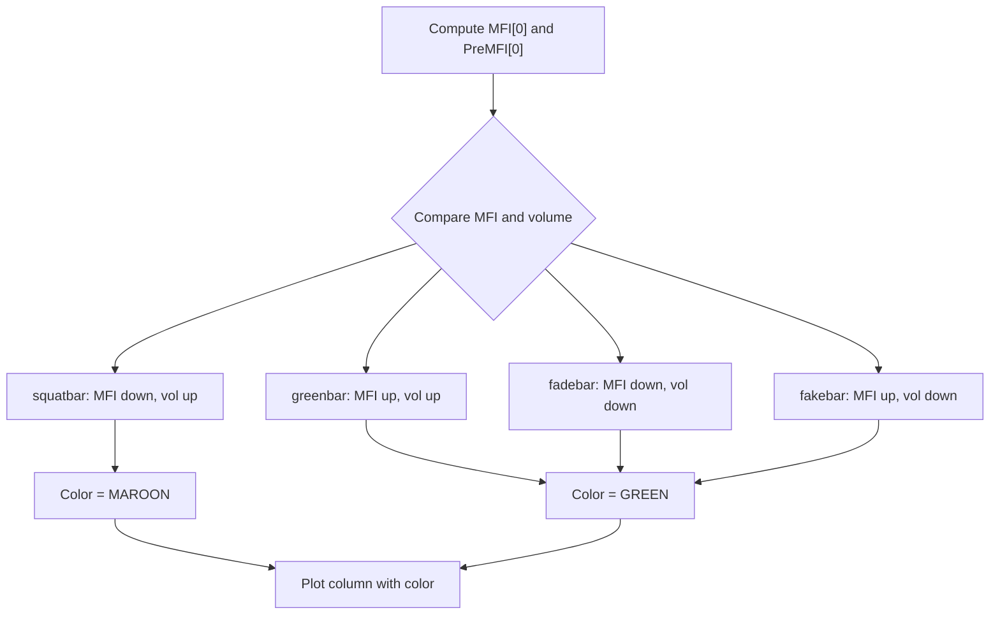

# Market Facilitation Index Squat Bars [Skyrexio] - Technical Guide

> Computes Market Facilitation Index and colors bars maroon when MFI decreases while volume increases (squat bar).

| | |
| --- | --- |
| **Language** | Indie Script v5 |
| **Platform** | [TakeProfit](https://takeprofit.com) |
| **Category** | Volume |
| **Type** | Indicator |
| **Author** | @skyrexio on TakeProfit |
| **License** | MIT |
| **Live script** | [Open on TakeProfit](https://takeprofit.com/indicator/market-facilitation-index-squat-bars-skyrexio-18) |
| **Source file** | [Market Facilitation Index Squat Bars Skyrexio.indie5](Market%20Facilitation%20Index%20Squat%20Bars%20Skyrexio.indie5) |

## Overview

The Market Facilitation Index (MFI) is a volume-based indicator that measures the efficiency of price movement per unit of volume. It is calculated as (high - low) * 1e9 / volume. By comparing the current bar's MFI and volume with the previous bar, the indicator classifies bars into four classical types: green (MFI up, volume up), fade (MFI down, volume down), fake (MFI up, volume down), and squat (MFI down, volume up).

This script plots the MFI value as columns in a separate pane, coloring only the bars that are classified as squat (maroon). All other bars are green. Squat bars are considered significant because they indicate that price is becoming less efficient (smaller range per unit volume) while volume is expanding, often associated with potential reversals or accumulation. The indicator helps traders identify periods of market inefficiency and possible turning points.

## How it works

1. Compute MFI for the current bar as 1e9 × (high - low) / volume.
2. Compute MFI for the previous bar using the same formula.
3. Compare current MFI with previous MFI, and current volume with previous volume.
4. Classify the bar: green (MFI↑, vol↑), fade (MFI↓, vol↓), fake (MFI↑, vol↓), squat (MFI↓, vol↑).
5. Set bar color to maroon if squat, otherwise green.
6. Plot the current MFI value as a column with the assigned color.

## Mathematical model

$$
MFI = \frac{10^9 \times (\text{high} - \text{low})}{\text{volume}}
$$

## Logic flow



## Code walkthrough

### MFI Calculation for Current and Previous Bar

Lines 8-9 of [Market Facilitation Index Squat Bars Skyrexio.indie5](Market%20Facilitation%20Index%20Squat%20Bars%20Skyrexio.indie5):

```python
    MFI = MutSeriesF.new(1000000000 * (self.high[0] - self.low[0]) / self.volume[0])
    PreMFI = MutSeriesF.new(1000000000 * (self.high[1] - self.low[1]) / self.volume[1])
```

The MFI is computed as 1e9 multiplied by the bar's range (high - low) divided by the bar's volume. To get the previous bar's MFI, `self.high[1]`, `self.low[1]`, and `self.volume[1]` are used. Both values are stored in `MutSeriesF` objects, allowing access to the current value with `[0]`. The huge scaling factor (1e9) prevents values from being too small when volume is large.

### Bar State Conditions

Lines 12-15 of [Market Facilitation Index Squat Bars Skyrexio.indie5](Market%20Facilitation%20Index%20Squat%20Bars%20Skyrexio.indie5):

```python
    greenbar = (MFI[0] > PreMFI[0]) and (self.volume[0] > self.volume[1])
    fadebar = (MFI[0] < PreMFI[0]) and (self.volume[0] < self.volume[1])
    fakebar = (MFI[0] > PreMFI[0]) and (self.volume[0] < self.volume[1])
    squatbar = (MFI[0] < PreMFI[0]) and (self.volume[0] > self.volume[1])
```

Four boolean variables classify the current bar based on the direction of change in MFI and volume relative to the previous bar. `greenbar` requires both MFI and volume to increase; `fadebar` requires both to decrease; `fakebar` requires MFI up and volume down; `squatbar` requires MFI down and volume up. These correspond to the classical Market Facilitation Index categories.

### Color Assignment and Plotting

Lines 18-21 of [Market Facilitation Index Squat Bars Skyrexio.indie5](Market%20Facilitation%20Index%20Squat%20Bars%20Skyrexio.indie5):

```python
    bar_color = color.MAROON if squatbar else color.GREEN

    # Return the value of MFI for the current bar
    return plot.Columns(MFI[0], color = bar_color)
```

The bar color is set to maroon (`color.MAROON`) if the bar is a squat bar, otherwise green (`color.GREEN`). Note that this logic does not differentiate among green, fade, or fake bars – they all receive the same green color. The `plot.Columns` call returns the MFI value with the chosen color; the decorator `@plot.columns(id='#plot_0')` ensures the plot is drawn as columns in a separate pane.

## Reading the chart

* The indicator plots columns representing the Market Facilitation Index (MFI) value for each bar.
* Columns are colored **maroon** when the bar is classified as a **squat bar** (MFI decreasing, volume increasing).
* All other bars – green, fade, and fake – are colored **green**.
* Squat bars are visually highlighted, drawing attention to periods where price movement is becoming less efficient despite rising volume (possible reversal or accumulation).
* The MFI value itself can be compared across bars to see relative efficiency.

## Implementation notes

- The large scaling factor 1e9 is arbitrary; the absolute values of MFI are not meaningful, only the direction of change matters.
- `MutSeriesF.new()` is used to store per-bar values that update on each bar; the classification can change intra-bar because `MFI[0]` uses the current developing bar's data.
- The previous bar's volume is accessed via `self.volume[1]`, which refers to the volume of the last completed bar, providing a stable reference.
- The color only distinguishes squat bars from all others; if you need separate colors for each bar type, the conditional logic would need to be extended (e.g., using `if-elif`).

## FAQ

**How can I change the colors to highlight all four bar types differently?**

Modify the `bar_color` assignment (line 18) to use separate colors for each condition, e.g., green for greenbar, blue for fadebar, orange for fakebar, and maroon for squatbar.

**Why does the indicator multiply the range by 1e9?**

The factor 1e9 scales the MFI value to avoid very small numbers when volume is large. The actual value is arbitrary; only the relative comparison between bars matters for classification.

**Does this indicator repaint?**

Yes, during the bar, the current bar's MFI changes as the bar develops (high, low, volume update). The classification may flip before the bar closes. Once the bar closes, the values are fixed and no longer change.

## Full source code

Indie Script v5, as published on TakeProfit. Copy it into the platform's script editor or [open the live script](https://takeprofit.com/indicator/market-facilitation-index-squat-bars-skyrexio-18).

```python
# indie:lang_version = 5
from indie import indicator, plot, color, SeriesF, MutSeriesF, Optional

@indicator('Market Facilitation Index [TC]', overlay_main_pane=False)
@plot.columns(id='#plot_0')
def Main(self):
    # Calculate MFI for the current and previous bars
    MFI = MutSeriesF.new(1000000000 * (self.high[0] - self.low[0]) / self.volume[0])
    PreMFI = MutSeriesF.new(1000000000 * (self.high[1] - self.low[1]) / self.volume[1])
    
    # Calculate the bar states
    greenbar = (MFI[0] > PreMFI[0]) and (self.volume[0] > self.volume[1])
    fadebar = (MFI[0] < PreMFI[0]) and (self.volume[0] < self.volume[1])
    fakebar = (MFI[0] > PreMFI[0]) and (self.volume[0] < self.volume[1])
    squatbar = (MFI[0] < PreMFI[0]) and (self.volume[0] > self.volume[1])

    # Initialize bar_color with Optional[color] type
    bar_color = color.MAROON if squatbar else color.GREEN

    # Return the value of MFI for the current bar
    return plot.Columns(MFI[0], color = bar_color)
```
